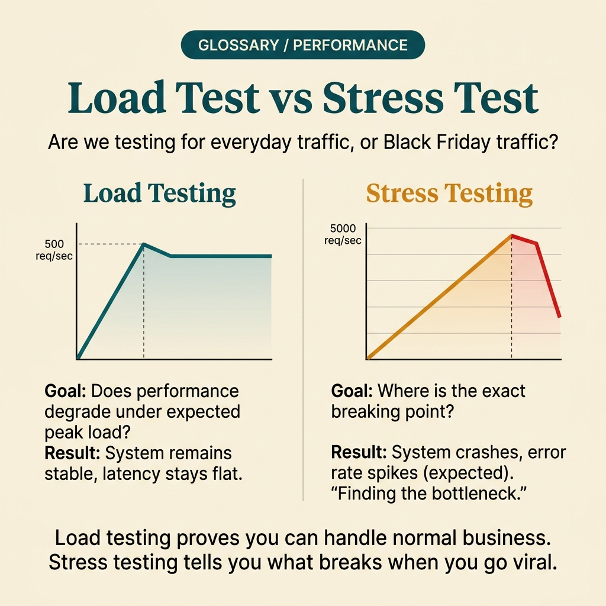

<!-- tags: glossary, reference, testing-quality, load-test -->
# Load Test

> Testing under gradually increasing traffic to measure throughput thresholds, latency, and degradation behavior of a system.

| Aspect | Detail |
| --- | --- |
| **Concept** | Testing under gradually increasing traffic to measure throughput thresholds, latency, and degradation behavior of a system. |
| **Audience** | QA engineer, SRE, backend engineer |
| **Primary style** | Glossary term |
| **Entry point** | Use when the team wants to know how the system performs under expected real load — not just by gut feel. |

📅 Created: 2026-03-30 · 🔄 Updated: 2026-04-04 · ⏱️ 9 min read

---

## 1. DEFINE

Picture this: you are about to launch a big campaign and the dashboard looks green on a normal day. But "green at idle" does not answer what happens when requests multiply in a short window. Load test exists to turn that question into clear measurements of throughput, latency, and saturation.

**Load Test** is testing under gradually increasing traffic to measure throughput thresholds, latency, and degradation behavior of a system.

| Variant | Description |
| --- | --- |
| Steady-state load test | Holds traffic near expected levels to observe latency and error rate. |
| Ramp-up load test | Gradually increases RPS or concurrency to find the degradation threshold. |
| Workflow load test | Simulates a real journey like checkout or search. |

| Approach | Time | Space | When to choose |
| --- | --- | --- | --- |
| Single endpoint load | O(n requests) | O(metrics) | When you need to understand one specific hotspot. |
| Workflow load | O(n steps × users) | O(trace + metrics) | When the pain is in a multi-step journey. |
| Step-load experiment | O(n load levels) | O(history) | When you need to find the saturation zone gradually. |

Core insight:

> Load test is not about breaking the system at all costs. It aims to measure how the system behaves within the traffic zone that the business actually expects or is about to reach.

### 1.1 Invariants & Failure Modes

The most important invariant is that the load profile must be close to real user or job system usage. If you only spam one clean endpoint with ideal payloads, the team will optimize the wrong bottleneck.

---

## 2. CONTEXT

**Who uses it**: QA engineer, SRE, backend engineer

**When**: Use when the team wants to know how the system performs under expected real load — not just by gut feel.

**Purpose**: Load test is not about breaking the system at all costs. It aims to measure how the system behaves within the traffic zone that the business actually expects or is about to reach.

**In the ecosystem**:
- Load test differs from stress test: stress deliberately exceeds the expected zone to find the breaking point.
- Load test differs from smoke test: load looks at metrics under traffic; smoke only asks if the build/deploy is alive.
- If the workload is not close to real traffic, results are very hard to use for capacity planning.

---

Measuring throughput is clear. But which environment should load tests run on, with what data, and how much do results deviate from real production?

## 3. EXAMPLES

Load test surfaces most visibly when staging handles 1000 RPS but production dies at 500 because the connection pool is different, when load test results are dismissed because "it's not like prod," or when the team runs load tests weekly but nobody reads the report. The examples below place the pattern into exactly those situations.

### Example 1: Basic — Measure target workload for a hot endpoint

> **Goal**: Know whether the endpoint can maintain acceptable latency at the target load level.
> **Approach**: Ramp-up RPS in steps and track p95, throughput, and error rate.
> **Example**: Search API needs to keep p95 < 300ms at 600 RPS.
> **Complexity**: Basic

```yaml
load_profile:
  target: search-api
  traffic:
    mode: ramp-up
    start_rps: 100
    end_rps: 600
    step: 100
  success_criteria:
    p95_latency_lt: 300ms
    error_rate_lt: 1%
```

**Why?** Without clear success criteria, load test produces many numbers but cannot answer "are we OK or not?" Its value lies in tying directly to a specific operational expectation.

**Takeaway**: Basic load test should lock down the endpoint, load level, and acceptance threshold before pressing run.

### Example 2: Intermediate — Use workflow load to measure real user pain

> **Goal**: Avoid optimizing one endpoint with nice numbers while missing the bottleneck of the entire journey.
> **Approach**: Simulate the route mix and step order close to the real user flow.
> **Example**: Checkout consists of add-to-cart, preview, apply coupon, and confirm order.
> **Complexity**: Intermediate


*Figure: Workflow load reveals which step in the journey degrades first — not just which handler benchmarks nicely.*

```yaml
workflow_load:
  journey: checkout
  mix:
    add_to_cart: 40%
    preview_order: 35%
    confirm_order: 25%
  assertions:
    journey_success_rate_gt: 99%
    p95_checkout_lt: 800ms
```

**Why?** Users do not experience individual endpoints; they experience the entire journey. Workflow load helps the team see which step is the bottleneck instead of a single handler benchmarked in isolation.

**Takeaway**: Intermediate load test delivers more value when it follows a journey with real business significance.

### Example 3: Advanced — Find the saturation zone before a major campaign

> **Goal**: Know where degradation begins so the team can prepare scaling or rate limiting.
> **Approach**: Step-load through multiple levels and observe queue depth, DB connections, and retry rate.
> **Example**: Campaign expects 3× peak over normal days, so you need to know where degradation starts.
> **Complexity**: Advanced

```yaml
step_load:
  stages:
    - rps: 500
      hold: 5m
    - rps: 800
      hold: 5m
    - rps: 1100
      hold: 5m
  observe:
    - p95_latency
    - db_connections
    - queue_depth
    - retry_rate
```

**Why?** Systems rarely break instantly; they usually degrade through queue buildup, retry storms, or DB saturation. Step-load lets the team see the warning zone before production reaches it.

**Takeaway**: Advanced load test gives capacity planning a buffer zone — instead of waiting for production to signal pain.

### Example 4: Expert — Turn load test into input for release governance

> **Goal**: Ensure load test is not just an ad-hoc activity that gets forgotten.
> **Approach**: Attach a golden workload to release rules and performance regression thresholds.
> **Example**: Any change to checkout must not degrade p95 by more than 10% on the standard workload.
> **Complexity**: Expert

```yaml
performance_governance:
  golden_workload: checkout_peak_profile
  release_rule:
    reject_if:
      p95_regression_gt: 10%
      error_rate_regression_gt: 0.5%
  review_before_campaigns: true
```

**Why?** Load test creates lasting value when it becomes input for release and scaling decisions. Without that, today's pretty report will not prevent next week's performance regression.

**Takeaway**: Expert load testing is a governance loop based on a standard workload — not a one-time benchmark.

---

## 4. COMPARE




*Figure: Position of load test between stress test, performance profiling, and capacity planning.*

Load test sounds like stress test. Not quite: load test verifies the system at expected volume; stress test pushes beyond the limit to find the breaking point — two different purposes.

### Level 1

```text
traffic target defined
  -> generate representative load
  -> watch throughput, latency, error rate
  -> decide capacity or next bottleneck
```

*Figure: Level 1 shows load test turns load expectations into concrete operational data.*

### Level 2

```text
rps rises step by step
  -> p95 latency climbs
  -> queue depth grows
  -> error rate starts drifting
  -> team identifies saturation zone before users do
```

*Figure: Level 2 emphasizes load test value lies in the gradual degradation zone, not just the hard break point.*

### Easy to confuse or cross the boundary

| # | Severity | Mistake | Consequence | Fix |
| --- | --- | --- | --- | --- |
| 1 | 🔴 Fatal | Using workload far from real behavior | Wrong capacity conclusions, optimizing wrong bottleneck | Model traffic by route mix and more realistic payloads. |
| 2 | 🟡 Common | Only watching CPU and ignoring latency/error rate | System looks fine but user pain is already rising | Track both service metrics and user-facing metrics. |
| 3 | 🟡 Common | Spamming one endpoint and calling it a system load test | Missing insight on critical workflows | Add workflow load for the main journeys. |
| 4 | 🔵 Minor | Not saving baselines across runs | Hard to know if performance improved or degraded | Keep golden workload and comparison history. |

### Quick scan

| If you encounter | What to do |
| --- | --- |
| Need capacity data around real load levels | Use load test. |
| Want to know where saturation starts | Run step-load. |
| Load test results are hard to use for decisions | Tie them to SLOs or release rules. |

---

## 5. REF

| Resource | Type | Link | Notes |
| --- | --- | --- | --- |
| Google SRE Workbook | Reference | https://sre.google/workbook/ | Strong foundation for SLO and workload-based planning. |
| k6 Docs | Official | https://k6.io/docs/ | Practical examples for organizing load profiles. |
| Locust Docs | Official | https://docs.locust.io/ | Popular tool for workflow load and step-load. |

---

## 6. RECOMMEND

Load test solves the problem of "can the system handle expected traffic?" The next question: where is the breaking point, how does chaos injection work, and what impact do flaky tests have?

| Expand to | When | Why | File/Link |
| --- | --- | --- | --- |
| Stress Test | When you want to know what happens beyond the expected load zone | Stress test continues where load test ends — into overload territory. | [Stress Test](./10-stress-test.md) |
| Canary Test | When you want to bring lab results to a real rollout step-by-step | Canary validates the new build under real traffic. | [Canary Test](./15-canary-test.md) |
| Testing & Quality | When you need to return to the full taxonomy | Keep context of the whole topic. | [Testing & Quality](./README.md) |

Back to that staging from the beginning — 1000 RPS looked great but production died at 500. Now you know: load test only means something when the environment, data, and config are close to production. Numbers do not lie, but wrong context makes good numbers meaningless.

**Links**: [← Previous](./08-unit-test.md) · [→ Next](./10-stress-test.md)
