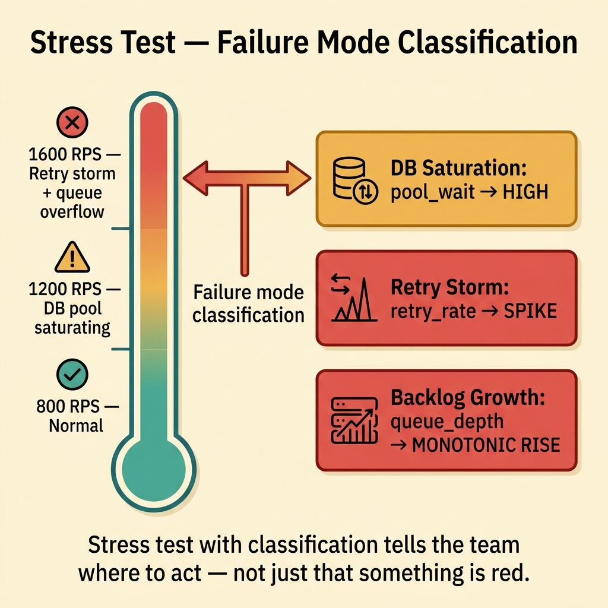
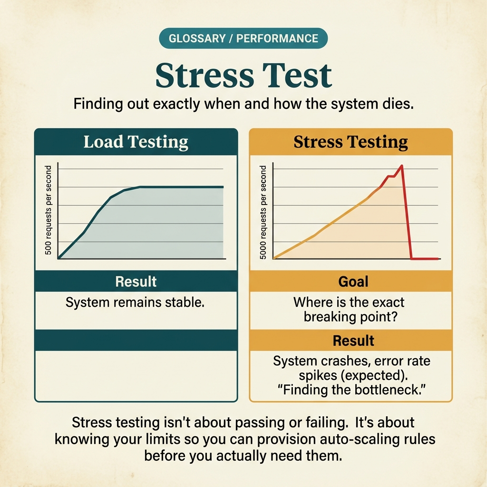

<!-- tags: glossary, reference, testing-quality, stress-test -->
# Stress Test

> Testing by pushing the system well beyond its expected limits to observe the breaking point, failure modes, and recovery behavior.

| Aspect | Detail |
| --- | --- |
| **Concept** | Testing by pushing the system well beyond its expected limits to observe the breaking point, failure modes, and recovery behavior. |
| **Audience** | SRE, backend engineer, platform engineer |
| **Primary style** | Glossary term |
| **Entry point** | Use when the team needs to know how the system breaks and how it recovers after being pushed past its safe zone. |

📅 Created: 2026-03-30 · 🔄 Updated: 2026-04-04 · ⏱️ 9 min read

---

## 1. DEFINE

Picture this: load test can show the system is fine within the expected traffic zone, but it does not reveal what happens when traffic doubles or a queue swells beyond plan. Stress test exists to expose the real failure modes when every layer of protection starts being pushed past its limits.

**Stress Test** is testing by pushing the system well beyond its expected limits to observe the breaking point, failure modes, and recovery behavior.

| Variant | Description |
| --- | --- |
| Burst stress | Spikes load suddenly to observe spike handling. |
| Saturation stress | Holds load above the threshold to watch how the system degrades. |
| Recovery stress | After overload, measures the ability to return to normal operation. |

| Approach | Time | Space | When to choose |
| --- | --- | --- | --- |
| Burst overload | O(n burst windows) | O(metrics) | When worried about thundering herd or unexpected spikes. |
| Soak under overload | O(n duration) | O(history) | When you want to see queue buildup, leaks, or retry storms. |
| Break-and-recover | O(overload + recovery) | O(checkpoints) | When you need to measure both the breaking point and recovery time. |

Core insight:

> Stress test is not about bragging that the system handles high load. It is about understanding failure modes, blast radius, and recovery behavior before production forces the team to learn that lesson painfully.

### 1.1 Invariants & Failure Modes

The critical invariant is that stress tests must have data and environment guardrails. Pushing the system past its threshold without a kill switch can corrupt the environment and invalidate subsequent results.

---

## 2. CONTEXT

**Who uses it**: SRE, backend engineer, platform engineer

**When**: Use when the team needs to know how the system breaks and how it recovers after being pushed past its safe zone.

**Purpose**: Stress test is not about bragging that the system handles high load. It is about understanding failure modes, blast radius, and recovery behavior before production forces the team to learn that lesson painfully.

**In the ecosystem**:
- Stress test differs from load test in that it deliberately exceeds the expected traffic zone.
- Stress test differs from chaos test: stress increases pressure; chaos injects faults intentionally.
- If there is no recovery phase, the stress test only answers half the question.

---

Finding the breaking point is clear. But how does stress test differ from load test, how far is enough to push, and what are the results used for?

## 3. EXAMPLES

Stress test surfaces most visibly when a 5× traffic spike hits and the team does not know which service dies first, when auto-scale config is wrong and new pods come up slower than traffic grows, or when a memory leak only appears after 2 hours of sustained load. The examples below place the pattern into exactly those situations.

### Example 1: Basic — Identify where a workflow starts to overload

> **Goal**: Know at what level latency and error rate begin to leave the acceptable zone.
> **Approach**: Increase load beyond the target and track the workflow's red thresholds.
> **Example**: Checkout targets 800 RPS; stress up to 1600 RPS to see the first signs.
> **Complexity**: Basic

```yaml
stress_profile:
  target_workflow: checkout
  stages:
    - rps: 800
    - rps: 1200
    - rps: 1600
  stop_when:
    p95_latency_gt: 2s
    error_rate_gt: 5%
```

**Why?** Load test reveals the operating zone; stress test reveals the cliff edge. Knowing the overload threshold helps the team define guardrails and autoscaling more accurately.

**Takeaway**: Basic stress test should clearly state which overload level is being tested and which signal counts as the start of failure.

### Example 2: Intermediate — Observe failure modes instead of just counting errors

> **Goal**: Know which layer the system breaks at: queue, DB, pool, or retry storm.
> **Approach**: Collect queue depth, DB wait, retry rate, and timeout instead of just error count.
> **Example**: CPU is still fine but DB pool is exhausted and retries are exploding.
> **Complexity**: Intermediate



*Figure: Stress test with failure-mode classification tells the team where to act — not just that something is red.*

```yaml
failure_mode_probe:
  observe:
    - queue_depth
    - db_pool_wait
    - retry_rate
    - timeout_rate
  classify_failure:
    db_saturation: db_pool_wait_high
    retry_storm: retry_rate_spikes
    backlog_growth: queue_depth_monotonic
```

**Why?** Just looking at error count will not tell the team where to fix. Stress test delivers value when it maps out the specific failure mode so the next action is not a guessing game.

**Takeaway**: Intermediate stress test must produce a diagnosis — not just a red light.

### Example 3: Advanced — Measure recovery capability after load drops

> **Goal**: Know whether the system returns to normal after overload, or leaves behind backlog and technical debt.
> **Approach**: After the overload phase, bring traffic back to normal and measure recovery checkpoints.
> **Example**: Load drops to 400 RPS but the queue must return to baseline within 3 minutes.
> **Complexity**: Advanced

```yaml
recovery_phase:
  after_overload_rps: 400
  expect_recovery_within: 3m
  checkpoints:
    - queue_depth_back_to_baseline
    - error_rate_lt: 1%
    - latency_p95_back_under: 300ms
```

**Why?** Some systems do not die outright under overload but also do not self-recover quickly afterward. Recovery behavior matters just as much as the breaking point — because production traffic typically rises and then falls.

**Takeaway**: Advanced stress test must include a recovery phase; without it, the insight is only half complete.

### Example 4: Expert — Turn stress test into a recurring exercise for resilience policy

> **Goal**: Verify whether circuit breakers, backpressure, and concurrency limits actually produce graceful degradation.
> **Approach**: Compare stress scenarios with and without the main protection layers enabled.
> **Example**: API gateway with concurrency limit and queue backpressure is compared against a baseline with no protection.
> **Complexity**: Expert

```yaml
resilience_policy_stress:
  protections:
    - circuit_breaker
    - queue_backpressure
    - api_concurrency_limit
  compare_against_baseline: true
  success_signal:
    graceful_degradation_present: true
```

**Why?** Stress test is only useful long-term when it teaches the team which policy actually makes the system degrade more gracefully. Otherwise, every overload just produces the same vague lesson.

**Takeaway**: Expert stress testing is a recurring drill for resilience controls — not just breaking things to see what happens.

---

## 4. COMPARE




*Figure: Position of stress test between load test, chaos test, and capacity planning.*

Stress test sounds like a stronger load test. Partially true — but the purpose differs: load test confirms capacity at expected volume; stress test finds the point-of-failure to reveal the real limit and recovery behavior.

### Level 1

```text
load rises beyond safe ceiling
  -> system degrades
  -> failure mode appears
  -> team sees where it breaks
```

*Figure: Level 1 shows stress test deliberately crosses the safe zone to see the breaking point.*

### Level 2

```text
overload begins
  -> queue depth spikes
  -> retries amplify pressure
  -> breakers trip or not
  -> recovery starts after load drops
```

*Figure: Level 2 emphasizes stress test must observe both the breakdown phase and the recovery phase.*

### Easy to confuse or cross the boundary

| # | Severity | Mistake | Consequence | Fix |
| --- | --- | --- | --- | --- |
| 1 | 🔴 Fatal | Running stress test on an environment or data with real side effects | Corrupts the system or impacts users | Always have guardrails for tenant, data, and a kill switch. |
| 2 | 🟡 Common | No recovery phase | Know the breaking point but not recovery behavior | Always measure recovery checkpoints after overload. |
| 3 | 🟡 Common | Only watching error count | Root cause of the failure mode remains unknown | Collect queue, pool, retry, and timeout metrics. |
| 4 | 🔵 Minor | Not comparing against resilience policy | Hard to know which protection layer is effective | Run comparative stress scenarios. |

### Quick scan

| If you encounter | What to do |
| --- | --- |
| Need to know where the system breaks beyond its threshold | Use stress test. |
| Want to measure recovery after overload | Add a recovery phase. |
| Want to verify whether resilience controls are effective | Compare runs with and without policy enabled. |

---

## 5. REF

| Resource | Type | Link | Notes |
| --- | --- | --- | --- |
| Google SRE Book | Reference | https://sre.google/sre-book/ | Reliability, overload, and graceful degradation. |
| Netflix Tech Blog | Reference | https://netflixtechblog.com/tagged/chaos-engineering | Posts on overload and resilience experiments. |
| k6 Docs | Official | https://k6.io/docs/ | Practical tool for organizing overload scenarios. |

---

## 6. RECOMMEND

Stress test solves the problem of "where does the system die under overload?" The next question: what about production failure injection, and how does normal load verification work?

| Expand to | When | Why | File/Link |
| --- | --- | --- | --- |
| Chaos Test | When you want to inject faults instead of just increasing load | Chaos test adds the fault-injection dimension to resilience. | [Chaos Test](./11-chaos-test.md) |
| Load Test | When still within expected traffic levels | Load test is more appropriate before stepping into overload. | [Load Test](./09-load-test.md) |
| Testing & Quality | When you need to return to the full taxonomy | Keep context of the whole topic. | [Testing & Quality](./README.md) |

Back to that traffic spike from the beginning — 5× normal, no idea which service dies first. Now you know: stress test is not about proving the system is strong. It is about finding the weakest spot before production finds it for you.

**Links**: [← Previous](./09-load-test.md) · [→ Next](./11-chaos-test.md)
