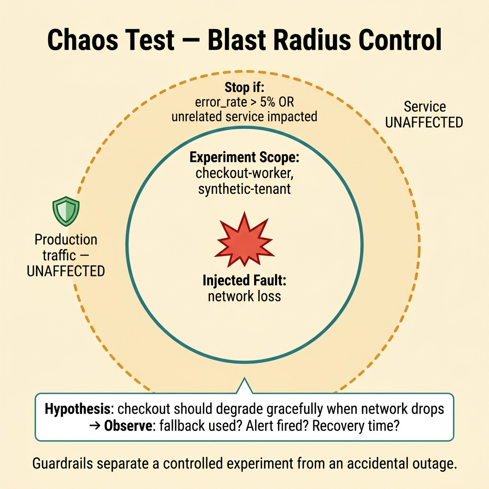
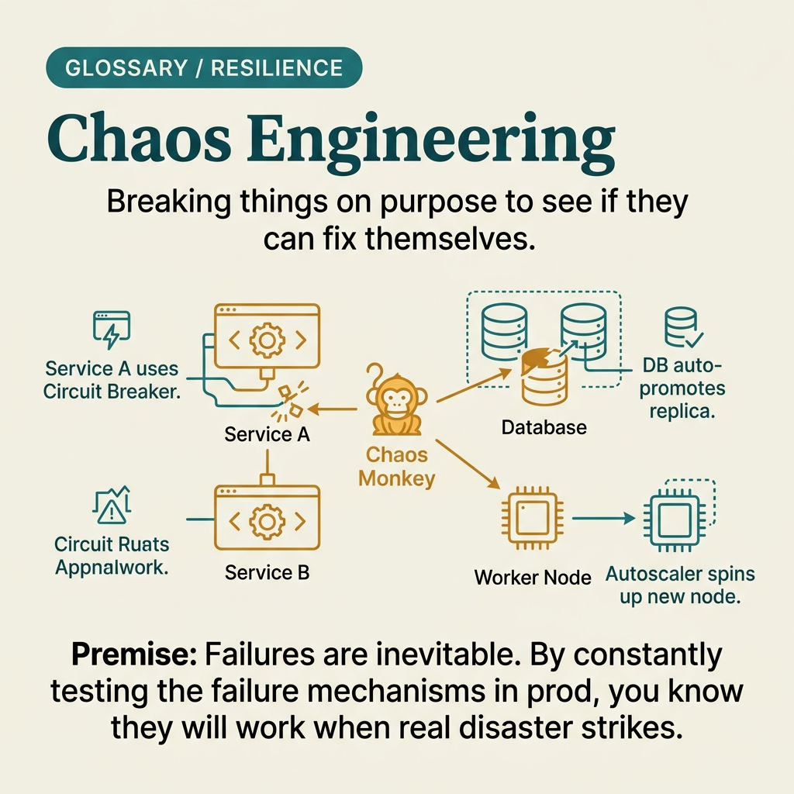

<!-- tags: glossary, reference, testing-quality, chaos-test -->
# Chaos Test

> Resilience testing by deliberately injecting faults into a real or near-real environment — such as killing nodes, dropping network, or slowing dependencies.

| Aspect | Detail |
| --- | --- |
| **Concept** | Resilience testing by deliberately injecting faults into a real or near-real environment — such as killing nodes, dropping network, or slowing dependencies. |
| **Audience** | SRE, platform engineer, backend engineer |
| **Primary style** | Glossary term |
| **Entry point** | Use when the team wants to verify resilience against real fault injection, rather than just assuming timeouts or failovers will work correctly on their own. |

📅 Created: 2026-03-30 · 🔄 Updated: 2026-04-11 · ⏱️ 9 min read

---

## 1. DEFINE

Picture this: the documentation says "if Redis goes down, the service degrades gracefully," but nobody has ever actually cut Redis to see if that really happens. Chaos test exists to force resilience assumptions through reality.

**Chaos Test** is resilience testing by deliberately injecting faults into a real or near-real environment — such as killing nodes, dropping network, or slowing dependencies.

| Variant | Description |
| --- | --- |
| Dependency fault injection | Slows or cuts a dependency like DB, cache, or queue. |
| Topology chaos | Kills pods, cuts zones, or drops replicas. |
| Network chaos | Injects packet loss, latency, or partitions. |

| Approach | Time | Space | When to choose |
| --- | --- | --- | --- |
| Single fault experiment | O(1 experiment) | O(metrics) | When starting out and needing a clear, focused lesson. |
| Blast-radius controlled chaos | O(n scopes) | O(history) | When you want fault injection but need to limit the scope. |
| Hypothesis-driven chaos | O(n hypotheses) | O(experiment log) | When the team has clear resilience hypotheses to validate. |

Core insight:

> Chaos test is not random sabotage. It is an experiment with a clear hypothesis about fault tolerance, a controlled blast radius, and predefined observability metrics.

### 1.1 Invariants & Failure Modes

The critical invariant is that every chaos experiment must have a hypothesis, blast radius, success signal, and rollback plan. Missing any one of the four makes fault injection more likely to become a real incident than a controlled experiment.

---

## 2. CONTEXT

**Who uses it**: SRE, platform engineer, backend engineer

**When**: Use when the team wants to verify resilience against real fault injection, rather than just assuming timeouts or failovers will work correctly on their own.

**Purpose**: Chaos test is not random sabotage. It is an experiment with a clear hypothesis about fault tolerance, a controlled blast radius, and predefined observability metrics.

**In the ecosystem**:
- Chaos test differs from stress test: stress increases pressure; chaos changes the fault conditions.
- Chaos test should not start in production if the team lacks a kill switch and minimal observability.
- Without a hypothesis and stop condition, chaos test only creates noise — not learning.

---

Injecting failure is clear. But should chaos test run in production or staging, what to inject first, and what does the team need to prepare before starting?

## 3. EXAMPLES

Chaos test surfaces most visibly when the team is confident the system is resilient but killing 1 pod makes the whole cluster shake, when the fallback path has never actually been triggered, or when an incident postmortem concludes "we never tested this scenario." The examples below place the pattern into exactly those situations.

### Example 1: Basic — Verify hypothesis when a dependency is unusually slow

> **Goal**: Confirm that timeouts and fallback actually keep the system usable when a dependency is slow.
> **Approach**: Inject latency into one dependency and measure the caller's behavior.
> **Example**: Cache service gets 2-second latency; API should fall back to DB or degrade according to policy.
> **Complexity**: Basic

```yaml
chaos_hypothesis:
  dependency: redis-cache
  inject_fault: latency_2000ms
  expect:
    request_still_served: true
    fallback_path_used: true
    p95_latency_lt: 1200ms
```

**Why?** Many fallbacks are correct only on paper because nobody has ever put the dependency into a fault state. Chaos test places the system in exactly that condition to confirm whether the expected behavior exists outside of slides.

**Takeaway**: Basic chaos test should be narrow: one fault, one hypothesis, and a small blast radius.

### Example 2: Intermediate — Limit blast radius by scoping the experiment

> **Goal**: Ensure fault injection creates learning without becoming an unintended outage.
> **Approach**: Lock the experiment to one service, tenant, or sub-environment with clear guardrails.
> **Example**: Inject network loss only into the checkout worker of a dedicated staging tenant.
> **Complexity**: Intermediate



*Figure: Guardrails and stop conditions separate a controlled experiment from an accidental outage.*

```yaml
experiment_scope:
  environment: staging
  target: checkout-worker
  safe_tenant: synthetic-tenant
  stop_if:
    error_rate_gt: 5%
    unrelated_service_impacted: true
```

**Why?** Not limiting scope is the most common mistake in chaos testing. Guardrails let the team dare to run experiments while keeping the environment and uninvolved stakeholders safe.

**Takeaway**: Intermediate chaos test is trustworthy when the blast radius is designed upfront — not handled after the fact.

### Example 3: Advanced — Use chaos test to validate runbooks and alert paths

> **Goal**: Not only check whether the system degrades gracefully, but also whether alerts and people respond correctly.
> **Approach**: During the experiment, observe alerts, dashboards, runbooks, and detection/response times.
> **Example**: Kill the leader node of a queue cluster and see which signal the on-call receives and which runbook they follow.
> **Complexity**: Advanced

```yaml
operational_chaos:
  injected_fault: queue_leader_killed
  observe:
    - alert_fired
    - dashboard_signal_present
    - runbook_followed
    - recovery_time_recorded
  success:
    detection_lt: 2m
    recovery_lt: 10m
```

**Why?** A system may tolerate faults fairly well but the team can still fail operationally if alerts are wrong or runbooks are unusable. Good chaos test must touch this socio-technical path as well.

**Takeaway**: Advanced chaos test validates both technical resilience and human operability.

### Example 4: Expert — Build a recurring chaos program around resilience hypotheses

> **Goal**: Turn chaos from a rare event into a continuous discipline for learning about fault tolerance.
> **Approach**: Store hypotheses, experiment history, findings, and action items for periodic replay.
> **Example**: Every quarter, replay 5 core resilience hypotheses: zone loss, cache latency, queue backlog, stale config, auth timeout.
> **Complexity**: Expert

```yaml
chaos_program:
  recurring_hypotheses:
    - zone_failure_should_failover_within_60s
    - cache_latency_should_trigger_fallback
    - auth_timeout_should_not_block_public_read_path
  cadence: quarterly
  output:
    - findings
    - remediation_items
    - rerun_after_fix
```

**Why?** A single experiment only produces local insight. A recurring chaos program is what helps the team track whether resilience is actually improving or degrading after each architectural change.

**Takeaway**: Expert chaos practice is a portfolio of hypotheses measured over time — not just a few scattered "game day" events.

---

## 4. COMPARE




*Figure: Position of chaos test between overload pressure, controlled fault injection, and operational learning.*

Chaos test sounds like random stress testing. Not quite: stress test asks how much load the system can handle; chaos test asks how the system reacts when a specific failure actually occurs.

### Level 1

```text
resilience hypothesis
  -> inject one fault
  -> observe system behavior
  -> compare with expected graceful degradation
```

*Figure: Level 1 shows chaos test is a hypothesis-driven resilience experiment — not random destruction.*

### Level 2

```text
pick dependency or node
  -> constrain blast radius
  -> inject fault
  -> watch alerts, fallbacks, recovery
  -> stop if guardrail violated
```

*Figure: Level 2 emphasizes chaos test needs clear guardrails and stop conditions.*

### Easy to confuse or cross the boundary

| # | Severity | Mistake | Consequence | Fix |
| --- | --- | --- | --- | --- |
| 1 | 🔴 Fatal | Injecting faults without guardrails or a kill switch | Experiment becomes a real incident | Define scope, stop conditions, and rollback before running. |
| 2 | 🟡 Common | No clear hypothesis | Results are vague, hard to turn into action | Write expected graceful behavior before the experiment. |
| 3 | 🟡 Common | Only watching technical metrics, ignoring alert/runbook path | Team is still blind when a real incident happens | Observe the operational and human response path as well. |
| 4 | 🔵 Minor | Running chaos once then forgetting about it | No way to know if resilience improves over time | Turn it into a recurring program with tracked findings. |

### Quick scan

| If you encounter | What to do |
| --- | --- |
| Want to verify resilience hypothesis with real faults | Use chaos test. |
| Do not yet have clear blast radius or rollback | Do not rush into the experiment. |
| Want to verify alerts and runbooks as well | Design chaos as an operational drill. |

---

## 5. REF

| Resource | Type | Link | Notes |
| --- | --- | --- | --- |
| Principles of Chaos Engineering | Reference | https://principlesofchaos.org/ | Foundational source for hypothesis-driven chaos engineering. |
| Netflix Tech Blog | Reference | https://netflixtechblog.com/tagged/chaos-engineering | Practical examples of fault injection. |
| Google SRE Workbook | Reference | https://sre.google/workbook/ | Connection between resilience, alerting, and operational readiness. |

---

## 6. RECOMMEND

Chaos test solves the problem of "is the system truly resilient when component X dies?" The next question: where is the volume limit, and how does test mutation work?

| Expand to | When | Why | File/Link |
| --- | --- | --- | --- |
| Stress Test | When the primary risk is overload rather than fault injection | Stress test is more appropriate for overload behavior. | [Stress Test](./10-stress-test.md) |
| Runbook | When you want to connect chaos findings to operational response | Runbook is the living artifact for operational response. | [Runbook](../observability-operations/12-runbook.md) |
| Testing & Quality | When you need to return to the full taxonomy | Keep context of the whole topic. | [Testing & Quality](./README.md) |

Back to that "resilient system" from the beginning — kill 1 pod, the whole cluster wobbles. Now you know: a resilience claim without chaos test is just an assumption. Inject failure with control, observe real behavior, then you will know whether fallback actually works or not.

**Links**: [← Previous](./10-stress-test.md) · [→ Next](./12-mutation-test.md)
