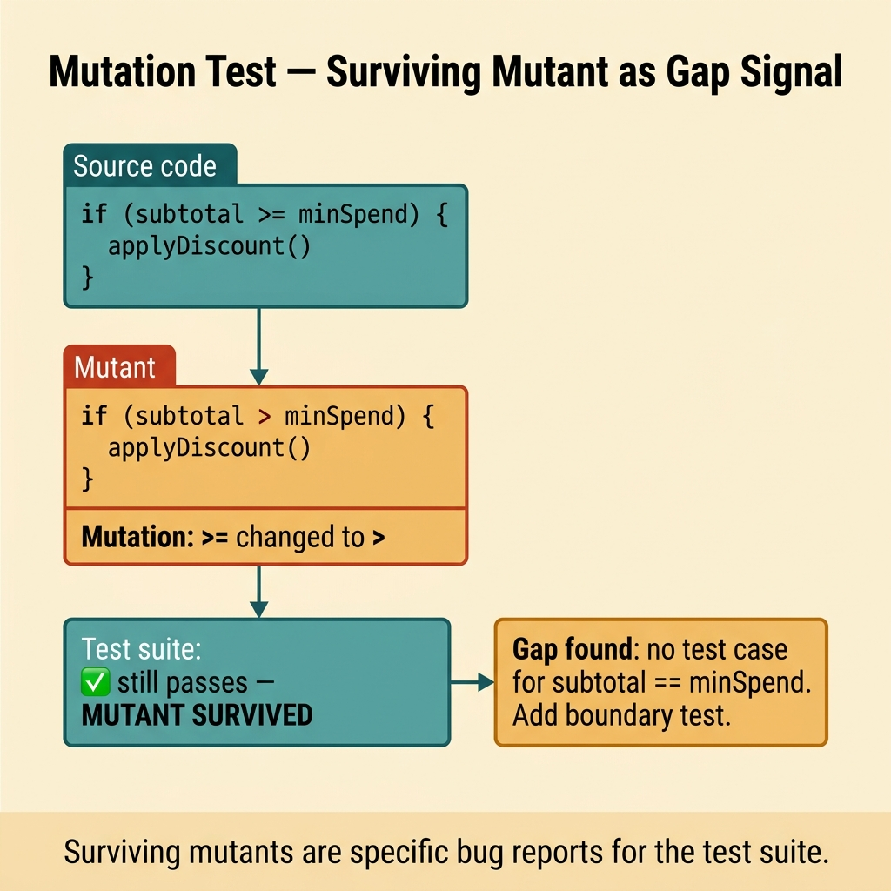
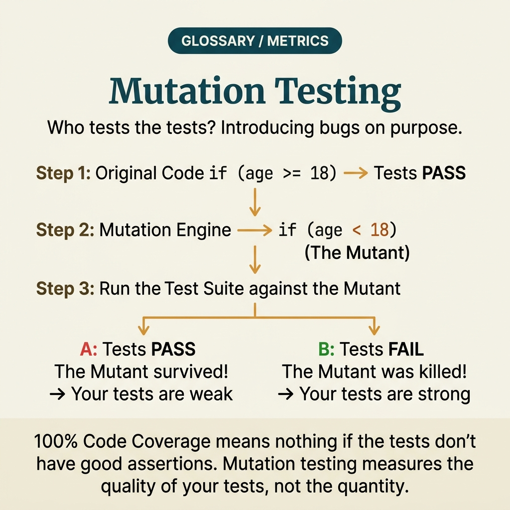

<!-- tags: glossary, reference, testing-quality, mutation-test -->
# Mutation Test

> A technique for evaluating test suite quality by deliberately making small changes to source code; if the tests still pass, the suite is not strong enough.

| Aspect | Detail |
| --- | --- |
| **Concept** | A technique for evaluating test suite quality by deliberately making small changes to source code; if the tests still pass, the suite is not strong enough. |
| **Audience** | Backend engineer, QA engineer, reviewer |
| **Primary style** | Glossary term |
| **Entry point** | Use when coverage looks great but the team suspects the test suite merely traverses code without truly catching wrong logic. |

📅 Created: 2026-03-30 · 🔄 Updated: 2026-04-04 · ⏱️ 9 min read

---

## 1. DEFINE

Picture this: coverage reports 92%, but a small logic bug still slips into production. Mutation test exists to ask a harder question than coverage: if the code is tweaked slightly in a plausibly wrong way, is the test suite strong enough to kill that mutant?

**Mutation Test** is a technique for evaluating test suite quality by deliberately making small changes to source code; if the tests still pass, the suite is not strong enough.

| Variant | Description |
| --- | --- |
| Operator mutation | Changes operators, conditions, or constants. |
| Control-flow mutation | Changes if-branches or branch decisions. |
| Semantic mutation | Tweaks behavior slightly to see if tests catch the wrong meaning. |

| Approach | Time | Space | When to choose |
| --- | --- | --- | --- |
| Focused mutation set | O(n selected mutants) | O(report) | When starting out and only want to check a critical module. |
| Diff-based mutation | O(n changed lines) | O(diff report) | When you want to apply mutation only to recently changed code. |
| Scheduled mutation run | O(n modules) | O(history) | When mutation is too expensive to run on every commit. |

Core insight:

> Mutation test measures the sharpness of assertions and test design — not just how much code gets executed. It is most useful when the team already has a stable suite and wants to know whether that suite truly detects wrong logic.

### 1.1 Invariants & Failure Modes

The critical invariant is that mutation test must be applied on an intentionally scoped target. Running blindly across the entire codebase is usually too expensive and produces long reports that never translate into action.

---

## 2. CONTEXT

**Who uses it**: Backend engineer, QA engineer, reviewer

**When**: Use when coverage looks great but the team suspects the test suite merely traverses code without truly catching wrong logic.

**Purpose**: Mutation test measures the sharpness of assertions and test design — not just how much code gets executed. It is most useful when the team already has a stable suite and wants to know whether that suite truly detects wrong logic.

**In the ecosystem**:
- Mutation test differs from coverage: coverage measures "did this code run?" while mutation measures "if it goes slightly wrong, does the test catch it?"
- Mutation test does not replace unit/integration tests; it is a way to check their strength.
- If many mutants survive but only in dead code or noise, read the report selectively instead of panicking.

---

Measuring test suite quality is clear. But what mutation score is enough, which mutants are worth killing, and what is the cost of running mutation tests?

## 3. EXAMPLES

Mutation test surfaces most visibly when coverage is 95% but bugs still slip because tests do not assert correctly, when changing `>=` to `>` causes no test failure, or when the team debates whether coverage is sufficient without any metric measuring test quality. The examples below place the pattern into exactly those situations.

### Example 1: Basic — Check a critical module with a small set of mutants

> **Goal**: Know whether existing assertions are sharp enough for the critical logic.
> **Approach**: Pick a critical module and run a basic set of mutations.
> **Example**: Discount engine has high coverage but assertions are suspected to be shallow.
> **Complexity**: Basic

```yaml
mutation_scope:
  module: discount-engine
  mutant_types:
    - condition_negation
    - comparison_swap
    - constant_change
  success_target:
    mutation_score_gt: 80%
```

**Why?** Mutation test is very expensive when run aimlessly. Starting with a critical module gives the team more meaningful feedback and teaches them how to read surviving mutants.

**Takeaway**: Basic mutation testing should start from a small scope with high business value.

### Example 2: Intermediate — Use mutation report to pinpoint weak assertions

> **Goal**: Turn surviving mutants into specific actions instead of a generic number.
> **Approach**: Map surviving mutants to the test case or assertion that is missing.
> **Example**: A mutant that changes `>=` to `>` survives because the suite has no boundary case at the min-spend threshold.
> **Complexity**: Intermediate



*Figure: Surviving mutants point directly at the assertion gap — far more actionable than a raw mutation score.*

```yaml
surviving_mutant_review:
  mutant: comparison_swap
  location: pricing/min_spend_rule
  likely_gap:
    missing_boundary_case: true
  follow_up:
    add_test: subtotal_equals_threshold
```

**Why?** The greatest strength of mutation test is not the mutation score — it is the ability to pinpoint where assertions are shallow. A surviving mutant is usually a very specific reminder of the case the suite does not yet protect.

**Takeaway**: Intermediate mutation practice is reading surviving mutants like bug reports for the test suite.

### Example 3: Advanced — Apply mutation by diff to protect recently changed code

> **Goal**: Reduce mutation cost while still increasing confidence in newly changed areas.
> **Approach**: Only generate mutants for files or lines that just changed, and run the relevant test subset.
> **Example**: A PR fixing auth token validation runs diff-based mutation instead of the whole repo.
> **Complexity**: Advanced

```yaml
diff_mutation:
  changed_files:
    - auth/token_validator.go
  mutant_scope: changed_lines_only
  test_selection:
    - auth-unit-suite
    - auth-integration-smoke
  gate:
    reject_if_survivors_gt: 0
```

**Why?** Full-repo mutation is too expensive for everyday development cadence. Diff-based mutation keeps quality pressure exactly where risk just increased: the newly changed code.

**Takeaway**: Advanced mutation testing fits well as a localized release guard for high-risk changes.

### Example 4: Expert — Use mutation governance to balance cost and value

> **Goal**: Prevent mutation from becoming an expensive ritual the team resents.
> **Approach**: Divide modules by criticality, cadence, and gate policy.
> **Example**: Core pricing runs nightly mutation; helper utils only run a weekly report.
> **Complexity**: Expert

```yaml
mutation_governance:
  core_domains:
    cadence: nightly
    gate: strict
  medium_domains:
    cadence: weekly
    gate: advisory
  low_risk_domains:
    cadence: on-demand
  prioritize_survivors_on_critical_paths: true
```

**Why?** Not every module needs mutation at the same intensity. Governance by criticality lets the team use this technique where the value exceeds the cost.

**Takeaway**: Expert mutation strategy is allocating the mutation budget to the right places — not forcing one policy across the entire codebase.

---

## 4. COMPARE




*Figure: Position of mutation test between test coverage, fuzz test, and code quality metrics.*

Mutation test sounds like advanced test coverage. Partially true — but coverage measures "which code was executed," while mutation test measures "does the test actually catch bugs?" Two very different metrics.

### Level 1

```text
source code mutated slightly
  -> existing tests rerun
  -> mutant killed or survives
  -> surviving mutants reveal weak assertions
```

*Figure: Level 1 shows mutation test checks suite strength by making code go wrong in a controlled way.*

### Level 2

```text
high line coverage
  -> many mutants survive
  -> insight: tests execute code but do not assert behavior deeply enough
```

*Figure: Level 2 emphasizes mutation test is especially useful when coverage is high but confidence is still low.*

### Easy to confuse or cross the boundary

| # | Severity | Mistake | Consequence | Fix |
| --- | --- | --- | --- | --- |
| 1 | 🔴 Fatal | Running mutation across the entire repo blindly | High cost, long reports with little actionable insight | Start from critical modules or diff-based scope. |
| 2 | 🟡 Common | Only looking at total mutation score | Missing specific insight from surviving mutants | Review surviving mutants by location and missing boundary case. |
| 3 | 🟡 Common | Making mutation a hard gate on every module | Team resents it and bypasses the pipeline | Tier cadence/gate by criticality. |
| 4 | 🔵 Minor | Not cross-referencing surviving mutants with dead code or noise | Wasting effort on low-signal items | Filter scope and read reports with intention. |

### Quick scan

| If you encounter | What to do |
| --- | --- |
| High coverage but suspect weak assertions | Use mutation test. |
| Mutation pipeline is too expensive | Narrow scope to critical modules or diff-based. |
| Mutation score is low | Read surviving mutants before looking at the aggregate number. |

---

## 5. REF

| Resource | Type | Link | Notes |
| --- | --- | --- | --- |
| Stryker Mutator Docs | Official | https://stryker-mutator.io/ | Popular multi-language mutation testing tool. |
| PIT Mutation Testing | Official | https://pitest.org/ | Mutation testing for the JVM ecosystem. |
| Mutation Testing | Reference | https://en.wikipedia.org/wiki/Mutation_testing | Foundational concepts and history. |

---

## 6. RECOMMEND

Mutation test solves the problem of "does the test suite actually catch bugs?" The next question: what about random input generation, and what does the basic coverage metric look like?

| Expand to | When | Why | File/Link |
| --- | --- | --- | --- |
| Test Coverage | When the team is confusing high coverage with high confidence | Coverage and mutation should be read together to avoid a false sense of safety. | [Test Coverage](./16-test-coverage.md) |
| Unit Test | When you want to strengthen assertions at the lowest layer | Mutation often leads to writing sharper unit tests. | [Unit Test](./08-unit-test.md) |
| Testing & Quality | When you need to return to the full taxonomy | Keep context of the whole topic. | [Testing & Quality](./README.md) |

Back to that 95% coverage from the beginning — a nice number but changing `>=` to `>` caused no test to fail. Now you know: coverage measures quantity; mutation test measures quality. Both are needed, but without mutation score, coverage is just a pretty number on the dashboard.

**Links**: [← Previous](./11-chaos-test.md) · [→ Next](./13-fuzz-test.md)
