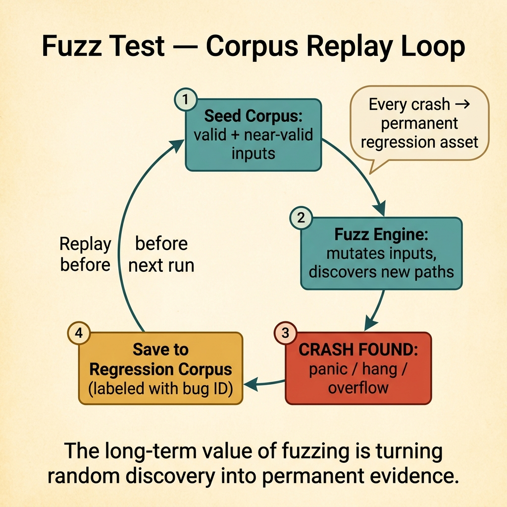
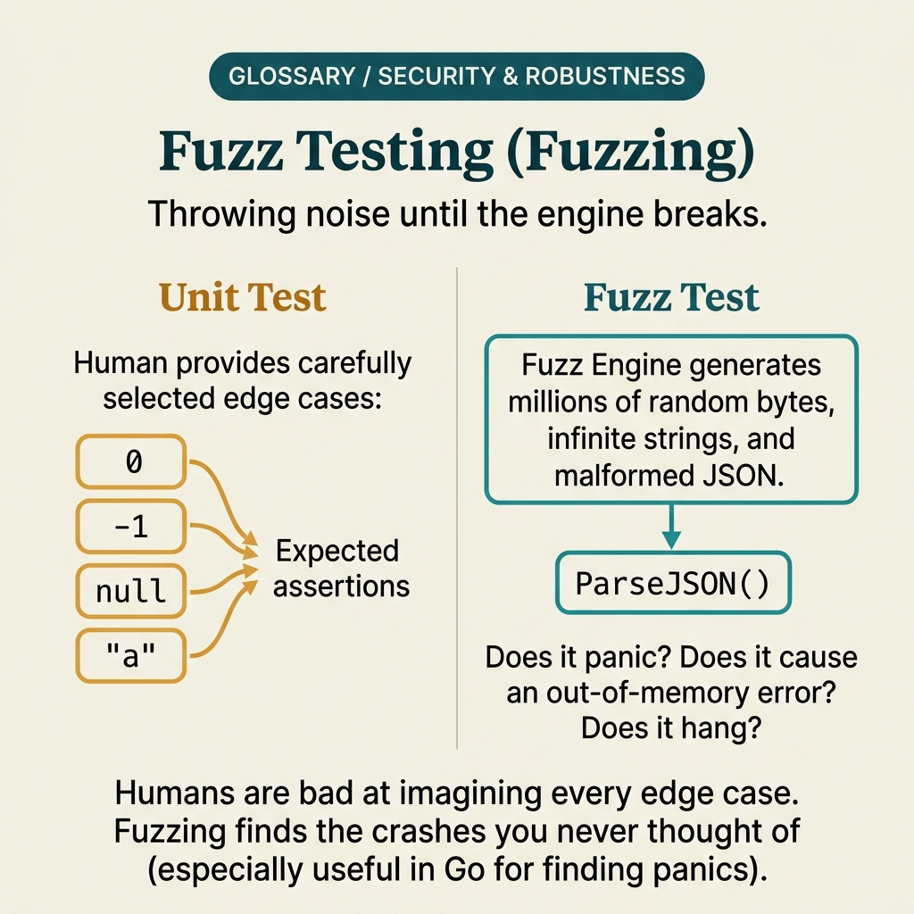

<!-- tags: glossary, reference, testing-quality, fuzz-test -->
# Fuzz Test

> Testing with random, malformed, or abnormal data to find crashes, undefined behavior, and security vulnerabilities.

| Aspect | Detail |
| --- | --- |
| **Concept** | Testing with random, malformed, or abnormal data to find crashes, undefined behavior, and security vulnerabilities. |
| **Audience** | Security engineer, backend engineer, QA engineer |
| **Primary style** | Glossary term |
| **Entry point** | Use when a parser, validator, or API boundary risks breaking with dirty data that manual test cases can hardly anticipate. |

📅 Created: 2026-03-30 · 🔄 Updated: 2026-04-04 · ⏱️ 9 min read

---

## 1. DEFINE

Picture this: a parser can pass every polished unit test, but a single rare malformed string causes a panic in production. Fuzz test exists to throw countless bad and bizarre inputs at that boundary faster than human imagination can keep up.

**Fuzz Test** is testing with random, malformed, or abnormal data to find crashes, undefined behavior, and security vulnerabilities.

| Variant | Description |
| --- | --- |
| Coverage-guided fuzzing | Generates new inputs based on coverage paths just discovered. |
| Seeded fuzzing | Starts from a corpus of valid and near-valid inputs. |
| API fuzzing | Fuzzes payloads or parameters of an HTTP/API boundary. |

| Approach | Time | Space | When to choose |
| --- | --- | --- | --- |
| Function-level fuzz | O(n generated inputs) | O(corpus) | When you want to test a parser or validator in isolation. |
| Protocol fuzz | O(n message variants) | O(message corpus) | When the boundary is a message format or API payload. |
| Regression fuzz corpus | O(n corpus × runs) | O(saved crashes) | When you want to replay inputs that previously caused failures long-term. |

Core insight:

> Fuzz test expands the input space far beyond what manual case writing can cover. It is especially powerful at boundaries that receive untrusted or highly diverse data.

### 1.1 Invariants & Failure Modes

The critical invariant is that fuzz test must have a mechanism to save the corpus or crashing inputs. Without it, the team only knows "there was a crash once" but has no evidence left to fix and regression-proof.

---

## 2. CONTEXT

**Who uses it**: Security engineer, backend engineer, QA engineer

**When**: Use when a parser, validator, or API boundary risks breaking with dirty data that manual test cases can hardly anticipate.

**Purpose**: Fuzz test expands the input space far beyond what manual case writing can cover. It is especially powerful at boundaries that receive untrusted or highly diverse data.

**In the ecosystem**:
- Fuzz test differs from property-based test: fuzz prioritizes abnormal inputs and broader crash paths.
- Fuzz test does not replace validator/unit tests; it forces the boundary to handle worse-than-normal input.
- If a discovered crash is not saved as a seed or corpus, the lesson becomes very hard to reproduce.

---

Random input is clear. But how does fuzz test differ from property-based test, how long should it run, and what are the results used to fix?

## 3. EXAMPLES

Fuzz test surfaces most visibly when a parser crashes on input no developer thought of, when a buffer overflow only appears with a 10 MB string, or when a security audit demands evidence that unit tests do not cover. The examples below place the pattern into exactly those situations.

### Example 1: Basic — Fuzz a narrow parser or validator

> **Goal**: Find panic or undefined behavior at a boundary receiving untrusted data.
> **Approach**: Pick a parse or validate function with string/bytes input and feed it random + malformed corpus.
> **Example**: URL parser or coupon validator receiving dirty strings from user input.
> **Complexity**: Basic

```yaml
fuzz_target:
  function: parse_coupon_payload
  input_type: bytes
  seeds:
    - '{}'
    - '{"code":"SAVE10"}'
    - 'not-json'
  fail_on:
    - panic
    - infinite_loop
```

**Why?** Humans can hardly anticipate every kind of bad input. Fuzz test expands that input space automatically and often discovers paths that hand-written cases never touch.

**Takeaway**: Basic fuzz test should start at a parser or validator with untrusted input and sensitive behavior.

### Example 2: Intermediate — Save crashing corpus for replay as a regression asset

> **Goal**: When fuzz discovers a failure-causing input, turn it into a long-term evidence asset for the suite.
> **Approach**: Every crash or hang gets its seed or corpus saved for replay after the fix.
> **Example**: A deeply nested payload that causes stack overflow is saved as a regression corpus.
> **Complexity**: Intermediate



*Figure: Every crashing input becomes a permanent regression asset — the long-term value of fuzzing.*

```yaml
fuzz_corpus:
  on_crash:
    save_input: true
    label_with_bug_id: true
  regression_replay:
    run_saved_corpus_before_random_mutation: true
```

**Why?** Not saving crash inputs is the biggest waste in fuzzing. The long-term value of fuzz test lies in every input that ever caused a failure becoming a regression asset.

**Takeaway**: Intermediate fuzz practice turns random discovery into an asset that can be replayed with intention.

### Example 3: Advanced — Fuzz API boundary with schema-aware seeds

> **Goal**: Find bugs that lie between valid and malformed payload shapes — not just garbage bytes.
> **Approach**: Start from seeds that nearly match the schema, then mutate field types, lengths, nesting, and encoding.
> **Example**: Order API receives payloads with valid shape but extreme values or mismatched data types.
> **Complexity**: Advanced

```yaml
api_fuzz_plan:
  target: POST /orders
  seed_payloads:
    - valid_minimal_order
    - valid_large_order
  mutations:
    - oversized_strings
    - invalid_enum
    - deeply_nested_metadata
    - numeric_overflow
```

**Why?** Pure random bytes usually only test the raw parser. For API boundaries, schema-aware seeds help fuzzing reach deeper into business validation paths that are hard to think up manually.

**Takeaway**: Advanced fuzz testing is effective when seeds are valid enough to reach deep logic, then break one assumption at a time.

### Example 4: Expert — Feed fuzz findings into security and reliability governance

> **Goal**: Prevent fuzzing from being just a technical exercise whose results are forgotten.
> **Approach**: Attach crash classes to severity, owner, and replay policy in the pipeline or backlog.
> **Example**: Crashes at the auth parser or public API are prioritized higher than internal helpers.
> **Complexity**: Expert

```yaml
fuzz_governance:
  classify_findings_by:
    - public_exposure
    - crash_severity
    - exploitability
  required_actions:
    - fix_or_accept_risk
    - add_regression_seed
    - assign_owner
```

**Why?** Fuzz test often produces many findings that vary widely in severity. Governance helps the team prioritize correctly and ensures every finding is turned into an action — not lost after the initial demo.

**Takeaway**: Expert fuzz strategy is connecting discovery to ownership, severity, and replay discipline.

---

## 4. COMPARE




*Figure: Position of fuzz test between unit test, mutation test, and security testing.*

Fuzz test sounds like "random input into a function." True — but it differs from unit test in that fuzz does not know the expected output; it looks for crashes/panics/hangs. And it differs from mutation test: mutation measures test quality; fuzz finds new bugs.

### Level 1

```text
input boundary receives random and malformed data
  -> parser or validator runs
  -> crash, hang or weird behavior surfaces
```

*Figure: Level 1 shows fuzz test focuses on input boundaries and abnormal behavior.*

### Level 2

```text
seed corpus starts
  -> engine mutates inputs
  -> new paths discovered
  -> crashing inputs saved for replay
```

*Figure: Level 2 emphasizes corpus and replay are the core of fuzz test's long-term value.*

### Easy to confuse or cross the boundary

| # | Severity | Mistake | Consequence | Fix |
| --- | --- | --- | --- | --- |
| 1 | 🔴 Fatal | Not saving crashing inputs | Cannot replay the bug after fixing | Always save corpus or seed for every significant failure. |
| 2 | 🟡 Common | Only throwing blind random bytes at a complex API | Hits the parser but never reaches deeper logic | Start from schema-aware seeds or valid corpus. |
| 3 | 🟡 Common | Not limiting time or resources | Fuzz run hangs or becomes too expensive | Set clear budget for runtime and memory. |
| 4 | 🔵 Minor | Not attaching fuzz findings to an owner | Discovery happens then sits idle | Add backlog/governance for findings. |

### Quick scan

| If you encounter | What to do |
| --- | --- |
| Boundary receiving untrusted input | Use fuzz test. |
| Had a crash but hard to reproduce | Save corpus and replay first. |
| API fuzz cannot reach deep logic | Add schema-aware seeds. |

---

## 5. REF

| Resource | Type | Link | Notes |
| --- | --- | --- | --- |
| Go Fuzzing Docs | Official | https://go.dev/doc/fuzz/ | Foundational docs for fuzzing in Go. |
| OSS-Fuzz | Reference | https://google.github.io/oss-fuzz/ | Real-world examples of fuzzing at scale. |
| OWASP Testing Guide | Reference | https://owasp.org/www-project-web-security-testing-guide/ | Connection between fuzzing and security testing. |

---

## 6. RECOMMEND

Fuzz test solves the problem of "which input crashes the system that the developer never thought of?" The next question: what measures test quality, and how does A/B testing differ?

| Expand to | When | Why | File/Link |
| --- | --- | --- | --- |
| Mutation Test | When you want to measure suite sharpness instead of input space | Mutation and fuzz complement each other from two different angles. | [Mutation Test](./12-mutation-test.md) |
| Flaky Test | When fuzz runs produce hard-to-reproduce failures | Distinguishing real crashes from test noise is critical. | [Flaky Test](./17-flaky-test.md) |
| Testing & Quality | When you need to return to the full taxonomy | Keep context of the whole topic. | [Testing & Quality](./README.md) |

Back to that parser crash from the beginning — input no developer thought of. Now you know: fuzz test does not replace unit test. It adds a perspective that humans cannot cover: random edge cases, bizarre inputs, boundaries that the spec does not describe.

**Links**: [← Previous](./12-mutation-test.md) · [→ Next](./14-ab-test.md)
