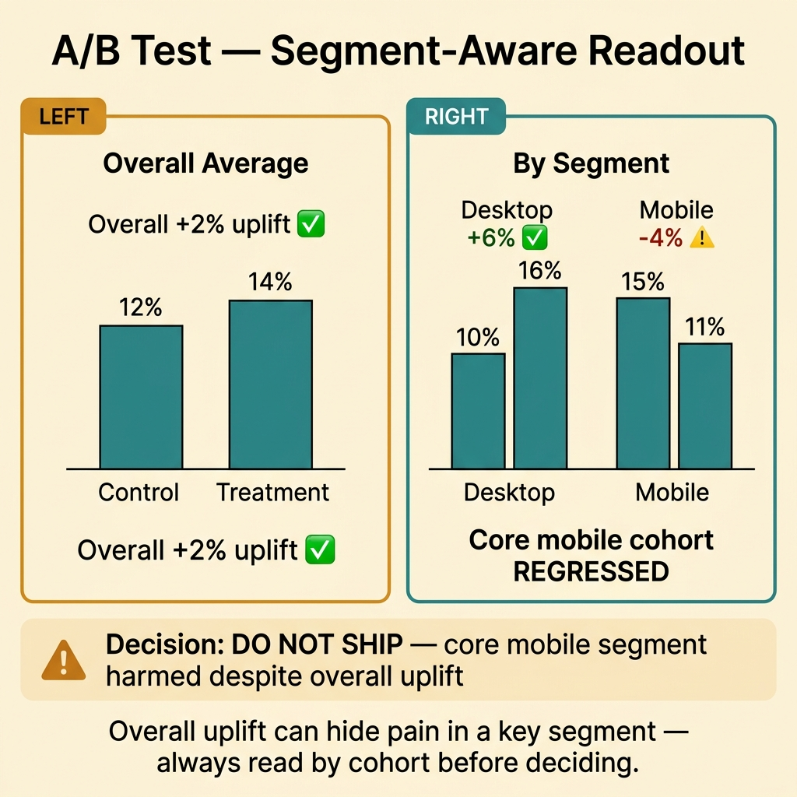
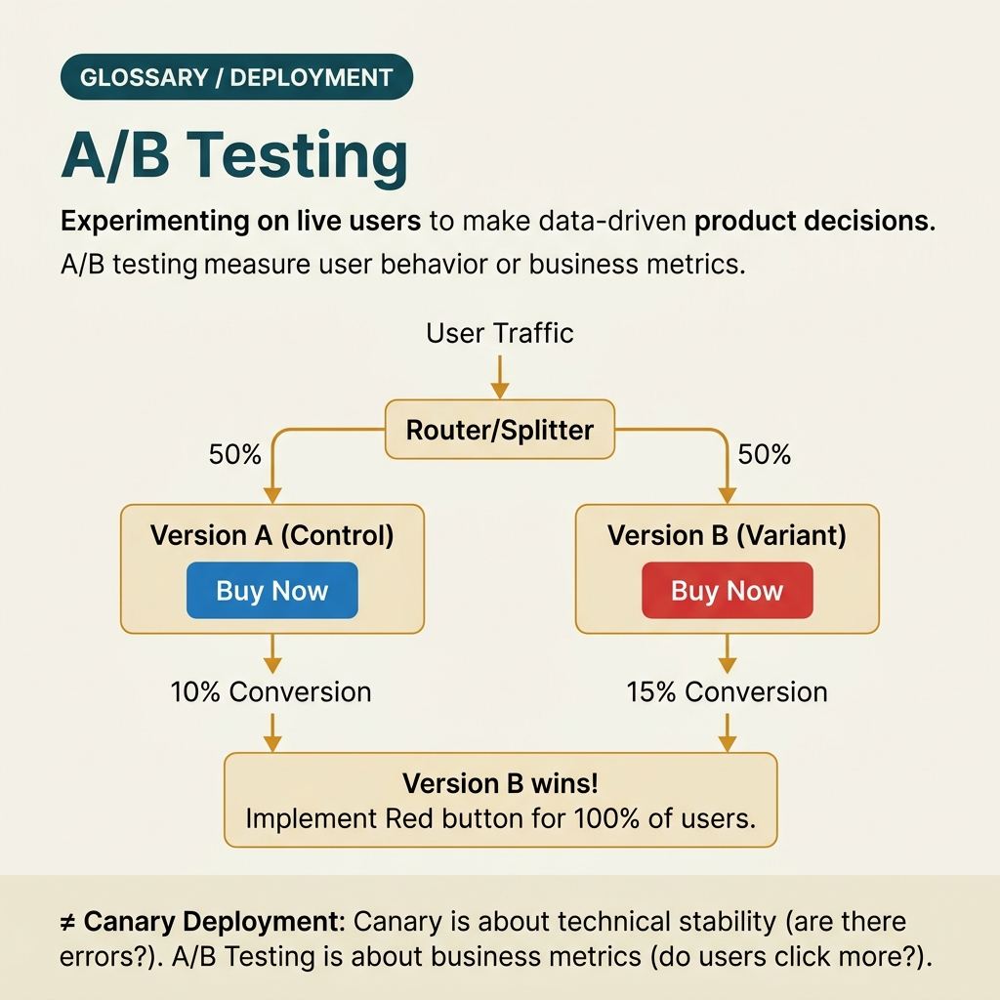

<!-- tags: glossary, reference, testing-quality, ab-test -->
# A/B Test

> An experiment running two variants in parallel across two user groups to compare which choice performs better.

| Aspect | Detail |
| --- | --- |
| **Concept** | An experiment running two variants in parallel across two user groups to compare which choice performs better. |
| **Audience** | Product manager, data analyst, backend engineer |
| **Primary style** | Glossary term |
| **Entry point** | Use when the team wants to make decisions based on real user behavior between two variants, instead of debating opinion-based arguments about copy, flow, or ranking. |

📅 Created: 2026-03-30 · 🔄 Updated: 2026-04-04 · ⏱️ 9 min read

---

## 1. DEFINE

Picture this: the team argues about a new CTA button — it looks nicer but will it change conversion? A/B test exists to turn aesthetic debates or product beliefs into experiments with clear metrics, populations, and stopping rules.

**A/B Test** is an experiment running two variants in parallel across two user groups to compare which choice performs better.

| Variant | Description |
| --- | --- |
| Pure A/B | Compares exactly two variants across two groups. |
| Multivariate extension | Multiple variables change simultaneously but analysis is more complex. |
| Feature-flagged experiment | Variants are toggled via rollout or a control plane. |

| Approach | Time | Space | When to choose |
| --- | --- | --- | --- |
| Simple split test | O(n users) | O(result logs) | When there are only 2 variants and 1 primary metric. |
| Segmented A/B | O(n users × segments) | O(segment metrics) | When you want to read by cohort such as mobile/web or new/returning. |
| Sequential decision experiment | O(streaming results) | O(history) | When you want to monitor gradually over time while still having a stopping rule. |

Core insight:

> A/B test is a causal inference problem at the product level: the same change must be read through metrics, segments, and experiment discipline to produce a trustworthy decision.

### 1.1 Invariants & Failure Modes

The critical invariant is that the primary metric, population, runtime, and stopping rule must be defined before opening the experiment. Changing the goal mid-flight invalidates the results.

---

## 2. CONTEXT

**Who uses it**: Product manager, data analyst, backend engineer

**When**: Use when the team wants to make decisions based on real user behavior between two variants, instead of debating opinion-based arguments about copy, flow, or ranking.

**Purpose**: A/B test is a causal inference problem at the product level: the same change must be read through metrics, segments, and experiment discipline to produce a trustworthy decision.

**In the ecosystem**:
- A/B test differs from canary test: A/B optimizes product outcome; canary optimizes release risk.
- A/B test does not replace pure observational analytics; it actively creates treatment and control.
- Without a primary metric and stopping rule, A/B test easily devolves into intuition-driven p-hacking.

---

Comparing 2 variants is clear. But how large a sample size is enough, how long to run, and at what p-value do you decide?

## 3. EXAMPLES

A/B test surfaces most visibly when the team debates blue button vs. red button without data, when a new feature looks good but conversion drops 5%, or when the test ends early because "it looks like enough." The examples below place the pattern into exactly those situations.

### Example 1: Basic — Lock the primary metric before running the experiment

> **Goal**: Avoid running an experiment then looking for whichever metric seems favorable.
> **Approach**: Lock one primary metric and a few guardrail metrics before splitting traffic.
> **Example**: New CTA aims to increase signup completion without making bounce rate worse.
> **Complexity**: Basic

```yaml
experiment_plan:
  variants: [control, treatment]
  primary_metric: signup_completion_rate
  guardrails:
    - bounce_rate
    - error_rate
  traffic_split: 50_50
```

**Why?** If the primary metric is not locked beforehand, the team easily looks at many dashboards and picks the number that supports the existing belief. A/B test is only trustworthy when the objective is locked before data appears.

**Takeaway**: Basic A/B test starts from metric discipline — not from a pretty design or an exciting idea.

### Example 2: Intermediate — Read results by segment instead of just looking at averages

> **Goal**: Avoid wrong conclusions when overall improves but a key cohort actually regresses.
> **Approach**: Add minimal segmentation for user groups with different behaviors.
> **Example**: Treatment is better for desktop but worse on older mobile devices.
> **Complexity**: Intermediate



*Figure: Overall uplift can hide pain in a key segment — always read by cohort before deciding.*

```yaml
segment_readout:
  primary_breakdowns:
    - platform
    - new_vs_returning
  alert_if:
    key_segment_regresses: true
  decision_rule:
    do_not_ship_if_core_segment_harmed: true
```

**Why?** Global averages can mask pain in an important segment. Segmentation helps the team avoid the kind of decision where "overall improved slightly" but the core revenue cohort dropped sharply.

**Takeaway**: Intermediate A/B test does not stop at mean uplift; it looks at the cohort carrying the most value or the most risk.

### Example 3: Advanced — Use feature flags and holdout to operate the experiment safely

> **Goal**: Separate experiment concerns from deployment and enable fast variant rollback.
> **Approach**: Distribute treatment via feature flag and keep holdout stable throughout the experiment.
> **Example**: New ranking model is enabled for 20% of users via flag but still has a clean control group.
> **Complexity**: Advanced

```yaml
experiment_delivery:
  flag: search-ranking-exp-v2
  cohorts:
    control: 50%
    treatment: 50%
  rollback:
    disable_flag_immediately: true
  holdout_integrity:
    user_sticky_assignment: true
```

**Why?** If the variant is unstable or assignment flips back and forth, experiment results become very unreliable. Feature flag with sticky assignment helps A/B test be both safe and capable of measuring impact cleanly.

**Takeaway**: Advanced A/B testing needs a good delivery mechanism — not just good statistics.

### Example 4: Expert — Design governance to prevent p-hacking and decision theater

> **Goal**: When A/B testing becomes a regular activity, maintain decision-making discipline.
> **Approach**: Standardize preregistration, stopping rules, owners, and post-experiment readouts.
> **Example**: Every experiment must declare hypothesis, primary metric, minimum runtime, and decision owner before launch.
> **Complexity**: Expert

```yaml
experiment_governance:
  preregistration_required: true
  fields:
    - hypothesis
    - primary_metric
    - guardrails
    - minimum_runtime
    - decision_owner
  forbid:
    - metric_switch_midflight
    - peeking_every_hour_without_rule
```

**Why?** Without governance, A/B test is easily used as a tool to rubber-stamp decisions already made. Expert practice is locking experiment discipline before looking at data.

**Takeaway**: Expert A/B testing is a disciplined decision-making capability — not just splitting traffic and reading dashboards.

---

## 4. COMPARE




*Figure: Position of A/B test between canary test, feature flag, and experiment platform.*

A/B test sounds like canary test. Not quite: canary test verifies deployment safety (crash? error rate?); A/B test measures business metrics (conversion? engagement?). One asks "is it safe?" — the other asks "is it better?"

### Level 1

```text
population split
  -> variant A to group 1
  -> variant B to group 2
  -> compare primary metric
```

*Figure: Level 1 shows A/B test is treatment-control comparison across two equivalent groups.*

### Level 2

```text
define metric and guardrails
  -> run experiment long enough
  -> inspect segments carefully
  -> choose ship, iterate or discard
```

*Figure: Level 2 emphasizes the discipline of metric, segment, and stopping rule in A/B testing.*

### Easy to confuse or cross the boundary

| # | Severity | Mistake | Consequence | Fix |
| --- | --- | --- | --- | --- |
| 1 | 🔴 Fatal | Switching primary metric mid-experiment | Results lose causal meaning | Preregister metric and stopping rule before running. |
| 2 | 🟡 Common | Only looking at overall average | An important segment may be getting harmed | Read additional cohort or key segments. |
| 3 | 🟡 Common | Not keeping assignment stable | Treatment/control data becomes noisy | Use sticky assignment via feature flag. |
| 4 | 🔵 Minor | Confusing A/B with canary release | Measuring the wrong objective for the experiment | Distinguish product optimization from release risk control. |

### Quick scan

| If you encounter | What to do |
| --- | --- |
| Want to compare 2 product variants with real data | Use A/B test. |
| Traffic split but the goal is safe rollout | You probably need canary test instead. |
| Experiment readout is being debated emotionally | Lock preregistration and stopping rule. |

---

## 5. REF

| Resource | Type | Link | Notes |
| --- | --- | --- | --- |
| Kohavi - Trustworthy Online Controlled Experiments | Book | https://experimentguide.com/ | Excellent source for A/B testing discipline. |
| GrowthBook Docs | Official | https://docs.growthbook.io/ | Feature-flagged experimentation workflow. |
| Statsig Perspectives | Reference | https://www.statsig.com/perspectives | Pragmatic articles on experimentation. |

---

## 6. RECOMMEND

A/B test solves the problem of "which variant delivers better business outcome?" The next question: what about deployment safety checks, and what does the coverage metric look like?

| Expand to | When | Why | File/Link |
| --- | --- | --- | --- |
| Canary Test | When the goal is reducing rollout risk rather than comparing product outcomes | Canary and A/B look similar in traffic split but the objective is completely different. | [Canary Test](./15-canary-test.md) |
| QA | When you need to see the experiment in the broader quality picture | QA helps place the experiment in the release and validation process. | [QA](./QA.md) |
| Testing & Quality | When you need to return to the full taxonomy | Keep context of the whole topic. | [Testing & Quality](./README.md) |

Back to that button-color debate from the beginning — nobody was wrong, but nobody was right either because there was no data. Now you know: A/B test is not about "proving yourself right." It is about letting data speak, with a sufficient sample size and a long enough runtime.

**Links**: [← Previous](./13-fuzz-test.md) · [→ Next](./15-canary-test.md)
