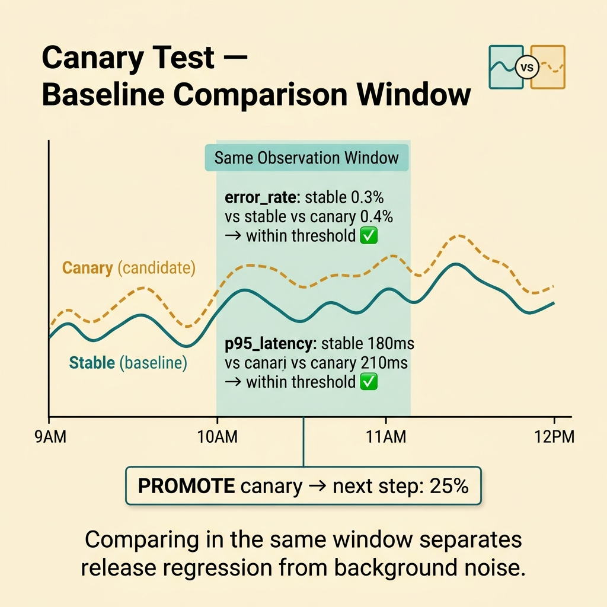
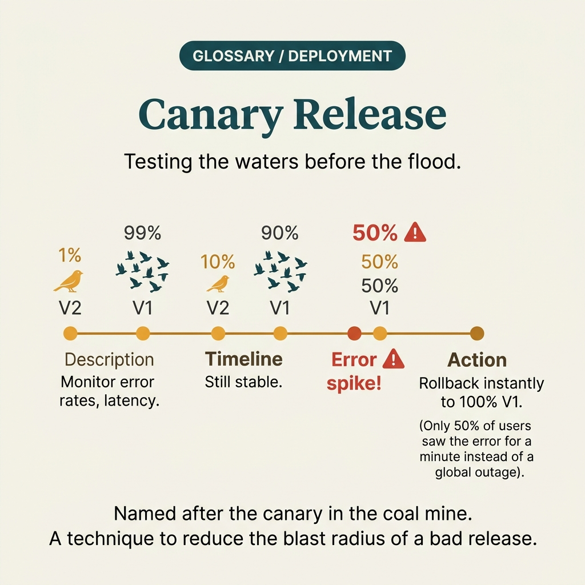

<!-- tags: glossary, reference, testing-quality, canary-test -->
# Canary Test

> Rollout testing by exposing the new version to a very small slice of traffic or users before gradually expanding to the entire system.

| Aspect | Detail |
| --- | --- |
| **Concept** | Rollout testing by exposing the new version to a very small slice of traffic or users before gradually expanding to the entire system. |
| **Audience** | SRE, release engineer, backend engineer |
| **Primary style** | Glossary term |
| **Entry point** | Use when the team wants to observe a new release under real traffic while limiting blast radius before widening the rollout. |

📅 Created: 2026-03-30 · 🔄 Updated: 2026-04-04 · ⏱️ 9 min read

---

## 1. DEFINE

Picture this: the build passed lab tests, but production is where secrets, cache, traffic shape, and real user behavior all appear together. Canary test helps the team place a new version into real production at a small blast radius before betting all traffic.

**Canary Test** is rollout testing by exposing the new version to a very small slice of traffic or users before gradually expanding to the entire system.

| Variant | Description |
| --- | --- |
| Traffic canary | Routes a percentage of requests to the new version. |
| User or tenant canary | Selects a small group of users or tenants as the canary. |
| Region canary | Tries one zone or region before expanding further. |

| Approach | Time | Space | When to choose |
| --- | --- | --- | --- |
| Step canary | O(n rollout steps) | O(metrics) | When you want to increase traffic in clear increments. |
| Metric-gated canary | O(n gated windows) | O(history) | When you need auto-promote or auto-rollback based on metrics. |
| Manual review canary | O(n review cycles) | O(evidence) | When the release is high-risk and needs human confirmation at each step. |

Core insight:

> Canary test differs from A/B test in its goal: it does not optimize the product — it optimizes rollout risk. Its value is providing real production feedback with a small blast radius and fast rollback capability.

### 1.1 Invariants & Failure Modes

The critical invariant is that a canary must have a metric gate, time window, and action on failure. Simply splitting 5% of traffic without knowing what to watch, how long to wait, and how to rollback negates the canary's purpose.

---

## 2. CONTEXT

**Who uses it**: SRE, release engineer, backend engineer

**When**: Use when the team wants to observe a new release under real traffic while limiting blast radius before widening the rollout.

**Purpose**: Canary test differs from A/B test in its goal: it does not optimize the product — it optimizes rollout risk. Its value is providing real production feedback with a small blast radius and fast rollback capability.

**In the ecosystem**:
- Canary test differs from A/B test: canary asks "is the new version safe to expand traffic?" — not "which variant is better?"
- Canary test differs from smoke test: smoke is the first gate; canary is observation under real traffic after reaching production.
- Without metric gates and a rollback plan, canary easily becomes "deploying gradually for peace of mind" without decision criteria.

---

Gradual rollout is clear. But what canary percentage, which metric decides promotion, and when does canary become a bottleneck?

## 3. EXAMPLES

Canary test surfaces most visibly when a new deploy raises error rate by 2% and blue-green does not catch it, when canary runs at 1% traffic but has no metrics for comparison, or when the team promotes canary manually because alerts have too many false positives. The examples below place the pattern into exactly those situations.

### Example 1: Basic — Roll out 5% traffic with minimal metric gates

> **Goal**: Put the new version into real production while limiting the initial blast radius.
> **Approach**: Pick a small traffic slice, hold it in a short window, and compare minimal metrics against baseline.
> **Example**: Error rate and p95 of checkout service must not be worse than baseline beyond threshold.
> **Complexity**: Basic

```yaml
canary_step:
  traffic: 5%
  observe_for: 5m
  gates:
    error_rate_regression_lt: 0.5%
    p95_latency_regression_lt: 10%
  action_on_fail: rollback
```

**Why?** Real traffic creates behavior combinations that staging rarely simulates fully. But canary is only safe when the slice is small and the metric gate is sharp enough to detect regression early.

**Takeaway**: Basic canary is controlled production exposure — not a half-hearted deploy for comfort.

### Example 2: Intermediate — Compare baseline and canary within the same workload window

> **Goal**: Avoid misreading natural traffic noise as success or failure.
> **Approach**: Compare canary metrics with the baseline control in the same window and similar workload.
> **Example**: Checkout latency rises during peak hours, so canary must be compared with the stable version at the same time.
> **Complexity**: Intermediate



*Figure: Comparing canary with baseline in the same window separates release regression from background noise.*

```yaml
baseline_compare:
  control_version: stable
  candidate_version: canary
  compare_same_window: true
  metrics:
    - error_rate
    - p95_latency
    - db_pool_wait
```

**Why?** Production traffic is inherently volatile. Comparing canary with baseline at the same point in time helps the team distinguish release regression from system background noise.

**Takeaway**: Intermediate canary needs comparative readout — not just absolute numbers from the new version.

### Example 3: Advanced — Use auto-promotion and auto-rollback via rollout policy

> **Goal**: Reduce reliance on the on-call engineer's gut feeling when rollout steps repeat many times.
> **Approach**: Encode promote/rollback policy based on time window and metric gate.
> **Example**: Canary is automatically promoted from 5% to 25% if 3 consecutive windows are green.
> **Complexity**: Advanced

```yaml
rollout_policy:
  steps: [5%, 25%, 50%, 100%]
  promote_if:
    consecutive_green_windows: 3
  rollback_if:
    any_gate_red: true
  notify_owner_on_each_step: true
```

**Why?** When rollout repeats frequently, clear policy reduces arbitrariness and makes canary results more consistent across releases.

**Takeaway**: Advanced canary testing turns rollout into a predictable policy machine — not a manual ritual each time.

### Example 4: Expert — Choose the right canary dimension: traffic, tenant, or region

> **Goal**: Optimize blast radius based on the real risk of the release rather than always using a default traffic percentage.
> **Approach**: Choose the rollout dimension that matches the most likely failure mode.
> **Example**: A release related to data residency means canary by region is more meaningful than canary at 5% global traffic.
> **Complexity**: Expert

```yaml
canary_dimension_choice:
  release_risk: region_specific_config
  preferred_dimension: region
  alternatives:
    traffic_split: low_value
    tenant_canary: medium_value
  match_dimension_to_risk: true
```

**Why?** Not every release fits pure traffic-split. Some releases should canary by tenant, region, or user class so the test touches the right risk surface.

**Takeaway**: Expert canary practice is choosing the right rollout dimension for each type of risk — not applying one template to every release.

---

## 4. COMPARE




*Figure: Position of canary test between blue-green deploy, A/B test, and progressive delivery.*

Canary test sounds like A/B test for deployment. Close — but canary focuses on safety (error rate, latency); A/B focuses on effectiveness (conversion, revenue). Canary asks "will it crash?" — A/B asks "is it better?"

### Level 1

```text
deploy new version to tiny slice
  -> observe live metrics
  -> pass => expand traffic
  -> fail => rollback fast
```

*Figure: Level 1 shows canary is a rollout safety check on real traffic.*

### Level 2

```text
5% traffic
  -> compare error, latency, saturation
  -> hold for window
  -> promote to 25%, 50%, 100%
  -> rollback on gate failure
```

*Figure: Level 2 emphasizes canary needs rollout steps and clear metric gates.*

### Easy to confuse or cross the boundary

| # | Severity | Mistake | Consequence | Fix |
| --- | --- | --- | --- | --- |
| 1 | 🔴 Fatal | Canary has no rollback plan | Blast radius grows and team cannot react in time | Define action_on_fail and owner before rollout. |
| 2 | 🟡 Common | Not comparing with baseline at the same time | Misreading traffic noise as regression or vice versa | Use comparative windows with the stable version. |
| 3 | 🟡 Common | Choosing wrong canary dimension | Not touching the failure surface that needs observation | Match traffic, tenant, or region to the actual risk. |
| 4 | 🔵 Minor | Canary steps are too manual and vague | Release quality depends on the on-call engineer's feelings | Encode rollout policy more explicitly. |

### Quick scan

| If you encounter | What to do |
| --- | --- |
| Want to put a new version on real production with small blast radius | Use canary test. |
| Traffic split but optimizing conversion or clickthrough | You probably need A/B test instead. |
| Canary failed but unclear how to rollback | You are missing a proper rollout policy. |

---

## 5. REF

| Resource | Type | Link | Notes |
| --- | --- | --- | --- |
| Google SRE Workbook | Reference | https://sre.google/workbook/canarying-releases/ | Excellent source for canarying and release engineering. |
| Argo Rollouts | Official | https://argo-rollouts.readthedocs.io/ | Popular tooling for canary rollout. |
| Flagger Docs | Official | https://docs.flagger.app/ | Metric-driven canary promotion and rollback. |

---

## 6. RECOMMEND

Canary test solves the problem of "will the new deploy cause an incident?" The next question: what about business metric experiments, and what does general coverage look like?

| Expand to | When | Why | File/Link |
| --- | --- | --- | --- |
| Load Test | When you need capacity evidence before exposing real traffic | Load test provides lab data before canary. | [Load Test](./09-load-test.md) |
| A/B Test | When the goal shifts to optimizing product outcome | A/B measures variant effectiveness — not release risk. | [A/B Test](./14-ab-test.md) |
| Testing & Quality | When you need to return to the full taxonomy | Keep context of the whole topic. | [Testing & Quality](./README.md) |

Back to that deploy from the beginning — error rate jumped 2% but full traffic was already rolled out before anyone noticed. Now you know: canary 1–5% traffic, compare metrics with baseline, auto-rollback if threshold is breached. Simple, but it saves production incidents.

**Links**: [← Previous](./14-ab-test.md) · [→ Next](./16-test-coverage.md)
