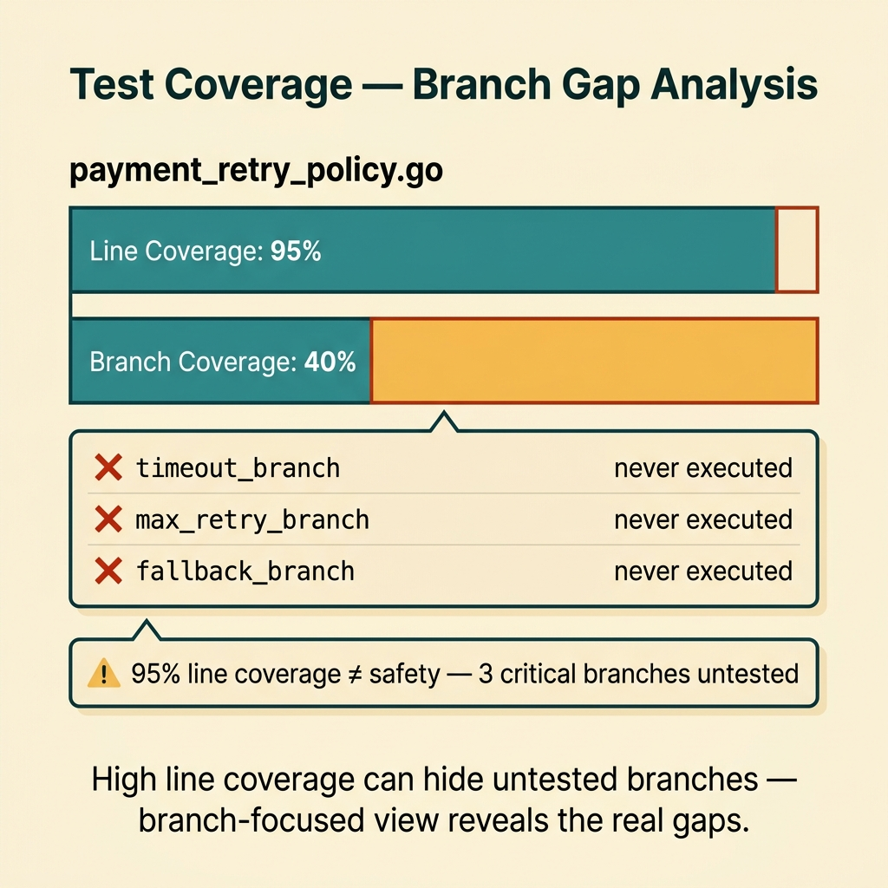
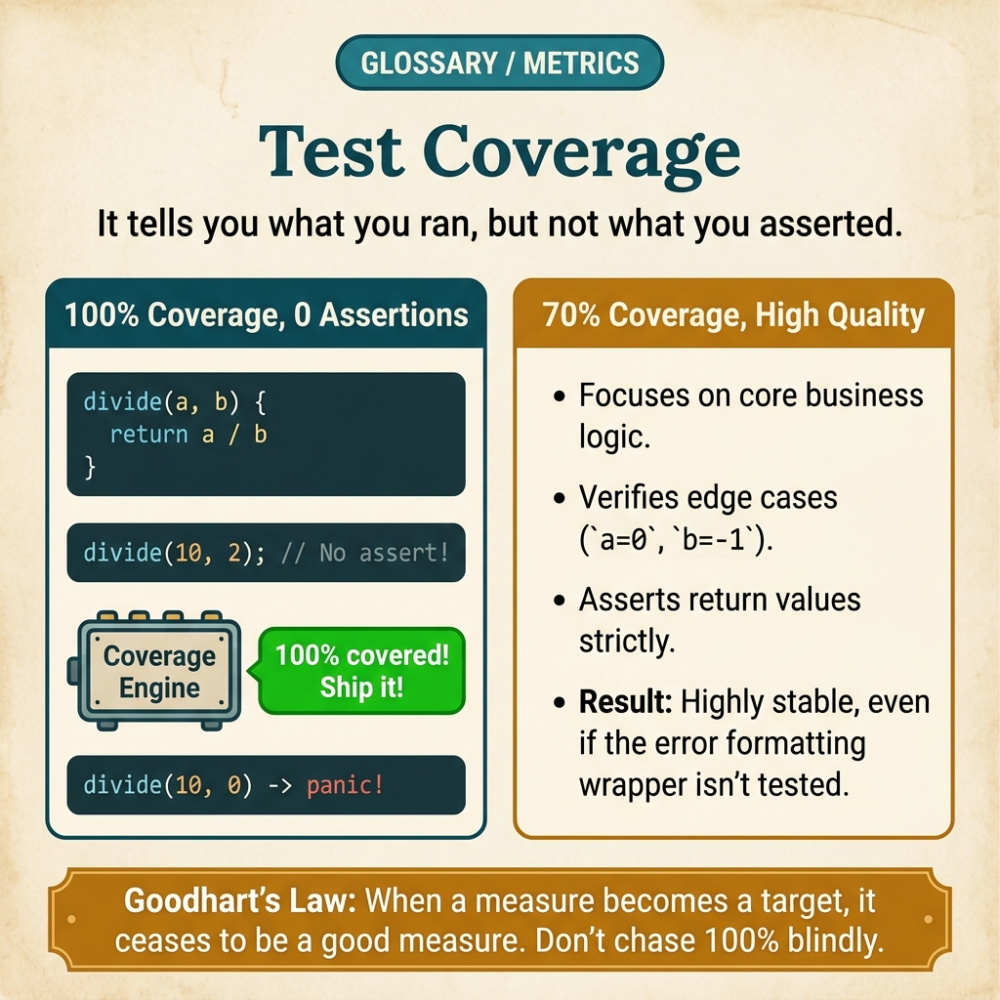

<!-- tags: glossary, reference, testing-quality, test-coverage -->
# Test Coverage

> A metric indicating how many lines, branches, or paths of code have been executed by the test suite.

| Aspect | Detail |
| --- | --- |
| **Concept** | A metric indicating how many lines, branches, or paths of code have been executed by the test suite. |
| **Audience** | Backend engineer, reviewer, engineering manager |
| **Primary style** | Glossary term |
| **Entry point** | Use when the team wants to measure the scope of test execution while still clearly distinguishing between real signal and a false sense of safety. |

📅 Created: 2026-03-30 · 🔄 Updated: 2026-04-04 · ⏱️ 8 min read

---

## 1. DEFINE

Picture this: the coverage dashboard climbs to 92%, but a logic bug still slips into production. Test coverage exists to show how far the code has been executed, but it does not automatically tell you how deeply the code has been asserted.

**Test Coverage** is a metric indicating how many lines, branches, or paths of code have been executed by the test suite.

| Variant | Description |
| --- | --- |
| Line coverage | Measures the number of code lines that have been run. |
| Branch coverage | Measures the number of if/switch branches that have been traversed. |
| Path coverage | Measures the number of combined paths that have been executed — much more expensive. |

| Approach | Time | Space | When to choose |
| --- | --- | --- | --- |
| Line coverage report | O(n lines) | O(report) | When you need a simple, widely-understood baseline. |
| Branch-focused coverage | O(n branches) | O(report) | When logic with many conditions needs sharper visibility than line coverage. |
| Coverage with critical-path annotation | O(n files) | O(mapping) | When you need to read coverage by domain risk rather than a single global percentage. |

Core insight:

> Coverage is a signal of execution scope, not a signal of assertion quality. It is most useful when read alongside risk, branch depth, and mutation or bug history.

### 1.1 Invariants & Failure Modes

The critical invariant is that coverage must be read in the context of domain risk. If the team chases a single global number, they easily optimize the percentage instead of optimizing actual confidence.

---

## 2. CONTEXT

**Who uses it**: Backend engineer, reviewer, engineering manager

**When**: Use when the team wants to measure the scope of test execution while still clearly distinguishing between real signal and a false sense of safety.

**Purpose**: Coverage is a signal of execution scope, not a signal of assertion quality. It is most useful when read alongside risk, branch depth, and mutation or bug history.

**In the ecosystem**:
- Coverage differs from mutation test: coverage measures execution; mutation measures assertion strength.
- High coverage does not equal high confidence if tests do not assert deeply or miss boundary cases.
- Low coverage on unimportant code may not be as dangerous as moderate coverage on highly critical code.

---

Measuring how much code gets tested is clear. But how much coverage is enough, which metric is trustworthy, and why does 100% coverage still have bugs?

## 3. EXAMPLES

Test coverage surfaces most visibly when a manager demands 80% but nobody knows 80% of what, when the team writes trivial tests just to bump the number, or when coverage drops after every feature and nobody notices. The examples below place the pattern into exactly those situations.

### Example 1: Basic — Use coverage as a baseline execution map

> **Goal**: Know which modules have barely been touched by tests.
> **Approach**: Read line or branch coverage to find obvious blind spots.
> **Example**: Pricing module has only 25% branch coverage after a refactor.
> **Complexity**: Basic

```yaml
coverage_report:
  module: pricing
  line_coverage: 68%
  branch_coverage: 25%
  threshold:
    line: 70%
    branch: 40%
```

**Why?** Coverage excels at telling the team which parts of the code have almost never been run by tests. It is a good radar for completely blind areas.

**Takeaway**: Basic coverage should be used as a baseline execution map — not as an absolute quality certificate.

### Example 2: Intermediate — Read coverage by branch and boundary instead of just by line

> **Goal**: Avoid a false sense of safety when line coverage is high but important branches remain untouched.
> **Approach**: Prioritize branch coverage on conditional logic, validation, and retry paths.
> **Example**: A retry function achieves high line coverage but the timeout and max-retry branches have never run.
> **Complexity**: Intermediate



*Figure: High line coverage can hide untested branches — branch-focused view reveals the real gaps.*

```yaml
branch_focus:
  file: payment_retry_policy.go
  line_coverage: 95%
  branch_gaps:
    - timeout_branch
    - max_retry_branch
    - fallback_branch
```

**Why?** A line can be executed, but its true or false branch may never have been tested. Branch coverage brings the team closer to the logic boundaries that actually carry risk.

**Takeaway**: Intermediate coverage reading should focus on branches and boundaries — not just overall line percentage.

### Example 3: Advanced — Attach coverage to critical path and bug history

> **Goal**: Prioritize test effort where the blast radius is largest rather than mechanically chasing a global number.
> **Approach**: Map files or modules to business criticality and incident history before setting thresholds.
> **Example**: Auth and pricing need higher thresholds than internal tooling.
> **Complexity**: Advanced

```yaml
risk_weighted_coverage:
  auth:
    branch_threshold: 80%
    reason: critical_path
  internal_admin_tools:
    branch_threshold: 40%
    reason: lower_blast_radius
  history_link:
    production_bug_modules_get_priority: true
```

**Why?** Not every line of code carries the same business value. Coverage is far more useful when read through a risk-weighted view rather than a single average across the entire repo.

**Takeaway**: Advanced coverage strategy sets thresholds by criticality — not by egalitarian averaging.

### Example 4: Expert — Use coverage alongside mutation and flaky governance

> **Goal**: Prevent coverage from becoming a vanity metric that is too easy to game.
> **Approach**: Read coverage in parallel with mutation findings and suite health.
> **Example**: Coverage rises but mutation score drops and flaky tests increase — actual confidence is deteriorating.
> **Complexity**: Expert

```yaml
coverage_governance:
  read_together_with:
    - mutation_score
    - flaky_rate
    - bug_escape_rate
  anti_vanity_rule:
    coverage_alone_cannot_greenlight_release: true
```

**Why?** Coverage is only one piece of the picture. When the team optimizes coverage while ignoring mutation, flakiness, or bug escapes, they easily create a beautiful measurement system while real confidence actually declines.

**Takeaway**: Expert coverage practice places it within a larger quality signal system — not worshipping a single percentage.

---

## 4. COMPARE




*Figure: Position of test coverage between mutation test, code quality metrics, and CI gate.*

Coverage sounds like "percentage of safe code." Not quite: coverage measures code that was run through — not whether the test asserts correctly. 100% line coverage + 0 assertions = 0 value.

### Level 1

```text
tests run
  -> code paths executed
  -> report shows lines or branches touched
```

*Figure: Level 1 shows coverage is an execution signal, not an overall quality verdict.*

### Level 2

```text
high global percentage
  -> critical branch still weak
  -> bug escapes
  -> lesson: coverage needs context
```

*Figure: Level 2 emphasizes coverage must be read alongside criticality and branch depth.*

### Easy to confuse or cross the boundary

| # | Severity | Mistake | Consequence | Fix |
| --- | --- | --- | --- | --- |
| 1 | 🔴 Fatal | Equating high coverage with high test quality | False sense of safety; logic bugs still escape | Read coverage alongside branch depth, mutation, and bug history. |
| 2 | 🟡 Common | Only chasing global percentage | Wasted effort on low-risk areas | Prioritize coverage by critical path. |
| 3 | 🟡 Common | Ignoring branch coverage on conditional code | Important branches never tested | Add branch-focused view for critical modules. |
| 4 | 🔵 Minor | Using coverage as a vanity KPI | Team games the metric instead of increasing confidence | Treat coverage as a diagnostic signal, not a badge. |

### Quick scan

| If you encounter | What to do |
| --- | --- |
| Want to know which parts have barely been tested | Use coverage. |
| Coverage is high but confidence remains low | Read mutation and branch gaps as well. |
| Chasing a single global number | Return to risk-weighted coverage. |

---

## 5. REF

| Resource | Type | Link | Notes |
| --- | --- | --- | --- |
| Martin Fowler - TestCoverage | Reference | https://martinfowler.com/bliki/TestCoverage.html | Balanced perspective on coverage. |
| Go Cover | Official | https://go.dev/blog/cover | Coverage tooling explained for Go. |
| Google Testing Blog | Reference | https://testing.googleblog.com/ | Many articles on metrics and test quality. |

---

## 6. RECOMMEND

Test coverage solves the problem of "how much code is being tested?" The next question: what measures test quality, and how does flaky test affect coverage?

| Expand to | When | Why | File/Link |
| --- | --- | --- | --- |
| Mutation Test | When you want to check whether assertions are sharp | Mutation is a critical complement to coverage. | [Mutation Test](./12-mutation-test.md) |
| Flaky Test | When coverage is high but the suite is still untrustworthy | Flakiness can destroy the value of a coverage report. | [Flaky Test](./17-flaky-test.md) |
| Testing & Quality | When you need to return to the full taxonomy | Keep context of the whole topic. | [Testing & Quality](./README.md) |

Back to that 80% coverage from the beginning — a pretty number on the dashboard but production bugs still got through. Now you know: coverage is a necessary condition, not a sufficient one. It needs to be paired with mutation score to know whether tests actually catch bugs or just run through code.

**Links**: [← Previous](./15-canary-test.md) · [→ Next](./17-flaky-test.md)
