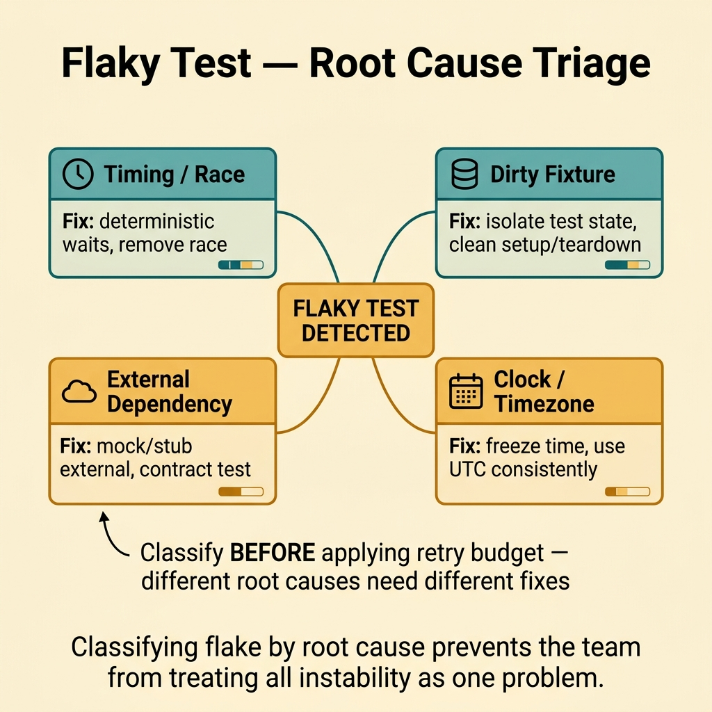
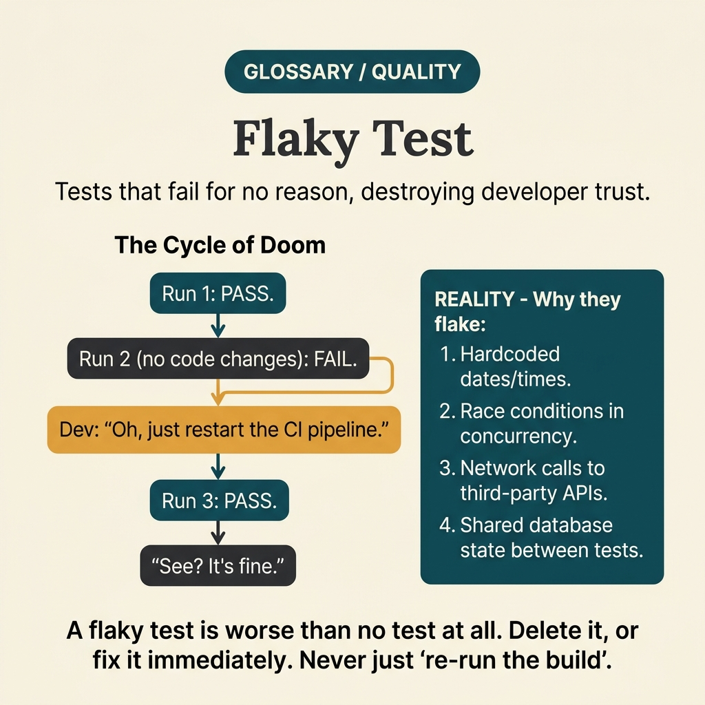

<!-- tags: glossary, reference, testing-quality, flaky-test -->
# Flaky Test

> A test that sometimes passes and sometimes fails despite no code change — usually caused by race conditions, timing, unstable data, or environment dependencies.

| Aspect | Detail |
| --- | --- |
| **Concept** | A test that sometimes passes and sometimes fails despite no code change — usually caused by race conditions, timing, unstable data, or environment dependencies. |
| **Audience** | Backend engineer, QA engineer, SRE |
| **Primary style** | Glossary term |
| **Entry point** | Use when the suite loses trustworthiness because random red tests make it hard for the team to distinguish real signals from noise. |

📅 Created: 2026-03-30 · 🔄 Updated: 2026-04-04 · ⏱️ 9 min read

---

## 1. DEFINE

Picture this: a PR touches nothing related to auth, but the pipeline goes red on the login test for the third time today. Everyone hits re-run and merges anyway. That is the moment flaky test becomes design debt for the entire quality process — no longer a minor annoyance.

**Flaky Test** is a test that sometimes passes and sometimes fails despite no code change — usually caused by race conditions, timing, unstable data, or environment dependencies.

| Variant | Description |
| --- | --- |
| Timing flake | Fails due to timeout, race, scheduler, or clock. |
| Data flake | Fails due to unstable fixture/state. |
| Environment flake | Fails due to environment dependency, network, or external sandbox. |

| Approach | Time | Space | When to choose |
| --- | --- | --- | --- |
| Quarantine and fix | O(n flaky cases) | O(triage log) | When the blocking suite must stay trustworthy. |
| Root-cause classification | O(n failures) | O(history) | When you want to categorize by timing, data, or environment. |
| Flake budget governance | O(suite runs) | O(trend) | When noise must be kept at an acceptable level. |

Core insight:

> Flaky test breaks trust in the entire suite because it blends real signal with random noise. A test that occasionally goes red for no reason does not just waste time — it trains the team to ignore real red.

### 1.1 Invariants & Failure Modes

The critical invariant is that the blocking suite must be deterministic enough for red to still carry meaning. When flake lingers too long in the main gate, the team learns to ignore failures by default.

---

## 2. CONTEXT

**Who uses it**: Backend engineer, QA engineer, SRE

**When**: Use when the suite loses trustworthiness because random red tests make it hard for the team to distinguish real signals from noise.

**Purpose**: Flaky test breaks trust in the entire suite because it blends real signal with random noise. A test that occasionally goes red for no reason does not just waste time — it trains the team to ignore real red.

**In the ecosystem**:
- Flaky test differs from a real test failure in that the code does not change but the result does.
- Flaky tests commonly appear from race conditions, short timeouts, dirty fixtures, or unstable external dependencies.
- If the team reflexively re-runs before investigating, flake has already become a systemic issue — no longer an isolated bug.

---

Tests that sometimes pass and sometimes fail are clear. But where is the root cause, quarantine or fix, and how much flake should the team accept?

## 3. EXAMPLES

Flaky test surfaces most visibly when CI fails randomly and the team hits re-run as a reflex, when a 15% flaky rate causes the team to ignore all failures, or when a flaky test masks a real bug and a production incident occurs. The examples below place the pattern into exactly those situations.

### Example 1: Basic — Identify flaky test instead of just calling it "CI is red"

> **Goal**: Distinguish random failure from real regression.
> **Approach**: Compare multiple runs on the same commit and look for pass/fail patterns that flip back and forth.
> **Example**: On the same SHA, login test passes 4 times and fails 1 time.
> **Complexity**: Basic

```yaml
flake_signal:
  commit_sha: same
  repeated_runs: 5
  results: [pass, pass, fail, pass, pass]
  classification: likely_flaky
```

**Why?** If the team cannot distinguish flake from real failure, they will either panic unnecessarily or — worse — ignore real regressions too. The first step is recognizing the unstable pattern on the same code state.

**Takeaway**: Basic flaky-test handling starts with calling the phenomenon by its right name: this is noise, not every time a regression.

### Example 2: Intermediate — Classify root cause to fix the right thing

> **Goal**: Avoid applying a one-size-fits-all solution to every flaky test.
> **Approach**: Separate flakes by timing, data, environment, or external dependency.
> **Example**: A test that fails due to a timeout race is fundamentally different from a test that fails because a sandbox API is intermittently unavailable.
> **Complexity**: Intermediate



*Figure: Classifying flake by root cause prevents the team from treating all instability as one problem.*

```yaml
flake_triage:
  categories:
    - timing_or_race
    - dirty_fixture_state
    - external_dependency
    - clock_or_timezone
  required_owner: true
  next_step:
    classify_before_retry_budget: true
```

**Why?** Flaky tests have many very different root causes. If the team just labels something "flake" and stops there, they will never reach the real fix.

**Takeaway**: Intermediate flake handling is structured triage — not a gut feeling of "this test is being moody."

### Example 3: Advanced — Quarantine flaky tests to keep the blocking suite clean

> **Goal**: Restore trust in the main gate while root causes are still being addressed.
> **Approach**: Move unstable tests out of the blocking path, but attach clear owner and fix deadline.
> **Example**: An external sandbox test is moved to the quarantine suite instead of continuing to break the main pipeline.
> **Complexity**: Advanced

```yaml
flake_quarantine:
  move_out_of_blocking_suite: true
  require:
    owner: assigned
    bug_ticket: created
    reentry_rule: 20_clean_runs
  forbid:
    silent_permanent_quarantine: true
```

**Why?** Proper quarantine protects the blocking suite's trust. But quarantine is not a permanent dumping ground; without an owner and re-entry rule, flake is merely hidden — not fixed.

**Takeaway**: Advanced flaky-test strategy protects the main gate while maintaining pressure to fix for good.

### Example 4: Expert — Use flake budget as a governance signal for test health

> **Goal**: Track and limit the noise level the suite is allowed to produce over time.
> **Approach**: Measure flaky rate, quarantine count, and rerun cost as part of test governance.
> **Example**: If the flaky rate exceeds threshold, the team must stop adding new tests to the blocking suite until debt is cleared.
> **Complexity**: Expert

```yaml
flake_governance:
  metrics:
    - flaky_rate
    - quarantine_count
    - rerun_cost_minutes
  policy:
    block_new_tests_if_flake_budget_exceeded: true
    weekly_flake_review: true
```

**Why?** Flaky test is not just one file's bug — it is debt for the entire process. A flake budget helps the team see it as operational debt with real cost, rather than just scattered annoyance.

**Takeaway**: Expert flake management is governance for suite reliability — not just fixing individual tests one by one.

---

## 4. COMPARE




*Figure: Position of flaky test between test reliability, CI pipeline health, and test quarantine.*

Flaky test sounds like "broken test." Not quite: a flaky test passes and fails non-deterministically — it creates false confidence when it passes and cry-wolf when it fails. Both are dangerous.

### Level 1

```text
same code
  -> test run 1 passes
  -> test run 2 fails
  -> trust in suite drops
```

*Figure: Level 1 shows flaky test breaks suite trust through its own instability.*

### Level 2

```text
flake appears
  -> people rerun blindly
  -> noise hides real regressions
  -> suite governance degrades
```

*Figure: Level 2 emphasizes the biggest harm of flaky test is corrupting the team's behavior toward CI signals.*

### Easy to confuse or cross the boundary

| # | Severity | Mistake | Consequence | Fix |
| --- | --- | --- | --- | --- |
| 1 | 🔴 Fatal | Blindly re-running to pass the pipeline | Real regressions get hidden | Record and classify flake instead of treating it as normal. |
| 2 | 🟡 Common | Quarantine without owner or deadline | Flake gets buried permanently | Attach ticket, owner, and re-entry rule to the blocking suite. |
| 3 | 🟡 Common | Using longer timeouts as the default fix | Masks symptoms without curing the cause | Classify timing, data, env then fix at the root. |
| 4 | 🔵 Minor | Not measuring rerun cost and flake rate | Hard to see the real damage of noise | Add flake metrics to weekly governance. |

### Quick scan

| If you encounter | What to do |
| --- | --- |
| Same code but test sometimes passes, sometimes fails | Think flaky test immediately. |
| Blocking suite has lost trust | Quarantine with discipline then fix root cause. |
| Team keeps re-running to merge faster | You are accumulating flake debt in your process. |

---

## 5. REF

| Resource | Type | Link | Notes |
| --- | --- | --- | --- |
| Martin Fowler - Eradicating Non-Determinism in Tests | Reference | https://martinfowler.com/articles/nonDeterminism.html | Classic article on flaky tests. |
| Google Testing Blog | Reference | https://testing.googleblog.com/2016/05/flaky-tests-at-google-and-how-we.html | How Google views flaky tests at scale. |
| Testing on the Toilet | Reference | https://testing.googleblog.com/search/label/tott | Many short articles on test hygiene. |

---

## 6. RECOMMEND

Flaky test solves the problem of "why has the team stopped trusting the test suite?" The next question: what does the coverage metric reflect when tests are flaky, and is chaos injection related?

| Expand to | When | Why | File/Link |
| --- | --- | --- | --- |
| Test Coverage | When the suite looks "pretty on numbers" but is still untrustworthy | Coverage is useless if the main gate is full of flake. | [Test Coverage](./16-test-coverage.md) |
| Mutation Test | When you want to improve suite quality after cleaning noise | Mutation is far more meaningful when the suite is deterministic. | [Mutation Test](./12-mutation-test.md) |
| Testing & Quality | When you need to return to the full taxonomy | Keep context of the whole topic. | [Testing & Quality](./README.md) |

Back to that random CI failure from the beginning — the team hit re-run 3 times then merged. Now you know: every re-run is one more moment the team loses trust in the suite. Quarantine flaky, fix root cause (timing, shared state, external dependency), and then the team can trust CI again.

**Links**: [← Previous](./16-test-coverage.md) · [→ Next](./BDD.md)
