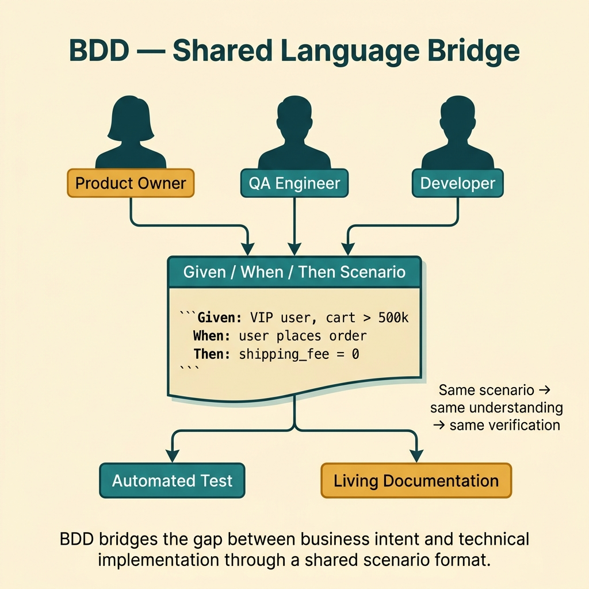
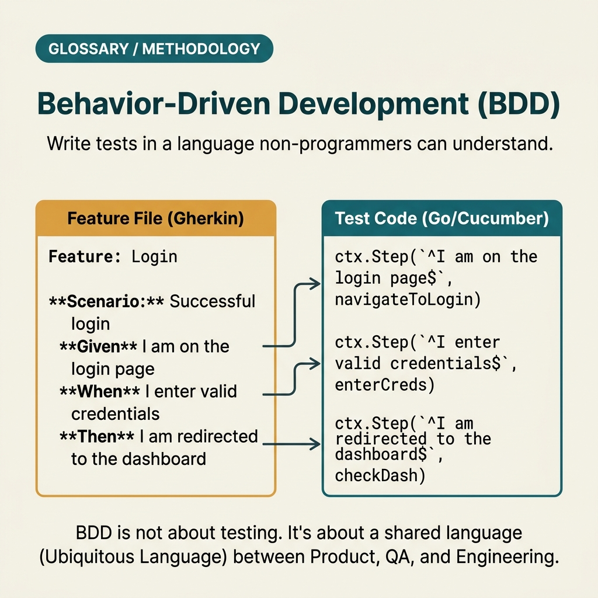

<!-- tags: glossary, reference, testing-quality, bdd -->
# BDD — Behavior-Driven Development

> A way to describe system behavior using language close to business so that business, QA, and dev share a single source of truth.

| Aspect | Detail |
| --- | --- |
| **Concept** | A way to describe system behavior using language close to business so that business, QA, and dev share a single source of truth. |
| **Audience** | Product owner, QA engineer, backend engineer |
| **Primary style** | Glossary term |
| **Entry point** | Use when the team wants to convert business requirements into behavior that can be read, discussed, and ultimately automated. |

📅 Created: 2026-03-20 · 🔄 Updated: 2026-04-04 · ⏱️ 11 min read

---

## 1. DEFINE

Picture this: a ticket says "give VIP users free shipping" — sounds clear, until dev interprets it one way, QA tests it another way, and product expects yet another. BDD exists to turn business expectations into specific behavior that is clear enough for all three sides to see the same picture.

**BDD (Behavior-Driven Development)** is a way to describe system behavior using language close to business so that business, QA, and dev share a single source of truth.

| Variant | Description |
| --- | --- |
| Specification by example | Uses concrete business examples to lock the meaning of requirements. |
| Gherkin-based BDD | Writes behavior in `Given / When / Then` format. |
| Executable specification | Binds spec directly to automation so the spec is both readable and runnable. |

| Approach | Time | Space | When to choose |
| --- | --- | --- | --- |
| Example-first discussion | O(n scenarios) | O(notes) | When requirements are still vague and expectations need to be locked before coding. |
| Gherkin scenario modeling | O(n steps × scenarios) | O(feature files) | When the team needs a shared language between product, QA, and dev. |
| Automation-backed BDD | O(n scenarios × runs) | O(step bindings + fixtures) | When critical behavior needs to be both readable and regression-proof. |

Core insight:

> BDD is not "writing tests in English." Its core value is making behavior a shared contract between business, QA, and engineering before bugs or arguments happen.

### 1.1 Invariants & Failure Modes

The critical invariant is that scenarios must be specific enough for business to understand and automation to verify. If the wording sounds nice but nobody knows how to verify it, BDD is drifting into soft documentation rather than executable knowledge.

---

## 2. CONTEXT

**Who uses it**: Product owner, QA engineer, backend engineer

**When**: Use when the team wants to convert business requirements into behavior that can be read, discussed, and ultimately automated.

**Purpose**: BDD is not "writing tests in English." Its core value is making behavior a shared contract between business, QA, and engineering before bugs or arguments happen.

**In the ecosystem**:
- BDD differs from TDD: TDD starts from unit behavior at the code level; BDD starts from business behavior at the shared-language level.
- BDD does not require Gherkin, but Gherkin is usually the most convenient format for anchoring behavior.
- If a scenario is not specific enough to determine pass/fail, it is not yet useful behavior.

---

Writing tests in business language is clear. But how does BDD differ from TDD, who writes the scenario, and when does Given/When/Then become overhead?

## 3. EXAMPLES

BDD surfaces most visibly when QA writes scenarios that dev does not understand, when Given/When/Then describes implementation instead of behavior, or when the team has 500 scenarios but the specification is still vague. The examples below place the pattern into exactly those situations.

### Example 1: Basic — Lock a business behavior with a concrete example

> **Goal**: Turn a vague requirement into a behavior that can be read and challenged.
> **Approach**: Write a minimal scenario with `Given / When / Then` for exactly one important rule.
> **Example**: VIP user checking out an order above 500k gets free shipping.
> **Complexity**: Basic

```yaml
feature: free-shipping-for-vip
scenario: vip_user_gets_free_shipping
given:
  - user_tier: VIP
  - cart_total: 600000
when:
  - user_places_order
then:
  - shipping_fee: 0
  - checkout_summary_shows_free_shipping: true
```

**Why?** A concrete example forces the team to state clearly who, under what condition, and what outcome. Without locking behavior with examples, the same requirement sentence can be interpreted differently and nobody notices until test time.

**Takeaway**: Basic BDD starts with a small scenario sharp enough to freeze the meaning of a business rule.

### Example 2: Intermediate — Use Gherkin to create a shared language between product, QA, and dev

> **Goal**: When multiple parties are involved, maintain one format everyone can read.
> **Approach**: Convert business behavior into Gherkin with clear data, action, and outcome.
> **Example**: An expired coupon must be rejected and the correct message displayed.
> **Complexity**: Intermediate



*Figure: BDD bridges the gap between business intent and technical implementation through a shared scenario format.*

```text
Feature: Coupon validation

  Scenario: Reject expired coupon
    Given a customer has a coupon "SUMMER2025"
    And the coupon expired on "2025-08-31"
    When the customer applies the coupon on "2025-09-01"
    Then the order should not receive a discount
    And the UI should show "Coupon has expired"
```

**Why?** Gherkin does not magically make requirements more correct. Its value is standardizing the rhythm of behavior description so product, QA, and dev read the same sentence and see the same expectation.

**Takeaway**: Intermediate BDD is useful when the team needs a clearer shared language than scattered comments on tickets.

### Example 3: Advanced — Bind behavior to automation to become executable specification

> **Goal**: Prevent scenarios from staying as pretty documents disconnected from the regression suite.
> **Approach**: Map scenarios to test bindings or runbook automation so behavior is both reviewable and runnable.
> **Example**: Login lockout after 5 failed attempts is used for review, QA, and CI regression.
> **Complexity**: Advanced

```yaml
scenario_binding:
  scenario: account_lock_after_5_failed_attempts
  checks:
    - failed_attempt_counter_increments
    - sixth_attempt_returns_account_locked
    - audit_log_emits_security_event
  automation:
    run_in_ci: true
    owner: identity-team
```

**Why?** When a scenario lives only in a documentation file, it easily drifts away from the real system. Binding it to automation creates a living contract: change the requirement and the spec changes; change the behavior and the test breaks.

**Takeaway**: Advanced BDD is powerful when scenarios become executable specification — not just meeting artifacts.

### Example 4: Expert — Design governance so BDD does not become theater

> **Goal**: Use BDD long-term without producing a beautiful feature-file repository that nobody trusts.
> **Approach**: Standardize which scenarios are canonical, who reviews them, which get automated, and which are for discovery only.
> **Example**: Every epic has 1–3 canonical scenarios reviewed before implementation and linked to the test plan.
> **Complexity**: Expert

```yaml
bdd_governance:
  canonical_scenarios_required: true
  review_roles:
    - product_owner
    - qa
    - engineering_owner
  scenario_types:
    discovery_only: allowed
    executable: preferred_for_high_risk_flows
  done_definition:
    - scenario_reviewed
    - ambiguous_terms_removed
    - automation_decision_recorded
```

**Why?** Without governance, BDD usually falls into two extremes: either feature files become decoration, or automation becomes so rigid nobody wants to maintain it. Governance ensures every scenario has a clear role in the lifecycle.

**Takeaway**: Expert BDD is managing shared behavior as a design and testing asset — not a text format.

---

## 4. COMPARE




*Figure: Position of BDD between TDD, UAT, and specification by example.*

BDD sounds like TDD with prettier syntax. Not quite: TDD drives code design from tests; BDD drives shared understanding from behavior. One is for dev — the other is for the entire team.

### Level 1

```text
business rule
  -> example scenario
  -> shared understanding
  -> implementation + verification
```

*Figure: Level 1 shows BDD connects requirement to implementation via concrete behavior — not vague interpretation.*

### Level 2

```text
product + QA + dev discuss rule
  -> write Given / When / Then scenarios
  -> map steps to automation or manual checks
  -> use the same scenario for review, test and regression
```

*Figure: Level 2 emphasizes BDD is strongest when the same scenario lives across discussion, execution, and regression.*

### Easy to confuse or cross the boundary

| # | Severity | Mistake | Consequence | Fix |
| --- | --- | --- | --- | --- |
| 1 | 🔴 Fatal | Scenario is vague with no measurable outcome | Business, QA, and dev still interpret differently | Write outcomes specific enough for clear pass/fail. |
| 2 | 🟡 Common | Using BDD to capture every small UI detail | Feature files balloon, become hard to read and review | Only keep important business behavior and acceptance-critical scenarios. |
| 3 | 🟡 Common | Feature file lives disconnected from automation and test plan | Scenarios quickly become outdated | Define which scenarios are canonical and how they bind to execution. |
| 4 | 🔵 Minor | Confusing BDD with "just writing Given/When/Then" | Has the format but lacks shared understanding | Use scenarios as a discussion tool before coding. |

### Quick scan

| If you encounter | What to do |
| --- | --- |
| Requirement is vague and multiple parties interpret differently | Write behavior scenarios first. |
| Team needs a shared language between product, QA, and dev | Use Gherkin or an equivalent example format. |
| Feature files look nice but nobody trusts them | Attach canonical scenarios to review and automation decisions. |

---

## 5. REF

| Resource | Type | Link | Notes |
| --- | --- | --- | --- |
| Dan North on BDD | Reference | https://dannorth.net/introducing-bdd/ | Foundational source for original BDD thinking. |
| Cucumber Docs | Official | https://cucumber.io/docs/bdd/ | Gherkin and executable specification. |
| Specification by Example | Book | https://specificationbyexample.com/ | Focus on shared examples and collaboration. |

---

## 6. RECOMMEND

BDD solves the problem of "are dev and business speaking the same language?" The next question: how to drive code design with tests, and how does the user accept the product?

| Expand to | When | Why | File/Link |
| --- | --- | --- | --- |
| TDD | When you want to pull behavior down to the unit/design level of code | TDD and BDD complement each other at two different layers. | [TDD](./TDD.md) |
| UAT | When you need to confirm behavior from the end-user's business perspective | UAT is the final acceptance checkpoint for behavior. | [UAT](./UAT.md) |
| Testing & Quality | When you need to return to the full taxonomy | Keep context of the whole topic. | [Testing & Quality](./README.md) |

Back to that scenario from the beginning — QA wrote it, dev did not understand it, PM never read it. Now you know: BDD is not a tool — it is a collaboration practice. A scenario only has value when all three sides (dev, QA, PM) write it together, understand it together, and use it together as specification.

**Links**: [← Previous](./17-flaky-test.md) · [→ Next](./QA.md)
