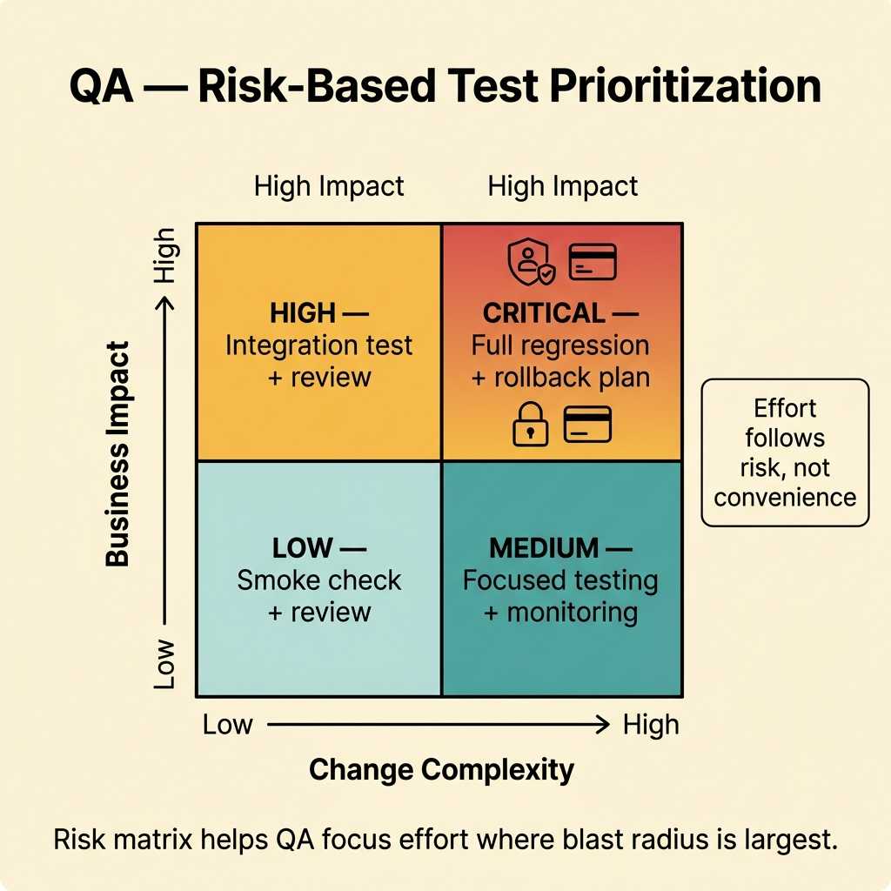
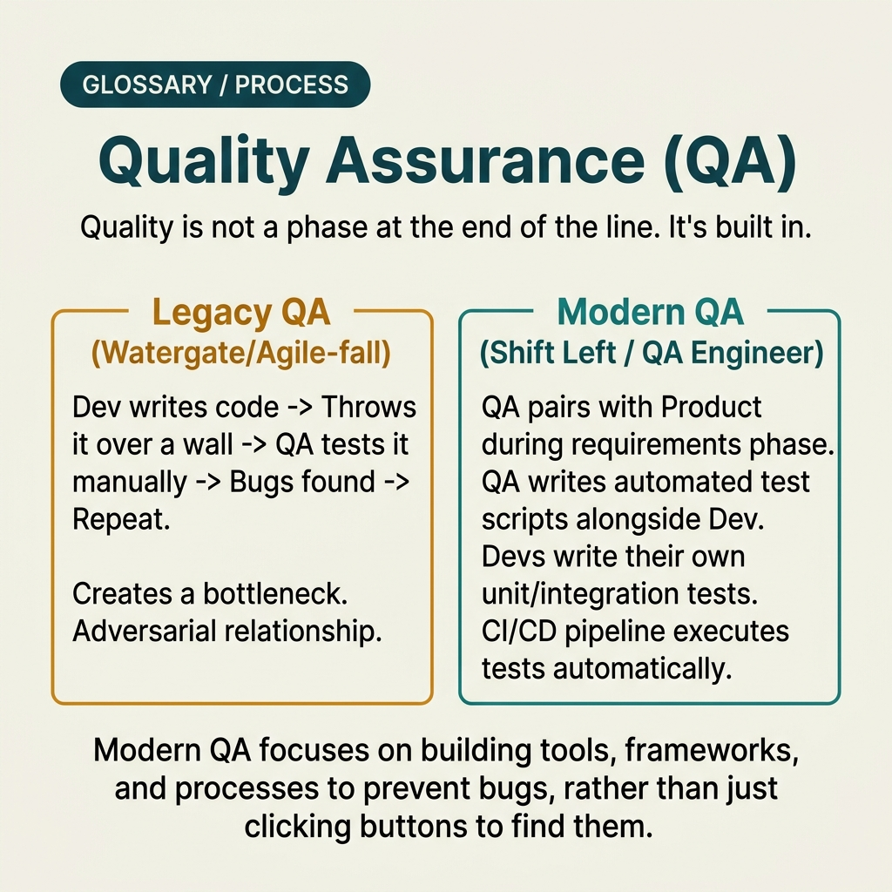

<!-- tags: glossary, reference, testing-quality, qa -->
# QA — Quality Assurance

> An ongoing activity ensuring quality throughout the development lifecycle so that defects are prevented early rather than only caught at the end.

| Aspect | Detail |
| --- | --- |
| **Concept** | An ongoing activity ensuring quality throughout the development lifecycle so that defects are prevented early rather than only caught at the end. |
| **Audience** | QA engineer, engineering manager, product manager |
| **Primary style** | Glossary term |
| **Entry point** | Use when the team is asking "who is responsible for quality" and needs to translate that question from running tests into a system of assurance that runs end-to-end. |

📅 Created: 2026-03-20 · 🔄 Updated: 2026-04-04 · ⏱️ 11 min read

---

## 1. DEFINE

Picture this: a sprint can pass all automated tests, but the release still floods support with tickets because the requirement was off, test data was wrong, or the rollback plan was missing. QA exists so that quality is not pushed entirely into the last minute of the pipeline.

**QA (Quality Assurance)** is an ongoing activity ensuring quality throughout the development lifecycle so that defects are prevented early rather than only caught at the end.

| Variant | Description |
| --- | --- |
| Process QA | Focuses on process, checklists, entry/exit criteria. |
| Product QA | Focuses on release quality, test strategy, defect risk. |
| Shift-left QA | Brings QA perspective into requirements, design, and review early. |

| Approach | Time | Space | When to choose |
| --- | --- | --- | --- |
| Risk-based QA planning | O(n risks) | O(test matrix) | When test effort must be prioritized by blast radius and business value. |
| Shift-left review loop | O(n lifecycle stages) | O(review artifacts) | When you want to prevent defects starting from requirements and design. |
| Release-quality governance | O(n releases) | O(reports + evidence) | When quality must be linked to go/no-go decisions. |

Core insight:

> QA is not synonymous with "the person who runs tests." It is the system that decides how quality is defined, measured, prioritized, and protected throughout the lifecycle.

### 1.1 Invariants & Failure Modes

The invariant of QA is traceability between risk, acceptance criteria, strategy, and release decision. If a defect surfaces and nobody can explain why it was not caught earlier, the assurance process has a gap.

---

## 2. CONTEXT

**Who uses it**: QA engineer, engineering manager, product manager

**When**: Use when the team is asking "who is responsible for quality" and needs to translate that question from running tests into a system of assurance that runs end-to-end.

**Purpose**: QA is not synonymous with "the person who runs tests." It is the system that decides how quality is defined, measured, prioritized, and protected throughout the lifecycle.

**In the ecosystem**:
- QA is broader than testing: testing is one activity in the QA toolbox.
- QA differs from end-of-line QC: QA tries to prevent defects early; QC mainly catches defects at the output.
- If the team only calls QA at the end of the sprint, they are using QA as a bug catcher — not as assurance.

---

Ensuring quality is clear. But how does QA differ from testing, what does the QA engineer do when not testing, and who owns quality?

## 3. EXAMPLES

QA surfaces most visibly when the team ships fast but bug rate climbs steadily, when the QA engineer gets reduced to a manual tester, or when "quality" is only mentioned after a production incident. The examples below place the pattern into exactly those situations.

### Example 1: Basic — Turn acceptance criteria into a testable checklist

> **Goal**: Prevent requirements from staying in a "sounds about right" state that nobody knows how to verify.
> **Approach**: Convert each acceptance criterion into an item that can be checked through review, test, or observation.
> **Example**: Checkout must complete in 3 steps and must not lose the cart on refresh.
> **Complexity**: Basic

```yaml
qa_checklist:
  feature: checkout_v2
  acceptance_criteria:
    - checkout_completes_in_3_steps
    - cart_state_survives_refresh
    - payment_error_message_is_actionable
  evidence_types:
    - ui_test
    - exploratory_note
    - release_signoff
```

**Why?** Quality cannot be assured with "looks fine" or "seems right." Basic QA starts by turning requirements into things that can be proven with evidence.

**Takeaway**: Basic QA is locking clear pass/fail conditions before execution begins.

### Example 2: Intermediate — Use a risk matrix to prioritize testing effort

> **Goal**: Avoid spreading test time equally across everything when blast radius varies enormously.
> **Approach**: Score risk by business impact, change surface, and rollback difficulty to decide testing depth.
> **Example**: Auth, payment, and data migration get deeper testing than cosmetic copy changes.
> **Complexity**: Intermediate



*Figure: Risk matrix helps QA focus effort where blast radius is largest — not where it is most convenient.*

```yaml
risk_matrix:
  dimensions:
    - business_impact
    - change_complexity
    - rollback_difficulty
  rules:
    critical:
      require:
        - integration_test
        - regression_suite
        - rollback_plan
    low:
      require:
        - smoke_check
        - focused_review
```

**Why?** QA does not have unlimited time. A risk matrix aligns effort with actual consequences if bugs escape, rather than distributing effort evenly by intuition or by whoever speaks loudest in the room.

**Takeaway**: Intermediate QA is powerful when it prioritizes by risk — not by convenience.

### Example 3: Advanced — Move QA into shift-left review instead of waiting for the build

> **Goal**: Prevent requirement, flow, and observability defects before they become production bugs.
> **Approach**: Add QA checkpoints at requirement, design, testability, and release readiness.
> **Example**: Before coding, QA already reviews empty state, monitoring hooks, and rollback assumptions.
> **Complexity**: Advanced

```yaml
shift_left_qa:
  before_implementation:
    - requirement_clarity_review
    - acceptance_criteria_review
    - observability_check
  before_release:
    - rollback_readiness
    - test_evidence_complete
    - known_risks_documented
```

**Why?** Many of the most expensive defects are not in code syntax but in wrong assumptions from requirements or design. Shift-left QA pulls that pain forward to when the cost of fixing is still low and context is still fresh.

**Takeaway**: Advanced QA creates quality from the upstream of the flow — not just cleaning up consequences at the end.

### Example 4: Expert — Use QA as release governance, not just an execution team

> **Goal**: Attach quality evidence directly to the go/no-go decision of a release.
> **Approach**: Standardize entry criteria, defect severity policy, waiver process, and sign-off ownership.
> **Example**: A release can only proceed when no `Critical` bugs remain open, risks have been explicitly accepted, and observability is fully enabled.
> **Complexity**: Expert

```yaml
release_governance:
  entry_criteria:
    - scope_frozen
    - test_environment_ready
    - acceptance_criteria_mapped
  exit_criteria:
    - no_open_critical_bug
    - known_risks_approved
    - rollback_path_verified
  signoff:
    - engineering_owner
    - qa_owner
    - product_owner
```

**Why?** If QA has no role in the release decision, all evidence collected easily becomes reference material instead of a control point. Expert QA turns evidence into leverage for real decision-making.

**Takeaway**: Expert QA is a governance capability driven by risk and evidence — not just a team running test cases.

---

## 4. COMPARE




*Figure: Position of QA between testing, quality culture, and process improvement.*

QA sounds like "the testing team." Not quite: QA is the discipline of ensuring quality throughout the process — not just at the testing stage. Testing is one part of QA, not all of it.

### Level 1

```text
requirements
  -> design review
  -> implementation + testing
  -> release decision
QA appears in every stage
```

*Figure: Level 1 shows QA is an assurance layer running throughout the lifecycle — not a final checkpoint.*

### Level 2

```text
risk identified
  -> test strategy chosen
  -> evidence collected
  -> defects triaged
  -> release gate decided
  -> production feedback loops back into planning
```

*Figure: Level 2 emphasizes QA is the loop of risk → evidence → decision → feedback.*

### Easy to confuse or cross the boundary

| # | Severity | Mistake | Consequence | Fix |
| --- | --- | --- | --- | --- |
| 1 | 🔴 Fatal | Equating QA with manual testing at end of sprint | Requirement and design defects leak deep into release | Move QA into requirements, design, and release gates. |
| 2 | 🟡 Common | No risk-based prioritization | Test effort spreads thin; the most dangerous areas get the least | Use risk matrix for test strategy. |
| 3 | 🟡 Common | Missing traceability between AC, test, and sign-off | Pass/fail and go/no-go become debatable | Map acceptance criteria to evidence and owner. |
| 4 | 🔵 Minor | QA report lists bugs without risk framing | Stakeholder cannot use the report to make decisions | Attach defects to impact, severity, and release implication. |

### Quick scan

| If you encounter | What to do |
| --- | --- |
| Team treats QA as end-of-sprint test runs | Pull QA upstream into requirements and risk planning. |
| Do not know what to test when time is limited | Use risk matrix. |
| Release decision is based on gut feeling | Attach QA evidence to exit criteria and sign-off. |

---

## 5. REF

| Resource | Type | Link | Notes |
| --- | --- | --- | --- |
| ISTQB Glossary | Official | https://glossary.istqb.org/ | Standardized QA/testing terminology. |
| Google Testing Blog | Reference | https://testing.googleblog.com/ | Many articles on testing strategy and quality. |
| Test Pyramid | Reference | https://martinfowler.com/bliki/TestPyramid.html | Context for multi-layer strategy. |

---

## 6. RECOMMEND

QA solves the problem of "what guarantees quality beyond tests?" The next question: what does a test-first approach look like, and how does user acceptance work?

| Expand to | When | Why | File/Link |
| --- | --- | --- | --- |
| UAT | When final validation from business users is needed | UAT is the acceptance gate at the user layer. | [UAT](./UAT.md) |
| BDD | When requirements are vague and need a shared language | BDD helps lock behavior earlier in the lifecycle. | [BDD](./BDD.md) |
| Testing & Quality | When you need to return to the full taxonomy | Keep context of the whole topic. | [Testing & Quality](./README.md) |

Back to that fast-shipping team from the beginning — bug rate climbed steadily, the QA engineer only ran tests at sprint end. Now you know: QA shift-left is a mindset change, not a tool change. Quality starts at requirements — not at the last test case.

**Links**: [← Previous](./BDD.md) · [→ Next](./TDD.md)
