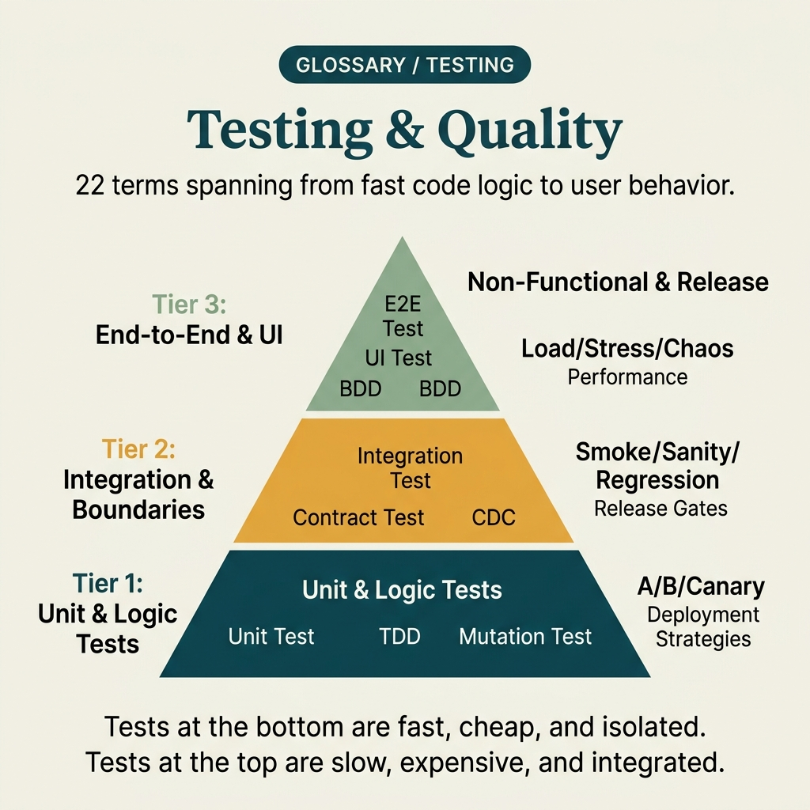

<!-- tags: glossary, reference, testing-quality, overview -->
# Testing & Quality

> A vocabulary cluster for naming test scope, confidence boundary, and verification techniques — from build safety through reliability to experiment.

| Aspect | Detail |
| --- | --- |
| **Concept** | A vocabulary cluster for naming test scope, confidence boundary, and verification techniques — from build safety through reliability to experiment. |
| **Audience** | QA, developer, reviewer, tech lead |
| **Primary style** | Glossary hub router |
| **Entry point** | Open when the team needs to agree on which type of test they are discussing, what confidence it provides, and why that test exists in the pipeline. |

📅 Created: 2026-03-30 · 🔄 Updated: 2026-04-18 · ⏱️ 7 min read

---

## 1. DEFINE

Picture this: the team keeps saying "write more tests" but if nobody names the right type of test, they easily add the wrong confidence layer in the wrong place. Smoke, sanity, integration, contract, chaos, and mutation test are not just different sizes of the same thing. This README routes the test conversation into the right boundary so the pipeline and expectations stay clear.

**Testing & Quality** is a vocabulary cluster for naming test scope, confidence boundary, and verification techniques — from build safety through reliability to experiment.

| Variant | Description |
| --- | --- |
| Build confidence basics | Smoke, sanity, regression, unit, integration, and end-to-end name the foundational confidence layers. |
| Contract & quality guardrails | Contract test, consumer-driven contract, coverage, flaky test, BDD, TDD, UAT, and QA hold the language for quality and collaboration. |
| Stress & exploration | Load, stress, chaos, mutation, fuzz, A/B, and canary test name the techniques for probing reliability or running experiments. |

| Approach | Time | Space | When to choose |
| --- | --- | --- | --- |
| Route by confidence question | O(1) route | O(1) | When you need to know what this test is guarding. |
| Route by pipeline phase | O(1) route | O(1) | When you need to map a test to build, pre-release, prod-like validation, or experiment. |
| Learn from basic to destructive | O(1) route | O(1) | When you want to progress from basic test safety to resilience and experiment. |

Core insight:

> Good testing vocabulary helps the team place the right confidence in the right place; without it, the pipeline will be both slow and insufficient to cover the real risks.

### 1.1 Signals & Boundaries

- Smoke, sanity, regression, and unit/integration/E2E are not just "small-to-large" levels; they differ by confidence objective.
- Contract testing and CDC guard the boundary between producer and consumer.
- Chaos, mutation, fuzz, load, and stress belong to the stress/exploration layer — they should not be mixed with the same logic as unit tests.

### Coverage Map

| Entry | Role | One-liner |
| --- | --- | --- |
| [Smoke Test](01-smoke-test.md) | Build confidence | Quick gate — is the build alive? |
| [Sanity Test](02-sanity-test.md) | Build confidence | Focused check after a specific change. |
| [Regression Test](03-regression-test.md) | Build confidence | Did the new change break something old? |
| [Contract Test](04-contract-test.md) | Contract guardrail | Does the provider still honor its contract? |
| [Consumer-Driven Contract](05-consumer-driven-contract.md) | Contract guardrail | Consumer expectations drive the contract. |
| [End-to-End Test](06-end-to-end-test.md) | Build confidence | Full user journey through real infrastructure. |
| [Integration Test](07-integration-test.md) | Build confidence | Two or more units collaborating at boundary. |
| [Unit Test](08-unit-test.md) | Build confidence | Single behavior in isolation. |
| [Load Test](09-load-test.md) | Stress & exploration | How does the system behave under expected load? |
| [Stress Test](10-stress-test.md) | Stress & exploration | Where does the system break under extreme load? |
| [Chaos Test](11-chaos-test.md) | Stress & exploration | Inject failure to prove resilience. |
| [Mutation Test](12-mutation-test.md) | Quality guardrail | Do tests actually catch bugs, or just cover lines? |
| [Fuzz Test](13-fuzz-test.md) | Stress & exploration | Random input to discover crashes and panics. |
| [A/B Test](14-ab-test.md) | Experiment | Compare two variants on real traffic. |
| [Canary Test](15-canary-test.md) | Experiment | Gradual rollout with live monitoring. |
| [Test Coverage](16-test-coverage.md) | Quality guardrail | How much code has been executed by tests? |
| [Flaky Test](17-flaky-test.md) | Quality guardrail | Non-deterministic test that erodes suite trust. |
| [BDD](BDD.md) | Practice | Shared language between business, QA, and dev. |
| [QA](QA.md) | Practice | Quality assurance across the full lifecycle. |
| [TDD](TDD.md) | Practice | Red-green-refactor as a design mechanism. |
| [UAT](UAT.md) | Practice | Final business acceptance before go-live. |

---

## 2. VISUAL




*Figure: Router map separating confidence basics, contract guardrails, and stress exploration so the team picks the right test layer before adding more cost to the pipeline.*

The cluster names are clear; the common mistake is that many teams add tests by habit rather than by confidence question. The visual below keeps the three test lanes in three separate jobs from the start.

### Level 1

```text
Build confidence basics
Contract & quality guardrails
Stress & exploration
```

*Figure: Level 1 divides this hub into the main decision lanes so readers do not have to dig through a flat term list.*

### Level 2

```text
If the symptom is...                                         Open first
-----------------------------------------------------------  ------------------------------------------
Need a quick gate to know if the build is alive              Smoke Test
Need confidence that integration between 2 boundaries holds  Integration Test
Need to lock the contract between service producer/consumer  Contract Test
Want to try the system under real load and failure            Load Test
Suite is noisy and team re-runs CI to pass                   Flaky Test
Want to know if tests actually catch bugs, not just run code Mutation Test
Business, QA, and dev interpret the same rule differently    BDD
```

*Figure: Level 2 turns the hub into a symptom router: start from the real question, then branch to the specific term.*

---

## 3. CODE

The diagram has divided testing by detection goal, verification scope, and system pressure level. From here, use this hub as a selector for the right test type — rather than calling everything "test" and moving on.

### Problem 1: Basic — Route the right symptom to the right glossary entry

> **Goal**: Prevent every **Testing & Quality** question from being thrown into the same bucket.
> **Approach**: Start from the symptom or the reader's question, then open the most relevant entry first.
> **Example**: The input is a review/design question; the output is the file to open first, like `./01-smoke-test.md`.
> **Complexity**: Basic

```yaml
router:
  - symptom: Need a quick gate to know if the build is alive
    open_first: ./01-smoke-test.md
  - symptom: Need confidence that integration between 2 boundaries holds
    open_first: ./07-integration-test.md
  - symptom: Need to lock the contract between service producer and consumer
    open_first: ./04-contract-test.md
  - symptom: Want to try the system under real load and failure
    open_first: ./09-load-test.md
  - symptom: Suite is noisy with random failures
    open_first: ./17-flaky-test.md
  - symptom: Coverage is high but bugs still escape
    open_first: ./12-mutation-test.md
  - symptom: Business and dev interpret the same requirement differently
    open_first: ./BDD.md
```

**Why?** Wrong test term leads to wrong verification strategy: writing unit tests when contract tests are needed, or calling load test for a smoke check. This router prevents classification errors right at the start.

**Takeaway**: The first value of this hub is helping the team choose the right test type before investing effort in writing and operating it.

### Problem 2: Intermediate — Use the hub as a purposeful learning path

> **Goal**: Read **Testing & Quality** in logical clusters rather than jumping across disconnected files.
> **Approach**: Follow a lane from foundational to heavier variants, then loop back to compare adjacent concepts when needed.
> **Example**: A reader who wants a durable mental model rather than just looking up a single definition.
> **Complexity**: Intermediate

```yaml
learning_path:
  confidence_basics:
    - 01-smoke-test.md
    - 02-sanity-test.md
    - 03-regression-test.md
    - 07-integration-test.md
    - 08-unit-test.md
    - 06-end-to-end-test.md
  contract_quality:
    - 04-contract-test.md
    - 05-consumer-driven-contract.md
    - 16-test-coverage.md
    - 17-flaky-test.md
    - BDD.md
    - TDD.md
    - QA.md
    - UAT.md
  stress_and_experiments:
    - 09-load-test.md
    - 10-stress-test.md
    - 11-chaos-test.md
    - 12-mutation-test.md
    - 13-fuzz-test.md
    - 14-ab-test.md
    - 15-canary-test.md
```

**Why?** Tests only stop being dry when the reader sees the connections between confidence layers. A learning path turns scattered terms into a test strategy with sequence and depth.

**Takeaway**: At the intermediate level, this hub helps readers stack confidence layers correctly before adding or removing a test type from the strategy.

### Problem 3: Advanced — Use the hub as a governance map for shared vocabulary

> **Goal**: Keep reviews, ADRs, runbooks, and postmortems using the same language within **Testing & Quality**.
> **Approach**: Group terms by decision lane, then use that lane as a glossary contract for the team.
> **Example**: When two people are using the same word but actually debating at two different system layers.
> **Complexity**: Advanced

```yaml
governance_map:
  build_confidence_basics:
    - 01-smoke-test.md
    - 02-sanity-test.md
    - 03-regression-test.md
  contract_quality_guardrails:
    - 04-contract-test.md
    - 05-consumer-driven-contract.md
    - 16-test-coverage.md
  stress_exploration:
    - 09-load-test.md
    - 10-stress-test.md
    - 11-chaos-test.md
```

**Why?** Testing vocabulary is a guardrail for release quality. If this hub maintains clear boundaries, the team will be less likely to confuse tests for learning, tests for blocking defects, and tests for protecting production.

**Takeaway**: At the advanced level, this hub is the system's confidence map — helping each test type stand in its proper role.

---

## 4. PITFALLS

The taxonomy is clear, but routing correctly is not enough to avoid the most common mistakes when using or interpreting this concept cluster.

| # | Severity | Mistake | Consequence | Fix |
| --- | --- | --- | --- | --- |
| 1 | 🔴 Fatal | Mixing multiple concept layers in the same discussion | Team fixes the wrong layer, debate goes off track | Re-route using the correct lane in this README before opening a specific term |
| 2 | 🟡 Common | Choosing term by familiarity instead of symptom | Deep-links to the right file but wrong boundary | Ask the symptom question first, then choose the entry point |
| 3 | 🟡 Common | Reading a term in isolation and skipping the learning path | Understanding stays fragmented, missing adjacent concepts for comparison | Follow the reading clusters suggested in CODE/RECOMMEND |
| 4 | 🔵 Minor | Not linking back to the parent hub or root hub | Reader gets lost and cannot return to the taxonomy | Keep the hub as a router; do not turn files into islands |

---

## 5. REF

| Resource | Type | Link | Notes |
| --- | --- | --- | --- |
| Google Testing Blog | Reference | https://testing.googleblog.com/ | Excellent source for strategy and quality thinking |
| Testing Trophy / Pyramid Discussions | Reference | https://kentcdodds.com/blog/the-testing-trophy-and-testing-classifications | Useful for test classification |
| Consumer-Driven Contracts | Reference | https://martinfowler.com/articles/consumerDrivenContracts.html | Canon for CDC |

---

## 6. RECOMMEND

You have identified which confidence layer is missing. Continue along the correct test layer to increase reliability — not just increase the number of test cases.

| Expand to | When | Why | File/Link |
| --- | --- | --- | --- |
| Smoke test first | When the team needs a quick baseline confidence | This is the entry point to avoid misjudging test scope from the start | [Smoke Test](./01-smoke-test.md) |
| Integration/contract next | When the biggest risk lies at boundaries between components | Good confidence does not come from unit tests alone | [Contract Test](./04-contract-test.md) |
| Load/chaos when reliability becomes a major concern | When the system needs to be tested under real pressure | At this point the pipeline needs to move beyond happy-path testing | [Load Test](./09-load-test.md) |

---

## 7. QUICK REF

| If you encounter | Open |
| --- | --- |
| Need a quick gate to know if the build is alive | [Smoke Test](./01-smoke-test.md) |
| Need confidence that integration between 2 boundaries holds | [Integration Test](./07-integration-test.md) |
| Need to lock the contract between service producer and consumer | [Contract Test](./04-contract-test.md) |
| Want to try the system under real load and failure | [Load Test](./09-load-test.md) |
| Suite is noisy with random failures, team re-runs CI | [Flaky Test](./17-flaky-test.md) |
| Coverage looks great but bugs still escape | [Mutation Test](./12-mutation-test.md) |
| Business and dev interpret the same rule differently | [BDD](./BDD.md) |
| Need to confirm business acceptance before go-live | [UAT](./UAT.md) |
| Want to use tests as a design tool, not just a safety net | [TDD](./TDD.md) |
| Quality is seen as "QA team's job" instead of shared discipline | [QA](./QA.md) |
