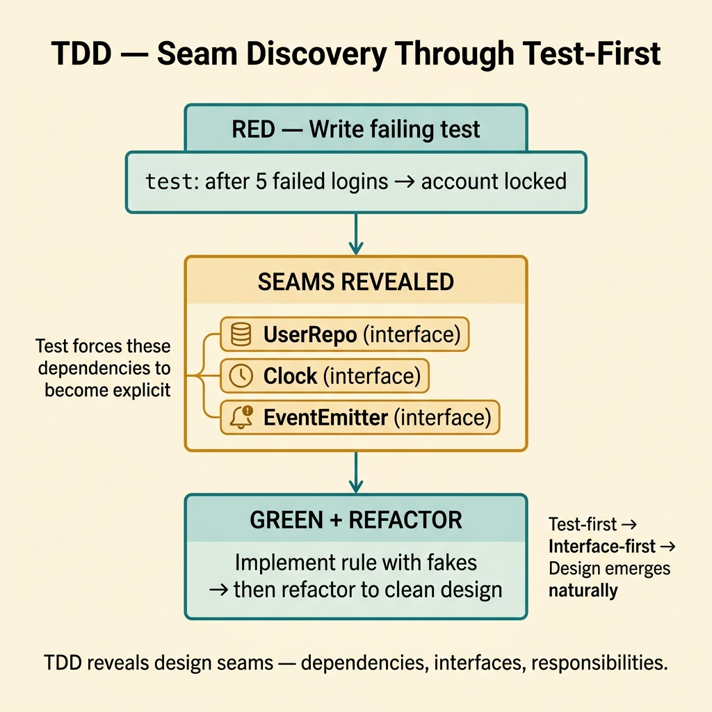
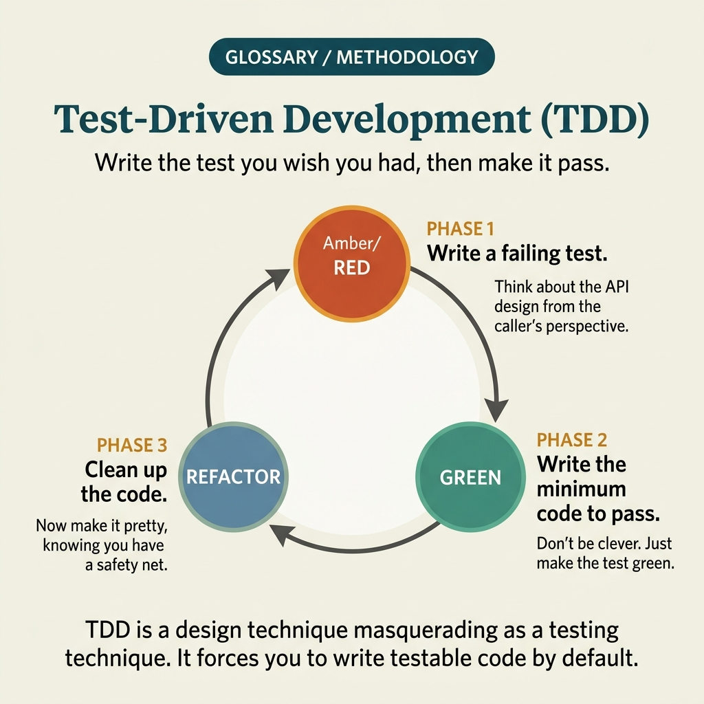

<!-- tags: glossary, reference, testing-quality, tdd -->
# TDD — Test-Driven Development

> A development approach following the red-green-refactor rhythm so that behavior is locked by test before implementation expands.

| Aspect | Detail |
| --- | --- |
| **Concept** | A development approach following the red-green-refactor rhythm so that behavior is locked by test before implementation expands. |
| **Audience** | Backend engineer, frontend engineer, reviewer |
| **Primary style** | Glossary term |
| **Entry point** | Use when the team wants to avoid writing too much code before truly knowing what behavior needs to be protected. |

📅 Created: 2026-03-20 · 🔄 Updated: 2026-04-04 · ⏱️ 11 min read

---

## 1. DEFINE

Picture this: you know you need a pricing function, but the more you code up front, the easier it is to pull in extra branches, caches, repos, and all sorts of things you "might need." TDD cuts that tendency by forcing you to state the desired behavior first, then write only the minimum code to make that behavior pass.

**TDD (Test-Driven Development)** is a development approach following the red-green-refactor rhythm so that behavior is locked by test before implementation expands.

| Variant | Description |
| --- | --- |
| Micro TDD | Very short cycles for small unit behavior. |
| Outside-in TDD | Starts from use case/API boundary then works inward. |
| Classical TDD | Favors state-based assertions over interaction-heavy mocks. |

| Approach | Time | Space | When to choose |
| --- | --- | --- | --- |
| Red-Green-Refactor loop | O(n behaviors) | O(test + implementation) | When you want to control scope of each implementation step. |
| Example-driven unit TDD | O(n examples) | O(fixtures) | When behavior has clear input/output and few dependencies. |
| Outside-in seam carving | O(n boundaries × collaborators) | O(test doubles) | When the use case has many dependencies and seams need discovering first. |

Core insight:

> TDD is not just about "having tests." It is a design mechanism: the first test forces implementation to reveal its API, seams, and responsibilities before code becomes tangled.

### 1.1 Invariants & Failure Modes

The invariant of TDD is that each loop must be small, have one clearly failing test, one small change to pass, then refactor in a safe state. When refactor is skipped or too much behavior is stuffed into one loop, TDD loses its design power.

---

## 2. CONTEXT

**Who uses it**: Backend engineer, frontend engineer, reviewer

**When**: Use when the team wants to avoid writing too much code before truly knowing what behavior needs to be protected.

**Purpose**: TDD is not just about "having tests." It is a design mechanism: the first test forces implementation to reveal its API, seams, and responsibilities before code becomes tangled.

**In the ecosystem**:
- TDD differs from "writing tests after": in TDD, tests shape the interface and scope of implementation from the start.
- TDD differs from BDD: BDD starts from business behavior at a higher language level; TDD starts from behavior at the code/use-case level close to implementation.
- If tests depend too heavily on implementation details, TDD is being misused as a snapshot of internals.

---

Writing tests before code is clear. But how does TDD differ from BDD, does TDD actually reduce bugs, and when is TDD overhead?

## 3. EXAMPLES

TDD surfaces most visibly when dev finishes code then writes tests as an afterthought, when Red-Green-Refactor skips the Refactor step, or when the team argues "TDD is too slow" without measuring. The examples below place the pattern into exactly those situations.

### Example 1: Basic — Lock a small behavior before writing implementation

> **Goal**: Avoid writing aimlessly when the desired behavior is still very small and clear.
> **Approach**: Write a failing test for exactly one outcome, then add only the minimum code to pass.
> **Example**: `apply_discount(100000, 10)` must return `90000`.
> **Complexity**: Basic

```yaml
tdd_loop:
  red:
    test: apply_discount_returns_reduced_total
    expect: 90000
  green:
    implementation: minimal_discount_logic
  refactor:
    keep_behavior_same: true
```

**Why?** When the test is written first, you are forced to describe a specific behavior instead of piling on code by intuition. A small loop reduces the probability of design drift right at the first step.

**Takeaway**: Basic TDD is most effective when behavior is small enough for one red-green-refactor loop to finish quickly and clearly.

### Example 2: Intermediate — Use tests to reveal seams between unit and dependency

> **Goal**: When the use case needs a repo, clock, or gateway, still find the cut point to test behavior first.
> **Approach**: Write tests at the use case boundary then inject minimal fake collaborators so behavior can run.
> **Example**: Login use case needs clock and user repo but the account-lock-after-5-failures rule can still be tested.
> **Complexity**: Intermediate



*Figure: TDD reveals design seams — dependencies that need injection, interfaces that are too rigid, responsibilities that are mixed.*

```yaml
outside_in_tdd:
  use_case: login
  failing_behavior:
    after_5_failed_attempts_account_locked: true
  seams:
    - user_repo_interface
    - clock_interface
  first_green:
    implement_rule_without_real_db: true
```

**Why?** Good TDD often reveals seams: which dependencies need injection, which interfaces are too rigid, which responsibilities are mixed. A test that fails at the right place forces design to become flexible naturally — rather than through late refactoring.

**Takeaway**: Intermediate TDD does not just create tests; it also reveals the design's need for layer separation and dependency abstraction.

### Example 3: Advanced — Use the refactor step to pay design debt immediately after behavior is locked

> **Goal**: Prevent the green phase from accumulating "just good enough to pass" code into technical debt.
> **Approach**: After passing the test, consolidate duplication, rename for clarity, and extract helpers — without changing behavior.
> **Example**: After 3 pricing cases pass, extract pricing rules into a clearly named policy object.
> **Complexity**: Advanced

```yaml
refactor_window:
  safe_when:
    all_tests_green: true
  allowed_moves:
    - rename_for_clarity
    - extract_policy
    - remove_duplication
  forbidden_moves:
    - add_new_behavior_without_new_test
```

**Why?** If you only chase green, code will quickly pass but look ugly. Refactor is the other half of TDD: it uses the safety net from tests to improve design while context is still warm and changes are still small.

**Takeaway**: Advanced TDD always treats refactor as a mandatory part of the loop — not a reward if there is time left.

### Example 4: Expert — Use TDD as a governance mechanism for design quality

> **Goal**: On larger teams, keep TDD from becoming a slogan or a mechanical ritual.
> **Approach**: Standardize when to use TDD, what to review in the first test, and what criteria prove the loop is still small, fast, and useful.
> **Example**: Review does not just ask if the test passes — it asks whether the first test reveals the right API/seam.
> **Complexity**: Expert

```yaml
tdd_governance:
  required_for:
    - core_domain_rules
    - bugfix_regressions
    - high_risk_refactors
  code_review_questions:
    - did_the_first_test_capture_behavior_not_implementation
    - is_the_loop_small_enough
    - did_refactor_happen_after_green
  anti_patterns:
    - giant_first_test
    - mock_everything_without_reason
    - green_without_refactor
```

**Why?** Without governance, TDD is easily misunderstood as "just write tests first and you're done." Expert practice evaluates the quality of the loop: does the first test shape good design, are seams natural, and is refactor being used or skipped.

**Takeaway**: Expert TDD is a design mechanism with discipline — not a checkbox about the order of file creation.

---

## 4. COMPARE




*Figure: Position of TDD between BDD, unit test strategy, and development workflow.*

TDD sounds like "unit test run first." True — but TDD is a design tool: writing the test first forces the developer to think about the interface before implementation. Writing tests first is not the goal — good design is.

### Level 1

```text
write failing test
  -> write minimal code
  -> test passes
  -> refactor safely
```

*Figure: Level 1 shows the minimal rhythm of TDD is red → green → refactor.*

### Level 2

```text
behavior hypothesis
  -> failing executable example
  -> minimal implementation
  -> design seam appears
  -> refactor without changing behavior
  -> next behavior starts
```

*Figure: Level 2 emphasizes TDD is a design loop that gradually reveals API and seams — not just writing tests first for fun.*

### Easy to confuse or cross the boundary

| # | Severity | Mistake | Consequence | Fix |
| --- | --- | --- | --- | --- |
| 1 | 🔴 Fatal | Testing implementation details instead of behavior | Harmless refactors break the suite | Write tests from observable outcomes and rules. |
| 2 | 🟡 Common | Red-green loop is too large | Loses fast feedback; hard to tell where the bug is | Keep each loop revolving around one small behavior. |
| 3 | 🟡 Common | Skipping refactor after green | Code passes tests but quality degrades | Treat refactor as a mandatory step of the loop. |
| 4 | 🔵 Minor | Mocking everything from the start | Tests become rigid and design gets distorted | Only create seams at dependencies that truly need isolation. |

### Quick scan

| If you encounter | What to do |
| --- | --- |
| Unsure what behavior needs protecting | Write the first failing test before anything else. |
| Code is expanding before seams are clear | Use TDD to force dependency boundaries to appear. |
| Suite passes but code keeps getting uglier | You are missing the refactor step. |

---

## 5. REF

| Resource | Type | Link | Notes |
| --- | --- | --- | --- |
| Test-Driven Development by Example | Book | https://www.oreilly.com/library/view/test-driven-development/0321146530/ | Foundational source by Kent Beck. |
| Growing Object-Oriented Software Guided by Tests | Book | https://www.growing-object-oriented-software.com/ | Outside-in TDD and seams. |
| Go Testing | Official | https://go.dev/doc/tutorial/add-a-test | Testing context in Go. |

---

## 6. RECOMMEND

TDD solves the problem of "is code design being driven by implementation instead of usage?" The next question: what about shared understanding with business, and how does user acceptance work?

| Expand to | When | Why | File/Link |
| --- | --- | --- | --- |
| BDD | When shared language with business/QA is needed before dropping to code | BDD operates at a higher behavior layer than TDD. | [BDD](./BDD.md) |
| Unit Test | When you want to zoom into unit boundaries after adopting TDD workflow | Unit test is where TDD is most commonly practiced. | [Unit Test](./08-unit-test.md) |
| Testing & Quality | When you need to return to the full taxonomy | Keep context of the whole topic. | [Testing & Quality](./README.md) |

Back to that code-first approach from the beginning — finished coding then wrote tests as an afterthought, tests become a formality, coverage for show. Now you know: TDD is not "writing tests first for fun." It forces the developer to think interface first, think behavior first. Code that comes out will be testable by design.

**Links**: [← Previous](./QA.md) · [→ Next](./UAT.md)
