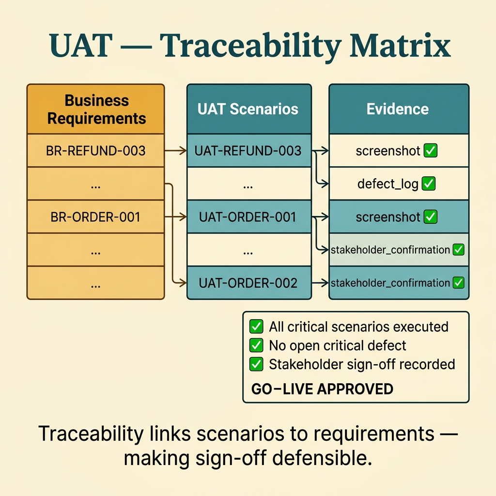
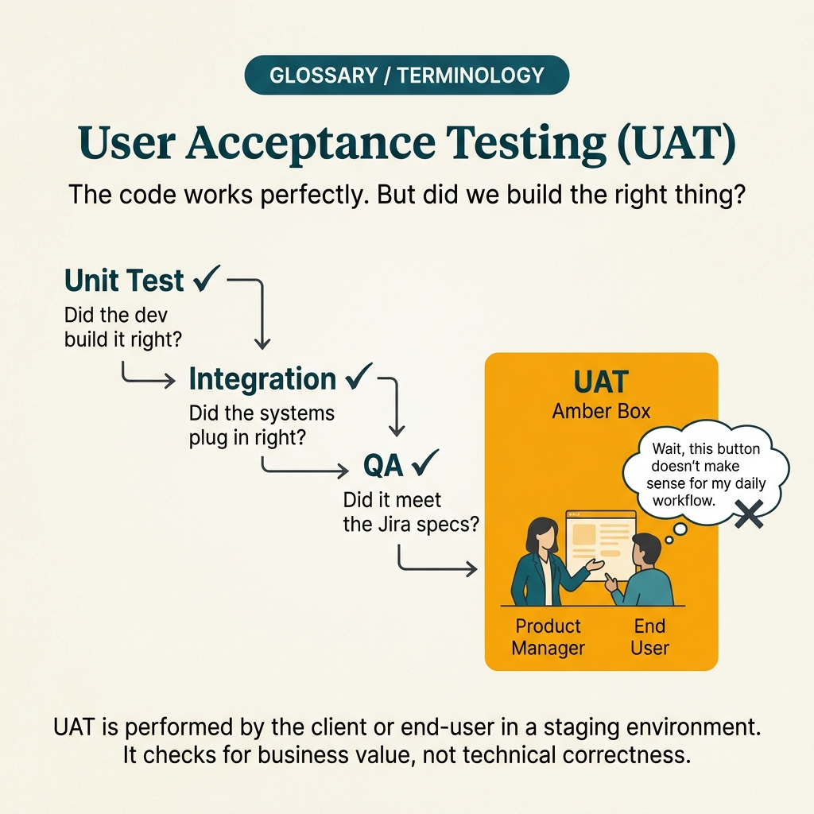

<!-- tags: glossary, reference, testing-quality, uat -->
# UAT — User Acceptance Testing

> The final confirmation stage by business users or business representatives that the system meets exactly what they need before going live.

| Aspect | Detail |
| --- | --- |
| **Concept** | The final confirmation stage by business users or business representatives that the system meets exactly what they need before going live. |
| **Audience** | Product owner, QA lead, business stakeholder |
| **Primary style** | Glossary term |
| **Entry point** | Use when the team needs to distinguish "the system works" from "business actually accepts it" before release. |

📅 Created: 2026-03-23 · 🔄 Updated: 2026-04-04 · ⏱️ 12 min read

---

## 1. DEFINE

Picture this: system tests are all green, but business still asks: "does this order-entry process match how the operations team actually works every day?" UAT exists so that question is answered by the person who owns the business — not by the developer or the automation framework.

**UAT (User Acceptance Testing)** is the final confirmation stage by business users or business representatives that the system meets exactly what they need before going live.

| Variant | Description |
| --- | --- |
| Business-user UAT | End users or business representatives run real-world scenarios. |
| Contract acceptance | UAT is tied to acceptance criteria or contractually committed terms. |
| Operational acceptance | Focuses on operational readiness, support, backup, and compliance. |

| Approach | Time | Space | When to choose |
| --- | --- | --- | --- |
| Scenario-based UAT | O(n business scenarios) | O(test scripts + notes) | When you want to confirm user journeys and key business rules. |
| Sign-off driven UAT | O(n review rounds) | O(evidence + approvals) | When the release needs formal approval before going live. |
| Risk-focused UAT | O(n critical flows) | O(traceability matrix) | When full UAT is impossible and high-value flows must be prioritized. |

Core insight:

> UAT does not aim to prove code has "fewer bugs." It aims to prove the product is truly usable and acceptable in the business context before turning on production at scale.

### 1.1 Invariants & Failure Modes

The invariant of UAT is that each scenario must trace back to an acceptance criterion or a clear business outcome. If users run through a series of steps but nobody knows which requirement pass/fail ties to, sign-off will be fragile.

---

## 2. CONTEXT

**Who uses it**: Product owner, QA lead, business stakeholder

**When**: Use when the team needs to distinguish "the system works" from "business actually accepts it" before release.

**Purpose**: UAT does not aim to prove code has "fewer bugs." It aims to prove the product is truly usable and acceptable in the business context before turning on production at scale.

**In the ecosystem**:
- UAT differs from system test: system test asks if the system runs correctly; UAT asks if business accepts that outcome.
- UAT differs from internal QA: the primary confirmer in UAT must be a business user or a credible business representative.
- If UAT only replays technical test cases without tying to real business workflows, it is drifting from its purpose.

---

User accepting the product is clear. But how does UAT differ from QA testing, who participates, and when does UAT become a bottleneck?

## 3. EXAMPLES

UAT surfaces most visibly when dev completes 100% of requirements but the user says "this is not what I meant," when UAT drags on for 3 weeks because stakeholders are busy, or when the team skips UAT and production feedback becomes the real UAT. The examples below place the pattern into exactly those situations.

### Example 1: Basic — Describe a UAT scenario tied directly to a business outcome

> **Goal**: Prevent UAT from starting with disjointed technical steps lacking business meaning.
> **Approach**: Write scenarios from the real user's perspective, tied to outcomes and clear acceptance criteria.
> **Example**: Warehouse staff creates an order and prints the delivery note in the same flow.
> **Complexity**: Basic

```yaml
uat_scenario:
  id: UAT-ORDER-001
  business_goal: warehouse_staff_can_create_and_print_delivery_note
  preconditions:
    - user_role: warehouse_staff
    - inventory_available: true
  success:
    - order_created: true
    - delivery_note_printed: true
```

**Why?** UAT only has meaning when tied to a business goal that business truly cares about. If the scenario does not state clearly what the user is trying to accomplish, it is very hard to evaluate results from an acceptance perspective.

**Takeaway**: Basic UAT should start from the real business workflow — not from menus or isolated screens.

### Example 2: Intermediate — Use traceability between acceptance criteria and scenarios

> **Goal**: When pass/fail is debated, still be able to trace back to the original requirement.
> **Approach**: Each scenario maps to a business requirement, owner, and required evidence.
> **Example**: Refund flow maps to BR-REFUND-003 and needs product owner signature before release.
> **Complexity**: Intermediate



*Figure: Traceability links scenarios to requirements and evidence — making sign-off defensible and disputes resolvable.*

```yaml
traceability:
  scenario: UAT-REFUND-003
  maps_to:
    - BR-REFUND-003
    - AC-REFUND-PARTIAL
  evidence:
    - screenshot
    - defect_log
    - stakeholder_confirmation
```

**Why?** Without traceability, UAT easily drifts into "the user said it looks fine" with no clarity on what standard was actually met. Mapping requirements makes sign-off have a foundation and helps disputes get resolved by evidence rather than feelings.

**Takeaway**: Intermediate UAT turns business expectation into a matrix that can be traced backward and verified.

### Example 3: Advanced — Organize UAT with near-production data and known-risk review

> **Goal**: Avoid passing UAT with overly clean data only to have production reveal the real pain.
> **Approach**: Prepare datasets close to reality, including edge records, role permissions, and operational assumptions.
> **Example**: A large tenant's thick order history, hierarchical permissions, and legacy data are used in UAT instead of a demo dataset.
> **Complexity**: Advanced

```yaml
uat_environment:
  data_profile:
    - realistic_user_roles
    - legacy_records_present
    - edge_case_orders_included
  review_after_execution:
    - open_defects
    - accepted_known_risks
    - required_workarounds
```

**Why?** Business usually accepts a product based on whether it handles their real context. Overly clean datasets push UAT away from reality, making sign-off falsely optimistic.

**Takeaway**: Advanced UAT is only trustworthy when the environment and data are close enough to the world the user will live in after go-live.

### Example 4: Expert — Turn UAT into a control point of the go-live decision

> **Goal**: Make sign-off more than an administrative ceremony at the end.
> **Approach**: Standardize exit criteria, defect severity policy, waiver process, and final decision owner.
> **Example**: No go-live if `Critical` defects remain open, or if workarounds have not been explicitly accepted by business.
> **Complexity**: Expert

```yaml
uat_governance:
  exit_criteria:
    - all_critical_scenarios_executed
    - no_open_critical_defect
    - stakeholder_signoff_recorded
  waiver_policy:
    allowed_for:
      - low_severity_defects
    requires:
      - workaround_documented
      - business_owner_acceptance
  decision_owner:
    - product_owner
    - business_sponsor
    - qa_lead
```

**Why?** When UAT is not tied to go-live criteria, sign-off gets pressured by deadline rather than evidence. Governance turns UAT into a real control point in the release process.

**Takeaway**: Expert UAT is a release acceptance mechanism driven by business evidence — not a symbolic signing ceremony.

---

## 4. COMPARE




*Figure: Position of UAT between QA testing, BDD, and product acceptance.*

UAT sounds like "QA test by users." Not quite: QA verifies code against spec; UAT verifies product against user expectation. The spec can be correct but if the expectation was wrong, UAT still fails.

### Level 1

```text
business scenarios selected
  -> business user runs them
  -> evidence recorded
  -> sign-off or rejection
```

*Figure: Level 1 shows UAT is the final confirmation loop from the business user's perspective.*

### Level 2

```text
acceptance criteria mapped
  -> realistic test data prepared
  -> users execute high-value flows
  -> defects triaged against go-live decision
  -> sign-off recorded with known risks
```

*Figure: Level 2 emphasizes UAT needs traceability, near-real data, and clear go/no-go decision.*

### Easy to confuse or cross the boundary

| # | Severity | Mistake | Consequence | Fix |
| --- | --- | --- | --- | --- |
| 1 | 🔴 Fatal | Dev or QA plays the user role to speed things up | Sign-off lacks real business perspective | Use business users or credible business representatives with authority. |
| 2 | 🟡 Common | Scenarios do not map to acceptance criteria | Pass/fail becomes emotional | Add traceability matrix between scenarios and requirements. |
| 3 | 🟡 Common | UAT dataset is too clean, far from production reality | Real pain only surfaces after go-live | Prepare near-real data and important edge cases. |
| 4 | 🔵 Minor | Sign-off does not record known risks and workarounds | Post-release accountability and context are lost | Save decision log alongside risk acceptance. |

### Quick scan

| If you encounter | What to do |
| --- | --- |
| Need business to confirm the system is "what they need" | Use UAT. |
| Technically passing but business is still uneasy | Re-map scenarios to acceptance criteria and real user workflows. |
| Sign-off is just a formality | Add exit criteria, waiver policy, and clear owners. |

---

## 5. REF

| Resource | Type | Link | Notes |
| --- | --- | --- | --- |
| ISTQB Glossary | Official | https://glossary.istqb.org/ | Standardized acceptance testing terminology. |
| Atlassian UAT Guide | Reference | https://www.atlassian.com/continuous-delivery/software-testing/user-acceptance-testing | Pragmatic view of the UAT lifecycle. |
| Microsoft Release Readiness Guidance | Reference | https://learn.microsoft.com/ | Perspective on readiness and sign-off. |

---

## 6. RECOMMEND

UAT solves the problem of "is the product truly what the user needs?" The next question: what about shared language with business, and what does the overall quality discipline look like?

| Expand to | When | Why | File/Link |
| --- | --- | --- | --- |
| BDD | When acceptance criteria are still vague from the start of the lifecycle | BDD helps lock behavior early before UAT. | [BDD](./BDD.md) |
| QA | When UAT needs to be seen in the broader assurance picture | UAT is one gate in the overall QA system. | [QA](./QA.md) |
| Testing & Quality | When you need to return to the full taxonomy | Keep context of the whole topic. | [Testing & Quality](./README.md) |

Back to that "100% requirements" from the beginning — dev finished everything but the user said "this is not what I meant." Now you know: correct requirements do not always mean correct expectations. UAT is the last check — not checking code, but checking value. Real users, real feedback.

**Links**: [← Previous](./TDD.md) · [→ Next](./README.md)
