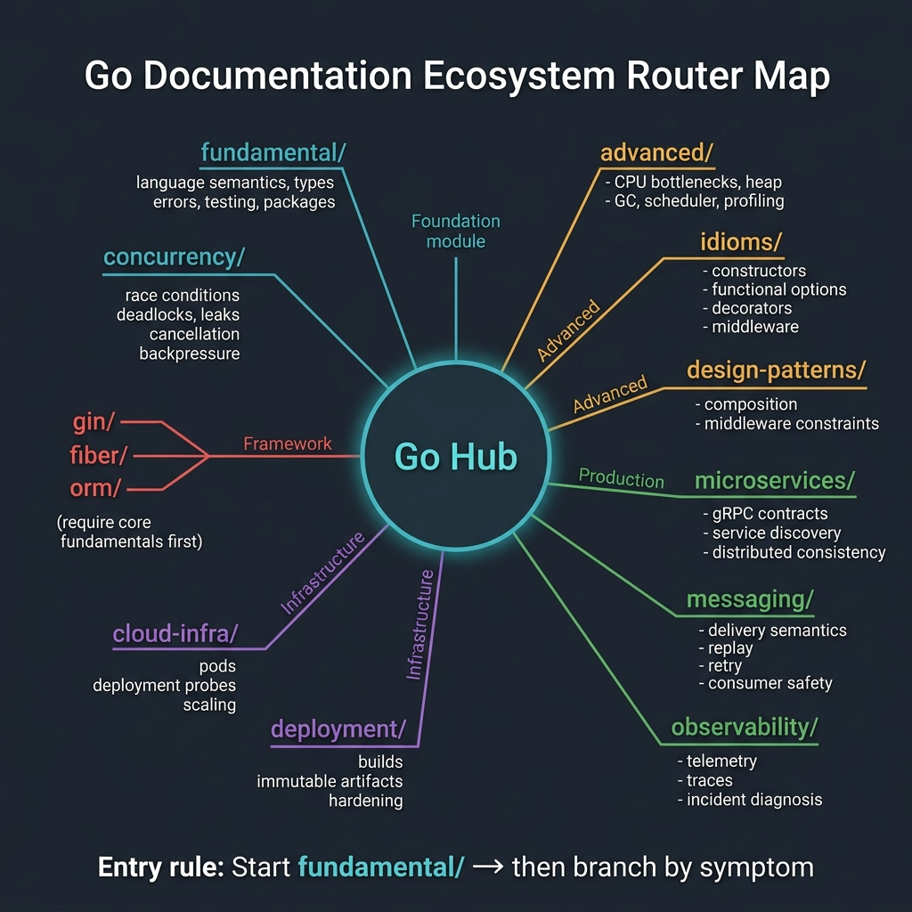
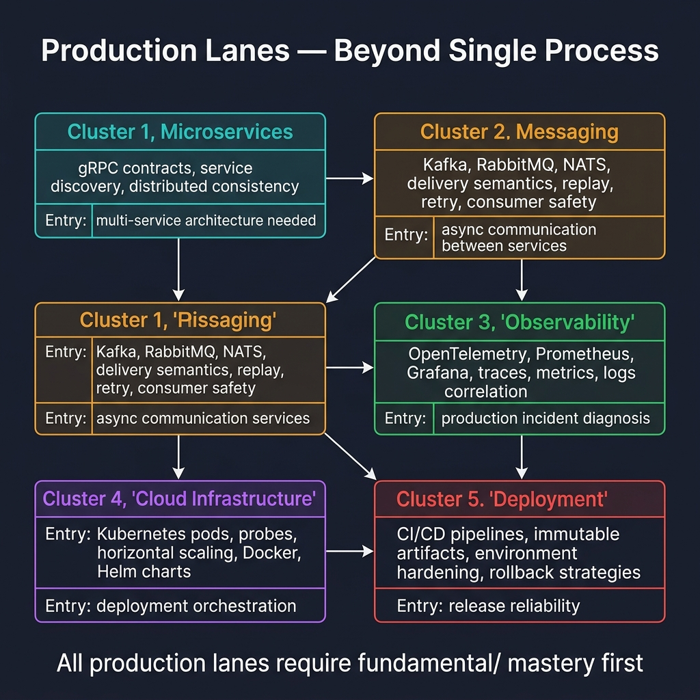
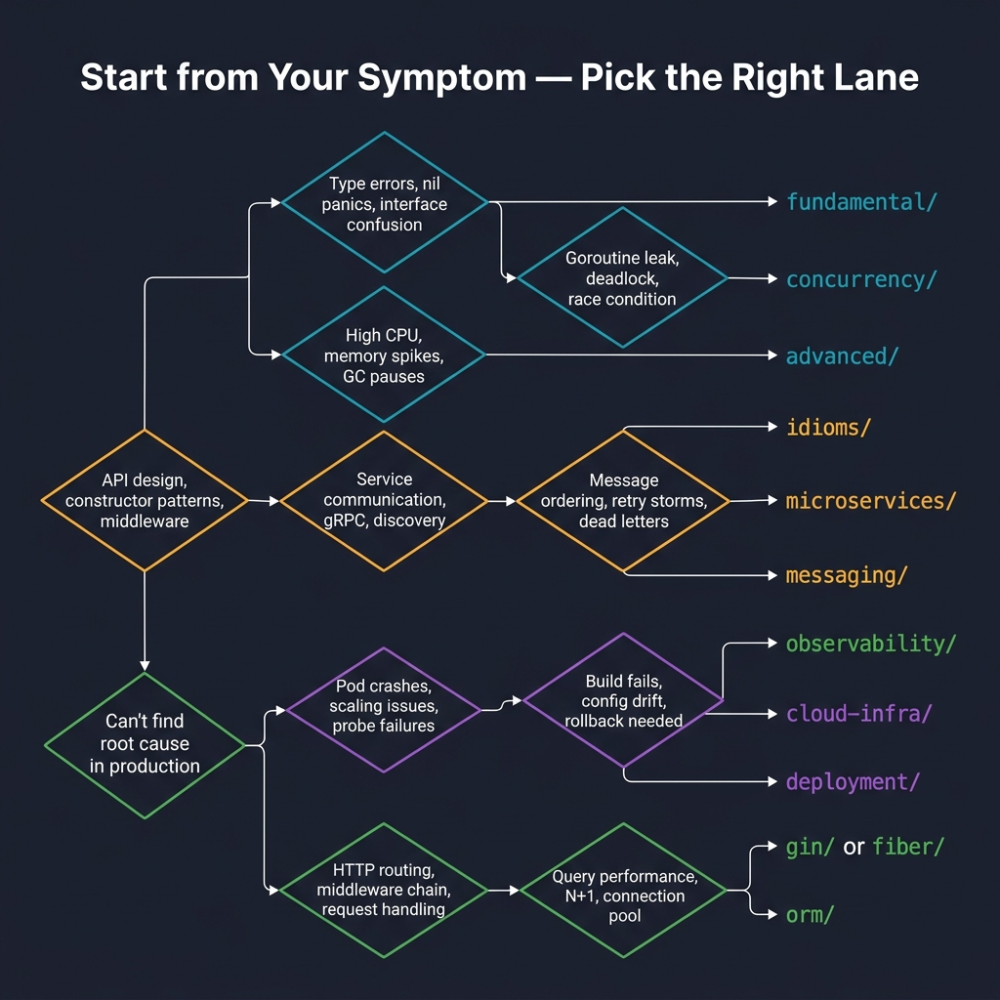
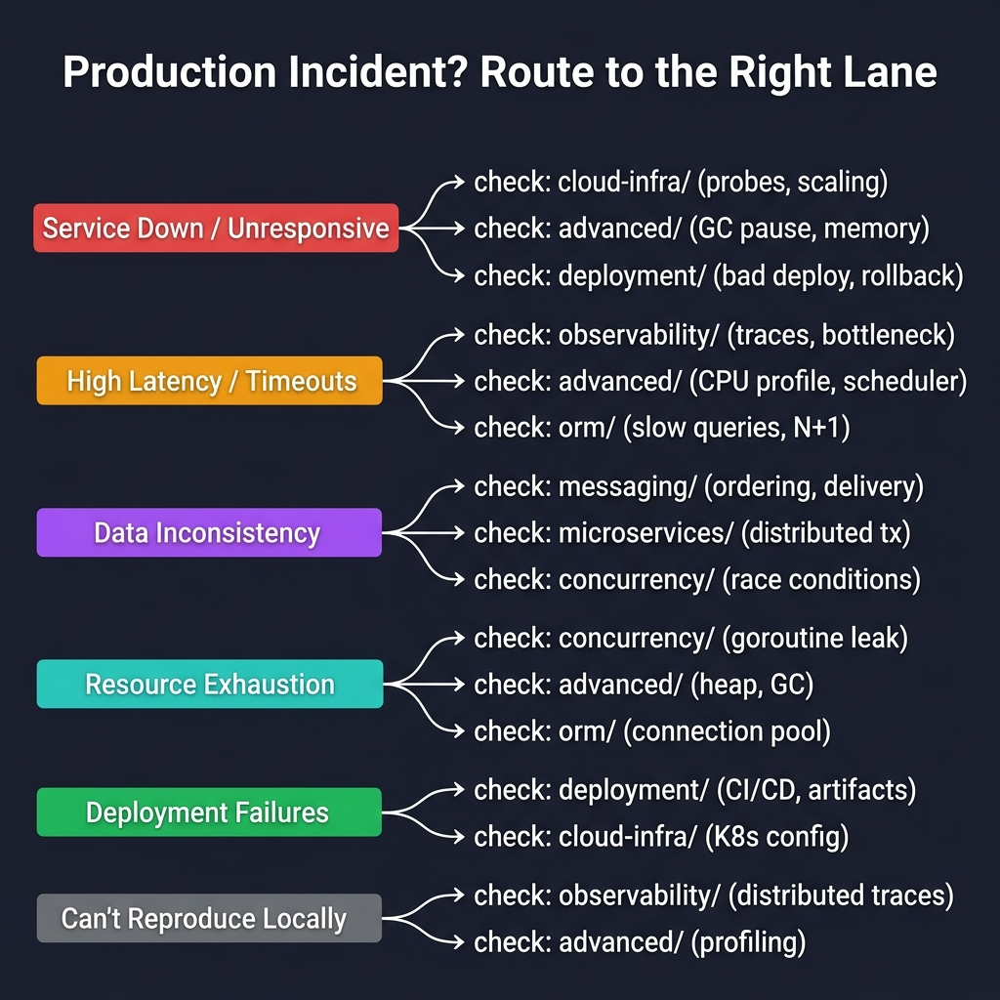

<!-- tags: golang, overview -->
# Go Programming

> The root router determining the entire `assets/go` subtree: utilize this choosing the exact semantic lane prior to delving deep into frameworks, runtimes, concurrency, or comprehensive production architectures.

📅 Updated: 2026-04-14 · ⏱️ 7 min read

## 1. DEFINE

This hub exists explicitly answering a highly practical constraint: considering the exact Go failure you face, which lane demands immediate access circumventing aimless learning?

Jumping directly into frameworks or external tooling lacking a fundamental mental model guarantees you repair superficial symptoms prioritizing root cause suppression falsely. Conversely, starting from basic fundamentals when investigating physical runtime constraints triggers wasted iterative loops.

Once language-level layers stabilize, production clustered lanes determine your proficiency reading the actual blast radius framing the incident accurately. 

### 1.1 Signals & Boundaries

- Access this hub when acknowledging you operate inside the `go` cluster mapping uncertain gateway lanes.
- This hub functions strictly as a router mapping architectural thresholds, never replacing deep distinct sub-topic tutorials.
- Rely upon `RECOMMEND` sections navigating internal boundaries safely; `REF` items exclusively anchor verified external documentation sources.

### 1.2 Learning Lanes

- `fundamental/` constitutes the default entrance mapping language semantics, strict types, comprehensive errors, testing limits, and overarching package interfaces.
- `concurrency/` fits when combating physical race conditions, lethal deadlocks, silent leaks, cancellation boundaries, or structural backpressure.
- `advanced/` fits diagnosing aggressive CPU bound bottlenecks, volatile heap constraints, core garbage collection overhead, scheduler profiling, bridging internal execution traces.
- `idioms/` and `design-patterns/` frame operational API shapes fitting composition models mapping clean middleware constraints bypassing bloated structure porting.
- `microservices/` functions mapping structural RPC contracts driving dynamic discovery nodes framing distributed consistency thresholds securely.
- `messaging/` resolves distinct delivery semantics enforcing replay resilience routing robust retry constraints bounding robust Consumer Safety natively.
- `observability/` diagnoses physical incidents demanding explicit operational telemetry exposing invisible network traces effectively.
- `cloud-infra/` targets pod lifecycle deployment probing aggressive draining metrics securing horizontal scaling structures seamlessly.
- `deployment/` maps reliable build boundaries trusting immutable artifact lineages spanning strict hardening environments confidently.
- Lanes matching `gin/`, `fiber/`, `orm/`, `microservices/`, `messaging/`, `observability/`, `cloud-infra/`, and `deployment/` explicitly require mastering basic core lane fundamentals preceding active entry safely.

## 2. VISUAL

The visual framing routing mapping prevents mapping random sequential choices. The topology branches distinctly bridging three separate structural scopes.

### Ecosystem Router



*Figure: Central Go Hub radiating to 10+ documentation lanes — fundamental/, concurrency/, advanced/, idioms/, design-patterns/ (foundation), microservices/, messaging/, observability/ (production), cloud-infra/, deployment/ (infrastructure), gin/, fiber/, orm/ (frameworks — require fundamentals first).*

### Production Lanes Cluster



*Figure: Five production clusters with dependencies — Microservices (gRPC, discovery) → Messaging (Kafka, delivery semantics) → Observability (OpenTelemetry, traces) → Cloud Infrastructure (K8s, probes) → Deployment (CI/CD, rollback). All require fundamental/ mastery.*

### Symptom-To-Lane Chooser



*Figure: Symptom-based routing — type errors → fundamental/, goroutine leak → concurrency/, high CPU → advanced/, API design → idioms/, gRPC issues → microservices/, message ordering → messaging/, production root cause → observability/, pod crashes → cloud-infra/, build fails → deployment/.*

### Production Symptom Chooser



*Figure: Six production incident categories routed to lanes — Service Down (cloud-infra, advanced, deployment), High Latency (observability, advanced, orm), Data Inconsistency (messaging, microservices, concurrency), Resource Exhaustion (concurrency, advanced, orm), Deployment Failures (deployment, cloud-infra), Can't Reproduce (observability, advanced).*

Parse these three visuals cumulatively: the first isolating macro-topology, the second mapping clustered production modules, and the third providing strict incident framing.

## 3. CODE

Visuals expose structural topology efficiently. The executable artifact below compresses identical logic mirroring internal routing paths enabling rapid distinct team evaluations.

### Example 1: Router artifact — selecting the lane identifying targeted symptoms or learning goals

> **Goal**: Transitioning this `README` structurally mapping operational navigation bounds overriding basic flat list mapping directly.
> **Approach**: Map identified symptoms isolating explicit learning goals directing correct entrance lane targets inherently.
> **Example**: Prioritize lanes actively solving precise incident vectors preceding accessing targeted component recipes safely.
> **Complexity**: O(1) matching explicit navigation mapping limits perfectly.

```go
func chooseGoLane(goal string) string {
	switch goal {
	case "language-basics", "types", "errors", "testing":
		return "./fundamental/README.md"
	case "race", "deadlock", "cancel", "backpressure", "worker-pool":
		return "./concurrency/README.md"
	case "cpu", "heap", "gc", "scheduler", "pprof", "trace":
		return "./advanced/README.md"
	case "api-shape", "composition", "middleware", "options":
		return "./idioms/README.md"
	case "pattern-translation", "adapter", "decorator", "strategy":
		return "./design-patterns/README.md"
	case "rpc", "service-contract", "resilience", "distributed-consistency":
		return "./microservices/README.md"
	case "broker", "offset", "retry", "idempotency", "replay":
		return "./messaging/README.md"
	case "logging", "metrics", "trace", "slo", "alert":
		return "./observability/README.md"
	case "readiness", "shutdown", "draining", "rollout", "scaling":
		return "./cloud-infra/README.md"
	case "docker", "kubernetes", "cicd", "release", "artifact":
		return "./deployment/README.md"
	case "http-framework":
		return "./gin/README.md"
	case "fiber-framework":
		return "./fiber/README.md"
	case "orm", "database":
		return "./orm/README.md"
	default:
		return "./README.md"
	}
}
```

This structural pseudo-router avoids operational runtime mapping logic. It functions forcing strict lane selections addressing precise problem parameters rather than executing habitual reading sequentially.

## 4. PITFALLS

| # | Severity | Defect | Consequence | Fix |
| --- | --- | --- | --- | --- |
| 1 | 🔴 Fatal | Opening framework lanes preceding mastering concurrency limits | Fixing symptoms while lacking architectural system comprehensions blindly | Choose lanes mapping root symptoms explicitly first |
| 2 | 🟡 Common | Operating directories parsing flat list layouts sequentially | Encountering fragmented learning losing clustered context completely | Utilize visual router selections targeting initial bound boundaries immediately |
| 3 | 🟡 Common | Enforcing `REF` sections directing internal navigation mappings | Blurring definitive verification source limits crossing boundaries | Isolate internal routing paths strictly within `RECOMMEND` |
| 4 | 🔵 Minor | Switching targeted lanes excessively late | Wasting critical runtime parsing incorrect structural chapters | Recognizing symptom bounds triggering immediate lane shifting strictly |

## 5. REF

| Resource | Type | Link | Notes |
| --- | --- | --- | --- |
| The Go Programming Language | Official docs | https://go.dev/doc/ | Core official repository governing Go mechanics |
| Effective Go | Official docs | https://go.dev/doc/effective_go | Guiding optimal stylistic limits mapping idiomatic baselines |
| A Tour of Go | Official docs | https://go.dev/tour/ | Fast overarching core language structural reviews |
| Go Blog | Official blog | https://go.dev/blog/ | Crucial profound execution metrics decoding profiling execution constraints |

## 6. RECOMMEND

This router hub asserts true value exclusively mapping successful transitions penetrating correctly targeted adjacent processing lanes immediately.

| Extension | When to proceed | Rationale | File/Link |
| --- | --- | --- | --- |
| Go Fundamental | Locking core language semantics directly | Erects robust foundations mastering packaging errors boundaries | [fundamental/README.md](./fundamental/README.md) |
| Go Concurrency | Investigating physical synchronization race leaks | Elevates syntax matching architectural lifecycle processing metrics | [concurrency/README.md](./concurrency/README.md) |
| Go Advanced | Profiling heavy CPU heap processing metrics | Transitions functional correctness handling overarching execution layers | [advanced/README.md](./advanced/README.md) |
| Go Idioms & Production Patterns | Identifying API compositions mapping struct bounds | Bridges idiomatic bounds overriding bloated Java translations | [idioms/README.md](./idioms/README.md) |
| Legacy Bridge — Design Patterns in Go | Translating pattern lexicons targeting native limits | Protects formal boundaries utilizing Go composition strictly | [design-patterns/README.md](./design-patterns/README.md) |
| Go Microservices | Traversing distributed operational limits securely | Balances discovery metrics routing contractual threshold parameters | [microservices/README.md](./microservices/README.md) |
| Go Messaging | Decoupling retry limits managing payload boundaries | Elevates delivery protections avoiding duplicated state executions | [messaging/README.md](./messaging/README.md) |
| Go Observability | Chasing latent operational metric incidents actively | Correlates distinct execution parameters mapping definitive limits | [observability/README.md](./observability/README.md) |
| Go Cloud Infrastructure | Matching routing rollouts wrapping pod limits | Secures node metrics mapping platform transitions reliably | [cloud-infra/README.md](./cloud-infra/README.md) |
| Go Deployment | Staging immutable binary deployment promotion environments | Isolates compilation metrics bridging rigid execution states | [deployment/README.md](./deployment/README.md) |
| Gin Framework with Go | Interfacing dedicated web request bounds structurally | Enforces middleware boundaries navigating robust structural processing | [gin/README.md](./gin/README.md) |
