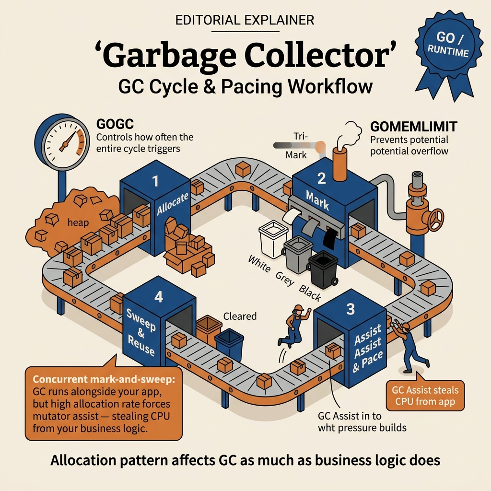

<!-- tags: golang -->
# 🗑️ Garbage Collector — GC Internals in Go

> Go’s GC is a **tri-color concurrent mark-and-sweep** — it runs **concurrently** with the application, prioritizing **low latency** over throughput. Understanding the GC is key to writing high-performance Go code.

📅 Created: 2026-03-19 · 🔄 Updated: 2026-04-19 · ⏱️ 8 min read

| Aspect             | Detail                                                |
| ------------------ | ----------------------------------------------------- |
| **Algorithm**      | Tri-color concurrent mark-and-sweep                   |
| **Latency target** | Sub-millisecond STW (Stop-The-World) pauses           |
| **Tuning knob**    | `GOGC` (default 100), `GOMEMLIMIT` (Go 1.19+)         |
| **Go version**     | Go 1.5+ (concurrent GC), Go 1.19+ (soft memory limit) |

---

## 1. DEFINE

> *Imagine deploying a Go service handling 50K req/s. Everything runs smoothly — until GC pause jumps from 1ms to 50ms every 2 seconds. CPU profile: 30% of time spent on GC. The problem lies in how you allocate memory — and the GC is the one who has to clean up.*

### What is GC?

**Garbage Collector** automatically frees memory that the program no longer uses. Go GC looks "automatic" — but there is a trap: `GOGC=off` without `GOMEMLIMIT` = OOM crash, and `sync.Pool` gets wiped every cycle if you do not understand its lifecycle. That trap will surface in PITFALLS. Go GC:

- **No need** for manual `free()` / `delete` like C/C++
- **Concurrent** — runs concurrently with application goroutines
- **Non-generational** — does not split heap into young/old gen (unlike Java/C#)
- **Non-compacting** — does not move objects after GC (simplifies unsafe.Pointer)

### Tri-color Mark-and-Sweep Algorithm

GC classifies all objects into **3 colors**:

| Color        | Meaning                                | Initially                     |
| ------------ | -------------------------------------- | ----------------------------- |
| **⚪ White** | Not scanned — may be garbage           | ALL objects                    |
| **🔘 Grey**  | Found but NOT YET scanned for references | Root objects (stack, globals) |
| **⚫ Black** | Fully scanned — confirmed reachable     | None                          |

### GC Cycle Phases

| Phase                     | Description                                                | STW?                        |
| ------------------------- | ---------------------------------------------------------- | --------------------------- |
| **1. Mark Setup**         | Enable write barrier, all goroutines must reach safe point | ✅ STW (very short, ~10-30µs) |
| **2. Concurrent Marking** | GC goroutines scan object graph concurrently with app      | ❌ Concurrent               |
| **3. Mark Termination**   | Re-scan roots, disable write barrier                       | ✅ STW (very short, ~10-30µs) |
| **4. Concurrent Sweep**   | Free white objects, return memory to the allocator         | ❌ Concurrent               |

### Write Barrier

During GC marking (phase 2), the app still runs and can **change pointers**. The **write barrier** is the mechanism ensuring GC does not miss reachable objects:

```text
// During marking, Go injects a write barrier on every pointer update:
obj.field = newPtr
// → writeBarrier marks newPtr so the GC does not miss it.
```

### GC Triggers

A GC cycle starts when:

1. **Heap growth** — heap doubles compared to after-GC size (controlled by `GOGC`)
2. **2 minutes idle** — forced GC if 2 minutes pass without a GC
3. **`runtime.GC()`** — explicit trigger (avoid in production)

### GOGC — GC Tuning Knob

```text
GOGC = 100 (default)
→ GC triggers when heap grows 100% over live heap after last GC

Example: live heap = 50MB
  GOGC=100 → trigger when heap = 100MB (50 + 50×100%)
  GOGC=200 → trigger when heap = 150MB (fewer GCs, more RAM usage)
  GOGC=50  → trigger when heap = 75MB  (more frequent GC, less RAM)
  GOGC=off → GC completely OFF (⚠️ memory leak if program runs long)
```

### GOMEMLIMIT (Go 1.19+)

**Soft memory limit** — caps total memory used by Go runtime:

```text
GOMEMLIMIT=1GiB
→ GC becomes more aggressive when approaching the limit
→ NOT a hard limit — can still temporarily exceed
→ Combined with GOGC=off → GC only runs when near limit (memory-efficient)
```

GOGC, GOMEMLIMIT, write barrier, tri-color — theory is covered. Now see how a GC cycle unfolds visually.

---

## 2. VISUAL

The primary visual of this article must answer a very practical question: where is the GC cycle consuming CPU and why allocation pressure can eat into app throughput.

### GC Cycle & Pacing



*Figure: This diagram compresses the entire article’s story into a single loop: allocate, mark, assist, sweep, then back to allocate under new heap pressure.*

### Supporting View: tri-color reasoning remains the foundation

```text
white  = object not yet proven reachable
grey   = object found but references not yet fully scanned
black  = object fully scanned, considered safe for the current cycle

The key point is not memorizing colors.
The key point is understanding why pointer-rich object graphs make marking more CPU-expensive.
```

*Figure: Tri-color is still worth remembering, but use it as a mental model to explain scan cost, not as trivia to memorize.*

Keeping these two visual layers side by side helps you read tuning code with better questions: where is allocation churn increasing GC work, and is the mutator being forced into too much assist.

---

## 3. CODE

You have seen the path of signals, requests, or goroutines in **Garbage Collector — GC Internals in Go**. Now move to code to verify which parts must be written tightly to avoid paying the price in production.

### Example 1: Basic — observe GC behavior

> **Goal**: Observe heap, GC cycle count, and the next trigger when the application creates and then frees many objects.
> **Approach**: Use `runtime.ReadMemStats`, create heap pressure, then call `runtime.GC()` to compare before/after.
> **Example**: Input is 100 allocations x 1MB; output is snapshot of `Alloc`, `NumGC`, `NextGC`.
> **Complexity**: Basic

```go
package main

import (
    "fmt"
    "runtime"
)

func main() {
    // ━━━━━━━━━━━━━━━━━━━━━━━━━━━━━━━━━━━━━━━━━━
    // Read GC statistics
    // ━━━━━━━━━━━━━━━━━━━━━━━━━━━━━━━━━━━━━━━━━━
    printGCStats("Initial")

// Mass allocations trigger garbage collection cycles rapidly.
    var data [][]byte
    for range 100 { // Go 1.22+
        data = append(data, make([]byte, 1<<20)) // 1MB chunks
    }
    printGCStats("After 100MB allocation")

// Free references → objects eligible for GC
    data = nil
    runtime.GC() // ✅ Force GC to see the freed heap in the next snapshot.
    printGCStats("After GC")

_ = data
}

func printGCStats(label string) {
    var stats runtime.MemStats
    runtime.ReadMemStats(&stats)
    fmt.Printf("=== %s ===\n", label)
    fmt.Printf("  Alloc:       %6d MB (allocated heap)\n", stats.Alloc/1024/1024)
    fmt.Printf("  TotalAlloc:  %6d MB (historical total)\n", stats.TotalAlloc/1024/1024)
    fmt.Printf("  Sys:         %6d MB (reserved memory)\n", stats.Sys/1024/1024)
    fmt.Printf("  NumGC:       %6d    (GC sweep cycles)\n", stats.NumGC)
    fmt.Printf("  GC CPU%%:     %6.2f%%\n", stats.GCCPUFraction*100)
    fmt.Printf("  HeapObjects: %6d\n", stats.HeapObjects)
    fmt.Printf("  NextGC:      %6d MB (trigger next GC)\n", stats.NextGC/1024/1024)
    fmt.Println()
}
```

This example helps readers see the GC as a system with concrete metrics, not a "black box". The caveat is that `runtime.GC()` should only be used for debug, benchmark, or diagnosis; production should not trigger it manually on a regular basis.

GC observation is covered. But when dense allocation creates GC pressure — `sync.Pool` is the solution to reduce pressure without tuning GOGC.

### Example 2: Intermediate — GC pressure and object pooling

> **Goal**: See clearly how dense allocation creates GC pressure and how `sync.Pool` reduces it.
> **Approach**: Compare two identical workloads, one continuously allocating new objects, the other reusing from pool.
> **Example**: Input is 1 million iterations; output is the difference in run time and GC cycle count.
> **Complexity**: Intermediate

```go
package main

import (
    "fmt"
    "runtime"
    "sync"
    "time"
)

// ━━━━━━━━━━━━━━━━━━━━━━━━━━━━━━━━━━━━━━━━━━
// Problem: Mass allocations create massive garbage collection pressure.
// Solution: Sync pools reuse objects reducing heap allocations.
// ━━━━━━━━━━━━━━━━━━━━━━━━━━━━━━━━━━━━━━━━━━

type Buffer struct {
    Data []byte
}

// ✅ sync.Pool — GC-aware object cache
var bufferPool = sync.Pool{
    New: func() interface{} {
        return &Buffer{Data: make([]byte, 0, 4096)}
    },
}

func withoutPool(iterations int) time.Duration {
    start := time.Now()
    for range iterations { // Go 1.22+
        buf := &Buffer{Data: make([]byte, 0, 4096)} // ❌ New allocation every iteration.
        buf.Data = append(buf.Data, "hello world"...)
        _ = buf
    }
    return time.Since(start)
}

func withPool(iterations int) time.Duration {
    start := time.Now()
    for range iterations { // Go 1.22+
        buf := bufferPool.Get().(*Buffer) // ✅ Reuse from pool — no heap allocation.
        buf.Data = buf.Data[:0]           // Reset length, keep underlying capacity.
        buf.Data = append(buf.Data, "hello world"...)
        bufferPool.Put(buf)               // ✅ Return to pool for next iteration.
    }
    return time.Since(start)
}

func main() {
    n := 1_000_000

d1 := withoutPool(n)
    var s1 runtime.MemStats
    runtime.ReadMemStats(&s1)

runtime.GC()

d2 := withPool(n)
    var s2 runtime.MemStats
    runtime.ReadMemStats(&s2)

fmt.Printf("Without Pool: %v (GC cycles: %d)\n", d1, s1.NumGC)
    fmt.Printf("With Pool:    %v (GC cycles: %d)\n", d2, s2.NumGC)
}
```

The takeaway from this example is that allocation patterns affect GC just as much as business logic. `sync.Pool` suits short-lived, high-reuse objects; do not use it as a long-term cache since GC can sweep the pool at any time.

sync.Pool reduces allocation pressure. But when you need to control GC frequency at the runtime level — GOGC and GOMEMLIMIT are more direct tools.

### Example 3: Advanced — GOGC and GOMEMLIMIT tuning

> **Goal**: Adjust GC frequency and soft memory limit based on throughput or footprint targets.
> **Approach**: Use `debug.SetGCPercent` and `debug.SetMemoryLimit` to observe how the runtime changes behavior as workload increases.
> **Example**: Input is a series of 10MB allocations; output is `Alloc`, `Sys`, `NumGC` per step.
> **Complexity**: Advanced

```go
package main

import (
    "fmt"
    "os"
    "runtime"
    "runtime/debug"
    "time"
)

func main() {
    // ━━━━━━━━━━━━━━━━━━━━━━━━━━━━━━━━━━━━━━━━━━
    // Tuning GC programmatically
    // ━━━━━━━━━━━━━━━━━━━━━━━━━━━━━━━━━━━━━━━━━━

// Method 1: GOGC environment variable
    // Higher GOGC = fewer GC cycles but more memory.
    fmt.Printf("GOGC env: %s\n", os.Getenv("GOGC"))

// Method 2: Programmatic GOGC
    oldGOGC := debug.SetGCPercent(200) // GOGC=200
    fmt.Printf("Old GOGC: %d, New GOGC: 200\n", oldGOGC)

// Method 3: GOMEMLIMIT (Go 1.19+)
    // Cap total Go runtime memory at 512 MiB.
    debug.SetMemoryLimit(512 << 20) // 512 MiB

// ━━━━━━━━━━━━━━━━━━━━━━━━━━━━━━━━━━━━━━━━━━
    // Production pattern: GOGC=off + GOMEMLIMIT
    // → GC only runs when heap approaches the soft limit.
    // → Fewer cycles, fewer STW pauses under sustained load.
    // ━━━━━━━━━━━━━━━━━━━━━━━━━━━━━━━━━━━━━━━━━━
    // debug.SetGCPercent(-1)           // GOGC=off
    // debug.SetMemoryLimit(1 << 30)    // 1 GiB limit

// Simulate workload
    var data [][]byte
    for range 50 { // Go 1.22+
        data = append(data, make([]byte, 10<<20)) // 10MB per allocation
        var stats runtime.MemStats
        runtime.ReadMemStats(&stats)
        fmt.Printf("  Alloc: %3dMB | Sys: %3dMB | NumGC: %d\n",
            stats.Alloc>>20, stats.Sys>>20, stats.NumGC)
        time.Sleep(50 * time.Millisecond)
    }
    _ = data
}
```

This example is valuable when you need to trade off RAM vs CPU/latency. Benchmark on real workloads before changing `GOGC`; a config that looks good on a laptop can easily diverge from production.

GOGC/GOMEMLIMIT allow frequency adjustment. But when you need to understand where GC is spending time — `gctrace` is the indispensable observability layer.

### Example 4: Expert — GC trace analysis

> **Goal**: Read `gctrace` to understand where GC is spending time and how the heap goal changes.
> **Approach**: Run a workload that creates GC pressure, enable `GODEBUG=gctrace=1`, then map each field in the trace to runtime symptoms.
> **Example**: Input is 20 allocations of 10MB; output is trace log and final pause stats.
> **Complexity**: Expert

```go
package main

import (
    "fmt"
    "runtime"
    "time"
)

// ━━━━━━━━━━━━━━━━━━━━━━━━━━━━━━━━━━━━━━━━━━
// Execution trace profiling:
//
// Output format:
// gc 1 @0.012s 2%: 0.018+1.2+0.015 ms clock,
//                   0.072+0.34/1.0/0+0.060 ms cpu,
//                   4->4->1 MB,
//                   5 MB goal,
//                   4 P
//
// Trace breakdowns:
// gc 1          — GC cycle #1
// @0.012s       — seconds since program start
// 2%            — fraction of CPU spent on GC
// 0.018+1.2+0.015 — STW sweep term + concurrent mark + STW mark term (ms)
// 4->4->1 MB    — heap before mark → heap after mark → live heap
// 5 MB goal     — target heap size for the next GC trigger
// 4 P           — number of Ps (logical processors) used
// ━━━━━━━━━━━━━━━━━━━━━━━━━━━━━━━━━━━━━━━━━━

func main() {
    fmt.Println("Execution: GODEBUG=gctrace=1 go run main.go")
    fmt.Println()

// Simulates heavy heap allocation pressure.
    for range 20 { // Go 1.22+
        data := make([]byte, 10<<20) // 10MB
        _ = data
        time.Sleep(100 * time.Millisecond)
    }

// ━━━━━━━━━━━━━━━━━━━━━━━━━━━━━━━━━━━━━━━━━━
    // Helpful profiling execution flags:
    // ━━━━━━━━━━━━━━━━━━━━━━━━━━━━━━━━━━━━━━━━━━
    // GODEBUG=gctrace=1          — GC trace
    // GODEBUG=schedtrace=1000    — scheduler state every 1000ms
    // GODEBUG=allocfreetrace=1   — log every allocation and free
    // GODEBUG=gcstoptheworld=1   — Force STW GC (debug only)
    // GODEBUG=madvdontneed=1     — Aggressive memory return to OS

var stats runtime.MemStats
    runtime.ReadMemStats(&stats)
    fmt.Printf("\nFinal stats:\n")
    fmt.Printf("  NumGC:      %d\n", stats.NumGC)
    fmt.Printf("  PauseTotal: %v\n", time.Duration(stats.PauseTotalNs))
    fmt.Printf("  LastPause:  %v\n", time.Duration(stats.PauseNs[(stats.NumGC+255)%256]))
}
```

The expert takeaway is that tuning GC cannot be separated from observability. When you have `gctrace`, `MemStats`, and benchmarks together, you finally have enough context to decide whether to increase `GOGC`, lower the memory limit, or cut allocations.

You now know observe, pooling, tuning, and trace. Now comes the dangerous part: GOGC=off without GOMEMLIMIT and sync.Pool being wiped by GC — the trap set up from the beginning of this article.

---

## 4. PITFALLS

The correct mechanism of **Garbage Collector — GC Internals in Go** is established. The traps below are where people skew timing, ownership, or evidence and only realize it when the incident has already exploded.

| # | Severity | Defect | Consequence | Fix |
| --- | --- | --- | --- | --- |
| 1 | 🔴 Fatal | **GOGC=off without GOMEMLIMIT** | OOM crash — heap grows without bound | Always pair `GOGC=off` with `GOMEMLIMIT` |
| 2 | 🔴 Fatal | **Retaining large slice references** | GC cannot free the backing array | Set slice to `nil` after processing |
| 3 | 🟡 Common | **Allocating per-request in hot loops** | GC pressure spikes, tail latency rises | Pre-allocate or use `sync.Pool` |
| 4 | 🟡 Common | **Using finalizers instead of `defer`** | Finalizer timing is non-deterministic | Use explicit `Close()` / `defer` |
| 5 | 🟡 Common | **Repeated `string([]byte)` in loops** | Each conversion copies the buffer | Convert once, reuse the result |
| 6 | 🔵 Minor | **Calling `runtime.GC()` in production** | Forces a full STW cycle | Restrict to benchmarks and diagnostics |

### Allocation-free techniques

```text
// ❌ Allocates a new string on every call.
func toString(b []byte) string {
    return string(b) // copies the entire byte slice
}

// ✅ GOOD: pre-allocate buffer, reuse
var buf = make([]byte, 0, 1024)

// ✅ Reuse buffers from sync.Pool on hot paths.
var pool = sync.Pool{New: func() any { return new(bytes.Buffer) }}
```

You have covered observe, pooling, tuning, trace, and the GOGC/Pool/allocation traps. The resources below help go deeper.

---

## 5. REF

| Resource | Type | Link | Notes |
| --- | --- | --- | --- |
| Go GC Guide | Official docs | [tip.golang.org/doc/gc-guide](https://tip.golang.org/doc/gc-guide) | Comprehensive GC tuning guide |
| Getting to Go: GC Journey | Core team blog | [go.dev/blog/ismmkeynote](https://go.dev/blog/ismmkeynote) | GC design history from 1.5→1.12 |
| `runtime` package | Official docs | [pkg.go.dev/runtime](https://pkg.go.dev/runtime) | MemStats, GC(), NumGoroutine |
| `runtime/debug` package | Official docs | [pkg.go.dev/runtime/debug](https://pkg.go.dev/runtime/debug) | SetGCPercent, SetMemoryLimit |
| GOMEMLIMIT proposal | Proposal | [github.com/golang/go/issues/48409](https://github.com/golang/go/issues/48409) | Rationale for soft memory limit |

---

## 6. RECOMMEND

You now have enough context from **Garbage Collector — GC Internals in Go** to continue with intention. The directions below help extend to the right tooling, runtime, or related pattern layer.

| Extension | When | Rationale | File/Link |
| --- | --- | --- | --- |
| **05 — Performance & pprof** | When you need to find allocation hotspots before tuning | Measure heap pressure with evidence instead of guessing | [05-performance-pprof.md](./05-performance-pprof.md) |
| **07 — Deep pprof and trace workflow** | When reading `gctrace`, trace, and runtime timeline together | Connect GC symptoms with deeper investigation workflow | [07-deep-pprof-and-trace-workflow.md](./07-deep-pprof-and-trace-workflow.md) |
| **02 — Runtime Scheduler** | When CPU pressure may come from both GC assist and scheduling | Distinguish heap issues from execution issues | [02-runtime-scheduler.md](./02-runtime-scheduler.md) |
| **08 — Benchmark strategy and benchstat** | When validating tuning before/after | Avoid premature conclusions from benchmark noise | [08-benchmark-strategy-and-benchstat.md](./08-benchmark-strategy-and-benchstat.md) |
| **09 — Goroutine leak detection & containment** | When heap grows because leaked goroutines hold references | Do not confuse leak retention with "poor" GC | [09-goroutine-leak-detection-and-containment.md](./09-goroutine-leak-detection-and-containment.md) |

---

**Navigation**: [← README](./README.md) · [→ Runtime & Scheduler](./02-runtime-scheduler.md)
