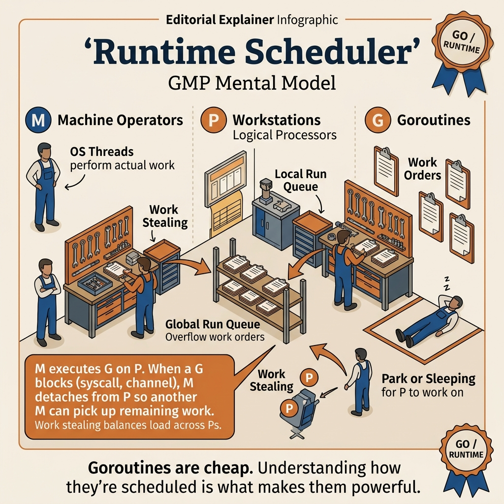

<!-- tags: golang, modules -->
# ⚙️ Go Runtime & Scheduler — GMP Model

> Go runtime manages goroutines through the **GMP model** (Goroutine-Machine-Processor). Understanding the scheduler is key to writing efficient concurrent code and debugging performance issues.

📅 Created: 2026-03-19 · 🔄 Updated: 2026-04-19 · ⏱️ 7 min read

| Aspect         | Detail                                              |
| -------------- | --------------------------------------------------- |
| **Model**      | GMP — Goroutine, Machine (OS Thread), Processor     |
| **Scheduling** | Cooperative + preemptive (Go 1.14+)                 |
| **Stack**      | Growable stacks — starts ~2-8KB, grows up to 1GB      |
| **GOMAXPROCS** | Number of P (logical processors) — default = num CPU cores |

---

## 1. DEFINE

Your service handles 10K concurrent WebSocket connections. Throughput plateaus even though CPU usage sits at 40%. pprof shows goroutines piling up in `runqueue` while two Ps sit idle. The problem is not CPU — the problem is that the scheduler cannot distribute Gs evenly because a long-running CGo call is pinning an M.

> *The scheduler is invisible when it works. When it fails, every symptom looks like "the system is slow" — and no profiler will explain it until you understand GMP.*

### GMP Model

Go scheduler uses **M:N threading** — mapping M goroutines onto N OS threads via P processors. But there is a trap: `LockOSThread` without `UnlockOSThread` = thread leak, and `GOMAXPROCS=1` with a CPU-bound workload = zero parallelism with throughput in free fall. That trap will surface in PITFALLS.

| Component         | Meaning                                | Count                              |
| ----------------- | -------------------------------------- | ---------------------------------- |
| **G** (Goroutine) | Lightweight user-space thread          | Millions — very light (~2KB stack) |
| **M** (Machine)   | Real OS thread                         | Hundreds — managed by OS          |
| **P** (Processor) | Logical processor — scheduling context | `GOMAXPROCS` (default = CPU cores) |

### G-M-P Relationship

```text
G must be attached to a P to run.
P must be attached to an M to execute on CPU.
Each P has 1 local run queue containing Gs ready to run.
There is also 1 global run queue.
```

### Goroutine States

| State        | Description                      | Transition                            |
| ------------ | -------------------------------- | ------------------------------------- |
| **Runnable** | Ready, waiting for P to schedule | → Running (when P picks)              |
| **Running**  | Currently running on M+P         | → Runnable (preempt), → Waiting (I/O) |
| **Waiting**  | Blocked on channel/syscall/timer | → Runnable (when event ready)         |
| **Dead**     | Finished execution               | → Free (recycled)                     |

### Preemptive Scheduling (Go 1.14+)

Before 1.14: **cooperative** — goroutines only yield at function calls → tight loop = starve other goroutines.

From Go 1.14: **asynchronous preemption** — runtime uses **OS signals** (SIGURG) to preempt goroutines at any point (safe points). Even goroutines running tight loops get preempted.

### Work Stealing

When P runs out of goroutines in its local queue:

1. Check **global run queue**
2. **Steal** goroutines from another P (take half the queue)
3. Check **network poller** (epoll/kqueue)
4. If nothing found → M parks (sleeps)

### Syscall Handling — Hand-off

When a goroutine calls a blocking syscall:

1. M gets blocked on the syscall
2. P **detaches** from M (hand-off)
3. P takes another M (or creates a new one) to continue running other goroutines
4. When the syscall returns → G goes back to run queue, the old M may park

### Growable Stacks

```text
Go goroutine stack:
- Initial: 2-8 KB (tiny! OS thread = 1-8 MB)
- Grow: runtime detects overflow in function prologues and allocates a larger stack.
- Shrink: GC halves unused stacks to reclaim memory.
```

GMP, work stealing, syscall hand-off, growable stacks — theory is covered. Now see what the scheduler looks like visually.

---
## 2. VISUAL

The goal of the visual in this article is not to draw many boxes. It is to lock a mental model strong enough to explain why goroutines can be very cheap yet still not "free".

### M, P, G Mental Model



*Figure: This diagram assigns GMP to the right job for each actor: goroutine is logical work, P is the scheduling token, M is the OS thread, and work stealing is how the runtime keeps Ps busy without you building a load balancer.*

### Supporting View: what a blocking syscall does to the scheduler

```text
Before blocking syscall:
P0 -> M0 runs G1, local queue still has G2 G3

During blocking syscall:
M0 may stay blocked
P0 is detached and can run G2 on another M

After return:
G1 is re-queued or resumed when a P is available
```

*Figure: Syscall hand-off is where many people start finding GMP "confusing", but viewing it through P and M ownership makes it much easier.*

Keeping this mental model in mind before opening pprof or trace helps you read scheduler symptoms through the correct mechanism layer instead of blaming everything on "too many goroutines".

---

## 3. CODE

The visual of **Go Runtime & Scheduler — GMP Model** gives you the big picture. Code is where decisions about cancellation, ownership, or sequencing become real behavior.

### Example 1: Basic — observe scheduler behavior

> **Goal**: Directly observe goroutine count and the impact of `GOMAXPROCS` in a simple workload.
> **Approach**: Spawn many short-sleeping goroutines, measure `NumGoroutine()` before, during, and after the workload.
> **Example**: Input is 10,000 goroutines; output is peak goroutine count and remaining count after `Wait()`.
> **Complexity**: Basic

```go
package main

import (
    "fmt"
    "runtime"
    "sync"
    "time"
)

func main() {
    fmt.Printf("GOMAXPROCS: %d\n", runtime.GOMAXPROCS(0))
    fmt.Printf("NumCPU:     %d\n", runtime.NumCPU())
    fmt.Printf("NumGoroutine (start): %d\n", runtime.NumGoroutine())

var wg sync.WaitGroup
    n := 10000

wg.Add(n)
    for i := range n { // Go 1.22+
        go func(id int) {
            defer wg.Done()
            // Simulate work
            time.Sleep(10 * time.Millisecond)
        }(i)
    }

// ✅ Check peak goroutine count.
    fmt.Printf("NumGoroutine (peak):  %d\n", runtime.NumGoroutine())

wg.Wait()
    fmt.Printf("NumGoroutine (done):  %d\n", runtime.NumGoroutine())
}
```

This example helps readers see that many goroutines does not mean many OS threads. It is suitable for building a foundational mental model before moving into tuning or tracing.

Scheduler observation is covered. But when you need to measure the actual impact of GOMAXPROCS on throughput — CPU-bound benchmarking is the only accurate way.

### Example 2: Intermediate — GOMAXPROCS tuning

> **Goal**: Understand how `GOMAXPROCS` affects CPU-bound workloads.
> **Approach**: Run the same CPU task with multiple `GOMAXPROCS` values and compare completion times.
> **Example**: Input is worker count and processor count; output is the corresponding duration.
> **Complexity**: Intermediate

```go
package main

import (
    "fmt"
    "runtime"
    "sync"
    "time"
)

// ━━━━━━━━━━━━━━━━━━━━━━━━━━━━━━━━━━━━━━━━━━
// CPU-bound workload
// ━━━━━━━━━━━━━━━━━━━━━━━━━━━━━━━━━━━━━━━━━━
func cpuWork(iterations int) int {
    sum := 0
    for i := range iterations { // Go 1.22+
        sum += i * i
    }
    return sum
}

func benchmark(procs int, workers int) time.Duration {
    old := runtime.GOMAXPROCS(procs)
    defer runtime.GOMAXPROCS(old)

var wg sync.WaitGroup
    start := time.Now()

wg.Add(workers)
    for range workers { // Go 1.22+
        go func() {
            defer wg.Done()
            cpuWork(10_000_000)
        }()
    }
    wg.Wait()

return time.Since(start)
}

func main() {
    workers := runtime.NumCPU()

for _, procs := range []int{1, 2, 4, runtime.NumCPU()} {
        d := benchmark(procs, workers)
        fmt.Printf("GOMAXPROCS=%d, Workers=%d → %v\n", procs, workers, d)
    }
    // GOMAXPROCS=1 : all goroutines run on a single P — no parallelism.
    // GOMAXPROCS=N : up to N goroutines run truly in parallel on N cores.
}
```

The takeaway from this example is that `GOMAXPROCS` is the knob for real parallelism, not just "the number of goroutines allowed to run". Tune with specific CPU-bound benchmarks, not by feel.

GOMAXPROCS tells you parallelism. But when you need to understand how the scheduler distributes goroutines — `schedtrace` is the indispensable observability layer.

### Example 3: Advanced — scheduler trace and debugging

> **Goal**: Read `schedtrace` to see local/global run queues and the number of OS threads the runtime holds.
> **Approach**: Create a time-varying load, enable `GODEBUG=schedtrace=1000`, then cross-reference logs with goroutine spawn counts.
> **Example**: Input is 5 incrementally increasing load waves; output is trace of `idleprocs`, `threads`, `runqueue`.
> **Complexity**: Advanced

```go
package main

import (
    "fmt"
    "runtime"
    "time"
)

// ━━━━━━━━━━━━━━━━━━━━━━━━━━━━━━━━━━━━━━━━━━
// Execution flags:
// GODEBUG=schedtrace=1000 go run main.go
//
// Output (every 1000ms logs):
// SCHED 1004ms: gomaxprocs=8 idleprocs=6 threads=10
//   runqueue=0 [2 0 0 0 0 0 0 0]
//
// Explanation logs:
// gomaxprocs=8   — 8 Ps
// idleprocs=6    — 6 Ps with no runnable G
// threads=10     — 10 OS threads created so far
// runqueue=0     — global run queue: 0 goroutines
// [2 0 0 ...]    — per-P local run queue counts
// ━━━━━━━━━━━━━━━━━━━━━━━━━━━━━━━━━━━━━━━━━━

func main() {
    fmt.Println("Run: GODEBUG=schedtrace=1000 go run main.go")
    fmt.Println()

// Create varying load
    for i := range 5 { // Go 1.22+
        n := (i + 1) * 100
        for range n { // Go 1.22+
            go func() {
                time.Sleep(time.Duration(i+1) * time.Second)
            }()
        }
        fmt.Printf("Spawned %d goroutines (total: %d)\n", n, runtime.NumGoroutine())
        time.Sleep(1 * time.Second)
    }

time.Sleep(6 * time.Second)
    fmt.Printf("Final goroutines: %d\n", runtime.NumGoroutine())
}
```

This example is valuable for incidents involving latency spikes, goroutine backlogs, or thread explosions. `schedtrace` is very useful, but only truly illuminating when read alongside CPU metrics and block/mutex profiles.

schedtrace gives a from-runtime view. But when you need to pin a goroutine to a specific OS thread (CGo, GUI, TLS) — `LockOSThread` is a powerful and expensive command.

### Example 4: Expert — `runtime.LockOSThread` and goroutine-local constraints

> **Goal**: Understand when to pin a goroutine to a specific OS thread and the trade-offs of that decision.
> **Approach**: Compare a goroutine with `LockOSThread` against a normal goroutine using `runtime.Gosched()`.
> **Example**: Input is two goroutines both yielding multiple times; output is different scheduling behavior.
> **Complexity**: Expert

```go
package main

import (
    "fmt"
    "runtime"
    "sync"
)

// ━━━━━━━━━━━━━━━━━━━━━━━━━━━━━━━━━━━━━━━━━━
// LockOSThread: Affinitizes goroutines targeting specific OS threads directly.
//
// - CGo calls require the same OS thread throughout the call.
// - Some syscalls depend on thread-local state.
// - Thread-local storage (TLS)
// ━━━━━━━━━━━━━━━━━━━━━━━━━━━━━━━━━━━━━━━━━━

func main() {
    var wg sync.WaitGroup
    wg.Add(2)

go func() {
        defer wg.Done()
        runtime.LockOSThread()   // ✅ Lock to current OS thread
        defer runtime.UnlockOSThread()

// This goroutine stays on the same OS thread across yields.
        for i := range 5 { // Go 1.22+
            fmt.Printf("[Locked] Goroutine on thread (iteration %d)\n", i)
            runtime.Gosched() // Yield CPU but keep the same M.
        }
    }()

go func() {
        defer wg.Done()
        // Normal goroutines may run on different Ms across yields.
        for i := range 5 { // Go 1.22+
            fmt.Printf("[Normal] Goroutine (iteration %d)\n", i)
            runtime.Gosched()
        }
    }()

wg.Wait()
}
```

The expert takeaway is that Go’s scheduler is very flexible, but `LockOSThread` is powerful and expensive. Use it only for CGo, GUI, thread-local state, or special syscalls; do not turn it into a workaround for race bugs or weak design.

You now know observe, GOMAXPROCS, schedtrace, and LockOSThread. Now comes the dangerous part: thread leak and goroutine leak — the trap set up from the beginning of this article.

---

## 4. PITFALLS

From this point, with **Go Runtime & Scheduler — GMP Model**, the focus is no longer making it work, but avoiding patterns that seem fine but silently create operational debt.

| # | Severity | Defect | Consequence | Fix |
| --- | --- | --- | --- | --- |
| 1 | 🔴 Fatal | **Goroutine leak** (millions leaked goroutines) | Memory exhaustion, OOM kill | Monitor `runtime.NumGoroutine()`, use context cancellation |
| 2 | 🔴 Fatal | **Too many goroutines blocked on syscall** | OS thread exhaustion → program hang | Use async I/O, limit concurrent syscalls |
| 3 | 🔴 Fatal | **LockOSThread without Unlock** | Thread leak → resource exhaustion | Always `defer UnlockOSThread()` |
| 4 | 🟡 Common | **GOMAXPROCS=1 for CPU-bound** | No parallelism, low throughput | Set GOMAXPROCS = NumCPU (default) |
| 5 | 🟡 Common | **runtime.Gosched() for synchronization** | Race conditions still exist | Use channels/mutexes |
| 6 | 🔵 Minor | **Tight loop without yield** (pre-1.14) | Starve other goroutines | Go 1.14+ has async preemption, no longer an issue |

You have covered observe, tuning, trace, LockOSThread, and the leak/thread/Gosched traps. The resources below help go deeper.

---

## 5. REF

| Resource | Type | Link | Notes |
| --- | --- | --- | --- |
| Go Scheduler Design | Design doc | [docs.google.com/document/d/1TTj4T2JO42uD5ID9e89oa0sLKhJYD0Y_kqxDv3I3XMw](https://docs.google.com/document/d/1TTj4T2JO42uD5ID9e89oa0sLKhJYD0Y_kqxDv3I3XMw) | Original GMP design document |
| Inside Go Scheduler | Engineering blog | [morsmachine.dk/go-scheduler](https://morsmachine.dk/go-scheduler) | Visual explanation of GMP model |
| Async Preemption Proposal | Proposal | [github.com/golang/proposal](https://github.com/golang/proposal/blob/master/design/24543-non-cooperative-preemption.md) | Go 1.14 preemption design |
| `runtime` package docs | Official docs | [pkg.go.dev/runtime](https://pkg.go.dev/runtime) | GOMAXPROCS, NumGoroutine, LockOSThread |

---

## 6. RECOMMEND

The most important point of **Go Runtime & Scheduler — GMP Model** is clear. The extension below is for when you need to turn this understanding into a more complete investigation or operational workflow.

| Extension | When | Rationale | File/Link |
| --- | --- | --- | --- |
| **01 — Garbage Collector** | When CPU pressure may come from both GC assist and scheduling | Separate heap pressure from run queue pressure | [01-garbage-collector.md](./01-garbage-collector.md) |
| **03 — Memory Model** | When scheduling intuition is clear but visibility remains vague | Connect execution model with happens-before guarantees | [03-memory-model.md](./03-memory-model.md) |
| **05 — Performance & pprof** | When you want to know which goroutine is blocking where | Use goroutine/block profile to see real symptoms | [05-performance-pprof.md](./05-performance-pprof.md) |
| **07 — Deep pprof and trace workflow** | When a scheduler timeline on trace is needed | See work stealing, blocking, GC events on a measurable flow | [07-deep-pprof-and-trace-workflow.md](./07-deep-pprof-and-trace-workflow.md) |
| **01 — Goroutines & Channels** | When GMP still feels too abstract | Return to primitive lifecycle before going deep into runtime | [../concurrency/01-goroutines-and-channels.md](../concurrency/01-goroutines-and-channels.md) |

---

**Navigation**: [← GC](./01-garbage-collector.md) · [→ Memory Model](./03-memory-model.md)
