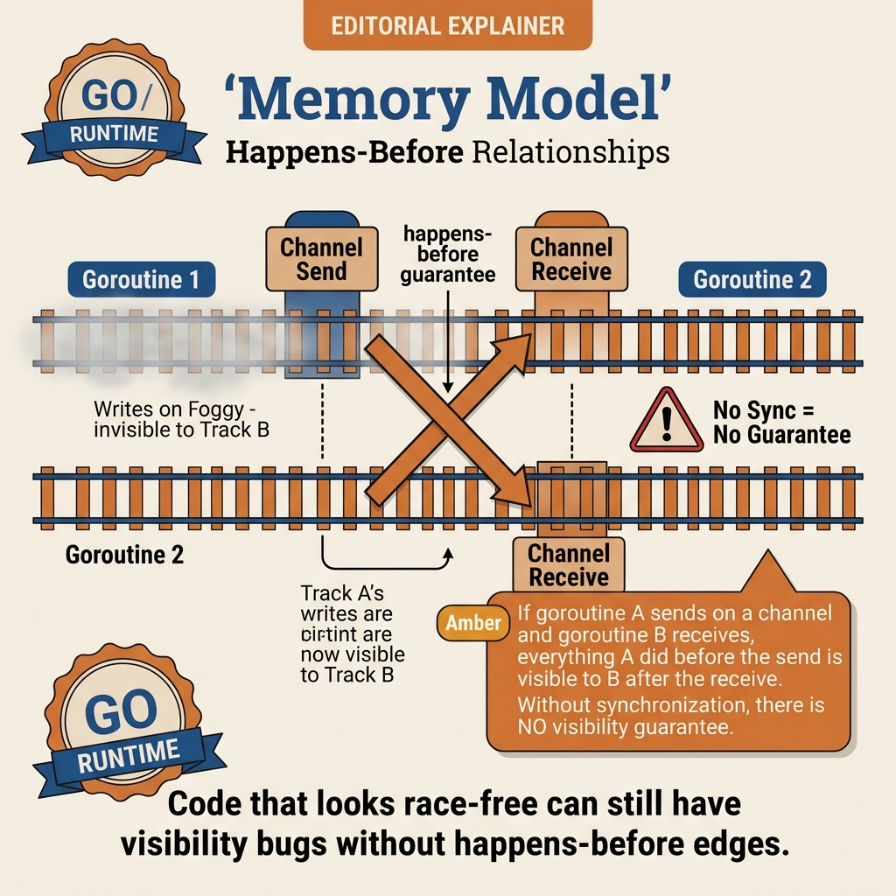

<!-- tags: golang, memory, modules -->
# 🧠 Go Memory Model — Happens-Before & Data Races

> Go Memory Model defines the **conditions** under which a **read** in one goroutine can **observe** a value **written** by another goroutine. Misunderstand it → data race → undefined behavior.

📅 Created: 2026-03-19 · 🔄 Updated: 2026-04-19 · ⏱️ 6 min read

| Aspect           | Detail                                                |                      |
| ---------------- | ----------------------------------------------------- | -------------------- |
| **Core concept** | Happens-before relationship                           | |
| **Detection**    | `go run -race`, `go test -race`                       | |
| **Guarantee**    | Synchronization primitives establish happens-before   | |
| **Danger**       | Data race = undefined behavior (NOT just wrong value) | |

---

## 1. DEFINE

Your integration test passes 99 out of 100 runs. On the 100th, a goroutine reads a config field that another goroutine just wrote — and gets the old value. The test is not flaky. The code has a data race: two goroutines access the same variable without synchronization, and Go’s memory model says the result is **undefined behavior** — not “wrong value”, but literally anything can happen.

> *If you cannot point to the happens-before edge between a write and a read, the read has no guarantee — even if it "works" today.*

### Happens-Before

If event **A happens-before event B**, then A’s effects are **guaranteed visible** at B. But there is a trap: data race without `-race` = silent corruption with no error reporting, and homegrown double-checked locking = broken even if it looks correct. That trap will surface in PITFALLS.

```text
A HB B  ⟹  B sees all writes that A has performed
```

### Happens-Before Rules in Go

| Rule                   | A (before)               | B (after)                  |
| ---------------------- | ------------------------ | ------------------------- |
| **Goroutine creation** | `go f()` statement       | `f()` begins execution    |
| **Channel send**       | `ch <- v` completes      | `v := <-ch` begins        |
| **Channel close**      | `close(ch)`              | `<-ch` returns zero value |
| **Unbuffered channel** | receive `<-ch` completes | send `ch <- v` completes  |
| **Mutex lock**         | `mu.Unlock()`            | next `mu.Lock()` returns  |
| **sync.Once**          | `once.Do(f)` — f returns | next `once.Do(g)` returns |
| **sync.WaitGroup**     | `wg.Done()`              | `wg.Wait()` returns       |

### Data Race = Undefined Behavior

A **data race** occurs when 2 goroutines access the same variable, at least 1 is a write, and **there is no synchronization**.

```text
// ❌ DATA RACE — undefined behavior!
var x int
go func() { x = 1 }()      // write
fmt.Println(x)               // read — no sync!

// ✅ NO RACE — channel provides happens-before
var x int
ch := make(chan struct{})
go func() { x = 1; ch <- struct{}{} }()
<-ch
fmt.Println(x) // guaranteed to see 1
```

### Race Detector

Go has a built-in race detector (based on ThreadSanitizer):

```bash
go run -race main.go      # detect races at runtime
go test -race ./...       # run all tests with race detector
go build -race -o app     # build instrumented binary
```

⚠️ Race detector only detects **runtime races** (not static analysis) → run tests multiple times to increase coverage.

Happens-before, synchronization rules, race detection — theory is covered. Now see what happens-before looks like visually.

---
## 2. VISUAL

The visual section of this article must enforce an uncomfortable truth: "works correctly on my machine" does not mean there is a visibility guarantee under the memory model.

### No Happens-Before vs Synchronized Visibility



*Figure: This diagram compresses the entire article into one critical contrast: with a synchronization edge, the reader has the right to trust the state; without an edge, every "stable" result is just luck.*

### Supporting View: channel is also a visibility boundary

```text
G1: x = 1
G1: ch <- done

HB edge exists here

G2: <-ch
G2: read x // now visibility is guaranteed
```

*Figure: Channel does not just carry data. It also creates a happens-before edge when send/receive is used as a synchronization event.*

If you keep these two visuals in mind, you will write less code like "sleep 10ms then probably see the new state".

---

## 3. CODE

The flow of **Go Memory Model — Happens-Before & Data Races** is now visible. Now lower it into code to see what constraints make this mechanism hold, not just intuition.

### Example 1: Basic — data race detection

> **Goal**: See firsthand what a data race looks like and why `-race` is more trustworthy than visual guessing.
> **Approach**: Create an incorrect concurrent increment, then fix the same example with mutex for comparison.
> **Example**: Input is 1000 goroutines incrementing one variable; output is wrong result with race and correct with mutex.
> **Complexity**: Basic

```go
package main

import (
    "fmt"
    "sync"
)

// ━━━━━━━━━━━━━━━━━━━━━━━━━━━━━━━━━━━━━━━━━━
// Execution: go run -race main.go
// ━━━━━━━━━━━━━━━━━━━━━━━━━━━━━━━━━━━━━━━━━━

func main() {
    // ❌ DATA RACE — DON'T DO THIS
    var counter int
    var wg sync.WaitGroup

wg.Add(1000)
    for range 1000 { // Go 1.22+
        go func() {
            defer wg.Done()
            counter++ // ❌ Concurrent read+write without sync!
        }()
    }
    wg.Wait()
    fmt.Println("Counter (WRONG):", counter) // Result: random, NOT 1000

// ✅ FIX 1: Mutex
    var mu sync.Mutex
    counter = 0
    wg.Add(1000)
    for range 1000 { // Go 1.22+
        go func() {
            defer wg.Done()
            mu.Lock()
            counter++
            mu.Unlock()
        }()
    }
    wg.Wait()
    fmt.Println("Counter (Mutex):", counter) // ✅ Always 1000

// ✅ FIX 2: sync/atomic
    // var atomicCounter atomic.Int64
    // atomicCounter.Add(1) // lock-free, no mutex needed

// ✅ FIX 3: Channel
    // countCh := make(chan int, 1000)
    // Aggregate in single goroutine
}
```

This example achieves the most important point of the memory model: without synchronization, the result is not just "possibly wrong", but has no guarantee at all. The caveat is that `-race` only detects races on code paths that actually execute.

Race detection is covered. But when you only need to protect simple primitive state (counter, flag) — `sync/atomic` is lighter than mutex.

### Example 2: Intermediate — atomic operations

> **Goal**: Use `sync/atomic` for simple shared state without needing mutex.
> **Approach**: Compare atomic counter with `atomic.Value` to see two different use case groups.
> **Example**: Input is 1000 increments and a config reload; output is correct counter and consistent config snapshot.
> **Complexity**: Intermediate

```go
package main

import (
    "fmt"
    "sync"
    "sync/atomic"
)

func main() {
    // ━━━━━━━━━━━━━━━━━━━━━━━━━━━━━━━━━━━━━━━━━━
    // sync/atomic: lock-free concurrent access
    // Faster than Mutex for simple operations
    // ━━━━━━━━━━━━━━━━━━━━━━━━━━━━━━━━━━━━━━━━━━
    var counter atomic.Int64
    var wg sync.WaitGroup

wg.Add(1000)
    for range 1000 { // Go 1.22+
        go func() {
            defer wg.Done()
            counter.Add(1) // ✅ Atomic — no mutex needed
        }()
    }
    wg.Wait()
    fmt.Println("Atomic counter:", counter.Load()) // ✅ Always 1000

// ━━━━━━━━━━━━━━━━━━━━━━━━━━━━━━━━━━━━━━━━━━
    // atomic.Value — concurrent config reload
    // ━━━━━━━━━━━━━━━━━━━━━━━━━━━━━━━━━━━━━━━━━━
    type Config struct {
        MaxConns int
        Timeout  int
    }

var config atomic.Value
    config.Store(&Config{MaxConns: 100, Timeout: 30})

// Writer goroutine: reload config
    go func() {
        config.Store(&Config{MaxConns: 200, Timeout: 60})
    }()

// Reader goroutines: always see consistent config (not partial)
    cfg := config.Load().(*Config)
    fmt.Printf("Config: MaxConns=%d, Timeout=%d\n", cfg.MaxConns, cfg.Timeout)
}
```

This example shows atomic suits small, clear-semantics primitive state. It cannot replace mutex or channels for all complex coordination.

Atomic covers primitive state. But when you need to prove happens-before through ownership transfer — channel is the more Go-idiomatic tool.

### Example 3: Advanced — channel synchronization establishes happens-before

> **Goal**: Prove happens-before via channel instead of lock.
> **Approach**: One goroutine writes data then sends a signal via channel; the other goroutine only reads after receiving the signal.
> **Example**: Input is a shared config; output is a synchronized read that sees the new data.
> **Complexity**: Advanced

```go
package main

import "fmt"

type Settings struct {
	Mode string
}

func main() {
	ready := make(chan struct{})
	settings := Settings{Mode: "boot"}

go func() {
		settings.Mode = "ready"
		ready <- struct{}{}
	}()

<-ready
	fmt.Println("Mode:", settings.Mode) // ✅ Guaranteed to print "ready"
}
```

The takeaway from this example is that channels are not just for "passing data", but also for passing ordering guarantees. They are especially suitable when you want ownership and sequencing clearer than mutex.

Channel establishes happens-before. But when you need lazy init singleton with correct memory semantics — `sync.Once` is the only correct answer in Go.

### Example 4: Expert — `sync.Once` for lazy init with correct memory semantics

> **Goal**: Avoid broken double-checked locking when initializing singletons or lazy caches.
> **Approach**: Let `sync.Once` be the only primitive deciding init, instead of self-checking `nil` then locking.
> **Example**: Input is many goroutines calling `GetClient()`; output is a single instance published safely.
> **Complexity**: Expert

```go
package main

import (
	"fmt"
	"sync"
)

type Client struct {
	Name string
}

var (
	once   sync.Once
	client *Client
)

func GetClient() *Client {
	once.Do(func() {
		client = &Client{Name: "primary"}
	})
	return client
}

func main() {
	var wg sync.WaitGroup
	wg.Add(2)

go func() {
		defer wg.Done()
		fmt.Println(GetClient().Name)
	}()
	go func() {
		defer wg.Done()
		fmt.Println(GetClient().Name)
	}()

wg.Wait()
}
```

The expert takeaway is that the memory model is not just theory for channels and mutex; it determines init patterns in production code as well. `sync.Once` should be the default for lazy singletons, not homegrown "if nil then lock".

You now know race detection, atomic, channel sync, and sync.Once. Now comes the dangerous part: silent corruption and double-checked locking — the trap set up from the beginning of this article.

---

## 4. PITFALLS

Knowing the correct path of **Go Memory Model — Happens-Before & Data Races** is not enough. The part that costs teams the most lies in wrong assumptions that dashboards or demo code cannot speak for you.

| # | Severity | Defect | Consequence | Fix |
| --- | --- | --- | --- | --- |
| 1 | 🔴 Fatal | **Shared variable without sync** | Data race → undefined behavior, corrupt data | Channel, Mutex, or Atomic |
| 2 | 🔴 Fatal | **Map concurrent access** | Panic: concurrent map writes → crash | Use `sync.Map` or Mutex |
| 3 | 🔴 Fatal | **Double-checked locking** | Broken in Go — no volatile keyword | Use `sync.Once` |
| 4 | 🟡 Common | **Partial write visible** | Struct fields inconsistent between goroutines | Atomic store/load entire struct |
| 5 | 🔵 Minor | **Race detector overhead (~10x)** | Slow if enabled in production | Use only in dev/CI, enable in CI pipeline |

```text
// ❌ Double-checked locking — BROKEN in Go
var instance *Singleton
if instance == nil {        // race: read without sync
    mu.Lock()
    if instance == nil {
        instance = newSingleton() // race: write without sync visible
    }
    mu.Unlock()
}

// ✅ Correct way
var once sync.Once
var instance *Singleton
once.Do(func() { instance = newSingleton() })
```

You have covered race detection, atomic, channel, sync.Once, and the race/locking/overhead traps. The resources below help go deeper.

---

## 5. REF

| Resource | Type | Link | Notes |
| --- | --- | --- | --- |
| Go Memory Model | Official spec | [go.dev/ref/mem](https://go.dev/ref/mem) | Canonical happens-before rules |
| Race Detector | Official docs | [go.dev/doc/articles/race_detector](https://go.dev/doc/articles/race_detector) | ThreadSanitizer-based detection |
| `sync/atomic` docs | Official docs | [pkg.go.dev/sync/atomic](https://pkg.go.dev/sync/atomic) | atomic.Int64, atomic.Value, atomic.Pointer |

---

## 6. RECOMMEND

Having seen how **Go Memory Model — Happens-Before & Data Races** operates and where it breaks easily, the next step is to open the right related branch to dig deeper instead of optimizing blindly.

| Extension | When | Rationale | File/Link |
| --- | --- | --- | --- |
| **02 — Mutex & Race Condition** | When applying memory model to shared-state code | See how happens-before manifests as lock boundaries | [../concurrency/02-mutex-and-race-condition.md](../concurrency/02-mutex-and-race-condition.md) |
| **01 — Goroutines & Channels** | When synchronization edge goes through channel, not lock | Reinforce channel send/receive as visibility events | [../concurrency/01-goroutines-and-channels.md](../concurrency/01-goroutines-and-channels.md) |
| **02 — Runtime Scheduler** | When execution order and visibility are being confused | Separate scheduling intuition from memory ordering rules | [02-runtime-scheduler.md](./02-runtime-scheduler.md) |
| **05 — Performance & pprof** | When symptoms start appearing under real load | Keep correctness reasoning alongside measurement workflow | [05-performance-pprof.md](./05-performance-pprof.md) |

---

**Navigation**: [← Runtime & Scheduler](./02-runtime-scheduler.md) · [→ Go 1.24 Features](./04-go-124-features.md)
