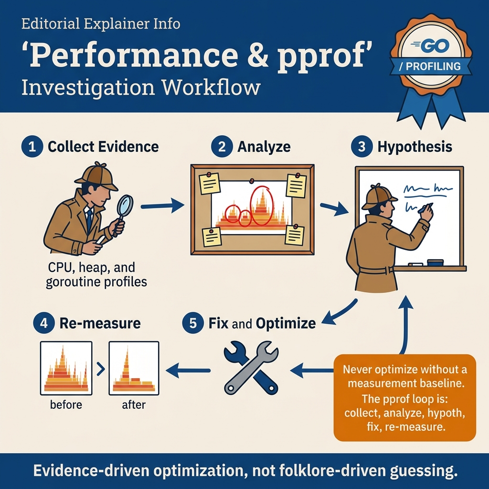

<!-- tags: golang -->
# 🔬 Performance Profiling — pprof, trace & Benchmarks

> Go has **powerful built-in profiling tools**: `pprof` (CPU, memory, goroutine), `trace` (execution tracing), and benchmarks. No 3rd-party tools needed.

📅 Created: 2026-03-19 · 🔄 Updated: 2026-04-19 · ⏱️ 6 min read

| Aspect       | Detail                                             |
| ------------ | -------------------------------------------------- | -------------------- |
| **Tools**    | `go tool pprof`, `go tool trace`, `go test -bench` | |
| **Profiles** | CPU, Heap, Goroutine, Block, Mutex, Threadcreate   | |
| **HTTP**     | `net/http/pprof` — production profiling endpoint   | |
| **Format**   | Protocol Buffers (pprof format)                    | |

---

## 1. DEFINE

Your API’s p99 latency jumped from 50ms to 200ms after a deploy. No feature changes, just a dependency bump. You open Grafana, see CPU at 60%, but the flamegraph shows 35% of CPU time inside `runtime.mallocgc`. The problem is not CPU — it is allocation pressure from a new serialization path. Without `pprof`, you would be guessing for hours.

> *pprof tells you where the time goes. Benchmarks tell you if a change helped. Together they replace intuition with evidence.*

### Profiling Types

| Profile       | Description             | When to use                        |
| ------------- | ----------------------- | ---------------------------------- |
| **CPU**       | Which func costs most CPU | Slow app, high CPU usage          |
| **Heap**      | Which objects cost most RAM | Memory leak, high GC pressure   |
| **Goroutine** | What goroutines are doing | Goroutine leak, deadlock          |
| **Block**     | Where goroutines block  | Contention on channel/mutex        |
| **Mutex**     | Mutex contention        | Lock contention issues             |
| **Allocs**    | Allocation hotspots     | GC pressure, allocation-heavy code |

### Benchmark framework

Go testing package has built-in benchmark support:

```text
func BenchmarkXxx(b *testing.B) {
    for b.Loop() { // Go 1.24+
        doWork()
    }
}
```

Profiler types, benchmark framework — theory is covered. But there is a trap: pprof on production without auth = exposed runtime internals, and inuse vs alloc confusion = misreading allocation patterns. That trap will surface in PITFALLS. Now see what the profiling workflow looks like visually.

---
## 2. VISUAL

This article has at least two visual jobs: the investigation loop and the before/after comparison. Keeping only one workflow diagram leaves readers without a sense of "what successful tuning looks like compared to baseline".

### Investigation Loop



*Figure: The first diagram enforces profiling as a scientific workflow: capture baseline, find hot path, change one variable, then measure again.*

### Before vs After


*Figure: The second diagram reminds that profiling does not end at "finding a nice flame graph". It ends at comparing baseline and tuned state on the same workload.*

Reading these two diagrams together helps you avoid two very common mistakes: optimizing before having a baseline, and declaring victory without re-measuring after a change.

---

## 3. CODE

You have seen the path of signal, request, or goroutine in **Performance Profiling — pprof, trace & Benchmarks**. Now it is time to move to code to verify which parts must be written tightly to avoid production paying the price.

### Example 1: Basic — HTTP pprof in production

> **Goal**: Quickly enable a profiling endpoint to capture CPU/heap/goroutine profiles from a running service.
> **Approach**: Import `net/http/pprof`, mount an HTTP server, then access `/debug/pprof/*`.
> **Example**: Input is a request workload to `/`; output is pprof endpoints accessible via `go tool pprof`.
> **Complexity**: Basic

```go
package main

import (
    "fmt"
    "log"
    "net/http"
    _ "net/http/pprof" // ✅ Import blank — registers /debug/pprof/*
    "time"
)

func heavyComputation() {
    data := make([]byte, 10<<20) // 10MB
    for i := range data {
        data[i] = byte(i % 256)
    }
    time.Sleep(10 * time.Millisecond)
}

func main() {
    // ✅ pprof endpoints available automatically:
    // /debug/pprof/           — index
    // /debug/pprof/profile    — CPU profile (30s default)
    // /debug/pprof/heap       — heap profile
    // /debug/pprof/goroutine  — goroutine stacks
    // /debug/pprof/block      — blocking profile
    // /debug/pprof/mutex      — mutex contention

http.HandleFunc("/", func(w http.ResponseWriter, r *http.Request) {
        heavyComputation()
        fmt.Fprintf(w, "Done!")
    })

fmt.Println("Server: http://localhost:6060")
    fmt.Println("pprof:  http://localhost:6060/debug/pprof/")
    log.Fatal(http.ListenAndServe(":6060", nil))
}

// ━━━━━━━━━━━━━━━━━━━━━━━━━━━━━━━━━━━━━━━━━━
// Post-execution terminal commands:
//
// CPU Profile (30 seconds):
// go tool pprof http://localhost:6060/debug/pprof/profile?seconds=30
//
// Heap Profile:
// go tool pprof http://localhost:6060/debug/pprof/heap
//
// Goroutine dump:
// go tool pprof http://localhost:6060/debug/pprof/goroutine
//
// Interactive commands in pprof:
// (pprof) top 10       ← top 10 heavy functions
// (pprof) list funcName ← show annotated source
// (pprof) web           ← open in browser (graphviz)
// (pprof) png > out.png ← export call graph
// ━━━━━━━━━━━━━━━━━━━━━━━━━━━━━━━━━━━━━━━━━━
```

This example achieves a very fast profiling entry point for a real service. The caveat is that production pprof must have auth or bind to a separate internal port; exposing it publicly leaks runtime data.

HTTP pprof covers live services. But when you need to capture profiles from batch jobs or benchmarks without HTTP — programmatic CPU profiling is the way.

### Example 2: Intermediate — programmatic CPU profile

> **Goal**: Capture CPU and heap profiles from a local workload or benchmark without needing an HTTP endpoint.
> **Approach**: Start/stop `pprof` via code, run the workload, then write artifacts to files.
> **Example**: Input is a sort workload; output is `cpu.prof` and `heap.prof`.
> **Complexity**: Intermediate

```go
package main

import (
    "fmt"
    "os"
    "runtime/pprof"
    "sort"
)

func main() {
    // ✅ CPU Profile → file
    f, _ := os.Create("cpu.prof")
    defer f.Close()
    pprof.StartCPUProfile(f)
    defer pprof.StopCPUProfile()

// Workload to profile
    data := make([]int, 1_000_000)
    for i := range data {
        data[i] = len(data) - i
    }
    sort.Ints(data) // ← profile this
    fmt.Println("Sorted", len(data), "items")

// ✅ Heap Profile
    heapFile, _ := os.Create("heap.prof")
    defer heapFile.Close()
    pprof.WriteHeapProfile(heapFile)

// Analyze:
    // go tool pprof -http=:8080 cpu.prof
// go tool pprof -http=:8080 heap.prof
}
```

The result is a profile artifact you can take for comparison or attach to an incident note. It is suitable for local diagnosis, batch jobs, and benchmark harnesses.

Programmatic profiling covers local. But when you need to verify an optimization hypothesis with data — benchmarks are the indispensable tool.

### Example 3: Advanced — benchmarks for optimization hypothesis

> **Goal**: Verify optimization with data instead of intuition.
> **Approach**: Write two implementations, benchmark both `ns/op` and `allocs/op`, then compare.
> **Example**: Input is `concatPlus` and `concatBuilder`; output is a benchmark report showing real differences.
> **Complexity**: Advanced

```go
package mylib

import (
    "strings"
    "testing"
)

// ━━━━━━━━━━━━━━━━━━━━━━━━━━━━━━━━━━━━━━━━━━
// go test -bench=. -benchmem -count=5
// ━━━━━━━━━━━━━━━━━━━━━━━━━━━━━━━━━━━━━━━━━━

func concatPlus(strs []string) string {
    result := ""
    for _, s := range strs {
        result += s // ❌ O(n²) — allocate new string each time
    }
    return result
}

func concatBuilder(strs []string) string {
    var b strings.Builder
    for _, s := range strs {
        b.WriteString(s) // ✅ O(n) — amortized append
    }
    return b.String()
}

func BenchmarkConcatPlus(b *testing.B) {
    strs := make([]string, 1000)
    for i := range strs {
        strs[i] = "hello"
    }
    b.ResetTimer()
    for b.Loop() { // Go 1.24+
        concatPlus(strs)
    }
}

func BenchmarkConcatBuilder(b *testing.B) {
    strs := make([]string, 1000)
    for i := range strs {
        strs[i] = "hello"
    }
    b.ResetTimer()
    for b.Loop() {
        concatBuilder(strs)
    }
}

// Output example:
// BenchmarkConcatPlus-8     1000    1500000 ns/op   5000000 B/op   999 allocs/op
// BenchmarkConcatBuilder-8  50000      3000 ns/op     16384 B/op     1 allocs/op
// → Builder: 500x faster, 1 alloc vs 999 allocs!
```

This example achieves the most important aspect of performance work: benchmark the hypothesis before refactoring. Run multiple times with `-count` and add `benchstat` when comparing before/after.

Benchmarks tell you "is there a regression". But when you need to know where the regression comes from — connecting benchmarks with pprof is the expert workflow.

### Example 4: Expert — connecting benchmark and profile to find root cause

> **Goal**: Not just know which implementation is slower, but also know why it is slow.
> **Approach**: Run the benchmark while simultaneously capturing a CPU profile for that benchmark.
> **Example**: Input is a benchmark run via `go test`; output is benchmark numbers plus a `cpu.prof` artifact.
> **Complexity**: Expert

```bash
# benchmark_profile.sh — Run benchmark and capture a CPU profile for the hot path.
go test -run='^$' -bench=BenchmarkConcat -benchmem -cpuprofile cpu.prof ./...
go tool pprof -http=:8080 cpu.prof
```

```go
package mylib

import (
    "strings"
    "testing"
)

func concatPlus(strs []string) string {
    result := ""
    for _, s := range strs {
        result += s
    }
    return result
}

func concatBuilder(strs []string) string {
    var b strings.Builder
    for _, s := range strs {
        b.WriteString(s)
    }
    return b.String()
}

func BenchmarkConcatCompare(b *testing.B) {
	strs := make([]string, 1000)
	for i := range strs {
		strs[i] = "hello"
	}

b.Run("plus", func(b *testing.B) {
		for b.Loop() {
			_ = concatPlus(strs)
		}
	})

b.Run("builder", func(b *testing.B) {
		for b.Loop() {
			_ = concatBuilder(strs)
		}
	})
}
```

The expert takeaway is that benchmark and pprof should go together when optimizing non-trivial hot paths. Benchmarks say "is there a regression"; profiles say "where the regression comes from".

You now know HTTP pprof, programmatic profiling, benchmarks, and benchmark+profile. Now comes the dangerous part: auth leak and inuse/alloc confusion — the trap set up from the beginning of this article.

---

## 4. PITFALLS

The correct mechanism of **Performance Profiling — pprof, trace & Benchmarks** is established. The traps below are where people skew timing, ownership, or evidence and only realize it when the incident has exploded.

| # | Severity | Defect | Consequence | Fix |
| --- | --- | --- | --- | --- |
| 1 | 🔴 Fatal | **pprof on production without auth** | Exposed runtime internals, heap data, source code | Wrap with auth middleware, or separate internal port |
| 2 | 🟡 Common | **CPU profile too short** | Sample not representative enough | Default 30s — increase `?seconds=60` for real workloads |
| 3 | 🟡 Common | **Benchmark without reset timer** | Setup time included in benchmark, wrong numbers | `b.ResetTimer()` after setup code |
| 4 | 🟡 Common | **Compiler optimize away benchmark** | Fake 0 ns/op result | Use `b.Loop()` (Go 1.24+) or assign to global var |
| 5 | 🔵 Minor | **Heap profile: inuse vs alloc confusion** | Misread allocation pattern | `-inuse_space` (current) vs `-alloc_space` (total) |

You have covered HTTP pprof, programmatic, benchmark, benchmark+profile, and the auth/confusion traps. The resources below help go deeper.

---

## 5. REF

| Resource | Type | Link | Notes |
| --- | --- | --- | --- |
| Go Blog — Profiling | Core team blog | [go.dev/blog/pprof](https://go.dev/blog/pprof) | pprof workflow basics |
| `runtime/pprof` docs | Official docs | [pkg.go.dev/runtime/pprof](https://pkg.go.dev/runtime/pprof) | Programmatic profile API |
| `net/http/pprof` docs | Official docs | [pkg.go.dev/net/http/pprof](https://pkg.go.dev/net/http/pprof) | HTTP endpoint for production |
| Benchmark docs | Official docs | [pkg.go.dev/testing#hdr-Benchmarks](https://pkg.go.dev/testing#hdr-Benchmarks) | b.Loop, b.N, -benchmem |

---

## 6. RECOMMEND

You now have enough context from **Performance Profiling — pprof, trace & Benchmarks** to proceed intentionally. The directions below help expand to the right tooling, runtime, or pattern layer.

| Extension | When | Rationale | File/Link |
| --- | --- | --- | --- |
| **07 — Deep pprof and trace workflow** | When you need to see scheduler, GC, block, and goroutine timeline on the same trace | Expand from profile snapshot to runtime timeline | [07-deep-pprof-and-trace-workflow.md](./07-deep-pprof-and-trace-workflow.md) |
| **08 — Benchmark strategy and benchstat** | When you need to confirm improvements are statistically significant | Avoid optimizing on noise or single benchmark runs | [08-benchmark-strategy-and-benchstat.md](./08-benchmark-strategy-and-benchstat.md) |
| **01 — Garbage Collector** | When heap profile points to allocation pressure as primary symptom | Connect profiling results with actual GC mechanisms | [01-garbage-collector.md](./01-garbage-collector.md) |
| **09 — Goroutine leak detection & containment** | When goroutine/block profile shows leak or stuck workers | Move from profile symptom to containment workflow | [09-goroutine-leak-detection-and-containment.md](./09-goroutine-leak-detection-and-containment.md) |
| **03 — Context** | When profile shows leaked request-scoped work | Lock cancellation story before optimizing CPU/heap | [../concurrency/03-context.md](../concurrency/03-context.md) |

---

**Navigation**: [← Go 1.24 Features](./04-go-124-features.md) · [→ Generator Pattern](./06-generator.md)
