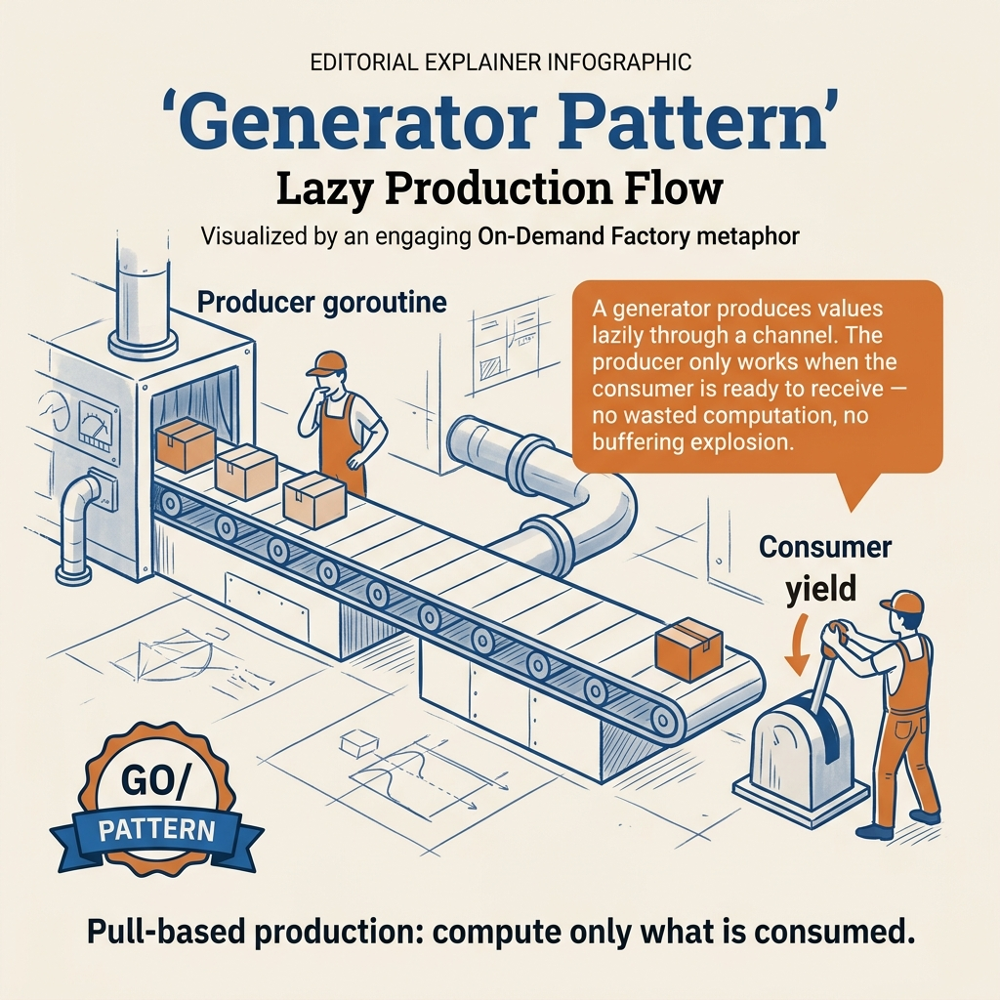

<!-- tags: golang, concurrency, goroutines -->
# ⚙️ Generator Pattern — Lazy Value Production with Goroutines & Channels

> The Generator pattern in Go uses goroutine + channel to **produce a sequence of values lazily** — similar to `yield` in Python/JS, but concurrent-safe and leveraging the power of CSP.

📅 Created: 2026-03-23 · 🔄 Updated: 2026-04-19 · ⏱️ 8 min read

| Aspect        | Detail                                                          |
| ------------- | --------------------------------------------------------------- |
| **Pattern**   | Concurrency / Producer pattern                                  |
| **Use case**  | Lazy evaluation, infinite sequences, data streaming             |
| **Go stdlib** | `goroutine`, `chan`, `context`, `iter` (Go 1.23+)               |
| **Compare**   | Python `yield`, JS `function*`, C# `IEnumerable`, Rx Observable |

---

## 1. DEFINE

You have a data pipeline that loads 10 million rows from a database, transforms each row, then writes results to S3. Loading all rows into a slice first means 10M × 2KB ≈ 20GB of heap — OOM before the first write. A generator produces one row at a time, the consumer processes and discards it, and heap stays at kilobytes.

> *Generators turn "load everything then process" into "produce one, consume one" — the difference between OOM and constant memory.*

### Definition

A **Generator** is a function that returns a channel, internally running a goroutine that continuously **produces values** and sends them through the channel. The caller **consumes** values via `range` or `<-ch`. But there is a trap: a generator without context = goroutine leak when caller stops early, and returning a bidirectional channel = consumer can close or send causing panic. That trap will surface in PITFALLS.

```text
Generator = Goroutine (producer) + Channel (delivery) + Lazy evaluation
```

### Generator vs other approaches

| Approach             | Eager/Lazy | Concurrent | Memory               | Cancelable |
| -------------------- | ---------- | ---------- | -------------------- | ---------- |
| **Slice return**     | Eager      | ❌         | O(n) — all in memory | N/A        |
| **Callback**         | Lazy       | ❌         | O(1)                 | Hard       |
| **Generator**        | Lazy       | ✅         | O(1)                 | ✅ context |
| **iter.Seq** (1.23+) | Lazy       | ❌         | O(1)                 | ✅ break   |

### When to use Generator?

| Scenario                      | Use Generator?  | Reason                                  |
| ----------------------------- | --------------- | --------------------------------------- |
| Infinite sequence (Fibonacci) | ✅              | Cannot allocate infinite slice          |
| Stream data from DB/API       | ✅              | Lazy fetch, natural backpressure        |
| Pipeline processing           | ✅              | Chain multiple stages through channels  |
| Light computation, few items   | ❌              | Goroutine + channel overhead not worth  |
| Need random access            | ❌              | Channel is sequential                   |

### Actors

```text
┌─────────────┐    chan T     ┌──────────────┐
│  Generator  │──────────────▶│   Consumer   │
│ (goroutine) │              │  (range/recv) │
└─────────────┘              └──────────────┘
      │                             │
      │ produce values              │ consume values
      │ close(ch) when done          │ range stops when channel closes
```

### Invariants

1. **Generator MUST close channel** when values are exhausted → consumer exits `range`
2. **Context cancellation** must be checked to avoid goroutine leak
3. **Channel buffer size** affects throughput — unbuffered = synchronous per item

Generator lifecycle, channel ownership, buffer size — theory is covered. Now see what the generator lifecycle looks like visually.

---
## 2. VISUAL

Generators are only elegant until the consumer stops early while the producer keeps running. The PNG below should be the primary visual because it locks down the lifecycle story.



*Figure: Lazy production is only worthwhile when the exit path is also lazy and clean; otherwise, the generator becomes a leak pattern disguised as elegance.*

### Generator Lifecycle

```text
    Generator()             Consumer
        │                      │
        ├── goroutine start    │
        │   │                  │
        │   ├── produce v1 ──▶ receive v1
        │   │                  │
        │   ├── produce v2 ──▶ receive v2
        │   │                  │
        │   ├── produce v3 ──▶ receive v3
        │   │                  │
        │   ├── close(ch) ──▶  range exits
        │   │                  │
        │   └── goroutine end  └── done
        │
        └── return ch
```

### Fan-Out / Fan-In with Generators

```text
                    ┌── Generator A ──┐
                    │                 │
  Input ───────────┼── Generator B ──┼──── Merge ────▶ Output
                    │                 │
                    └── Generator C ──┘

Fan-Out: 1 input → N generators (parallel)
  Fan-In:  N channels → 1 merged output
```

### Generator vs iter.Seq (Go 1.23+)

```text
  Classic Generator          iter.Seq (Push-based)
  ┌──────────────┐           ┌──────────────┐
  │  goroutine   │           │   function   │
  │  ch <- val   │           │  yield(val)  │
  │  close(ch)   │           │  return      │
  └──────┬───────┘           └──────┬───────┘
         │                          │
    chan T                     func(T) bool
         │                          │
  ┌──────▼───────┐           ┌──────▼───────┐
  │  range ch    │           │  range func  │
  │  (pull)      │           │  (push)      │
  └──────────────┘           └──────────────┘

✅ Concurrent               ✅ Zero overhead
  ✅ Backpressure             ✅ No goroutine leak risk
  ⚠️ Goroutine cost           ⚠️ Single-threaded
  ⚠️ Must close channel       ✅ Auto cleanup
```

The diagram gives an overview of generator lifecycle and pipeline composition. Now let us implement — starting from basic sequence, then context-aware, then pipeline fan-out/fan-in, then generic + iter.Seq.

---

## 3. CODE

You have seen the path of signal, request, or goroutine in **Generator Pattern — Lazy Value Production with Goroutines & Channels**. Now it is time to move to code to verify which parts must be written tightly to avoid production paying the price.

### Example 1: Basic — integer sequence generator

> **Goal**: Create a basic generator that returns a number sequence lazily.
> **Approach**: Producer runs in a separate goroutine, sends values through a receive-only channel and closes the channel when done.
> **Example**: Input is `start`, `end`; output is a stream `1,2,3...` and an infinite Fibonacci generator.
> **Complexity**: Basic

```go
package main

import "fmt"

// IntRange yields channels enumerating integers spanning ranges linearly.
// ✅ Pattern: function returns receive-only channel
func IntRange(start, end int) <-chan int {
	ch := make(chan int) // Unbuffered channels synchronize individual values sequentially.

go func() {
		defer close(ch) // ✅ Always close channels terminating background coroutines properly.
		for i := start; i <= end; i++ {
			ch <- i // produces subsequent outputs
		}
	}()

	return ch // returns immediately; goroutine produces in background
}

// Fibonacci returns an infinite stream of Fibonacci numbers.
// ⚠️ Consumer MUST break or cancel to avoid blocking forever.
func Fibonacci() <-chan int {
	ch := make(chan int)

go func() {
		defer close(ch)
		a, b := 0, 1
		for {
			ch <- a
			a, b = b, a+b
		}
	}()

return ch
}

func main() {
	// ✅ Finite generator: range exits when channel closes.
	fmt.Println("=== IntRange(1, 5) ===")
	for v := range IntRange(1, 5) {
		fmt.Printf("%d ", v)
	}
	fmt.Println()
	// Output: 1 2 3 4 5

// ✅ Infinite stream: consumer must break explicitly.
	fmt.Println("=== Fibonacci (first 10) ===")
	count := 0
	for v := range Fibonacci() {
		if count >= 10 {
			break // ⚠️ Without this break, the goroutine leaks.
		}
		fmt.Printf("%d ", v)
		count++
	}
	fmt.Println()
	// Output: 0 1 1 2 3 5 8 13 21 34
}
```

This basic pattern is well suited for understanding lazy production in Go. The caveat is that infinite generators without cancellation will leak if the consumer stops early.

Basic generator is covered. But a generator without context = goroutine leak — as the trap warned.

---

### Example 2: Intermediate — context-aware generator

> **Goal**: Give the generator a clear exit path when the consumer no longer needs data.
> **Approach**: Wrap the send path in `select` with `ctx.Done()` so the goroutine does not block forever.
> **Example**: Input is a Fibonacci stream and a random event stream; output is a stream that auto-terminates on timeout/cancel.
> **Complexity**: Intermediate

```go
package main

import (
	"context"
	"fmt"
	"math/rand/v2" // Go 1.22+
	"time"
)

// FibonacciCtx produces an infinite Fibonacci stream that exits on context cancellation.
// ✅ Context prevents goroutine leak when the consumer stops early.
func FibonacciCtx(ctx context.Context) <-chan int {
	ch := make(chan int)

go func() {
		defer close(ch)
		a, b := 0, 1
		for {
			select {
			case <-ctx.Done(): // ✅ Exit when context is cancelled
				return
			case ch <- a: // ✅ Send; blocks until consumer reads
				a, b = b, a+b
			}
		}
	}()

return ch
}

// RandomEvents simulates a continuous event stream with random delays.
// ✅ Useful for modeling WebSocket feeds or sensor data.
func RandomEvents(ctx context.Context, source string) <-chan string {
	ch := make(chan string, 5) // ✅ Buffer absorbs burst without blocking producer.

go func() {
		defer close(ch)
		eventID := 0
		for {
			// Simulate random event arrival
			delay := time.Duration(rand.IntN(100)) * time.Millisecond
			select {
			case <-ctx.Done():
				return
			case <-time.After(delay):
				eventID++
				event := fmt.Sprintf("[%s] event-%d (after %v)", source, eventID, delay)
				select {
				case <-ctx.Done():
					return
				case ch <- event: // produce event
				}
			}
		}
	}()

return ch
}

func main() {
	// ✅ Context-scoped: goroutine exits automatically on cancel.
	ctx, cancel := context.WithCancel(context.Background())

fmt.Println("=== Fibonacci with Context ===")
	count := 0
	for v := range FibonacciCtx(ctx) {
		fmt.Printf("%d ", v)
		count++
		if count >= 15 {
			cancel() // ✅ Signal the goroutine to stop.
			break
		}
	}
	fmt.Println()

// ✅ Timeout-bounded stream: exits after 500ms.
	fmt.Println("\n=== Random Events (500ms timeout) ===")
	ctx2, cancel2 := context.WithTimeout(context.Background(), 500*time.Millisecond)
	defer cancel2()

for event := range RandomEvents(ctx2, "sensor-1") {
		fmt.Println(event)
	}
	fmt.Println("Stream ended.")
}
```

The takeaway of this example is that `context.Context` is nearly mandatory for production generators. Without it, `break` at the consumer very easily leaves a goroutine hanging forever.

Context-aware generator covers single producer. But when you need to compose multiple stages in parallel — pipeline fan-out/fan-in is the next level.

---

### Example 3: Advanced — pipeline of generators + fan-out/fan-in

> **Goal**: Compose multiple stages to process data in parallel while keeping ownership and cancellation clear.
> **Approach**: Split the pipeline into source, filter, transform, fan-out workers, then fan-in merge results.
> **Example**: Input is the sequence `1..100`; output is a stream of squared prime numbers.
> **Complexity**: Advanced

```go
package main

import (
	"context"
	"fmt"
	"math"
	"sync"
)

// ━━━━━━━━━━━━━━━━━━━━━━━━━━━━━━━━━━━━━━━━━━━━━━━
// Stage 1: Source Generator — produce raw numbers
// ━━━━━━━━━━━━━━━━━━━━━━━━━━━━━━━━━━━━━━━━━━━━━━━━

func Numbers(ctx context.Context, start, end int) <-chan int {
	out := make(chan int)
	go func() {
		defer close(out)
		for i := start; i <= end; i++ {
			select {
			case <-ctx.Done():
				return
			case out <- i:
			}
		}
	}()
	return out
}

// ━━━━━━━━━━━━━━━━━━━━━━━━━━━━━━━━━━━━━━━━━━━━━━━━
// Stage 2: Filter — keep only prime numbers
// ━━━━━━━━━━━━━━━━━━━━━━━━━━━━━━━━━━━━━━━━━━━━━━━━

func FilterPrimes(ctx context.Context, in <-chan int) <-chan int {
	out := make(chan int)
	go func() {
		defer close(out)
		for n := range in {
			if isPrime(n) {
				select {
				case <-ctx.Done():
					return
				case out <- n:
				}
			}
		}
	}()
	return out
}

func isPrime(n int) bool {
	if n < 2 {
		return false
	}
	for i := 2; i <= int(math.Sqrt(float64(n))); i++ {
		if n%i == 0 {
			return false
		}
	}
	return true
}

// ━━━━━━━━━━━━━━━━━━━━━━━━━━━━━━━━━━━━━━━━━━━━━━━━
// Stage 3: Transform Generator — square each number
// ━━━━━━━━━━━━━━━━━━━━━━━━━━━━━━━━━━━━━━━━━━━━━━━━

func Square(ctx context.Context, in <-chan int) <-chan int {
	out := make(chan int)
	go func() {
		defer close(out)
		for n := range in {
			select {
			case <-ctx.Done():
				return
			case out <- n * n:
			}
		}
	}()
	return out
}

// ━━━━━━━━━━━━━━━━━━━━━━━━━━━━━━━━━━━━━━━━━━━━━━━━
// Fan-Out: N workers consume from one shared input channel.
// ━━━━━━━━━━━━━━━━━━━━━━━━━━━━━━━━━━━━━━━━━━━━━━━━

func FanOut(ctx context.Context, in <-chan int, workers int,
	stage func(context.Context, <-chan int) <-chan int) []<-chan int {

channels := make([]<-chan int, workers)
	for i := range workers { // Go 1.22+
		channels[i] = stage(ctx, in) // ✅ Each worker pulls from the same input.
	}
	return channels
}

// ━━━━━━━━━━━━━━━━━━━━━━━━━━━━━━━━━━━━━━━━━━━━━━━━
// Fan-In: merge N output channels into one.
// ━━━━━━━━━━━━━━━━━━━━━━━━━━━━━━━━━━━━━━━━━━━━━━━━

func FanIn(ctx context.Context, channels ...<-chan int) <-chan int {
	out := make(chan int)
	var wg sync.WaitGroup

for _, ch := range channels {
		wg.Add(1)
		go func(c <-chan int) {
			defer wg.Done()
			for v := range c {
				select {
				case <-ctx.Done():
					return
				case out <- v:
				}
			}
		}(ch)
	}

// ✅ Close output after all workers finish.
	go func() {
		wg.Wait()
		close(out)
	}()

return out
}

func main() {
	ctx, cancel := context.WithCancel(context.Background())
	defer cancel()

// ✅ Pipeline: Numbers → FilterPrimes → Fan-Out Square (3 workers) → Fan-In
	//
	// Numbers(1..100) → FilterPrimes → [Square, Square, Square] → Merge → Print
	//                                   (fan-out 3 workers)       (fan-in)

numbers := Numbers(ctx, 1, 100)                     // Stage 1: generate 1-100
	primes := FilterPrimes(ctx, numbers)                // Stage 2: filter primes
	squared := FanOut(ctx, primes, 3, Square)           // Stage 3: fan-out to 3 workers
	results := FanIn(ctx, squared...)                   // Merge results

fmt.Println("Prime squares (1-100):")
	for v := range results {
		fmt.Printf("%d ", v)
	}
	fmt.Println()
	// Output (unordered): 4 9 25 49 121 169 289 361 529 ...
}
```

This example shows that generators are truly powerful when composed into pipelines. Use when there are many independent stages; for small workloads, channel/goroutine overhead may not be worthwhile.

Pipelines cover concurrency. But when you only need lazy evaluation without goroutines — `iter.Seq` (Go 1.23+) is the lighter choice.

---

### Example 4: Expert — generic generator + `iter.Seq` bridge

> **Goal**: Combine channel-based generators with `iter.Seq` to choose the right abstraction for each use case.
> **Approach**: Write a generic generator, bridge channels to `iter.Seq`, then compose `Filter/Map/Take/Collect`.
> **Example**: Input is a generic stream `T` and numeric range; output is lazy pipelines with or without goroutines.
> **Complexity**: Expert

```go
package main

import (
	"context"
	"fmt"
	"iter"
)

// ━━━━━━━━━━━━━━━━━━━━━━━━━━━━━━━━━━━━━━━━━━━━━━━━
// Generic generators work with any type T.
// ━━━━━━━━━━━━━━━━━━━━━━━━━━━━━━━━━━━━━━━━━━━━━━━━

// Generator wraps a produce function into a channel-based lazy stream.
// ✅ Works with any type T.
func Generator[T any](ctx context.Context, produce func(yield func(T))) <-chan T {
	ch := make(chan T)
	go func() {
		defer close(ch)
		produce(func(val T) {
			select {
			case <-ctx.Done():
				return
			case ch <- val:
			}
		})
	}()
	return ch
}

// ━━━━━━━━━━━━━━━━━━━━━━━━━━━━━━━━━━━━━━━━━━━━━━━━
// Channel → iter.Seq bridge
// ━━━━━━━━━━━━━━━━━━━━━━━━━━━━━━━━━━━━━━━━━━━━━━━━

// ChanToSeq converts a channel into an iter.Seq for idiomatic range usage.
// ✅ Enables composing channel producers with iter.Seq combinators.
func ChanToSeq[T any](ch <-chan T) iter.Seq[T] {
	return func(yield func(T) bool) {
		for v := range ch {
			if !yield(v) {
				return // ✅ Consumer break stops the iteration.
			}
		}
	}
}

// ━━━━━━━━━━━━━━━━━━━━━━━━━━━━━━━━━━━━━━━━━━━━━━━━
// iter.Seq-native generators (Go 1.23+ style)
// ━━━━━━━━━━━━━━━━━━━━━━━━━━━━━━━━━━━━━━━━━━━━━━━━

// Range returns a lazy integer sequence from start to end.
// ✅ Zero goroutine overhead — pure function-based
func Range(start, end int) iter.Seq[int] {
	return func(yield func(int) bool) {
		for i := start; i <= end; i++ {
			if !yield(i) {
				return
			}
		}
	}
}

// Map applies fn to each element in seq.
func Map[T, U any](seq iter.Seq[T], fn func(T) U) iter.Seq[U] {
	return func(yield func(U) bool) {
		for v := range seq {
			if !yield(fn(v)) {
				return
			}
		}
	}
}

// Filter keeps elements where predicate returns true.
func Filter[T any](seq iter.Seq[T], predicate func(T) bool) iter.Seq[T] {
	return func(yield func(T) bool) {
		for v := range seq {
			if predicate(v) {
				if !yield(v) {
					return
				}
			}
		}
	}
}

// Take returns at most n elements from seq.
func Take[T any](seq iter.Seq[T], n int) iter.Seq[T] {
	return func(yield func(T) bool) {
		count := 0
		for v := range seq {
			if count >= n {
				return
			}
			if !yield(v) {
				return
			}
			count++
		}
	}
}

// Collect drains a sequence into a slice.
func Collect[T any](seq iter.Seq[T]) []T {
	var result []T
	for v := range seq {
		result = append(result, v)
	}
	return result
}

func main() {
	ctx, cancel := context.WithCancel(context.Background())
	defer cancel()

// ━━━━━━━━━━━━━━━━━━━━━━━━━━━━━━━━━━━━━━━
	// Demo 1: Generic channel-based generator
	// ━━━━━━━━━━━━━━━━━━━━━━━━━━━━━━━━━━━━━━━
	fmt.Println("=== Generic Generator ===")

words := Generator(ctx, func(yield func(string)) {
		for _, w := range []string{"Go", "is", "awesome", "for", "generators"} {
			yield(w)
		}
	})

for w := range words {
		fmt.Printf("%s ", w)
	}
	fmt.Println()

// ━━━━━━━━━━━━━━━━━━━━━━━━━━━━━━━━━━━━━━━
	// Demo 2: iter.Seq pipeline (Go 1.23+)
	// ━━━━━━━━━━━━━━━━━━━━━━━━━━━━━━━━━━━━━━━
	fmt.Println("\n=== iter.Seq Pipeline ===")

// Pipeline: Range(1,100) → Filter(even) → Map(square) → Take(5) → Collect
	result := Collect(
		Take(
			Map(
				Filter(
					Range(1, 100),
					func(n int) bool { return n%2 == 0 }, // even numbers
				),
				func(n int) int { return n * n }, // square
			),
			5, // take first 5
		),
	)

fmt.Println("First 5 even squares:", result)
	// Output: [4 16 36 64 100]

// ━━━━━━━━━━━━━━━━━━━━━━━━━━━━━━━━━━━━━━━
	// Demo 3: Channel → iter.Seq bridge
	// ━━━━━━━━━━━━━━━━━━━━━━━━━━━━━━━━━━━━━━━
	fmt.Println("\n=== Channel → iter.Seq Bridge ===")

numCh := Generator(ctx, func(yield func(int)) {
		for i := 1; i <= 20; i++ {
			yield(i)
		}
	})

// Integrates native channel consumption leveraging functional slice paradigms.
	seq := ChanToSeq(numCh)
	first5 := Collect(Take(seq, 5))
	fmt.Println("First 5 from channel:", first5)
	// Output: [1 2 3 4 5]
}
```

The expert takeaway is that generators in Go no longer have just one shape. Use channel-based generators when you need concurrency/backpressure; use `iter.Seq` when you only need lazy evaluation and want to avoid goroutine overhead.

You now know basic, context-aware, pipeline, and generic+iter.Seq. Now comes the dangerous part: goroutine leak and bidirectional channel — the trap set up from the beginning of this article.

---

## 4. PITFALLS

The correct mechanism of **Generator Pattern — Lazy Value Production with Goroutines & Channels** is established. The traps below are where people skew timing, ownership, or evidence and only realize it when the incident has exploded.

| # | Severity | Defect | Consequence | Fix |
| --- | --- | --- | --- | --- |
| 1 | 🔴 Fatal | **Goroutine leak when consumer breaks early** | Producer goroutine blocks forever at `ch <- val`, memory leak | Use `context.Context` + `select { case <-ctx.Done(): return }` |
| 2 | 🔴 Fatal | **Forgetting to close channel** | Consumer `range` runs forever → deadlock | Always `defer close(ch)` inside goroutine |
| 3 | 🔴 Fatal | **Send on closed channel → panic** | Runtime panic crashes production | Only producer closes channel, never close from consumer |
| 4 | 🟡 Common | **Unbuffered channel causing bottleneck** | Producer and consumer must synchronize per item | Use buffered channel `make(chan T, bufSize)` to decouple |
| 5 | 🔵 Minor | **Generator returning bidirectional channel** | Consumer can close or send causing panic | Always return `<-chan T` (receive-only) instead of `chan T` |

You have covered basic, context, pipeline, generic, and the leak/bidirectional traps. The illustration below and resources help go deeper.

### Illustration of Pitfall #1: Goroutine Leak

```text
// ❌ BAD — goroutine leak when consumer breaks
func BadFibonacci() <-chan int {
	ch := make(chan int)
	go func() {
		// ⚠️ No context: if consumer breaks, this goroutine blocks on ch <- a forever.
		// Each leaked goroutine holds ~4KB of stack + the channel.
		a, b := 0, 1
		for {
			ch <- a
			a, b = b, a+b
		}
	}()
	return ch
}

// ✅ GOOD — context-aware, no leak
func GoodFibonacci(ctx context.Context) <-chan int {
	ch := make(chan int)
	go func() {
		defer close(ch)
		a, b := 0, 1
		for {
			select {
			case <-ctx.Done():
				return // ✅ Clean exit on cancellation.
			case ch <- a:
				a, b = b, a+b
			}
		}
	}()
	return ch
}
```

---

You have covered Generator patterns. The resources below help go deeper.

## 5. REF

| Resource | Type | Link | Notes |
| --- | --- | --- | --- |
| Go Concurrency Patterns (Rob Pike) | Conference talk | [go.dev/talks/2012/concurrency](https://go.dev/talks/2012/concurrency.slide) | Generator & fan-out/fan-in origins |
| Pipelines and cancellation | Core team blog | [go.dev/blog/pipelines](https://go.dev/blog/pipelines) | Official pipeline pattern |
| Go Concurrency Patterns | Core team blog | [go.dev/blog/context](https://go.dev/blog/context) | Context cancellation for goroutines |
| Go 1.23 — Range over function types | Core team blog | [go.dev/blog/range-functions](https://go.dev/blog/range-functions) | iter.Seq design and examples |
| `iter` package docs | Official docs | [pkg.go.dev/iter](https://pkg.go.dev/iter) | iter.Seq, iter.Seq2 API |
| Advanced Go Concurrency Patterns | Conference talk | [go.dev/talks/2013/advconc](https://go.dev/talks/2013/advconc.slide) | Fan-out, rate limiting, heartbeat |
| Go by Example — Channel Directions | Tutorial | [gobyexample.com](https://gobyexample.com/channel-directions) | `<-chan` vs `chan<-` basics |

---

## 6. RECOMMEND

You now have enough context from **Generator Pattern — Lazy Value Production with Goroutines & Channels** to proceed intentionally. The directions below help expand to the right tooling, runtime, or pattern layer.

| Extension | When | Rationale | File/Link |
| --- | --- | --- | --- |
| **Pipeline pattern** | Processing data through multiple stages | Chain generators into ETL pipelines | [go.dev/blog/pipelines](https://go.dev/blog/pipelines) |
| **Worker pool** | Need to limit concurrency | Combine generator + semaphore pattern | Internal pattern |
| **`errgroup`** | Pipeline needs error handling | Manage goroutine errors, cancel on first error | [pkg.go.dev/golang.org/x/sync/errgroup](https://pkg.go.dev/golang.org/x/sync/errgroup) |
| **`iter` + `xiter`** | Go 1.23+, no concurrency needed | Zero-cost lazy evaluation, no goroutine overhead | [pkg.go.dev/iter](https://pkg.go.dev/iter) |
| **Reactive streams** | Complex event processing | RxGo, event-driven architectures | External lib |
| **`watermill`** | Message-driven pipeline | Kafka/AMQP/GoChannel integration | [github.com/ThreeDotsLabs/watermill](https://github.com/ThreeDotsLabs/watermill) |

---

**Navigation**: [← Performance & pprof](./05-performance-pprof.md) · [→ Advanced README](./README.md)
