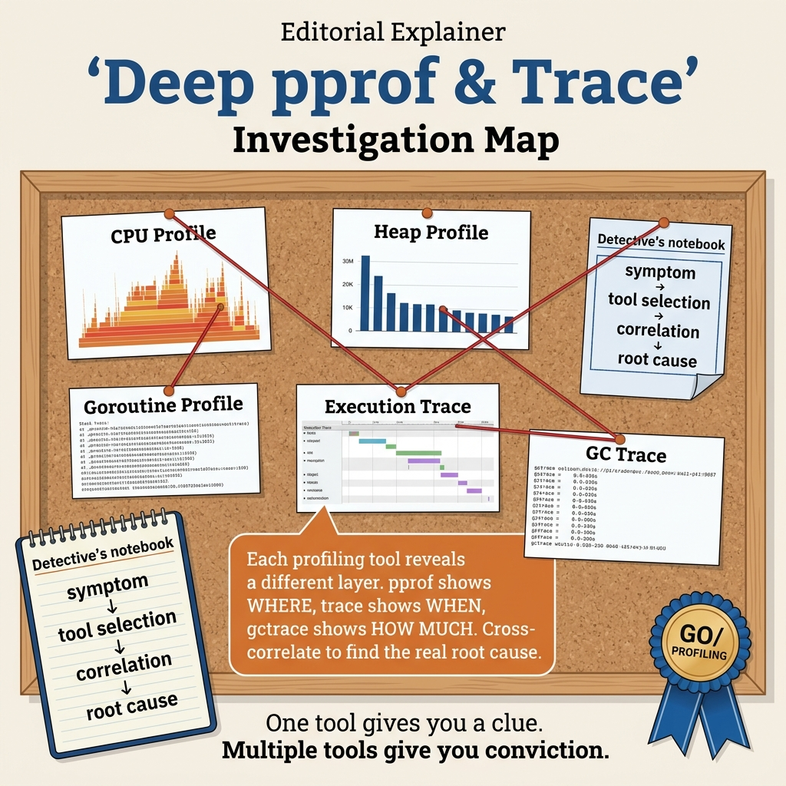

<!-- tags: golang -->
# 07 — Deep pprof & Trace Workflow

> Knowing `go tool pprof` alone is not enough. When a real incident happens, the challenge is choosing which profile first, reading flame graphs correctly, and knowing when to switch from pprof to `go tool trace`. This article focuses on real-world performance investigation workflows.

📅 Created: 2026-03-28 · 🔄 Updated: 2026-04-19 · ⏱️ 6 min read

## 1. DEFINE

An incident fires: p99 latency tripled in the last 30 minutes. You open pprof and see a CPU hotspot in `encoding/json.Marshal`. You refactor to `jsoniter`. Latency does not improve. The real cause was GC STW pauses triggered by allocation churn in a middleware layer — invisible to pprof, but obvious in `go tool trace`. Knowing *when to switch tools* is the difference between a 30-minute fix and a 4-hour rabbit hole.

> *pprof answers "where is CPU/memory being spent". trace answers "when and why are goroutines blocked, preempted, or waiting for GC".*

### How do pprof and trace differ?

| Tool | Best at answering |
| --- | --- |
| pprof | Where CPU/heap/alloc/mutex/block is being spent |
| trace | How scheduler, GC, syscall, goroutine timeline are interacting |

### When to use which?

| Symptom | First tool |
| --- | --- |
| High CPU | CPU profile |
| Memory growth | heap/alloc profile |
| Lock contention | mutex/block profile |
| Unexplained latency spike | trace timeline |

### Failure Modes

| Failure | Cause | Fix |
| --- | --- | --- |
| Optimizing wrong spot | looking only at `top` without call tree | use `top`, `list`, `web`, `trace` together |
| Non-representative profile | profiling during idle traffic | capture during symptom workload |
| Premature conclusion | seeing hotspot then fixing blindly | compare before/after with benchmark/profile |

pprof vs trace, symptom routing, failure modes — theory is covered. But there is a trap: optimizing the wrong spot because you only look at `top` without the call tree, and not saving profile artifacts = lost evidence. That trap will surface in PITFALLS. Now see what the workflow looks like visually.
## 2. VISUAL

In this article, the primary visual must be an incident router: which symptom maps to which profile, and when to escalate to trace.



*Figure: Without this symptom router, it is very easy to fall into the anti-pattern of opening every runtime tool but having no clear measurement path.*

```text
incident symptom
    │
    ├── CPU / alloc / heap? ──▶ pprof
    │                               │
    │                               ├── top
    │                               ├── list
    │                               └── flame graph
    │
    └── scheduler / latency jitter? ──▶ trace
                                        │
                                        ├── goroutine timeline
                                        ├── GC pauses
                                        └── syscall/network stalls
```

The diagram gives an overview of the investigation workflow. Now let us implement — starting from capturing CPU profiles, then symptom router, then incident bundle, then trace escalation.

## 3. CODE

The flow of **Deep pprof & Trace Workflow** is now visible. Now lower it into code to see what constraints make this mechanism hold, not just intuition.

### Example 1: Basic — capture CPU profile for a controlled workload

> **Goal**: Create a small harness to capture CPU profiles for exactly the suspected workload.
> **Approach**: Wrap the workload with `pprof.StartCPUProfile` and ensure the profile is always stopped correctly.
> **Example**: Input is a `workload func(context.Context) error`; output is a `.prof` file openable with `go tool pprof`.
> **Complexity**: Basic

```go
// profile_harness.go — Run a bounded workload under a chosen profiling session.
package advancedworkflow

import (
	"context"
	"fmt"
	"os"
	"runtime/pprof"
)

func CaptureCPU(ctx context.Context, path string, workload func(context.Context) error) error {
	// Fail early if the profile path is invalid.
	file, err := os.Create(path)
	if err != nil {
		return fmt.Errorf("create cpu profile: %w", err)
	}
	defer file.Close()

// Start profiling before the workload begins.
	if err := pprof.StartCPUProfile(file); err != nil {
		return fmt.Errorf("start cpu profile: %w", err)
	}
	defer pprof.StopCPUProfile()

// Run the workload while profiling is active.
	if err := workload(ctx); err != nil {
		return fmt.Errorf("run workload: %w", err)
	}

return nil
}
```

This example helps reproduce the problem instead of "waiting for production to get hot then capturing blindly". The caveat is that the workload must be representative enough; profiling during idle traffic is nearly meaningless.

Capture is covered. But when an incident just fired, you need to choose the right tool from the start — a symptom router helps avoid opening the wrong profile.

### Example 2: Intermediate — choosing the first profile from symptom

> **Goal**: Avoid opening the wrong tool from the start when an incident just fired.
> **Approach**: Encode a small symptom router so the team always starts with the most appropriate profile.
> **Example**: Input is a symptom like `high_cpu`, `memory_growth`; output is the profile target to capture first.
> **Complexity**: Intermediate

```go
// symptom_router.go — Map common production symptoms to the most useful first profile.
package advancedworkflow

type ProfileTarget string

const (
	CPUProfile   ProfileTarget = "cpu"
	HeapProfile  ProfileTarget = "heap"
	BlockProfile ProfileTarget = "block"
	MutexProfile ProfileTarget = "mutex"
	TraceProfile ProfileTarget = "trace"
)

func TargetForSymptom(symptom string) ProfileTarget {
	switch symptom {
	case "high_cpu":
		return CPUProfile
	case "memory_growth":
		return HeapProfile
	case "lock_contention":
		return BlockProfile
	case "mutex_wait":
		return MutexProfile
	default:
		return TraceProfile
	}
}
```

The result is that the investigation process starts having common rules. You still have to override with judgment when symptoms are vague, but at least the team no longer has "everyone prefers a different tool".

Symptom router covers single-profile cases. But when an issue only appears briefly, you need to capture multiple artifacts simultaneously — incident bundle is the next level.

### Example 3: Advanced — assembling an incident bundle to preserve evidence

> **Goal**: When an issue only appears briefly, capture multiple artifacts simultaneously instead of taking separate profiles.
> **Approach**: Capture a CPU profile in a short window, simultaneously dumping a goroutine snapshot to see blocking paths.
> **Example**: Input is the output directory and capture duration; output is `cpu.prof` and `goroutines.txt`.
> **Complexity**: Advanced

```go
// incident_bundle.go — Capture multiple artifacts from one investigation window.
package advancedworkflow

import (
	"context"
	"fmt"
	"os"
	"path/filepath"
	"runtime/pprof"
	"time"
)

func CaptureIncidentBundle(ctx context.Context, dir string, duration time.Duration) error {
	// Keep all artifacts in one directory so the before/after comparison is easy.
	if err := os.MkdirAll(dir, 0o755); err != nil {
		return fmt.Errorf("mkdir bundle dir: %w", err)
	}

cpuFile, err := os.Create(filepath.Join(dir, "cpu.prof"))
	if err != nil {
		return fmt.Errorf("create cpu profile: %w", err)
	}
	defer cpuFile.Close()

if err := pprof.StartCPUProfile(cpuFile); err != nil {
		return fmt.Errorf("start cpu profile: %w", err)
	}
	defer pprof.StopCPUProfile()

// Bound the capture window so the bundle represents one investigation slice.
	select {
	case <-ctx.Done():
		return ctx.Err()
	case <-time.After(duration):
	}

goroutineFile, err := os.Create(filepath.Join(dir, "goroutines.txt"))
	if err != nil {
		return fmt.Errorf("create goroutine dump: %w", err)
	}
	defer goroutineFile.Close()

if profile := pprof.Lookup("goroutine"); profile != nil {
		if err := profile.WriteTo(goroutineFile, 2); err != nil {
			return fmt.Errorf("write goroutine dump: %w", err)
		}
	}

return nil
}
```

This example achieves a small "evidence pack" for before/after comparison. Use it when the incident is brief and hard to reproduce; avoid capturing too long as long profiles mix in too much noise.

Bundle covers multi-artifact capture. But when pprof cannot explain the latency — a clear rule is needed to escalate to trace.

### Example 4: Expert — escalating from profile to trace with clear triggers

> **Goal**: Only enable `go tool trace` when symptoms truly need timeline analysis, avoiding trace overuse for every case.
> **Approach**: Encode a rule for switching from pprof to trace based on latency, GC, scheduler, and lock suspicion.
> **Example**: Input is a symptom snapshot already collected from metrics/profiles; output is a decision on whether trace is needed.
> **Complexity**: Expert

```go
// trace_decision.go — Escalate to runtime trace only when symptoms justify timeline analysis.
package advancedworkflow

type IncidentSnapshot struct {
	HighCPU        bool
	LatencySpike   bool
	GCSuspected    bool
	LockSuspected  bool
	HotspotUnknown bool
}

func ShouldEscalateToTrace(snapshot IncidentSnapshot) bool {
	// Trace is most valuable when pprof alone cannot explain request jitter.
	if snapshot.LatencySpike && snapshot.HotspotUnknown {
		return true
	}

// Scheduler, GC, and lock interactions are timeline problems.
	if snapshot.GCSuspected || snapshot.LockSuspected {
		return true
	}

// Pure high CPU with a clear hotspot can usually stay inside pprof first.
	return false
}
```

The expert takeaway is that the investigation workflow gains clear criteria: when to stop at pprof, when to escalate to trace. This is especially useful for on-call rotations, where not everyone is a performance specialist.

You now know capture, symptom router, bundle, and trace escalation. Now comes the dangerous part: optimizing the wrong spot and losing evidence — the trap set up from the beginning of this article.

## 4. PITFALLS

Knowing the correct path of **Deep pprof & Trace Workflow** is not enough. The part that costs teams the most lies in wrong assumptions that dashboards or demo code cannot speak for you.

| # | Severity | Defect | Consequence | Fix |
| --- | --- | --- | --- | --- |
| 1 | 🔴 Fatal | **Optimizing wrong spot** — looking only at `top` without call tree | Fixing non-hotspot, no performance change | Use `top`, `list`, `web`, `trace` together |
| 2 | 🔴 Fatal | **Non-representative profile** | Wrong conclusions, wrong optimization direction | Capture during real symptom workload |
| 3 | 🟡 Common | **Not saving profile artifacts** | Lost evidence for before/after comparison | Save `.prof`/trace files to incident dir |
| 4 | 🟡 Common | **Optimizing on local laptop then thinking it is done** | Production behavior differs | Validate on near-production workloads |

You have covered capture, routing, bundle, escalation, and the investigation traps. The resources below help go deeper.

## 5. REF

| Resource | Type | Link | Notes |
| --- | --- | --- | --- |
| Go blog profiling | Core team blog | [go.dev/blog/profiling-go-programs](https://go.dev/blog/profiling-go-programs) | pprof + flame graph walkthrough |
| Go execution tracer | Official docs | [pkg.go.dev/runtime/trace](https://pkg.go.dev/runtime/trace) | Programmatic trace capture |
| `go tool pprof` | Reference | [pkg.go.dev/cmd/pprof](https://pkg.go.dev/cmd/pprof) | CLI commands reference |

## 6. RECOMMEND

Having seen how **Deep pprof & Trace Workflow** operates and where it breaks easily, the next step is to open the right related branch to dig deeper instead of optimizing blindly.

| Extension | When | Rationale | File/Link |
| --- | --- | --- | --- |
| **continuous profiling** | Many services/hotspots | Catch regressions early before incidents | Pyroscope, Parca |
| **trace + metrics correlation** | Hard-to-reproduce latency issues | See symptom and cause closer together | [pkg.go.dev/runtime/trace](https://pkg.go.dev/runtime/trace) |
| **incident cookbook** | Larger teams | Consistent investigation, reduce MTTR | Internal wiki |
| **Benchmark Strategy** | Need to validate optimization | Compare before/after with data | [08-benchmark-strategy-and-benchstat.md](./08-benchmark-strategy-and-benchstat.md) |
| **Performance & pprof** | Want to learn basics first | Entry point for profiling workflow | [05-performance-pprof.md](./05-performance-pprof.md) |

---

## 7. QUICK REF

1. When the symptom is high CPU, which tool should come first? → **CPU profile**
2. When latency spikes but CPU is normal and scheduler/GC is suspected, what to open? → **`go tool trace`**
3. Why must we compare before/after profiles? → Because optimization by feel is very error-prone

---

**Navigation**: [← Performance & pprof](./05-performance-pprof.md) · [→ Benchmark Strategy](./08-benchmark-strategy-and-benchstat.md)
