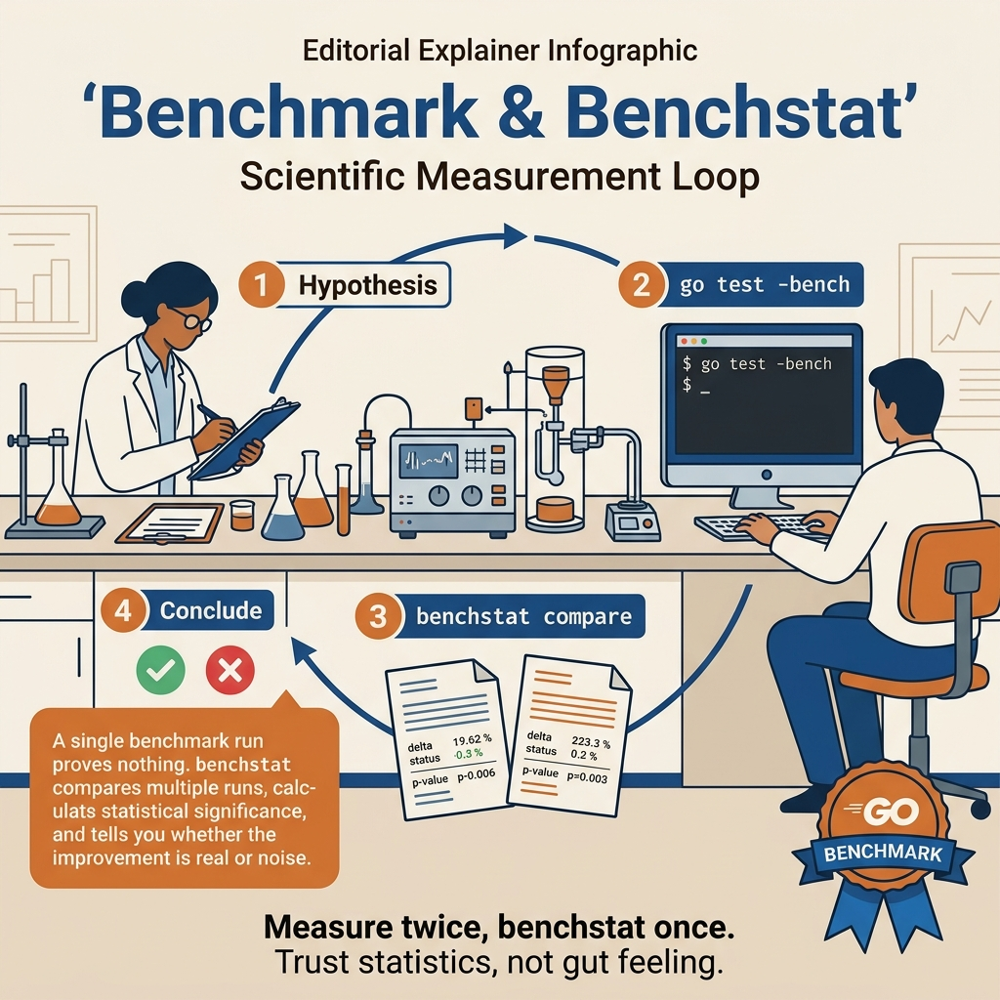

<!-- tags: golang -->
# 08 — Benchmark Strategy & benchstat

> Benchmarks in Go easily give the feeling "having numbers is enough", but benchmark numbers are very easy to deceive if setup is wrong. This article focuses on writing more trustworthy benchmarks, comparing with `benchstat`, and avoiding self-deception through beautiful microbenchmarks that do not match the real workload.

📅 Created: 2026-03-28 · 🔄 Updated: 2026-04-19 · ⏱️ 6 min read

## 1. DEFINE

Your colleague rewrites a hot-path serializer, runs `go test -bench=.` once, sees 200ns/op → 180ns/op, and declares a 10% win. You re-run with `-count=10` and `benchstat`: the improvement is **+1.2% ± 8%** — statistically indistinguishable from noise. The “optimization” was a mirage caused by CPU thermal throttling on the first run.

> *A single benchmark run is an anecdote. Ten runs with benchstat is evidence.*

### What does a trustworthy benchmark need?

| Factor | Meaning |
| --- | --- |
| clear workload | know what you are measuring |
| setup separated from measured loop | avoid mixing overhead |
| compare multiple runs | reduce noise |
| statistical comparison | avoid conclusions from 1 run |

### Failure Modes

| Failure | Cause | Fix |
| --- | --- | --- |
| Fake beautiful benchmark | compiler optimize away | keep result/sink explicit |
| High noise results | only 1 run | `-count`, `benchstat` |
| Optimizing wrong workload | benchmark too synthetic | simulate more realistic input |

Benchmark setup, failure modes — theory is covered. But there is a trap: compiler optimize away = beautiful but fake benchmark, and conclusions from 1 run = high noise causing false conclusions. That trap will surface in PITFALLS. Now see what the benchmark workflow looks like visually.
## 2. VISUAL

Benchmarks are only trustworthy when the measurement loop is tight enough. The PNG below should be the primary visual because it forces you through workload, repetition, statistical comparison, then interpretation.



*Figure: This article does not just teach `benchstat`. It teaches a measurement loop that can survive serious code review.*

```text
write benchmark
    │
    ├── isolate setup
    ├── run multiple samples
    ├── capture before / after
    └── compare with benchstat
```

The diagram gives an overview of the benchmark workflow. Now let us implement — starting from result sink, then table-driven, then benchstat, then CI gate.

## 3. CODE

The flow of **Benchmark Strategy & benchstat** is now visible. Now lower it into code to see what constraints make this mechanism hold, not just intuition.

### Example 1: Basic — benchmark with result sink to avoid compiler optimize away

> **Goal**: Measure a small function without the compiler eliminating its result.
> **Approach**: Use a `sink` variable at package scope to hold the output of the benchmarked function.
> **Example**: Input is a `[]int` slice; output is a running sum and benchmark `ns/op`, `allocs/op`.
> **Complexity**: Basic

```go
// benchmark_sink.go — Prevent compiler from optimizing benchmarked result away.
package advancedbench

import "testing"

var sink int

func Sum(values []int) int {
	total := 0
	for _, value := range values {
		total += value
	}
	return total
}

func BenchmarkSum(b *testing.B) {
	values := make([]int, 1024)
	for i := range values {
		values[i] = i
	}

// ResetTimer excludes setup cost from the measured loop.
	b.ResetTimer()
	for b.Loop() {
		// Keep the result in a package-level sink so the compiler cannot remove the work.
		sink = Sum(values)
	}
}
```

This example achieves a purer function measurement. The caveat is that this type of benchmark only represents one input distribution; not enough to conclude for production workloads.

Sink covers the compiler issue. But only one input size does not show scaling trends — table-driven benchmarks are the next level.

### Example 2: Intermediate — table-driven benchmark with multiple input sizes

> **Goal**: Compare the same algorithm on multiple data sizes instead of just one case.
> **Approach**: Use `b.Run` to create sub-benchmarks and prepare input outside the measured loop.
> **Example**: Input is sizes `16`, `256`, `4096`; output is a separate benchmark report for each size.
> **Complexity**: Intermediate

```go
// benchmark_cases.go — Exercise multiple realistic input sizes in one benchmark file.
package advancedbench

import (
	"fmt"
	"testing"
)

var sink int

func Sum(values []int) int {
	total := 0
	for _, value := range values {
		total += value
	}
	return total
}

func BenchmarkSumBySize(b *testing.B) {
	sizes := []int{16, 256, 4096}
	for _, size := range sizes {
		values := make([]int, size)
		for i := range values {
			values[i] = i % 17
		}

b.Run(fmt.Sprintf("size=%d", size), func(b *testing.B) {
			b.ResetTimer()
			for b.Loop() {
				sink = Sum(values)
			}
		})
	}
}
```

The result is you can see scaling trends rather than just one nice number. When regression only appears at large sizes, the benchmark starts having much more practical value.

Table-driven covers multiple sizes. But 1 run is still noisy — you need to compare multiple runs with benchstat to avoid false conclusions from noise.

### Example 3: Advanced — running benchmarks multiple times and comparing with `benchstat`

> **Goal**: Avoid conclusions from a single benchmark run that is inherently noisy.
> **Approach**: Collect multiple `before/after` samples, then use `benchstat` for more statistically meaningful comparison.
> **Example**: Input is two benchmark output files; output is a diff like `% slower`, `% allocs change`.
> **Complexity**: Advanced

```bash
# bench_workflow.sh — Capture statistically useful samples before comparing changes.
go test -run='^$' -bench=BenchmarkSum -benchmem -count=10 > before.txt
go test -run='^$' -bench=BenchmarkSum -benchmem -count=10 > after.txt
benchstat before.txt after.txt
```

```go
// compare_policy.go — Encode benchmark comparison guardrails in team conventions.
package advancedbench

type ComparisonPolicy struct {
	MinRuns       int
	UseBenchstat  bool
	RequireAllocs bool
}

func DefaultPolicy() ComparisonPolicy {
	return ComparisonPolicy{
		MinRuns:       10,
		UseBenchstat:  true,
		RequireAllocs: true,
	}
}
```

This example achieves a repeatable comparison policy for the team. The caveat is that `benchstat` cannot save a bad benchmark; if the workload is artificial, results will still be misleading.

Benchstat covers manual comparison. But when automation is needed to block regression in CI — benchmark gate is the expert level.

### Example 4: Expert — benchmark gate for CI or pre-merge check

> **Goal**: Automate blocking regressions on hot paths instead of remembering to run manually.
> **Approach**: Parse raw `benchstat` output and fail the job when regression exceeds the committed threshold.
> **Example**: Input is a `benchstat` line; output is `error` if regression exceeds threshold.
> **Complexity**: Expert

```go
// bench_gate.go — Fail a quality gate when benchmark regressions exceed a team threshold.
package advancedbench

import (
	"fmt"
	"strconv"
	"strings"
)

func ParseRegressionPercent(line string) (float64, bool) {
	fields := strings.Fields(line)
	for _, field := range fields {
		if strings.HasSuffix(field, "%") {
			value := strings.TrimSuffix(field, "%")
			parsed, err := strconv.ParseFloat(strings.TrimPrefix(value, "+"), 64)
			if err == nil {
				return parsed, true
			}
		}
	}
	return 0, false
}

func EnforceRegressionBudget(benchstatLine string, allowedPercent float64) error {
	percent, ok := ParseRegressionPercent(benchstatLine)
	if !ok {
		return fmt.Errorf("no regression percent found")
	}
	if percent > allowedPercent {
		return fmt.Errorf("benchmark regression %.2f%% exceeds allowed %.2f%%", percent, allowedPercent)
	}
	return nil
}
```

The final takeaway is that benchmarks are not just for "running for fun" but can become quality gates. Use them on stable hot paths; do not apply rigidly to every new benchmark as noise will create false alarms.

You now know sink, table-driven, benchstat, and CI gate. Now comes the dangerous part: compiler optimize away and single-run conclusion — the trap set up from the beginning of this article.

## 4. PITFALLS

Knowing the correct path of **Benchmark Strategy & benchstat** is not enough. The part that costs teams the most lies in wrong assumptions that dashboards or demo code cannot speak for you.

| # | Severity | Defect | Consequence | Fix |
| --- | --- | --- | --- | --- |
| 1 | 🔴 Fatal | **Benchmark with heavy setup inside loop** | Numbers include overhead, wrong conclusions | Move setup out of measured section |
| 2 | 🟡 Common | **Only looking at `ns/op`, forgetting allocs** | Missing allocation regression | Always run with `-benchmem` |
| 3 | 🟡 Common | **Conclusions from 1 run** | High noise, false conclusion | `-count=10` + `benchstat` |
| 4 | 🟡 Common | **Benchmark too synthetic, far from real workload** | Optimizing wrong direction | Create scenarios closer to real data |

You have covered sink, table-driven, benchstat, CI gate, and the benchmark traps. The resources below help go deeper.

## 5. REF

| Resource | Type | Link | Notes |
| --- | --- | --- | --- |
| Go testing benchmarks | Official docs | [pkg.go.dev/testing#hdr-Benchmarks](https://pkg.go.dev/testing#hdr-Benchmarks) | b.Loop, b.N, b.Run |
| benchstat | Tool reference | [pkg.go.dev/golang.org/x/perf/cmd/benchstat](https://pkg.go.dev/golang.org/x/perf/cmd/benchstat) | Statistical comparison |

## 6. RECOMMEND

Having seen how **Benchmark Strategy & benchstat** operates and where it breaks easily, the next step is to open the right related branch to dig deeper instead of optimizing blindly.

| Extension | When | Rationale | File/Link |
| --- | --- | --- | --- |
| **macrobenchmarks** | Service throughput matters | Check impact beyond micro scope | Internal harness |
| **perf CI gates** | Libs/hot paths critical | Catch regressions early in CI | CI configuration |
| **profile benchmarks** | Benchmark slow but cause unclear | Connect benchmark with pprof to find root cause | [07-deep-pprof-and-trace-workflow.md](./07-deep-pprof-and-trace-workflow.md) |
| **Goroutine Leak Detection** | Many background goroutines | Check lifecycle end-to-end | [09-goroutine-leak-detection-and-containment.md](./09-goroutine-leak-detection-and-containment.md) |
| **Performance & pprof** | Want to learn basics first | Entry point for profiling | [05-performance-pprof.md](./05-performance-pprof.md) |

---

## 7. QUICK REF

1. Why use a result sink in benchmarks? → So the compiler does not optimize away the part being measured
2. What does `benchstat` help with? → Statistically comparing multiple runs, avoiding noise
3. Should you conclude from 1 benchmark run? → No; very easy to be misled by noise

---

**Navigation**: [← Deep pprof & Trace](./07-deep-pprof-and-trace-workflow.md) · [→ Goroutine Leak Detection](./09-goroutine-leak-detection-and-containment.md)
