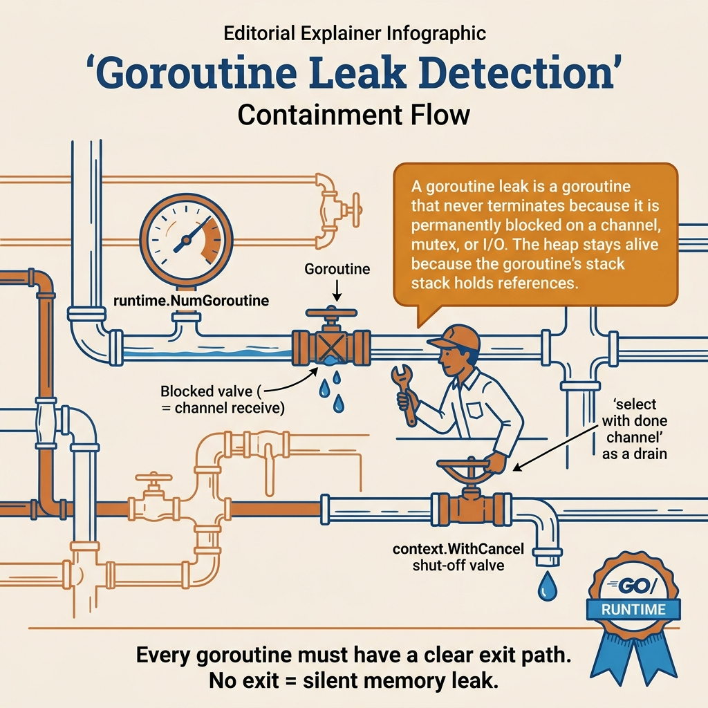

<!-- tags: golang -->
# 09 — Goroutine Leak Detection & Containment

> Goroutines are cheap but not free. Leaks do not always explode immediately; often they silently accumulate until memory, FD count, queue latency, or shutdown behavior becomes abnormal. This article focuses on detecting and containing goroutine leaks.

📅 Created: 2026-03-28 · 🔄 Updated: 2026-04-19 · ⏱️ 6 min read

## 1. DEFINE

Your service’s memory grows by 5MB per hour, steady and relentless. No spike, no crash — just a slow bleed. `pprof` shows goroutine count climbing from 50 at startup to 5,000 after a day. Each leaked goroutine holds ~4KB of stack plus whatever it captured in its closure. The root cause: a retry loop inside `go func()` that never checks `ctx.Done()`, so it keeps retrying long after the request that spawned it has returned.

> *A goroutine leak is a memory leak that does not show up in heap profiles — because the stack is the thing growing.*

### What is a goroutine leak?

A goroutine still alive after its request/job/use case has finished, or with no valid exit path remaining.

### Where do leaks commonly appear?

| Pattern | Example |
| --- | --- |
| channel receiver hanging | waiting for a message that will never arrive |
| background retry loop ignoring cancel | worker does not exit when service shuts down |
| HTTP/SSE/WebSocket stream without cleanup | client disconnects but goroutine stays alive |

### Failure Modes

| Failure | Cause | Fix |
| --- | --- | --- |
| goroutine count keeps increasing | loop/background work does not stop | context cancellation + clear ownership |
| shutdown hangs | workers not listening to signal | root context + bounded shutdown |
| memory/socket silently increasing | stream/retry goroutines not cleaning up | detect disconnect/cancel correctly |

Goroutine leak patterns, failure modes — theory is covered. But there is a trap: `go func(){...}` without clear owner = goroutine lives forever, and stream/client disconnect not propagating cleanup = goroutine stays alive after client is gone. That trap will surface in PITFALLS. Now see what the lifecycle looks like visually.
## 2. VISUAL

Leak handling needs a clearer flow than "goroutine is stuck". The PNG below separates the leak story into observe, profile, contain, then fix the ownership path.



*Figure: The greatest value of this article is turning leaks from vague symptoms into a repeatable investigation and containment workflow.*

```text
request starts goroutine
     │
     ├── good path: context cancelled -> goroutine exits
     └── bad path: blocked forever on channel / retry loop / stream
```

The diagram gives an overview of goroutine lifecycle. Now let us implement — starting from cancellable worker, then watchdog, then test helper, then goroutine dump.

## 3. CODE

The visual of **Goroutine Leak Detection & Containment** gives you the big picture. Code is where decisions about cancellation, ownership, or sequencing become real behavior.

### Example 1: Basic — worker respecting `context.Context`

> **Goal**: Ensure the goroutine has a clear exit path when the request or service finishes.
> **Approach**: Always `select` on `ctx.Done()` alongside the work channel.
> **Example**: Input is `jobs <-chan func()`; output is a worker that exits cleanly when context cancels or channel closes.
> **Complexity**: Basic

```go
// cancellable_worker.go — Exit cleanly when the owning context is done.
package advancedleak

import "context"

func RunWorker(ctx context.Context, jobs <-chan func()) {
	for {
		select {
		case <-ctx.Done():
			return
		case job, ok := <-jobs:
			if !ok {
				return
			}
			job()
		}
	}
}
```

This example establishes the most important foundation: every goroutine has an owner and exit path. Without this pattern, all detection techniques that follow are just firefighting.

Cancellable worker covers the exit path. But how do you know the system is leaking gradually? A watchdog monitoring goroutine count is the simplest signal.

### Example 2: Intermediate — watchdog detecting abnormal goroutine growth

> **Goal**: Have a simple runtime signal to know the system is leaking gradually.
> **Approach**: Compare baseline with current goroutine count and detect spikes based on threshold.
> **Example**: Input is baseline and current count; output is a boolean indicating suspicion.
> **Complexity**: Intermediate

```go
// goroutine_watchdog.go — Observe goroutine growth and trigger diagnostics threshold.
package advancedleak

import "runtime"

func GoroutineSpike(baseline int, current int) bool {
	return current > baseline*2
}

func CurrentGoroutines() int {
	return runtime.NumGoroutine()
}
```

The result of this example is a very cheap SLI for setting alerts or debug dashboards. The caveat is that spikes do not always mean leaks; read alongside traffic, queue depth, and background job lifetimes.

Watchdog covers runtime detection. But to catch leaks early before production — a test helper comparing goroutine count before/after workloads is the next level.

### Example 3: Advanced — test helper for catching leak-prone flows

> **Goal**: Catch abnormal goroutine growth early in tests instead of waiting for production.
> **Approach**: Measure goroutine count before and after running a workload with timeout/cancel.
> **Example**: Input is `fn func()` and tolerance; output is test failure when goroutines do not return to a reasonable baseline.
> **Complexity**: Advanced

```go
// leak_test_helper.go — Compare goroutine count before and after a bounded test workload.
package advancedleak

import (
	"runtime"
	"testing"
	"time"
)

func AssertNoLargeGoroutineGrowth(t *testing.T, tolerance int, fn func()) {
	t.Helper()

before := runtime.NumGoroutine()
	fn()

// Give background cleanup a small grace period before we compare counts.
	time.Sleep(100 * time.Millisecond)

after := runtime.NumGoroutine()
	if after > before+tolerance {
		t.Fatalf("goroutine growth too high: before=%d after=%d tolerance=%d", before, after, tolerance)
	}
}
```

This example achieves a very useful guardrail for SSE, WebSocket, consumer, retry loop, or shutdown paths. When the test fails, you have evidence near the code instead of just the symptom "RAM increasing".

Test helper covers detection. But when the watchdog reports suspected leaks, evidence is needed immediately — dumping goroutine stacks is the expert workflow.

### Example 4: Expert — dumping goroutine stacks when watchdog exceeds threshold

> **Goal**: When the watchdog reports suspected leaks, capture evidence immediately for investigation instead of waiting for shell access into the pod.
> **Approach**: Capture goroutine profile to file when count exceeds threshold.
> **Example**: Input is the dump `path`; output is a file containing stacks of all living goroutines.
> **Complexity**: Expert

```go
// goroutine_dump.go — Persist goroutine stacks when the process suspects a leak.
package advancedleak

import (
	"fmt"
	"os"
	"runtime/pprof"
)

func DumpGoroutines(path string) error {
	file, err := os.Create(path)
	if err != nil {
		return fmt.Errorf("create dump file: %w", err)
	}
	defer file.Close()

profile := pprof.Lookup("goroutine")
	if profile == nil {
		return fmt.Errorf("goroutine profile unavailable")
	}

// Debug level 2 includes stack frames and state, which is useful during incident review.
	if err := profile.WriteTo(file, 2); err != nil {
		return fmt.Errorf("write goroutine dump: %w", err)
	}

return nil
}
```

The expert takeaway is that detection and containment must go together: count goroutines to know there is a problem, dump stacks to know where the problem lies. Enable this when clear thresholds exist; do not spam dumps continuously as artifacts are very large.

You now know cancellable worker, watchdog, test helper, and goroutine dump. Now comes the dangerous part: fire-and-forget and stream disconnect — the trap set up from the beginning of this article.

## 4. PITFALLS

From this point, with **Goroutine Leak Detection & Containment**, the focus is no longer making it work, but avoiding patterns that seem fine but silently create operational debt.

| # | Severity | Defect | Consequence | Fix |
| --- | --- | --- | --- | --- |
| 1 | 🔴 Fatal | **`go func(){...}` without clear owner** | Goroutine lives forever, memory leak | Define caller ownership and shutdown path |
| 2 | 🔴 Fatal | **Retry loop `for {}` without checking `ctx.Done()`** | Worker does not exit on service shutdown | Add select/cancel path |
| 3 | 🔴 Fatal | **Stream/client disconnect not propagating cleanup** | Goroutine stays alive after client is gone | Watch request context/disconnect |
| 4 | 🟡 Common | **Not monitoring goroutine count in runtime** | Leaks silently accumulate | Add observability/watchdogs |

You have covered worker, watchdog, test helper, dump, and the fire-and-forget/stream traps. The resources below help go deeper.

## 5. REF

| Resource | Type | Link | Notes |
| --- | --- | --- | --- |
| Go blog: contexts | Core team blog | [go.dev/blog/context](https://go.dev/blog/context) | Context cancellation patterns |
| `runtime` package | Official docs | [pkg.go.dev/runtime](https://pkg.go.dev/runtime) | NumGoroutine, pprof Lookup |

## 6. RECOMMEND

The most important point of **Goroutine Leak Detection & Containment** is clear. The extension below is for when you need to turn this understanding into a more complete investigation or operational workflow.

| Extension | When | Rationale | File/Link |
| --- | --- | --- | --- |
| **leak-focused integration tests** | Many streaming/background features | Catch leaks earlier than unit tests | Internal test harness |
| **goroutine dump on threshold** | Hard-to-reproduce leaks | Capture evidence when symptom appears | `runtime/pprof` Lookup("goroutine") |
| **shutdown drills** | Service with many workers | Check lifecycle end-to-end | Manual verification |
| **Go 1.26 Goroutine Leak Profile** | CI/testing | Automatically detect leaks in tests | [04-go-124-features.md#go-126](./04-go-124-features.md) |
| **Advanced README** | Navigation | Return to overview | [README.md](./README.md) |

---

## 7. QUICK REF

1. What simple runtime signal is useful for detecting leaks? → **Goroutine count gradually increasing abnormally**
2. Why is `ctx.Done()` important for background goroutines? → Because it tells the goroutine when to exit
3. Are fire-and-forget goroutines safe by default? → **No**; without clear owner/lifecycle, they leak very easily

---

**Navigation**: [← Benchmark Strategy](./08-benchmark-strategy-and-benchstat.md) · [→ Advanced README](./README.md)
