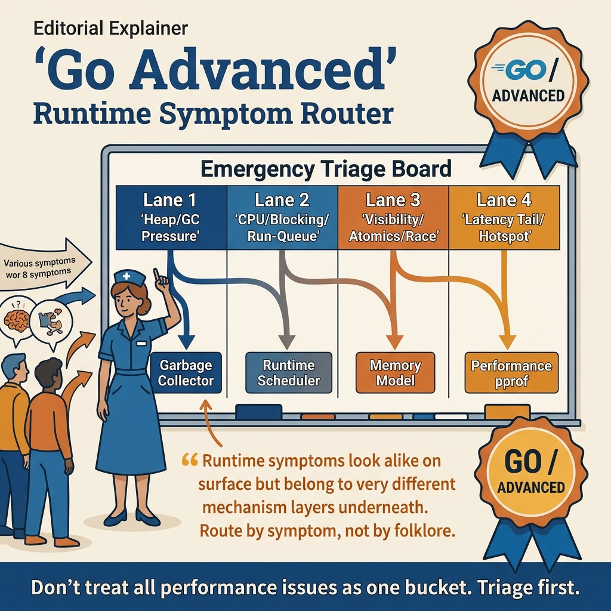

<!-- tags: golang, overview -->
# Go Advanced — Runtime & Performance Deep Dives

> Router for the `advanced` lane: connect runtime symptoms to the right article on GC, scheduler, memory model, profiling, benchmark, and leak containment.

📅 Updated: 2026-04-19 · ⏱️ 7 min read

## 1. DEFINE

The `advanced` lane is for when code is functionally correct but the system is still slow, heap-hungry, spiking tail latency, or behaving inexplicably under real load.

This is where many teams start making folklore mistakes: "GC is bad", "too many goroutines", "pprof looks confusing", or "just add cache". This hub exists to force runtime symptoms back to the correct analysis lane instead of debugging by guessing.

### 1.1 Signals & Boundaries

- Open this hub when the symptom is CPU, heap, GC, scheduler, memory visibility, pprof, trace, benchmark, or goroutine leak.
- This hub is a runtime/performance router, not a replacement for each detail article.
- If the real symptom is coordination or ownership, go back to `concurrency/` instead of trying profiling first.

### 1.2 Learning Lanes

- `01-garbage-collector.md` is the entry point when heap, allocation churn, or pause pressure is surfacing.
- `02-runtime-scheduler.md` is the entry point when goroutine behavior is hard to explain or blocking causes unusual throughput.
- `03-memory-model.md` is the entry point when code "looks race-free" but visibility remains untrustworthy.
- `05-performance-pprof.md` is the entry point when you need a measurement loop with before/after comparison.

## 2. VISUAL

A runtime hub is only useful when it helps you connect symptoms to the right mechanism layer: heap, scheduler, visibility, or profiling workflow.



*Figure: The `advanced` lane router map shows runtime symptoms should be separated into GC, scheduler, memory model, profiling, and benchmarking instead of lumping them into a single "performance" bucket.*

The key point to keep in mind: runtime symptoms look similar on the surface but usually belong to very different mechanism layers underneath.

## 3. CODE

The artifact below forces runtime symptoms into the correct entry lane.

### Example 1: Router artifact — select runtime topic by symptom

> **Goal**: Select the correct runtime article from the first diagnostic round.
> **Approach**: Separate heap, CPU, visibility, and measurement workflow into distinct branches.
> **Example**: Do not mix memory model with pprof, or GC with scheduler just because they both appear when the service is slow.
> **Complexity**: O(1) at the routing level; difficulty lies in describing the symptom correctly.

```go
func chooseAdvancedTopic(symptom string) string {
	switch symptom {
	case "heap-growth", "gc-pressure", "allocation-churn":
		return "./01-garbage-collector.md"
	case "scheduler", "blocking", "run-queue", "gmp":
		return "./02-runtime-scheduler.md"
	case "visibility", "happens-before", "atomics":
		return "./03-memory-model.md"
	case "cpu-hotspot", "latency-tail", "pprof":
		return "./05-performance-pprof.md"
	case "benchmark", "benchstat":
		return "./08-benchmark-strategy-and-benchstat.md"
	default:
		return "./README.md"
	}
}
```

If a symptom matches multiple branches, you usually need to keep two articles side by side: one for mechanism, one for the measurement loop.

## 4. PITFALLS

| # | Severity | Defect | Consequence | Fix |
| --- | --- | --- | --- | --- |
| 1 | 🔴 Fatal | Optimizing before having a measurement baseline | False improvement or new regression | Open `05-performance-pprof.md` early |
| 2 | 🟡 Common | Lumping heap, CPU, scheduler into a single "performance" bucket | Diagnosing the wrong mechanism layer | Select lane by more specific symptom |
| 3 | 🟡 Common | Using folklore instead of the memory model | Code "works" but is not portable | Return to `03-memory-model.md` when visibility concerns arise |
| 4 | 🔵 Minor | Reading the profiling guide before understanding root symptoms | Many tools but unclear reasoning | Use the hub to separate symptoms first |

## 5. REF

| Resource | Type | Link | Notes |
| --- | --- | --- | --- |
| A Guide to the Go Garbage Collector | Official docs | https://go.dev/doc/gc-guide | Official foundation for GC reasoning |
| The Go Memory Model | Official docs | https://go.dev/ref/mem | Standard document for happens-before and visibility |
| Diagnostics | Official docs | https://go.dev/doc/diagnostics | Official portal for profiling, tracing, debugging |
| Profiling Go Programs | Official blog | https://go.dev/blog/pprof | Good entry point for pprof workflow |

## 6. RECOMMEND

Do not read this lane as a tool list. Select the next article based on which mechanism layer is broken.

| Extension | When to read next | Rationale | File/Link |
| --- | --- | --- | --- |
| 01 — Garbage Collector | When heap, allocation, or pause pressure are prominent | Resolve memory symptoms with lifecycle reasoning | [01-garbage-collector.md](./01-garbage-collector.md) |
| 02 — Runtime Scheduler | When goroutine behavior and blocking are the main blind spots | Lock the M, P, G mental model before deep optimization | [02-runtime-scheduler.md](./02-runtime-scheduler.md) |
| 03 — Memory Model | When code involves atomics or visibility | Maintain correctness before chasing performance folklore | [03-memory-model.md](./03-memory-model.md) |
| 05 — Performance & pprof | When a measurement loop is needed for investigation | Connect runtime symptoms with real evidence | [05-performance-pprof.md](./05-performance-pprof.md) |
| Go Programming | When switching cluster away from runtime/performance | Return to root hub to pick another lane | [../README.md](../README.md) |
