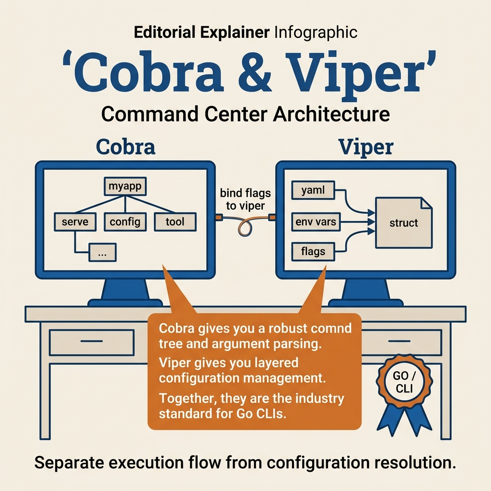

<!-- tags: golang -->
# 🐍 Cobra & Viper — Building Production-ready CLI Foundations

> Cobra and Viper are the most popular pair for building CLIs in Go, but a production CLI does not stop at "having a working command". This article focuses on command tree, flags, config bootstrap, and stable exit behavior.

📅 Created: 2026-03-23 · 🔄 Updated: 2026-03-28 · ⏱️ 15 min read

| Aspect | Detail |
| --- | --- |
| **Complexity** | Intermediate |
| **Use case** | internal tools, ops CLIs, developer tooling |
| **Go libs** | `github.com/spf13/cobra`, `github.com/spf13/viper`, `os`, `fmt` |
| **Prerequisites** | basic Go project structure, config concepts |

## 1. DEFINE

Imagine a CLI command just failed on a client machine because config precedence and secret layering were misunderstood. Without a solid grasp of **Cobra & Viper — Building Production-ready CLI Foundations**, you risk patching the surface while missing the real mechanism underneath.

> *CLI 3 subcommands 10 flags. os.Args=mess. Cobra Viper solve.*

### What do Cobra and Viper solve?

| Tool | Role |
| --- | --- |
| Cobra | command tree, flags, help, completion |
| Viper | config file, env vars, defaults, precedence |

### Invariants

| Rule | Meaning |
| --- | --- |
| keep root command as thin as possible | business logic belongs in the service layer |
| flags and config keys must be consistent | more predictable UX |
| command should return errors instead of calling `panic` | clear exit behavior |

### Failure Modes

| Failure | Root Cause | Fix |
| --- | --- | --- |
| config precedence confusion | bind flag/env/config without a strategy | define layering explicitly |
| command logic too fat | stuffing business logic into `RunE` | split into service/use case |
| CLI returns inconsistent exit codes | swallowing errors or careless `fmt.Println` | return errors from `RunE` |

These failure modes sound familiar. But there is a trap: panic in RunE turns the CLI into an undebuggable tool, and non-standard flag/config naming causes incorrect value merges. That trap will surface in PITFALLS.
## 2. VISUAL



*Figure: This API map groups the surface area so choosing the right primitive becomes less ambiguous.*


In **Cobra & Viper — Building Production-ready CLI Foundations**, the component names are just the surface. The visual below shows how they coordinate when a real request flows through the system.

```text
root command
   ├── serve
   ├── migrate
   └── user
        ├── create
        └── list

flags + env + config file
           │
           ▼
       Viper config
           │
           ▼
        command logic
```

## 3. CODE

At this point, the framework flow in **Cobra & Viper — Building Production-ready CLI Foundations** is clear. Now move to code to lock down setup patterns and handler conventions precisely.

### Example 1: Basic — Root command with `Execute`

> **Goal**: Create a clear CLI entry point where all errors are funneled to one place for exit behavior decisions.
> **Approach**: Use `Execute()` to call `rootCmd.Execute()`, print errors to `stderr`, and exit with code 1 if needed.
> **Example**: All subcommands return errors via `RunE`; `Execute()` is the final place converting that error into a process exit.
> **Complexity**: O(1) setup.

```go
// cmd/root.go — Keep root command responsible for setup and error propagation
package cmd

import (
	"fmt"
	"os"

"github.com/spf13/cobra"
)

var rootCmd = &cobra.Command{
	Use:   "myapp",
	Short: "My production-grade CLI",
}

func Execute() {
	if err := rootCmd.Execute(); err != nil {
		fmt.Fprintln(os.Stderr, err)
		os.Exit(1)
	}
}
```

> **Takeaway**: This is the correct baseline for production CLI: panics do not spread uncontrolled, exit behavior is unified. Config precedence is not addressed yet; flag binding is the next step.

Root command is covered. But config binding needs Viper — let us integrate.

### Example 2: Intermediate — Bind flags into Viper

> **Goal**: Consolidate flags, env vars, and config files into a single source of truth instead of reading each from a different place.
> **Approach**: Bind persistent flags into Viper, standardize the env key replacer, and enable `AutomaticEnv()`.
> **Example**: `--verbose`, `MYAPP_VERBOSE`, and config file all go through Viper layering.
> **Complexity**: O(1) bootstrap logic.

```go
// cmd/config_flags.go — Bind persistent flags into Viper for one source of truth
package cmd

import (
	"strings"

	"github.com/spf13/cobra"
	"github.com/spf13/viper"
)

var cfgFile string
var rootCmd = &cobra.Command{Use: "myapp"}

func initConfig() {}

func init() {
	cobra.OnInitialize(initConfig)

	rootCmd.PersistentFlags().StringVar(&cfgFile, "config", "", "custom config file")
	rootCmd.PersistentFlags().Bool("verbose", false, "enable verbose logging")

	_ = viper.BindPFlag("verbose", rootCmd.PersistentFlags().Lookup("verbose"))
	viper.SetEnvKeyReplacer(strings.NewReplacer(".", "_"))
	viper.AutomaticEnv()
}
```

> **Takeaway**: This is where Cobra and Viper start coordinating correctly: Cobra holds UX/flags, Viper holds config state. If layering is unclear, the CLI quickly becomes a tool that "works sometimes, breaks other times".

Config binding is covered. But subcommands need structure — let us organize.

### Example 3: Advanced — Command with service delegation

> **Goal**: Keep command handlers thin and push business logic down to a testable/reusable service layer.
> **Approach**: `RunE` only validates necessary input then calls `starter.Start(port)`.
> **Example**: Subcommand `serve` knows how to parse port and return clean errors, but does not contain complex server startup logic itself.
> **Complexity**: O(1) command overhead.

```go
// cmd/serve.go — Keep command thin and delegate work to a service object
package cmd

import (
	"fmt"

"github.com/spf13/cobra"
)

type ServerStarter interface {
	Start(port int) error
}

func NewServeCmd(starter ServerStarter) *cobra.Command {
	var port int

cmd := &cobra.Command{
		Use:   "serve",
		Short: "Start the HTTP server",
		RunE: func(cmd *cobra.Command, args []string) error {
			if port <= 0 {
				return fmt.Errorf("port must be positive")
			}
			// ✅ Business work is delegated to the service so the handler stays thin.
			return starter.Start(port)
		},
	}

cmd.Flags().IntVarP(&port, "port", "p", 8080, "server port")
	return cmd
}
```

> **Takeaway**: This is a good CLI foundation shape for large repos: clear command tree, clear config layering, and business logic not stuffed into Cobra. What is still missing is end-to-end bootstrap config validation for the entire app.

Subcommands are covered. But config layering needs priority — let us handle merging.

### Example 4: Expert — Persistent pre-run config bootstrap

> **Goal**: Load and validate runtime config once before any business command runs, instead of letting each subcommand bootstrap chaotically.
> **Approach**: Use `PersistentPreRunE` on the root command to initialize config/service dependencies.
> **Example**: All subcommands go through the same config bootstrap and fail early if config is wrong.
> **Complexity**: O(1) per command invocation.

```go
// cmd/bootstrap.go — Initialize shared config once before any business subcommand runs
package cmd

import "github.com/spf13/cobra"

type Bootstrapper interface {
	Bootstrap() error
}

func AttachBootstrap(root *cobra.Command, app Bootstrapper) {
	root.PersistentPreRunE = func(cmd *cobra.Command, args []string) error {
		// ✅ Root-level bootstrap ensures all subcommands share the same config/init contract.
		return appBootstrap(app)
	}
}

func appBootstrap(app Bootstrapper) error {
	return app.Bootstrap()
}
```

> **Takeaway**: This is the step where CLI foundation moves from a "working command" to "disciplined application initialization". Do not overuse `PersistentPreRunE` for heavy side effects on every command; only truly shared bootstrap should live here.
```

You have covered command, config, subcommands, and layering. Now comes the dangerous part: panic in RunE and naming mismatch — the trap set up from the beginning of this article.

## 4. PITFALLS

The hard part of **Cobra & Viper — Building Production-ready CLI Foundations** is not calling the framework API correctly, but recognizing when the request lifecycle has been skewed without seeing consequences immediately.

| # | Defect | Fix |
| --- | --- | --- |
| 1 | `panic` in `RunE` | return error and let `Execute` decide exit |
| 2 | Flag names and config keys differ without convention | standardize naming |
| 3 | Viper becomes messy global state | consolidate bootstrap or wrap config layer |
| 4 | Root command does too much itself | split into subcommands/service constructors |

You have covered Cobra/Viper foundations and the traps. The resources below help go deeper.

## 5. REF

| Resource | Link |
| --- | --- |
| Cobra | https://github.com/spf13/cobra |
| Viper | https://github.com/spf13/viper |

## 6. RECOMMEND

At this point, the foundation of **Cobra & Viper — Building Production-ready CLI Foundations** is ready. Open the right related topics to deepen the app, not just add features for coverage.

| Extension | When | Rationale |
| --- | --- | --- |
| command testing harness | CLI used in CI or ops | maintain more stable UX |
| config schema validation | complex config | clear fail-fast behavior |
| structured stderr output | automation/scripts | parse CLI errors more reliably |

## 7. QUIZ

### Quick Check

1. Why is `RunE` better than `Run` for production CLIs?
2. How do Cobra and Viper split their roles?
3. Should root command contain heavy business logic?

### Answer Key

1. Because it returns errors with control and allows more consistent exit behavior.
2. Cobra manages commands/flags/help; Viper manages config/env/defaults.
3. No; keep root thin and delegate to services.

## 8. NEXT STEPS

- Read [Config Layering & Secrets](./02-config-layering-and-secrets.md)
- Or continue to [Deployment: GoReleaser](../deployment/04-goreleaser-release-pipeline.md)
