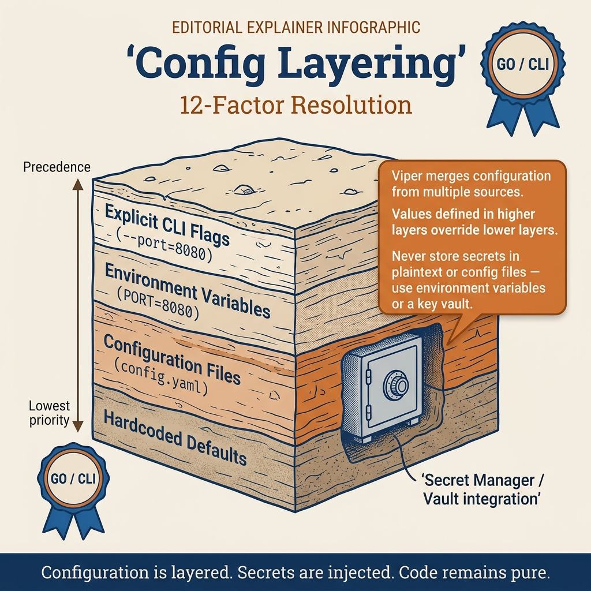

<!-- tags: golang -->
# 🔧 Config Layering & Secrets — Flags, Env, Files, Validation

> Production CLIs typically run on dev laptops, CI runners, and production machines. If precedence between config files, env vars, and flags is unclear, the tool quickly becomes unreliable. This article focuses on clear config layering for Cobra/Viper.

📅 Created: 2026-03-28 · 🔄 Updated: 2026-03-28 · ⏱️ 15 min read

| Aspect | Detail |
| --- | --- |
| **Complexity** | Advanced |
| **Use case** | CLIs with multiple config sources including secrets |
| **Go libs** | `github.com/spf13/viper`, `fmt`, `strings`, `time` |
| **Prerequisites** | Cobra/Viper basics |

## 1. DEFINE

A production on-call shift often starts when a CLI command just failed on a client machine because config precedence and secret layering were misunderstood. **Config Layering & Secrets — Flags, Env, Files, Validation** helps you name the problem correctly before reacting from habit.

> *Config from 4 sources, 3 set the same key — which wins? Password in YAML on git.*

### What should the precedence order be?

Typically:

```text
flags > env vars > config file > defaults
```

### Invariants

| Rule | Meaning |
| --- | --- |
| precedence must be clearly documented | users should not have to guess |
| config must validate before the command runs | fail fast |
| secrets must not be printed raw in logs/help/debug | prevent leaks |

### Failure Modes

| Failure | Root Cause | Fix |
| --- | --- | --- |
| CLI runs wrong env without anyone knowing | ambiguous config precedence | define layering explicitly |
| Secret exposed in debug logs | dumping full config struct | use redaction view |
| Config file missing important keys but app still runs | relying only on defaults | use explicit validation |

These failure modes sound easy to avoid. But there is a trap: Viper defaults hiding missing config cause silent production errors, and non-standard key naming across flag/env/file causes incorrect overrides. That trap will surface in PITFALLS.
## 2. VISUAL



*Figure: This decision map compresses the key forks so you can scan quickly before diving into code.*


In **Config Layering & Secrets — Flags, Env, Files, Validation**, the real request flow shows where middleware, handler, and response path hook into each other.

```text
defaults
   ↑
config file
   ↑
env vars
   ↑
flags
   │
   ▼
validated runtime config
```

## 3. CODE

The request flow of **Config Layering & Secrets — Flags, Env, Files, Validation** is clear. Now lower it into handler, middleware, and setup code to see where this framework is used correctly.

### Example 1: Basic — Typed config from Viper

> **Goal**: Load layered config into a typed struct so the command layer does not have to call `viper.Get*` everywhere.
> **Approach**: Create a clear `Config` struct and validate required fields immediately after reading.
> **Example**: Missing `api.base_url` or `api.token` will fail immediately before any business command runs.
> **Complexity**: O(1) per number of config fields.

```go
// runtime_config.go — Unmarshal a typed config object from layered Viper state
package cliconfig

import (
	"fmt"
	"time"

"github.com/spf13/viper"
)

type Config struct {
	LogLevel   string
	APIBaseURL string
	Timeout    time.Duration
	APIToken   string
}

func LoadConfig() (Config, error) {
	cfg := Config{
		LogLevel:   viper.GetString("log.level"),
		APIBaseURL: viper.GetString("api.base_url"),
		Timeout:    viper.GetDuration("api.timeout"),
		APIToken:   viper.GetString("api.token"),
	}

if cfg.APIBaseURL == "" {
		return Config{}, fmt.Errorf("api.base_url is required")
	}
	if cfg.APIToken == "" {
		return Config{}, fmt.Errorf("api.token is required")
	}

return cfg, nil
}
```

> **Takeaway**: This step moves config from vague global state to a validatable contract. It does not yet standardize precedence and env mapping; explicit bootstrap is the next step.

Config load is covered. But env overrides need layering — let us merge.

### Example 2: Intermediate — Defaults + env key strategy

> **Goal**: Establish defaults and consistent env mapping rules so users do not have to guess how to override config.
> **Approach**: Set defaults in Viper, add env prefix and replacer from `.` to `_`.
> **Example**: Key `api.timeout` can be overridden via env `MYAPP_API_TIMEOUT`.
> **Complexity**: O(1) bootstrap logic.

```go
// viper_bootstrap.go — Establish predictable defaults and env mapping
package cliconfig

import (
	"strings"

"github.com/spf13/viper"
)

func Bootstrap() {
	viper.SetDefault("log.level", "info")
	viper.SetDefault("api.timeout", "5s")

viper.SetEnvPrefix("MYAPP")
	viper.SetEnvKeyReplacer(strings.NewReplacer(".", "_"))
	viper.AutomaticEnv()
}
```

> **Takeaway**: This is where config layering starts becoming predictable. If env naming is unstable, supporting/debugging the CLI in CI or production becomes extremely frustrating.

Layering is covered. But secrets need isolation — let us isolate.

### Example 3: Advanced — Log-safe config view

> **Goal**: Allow debugging the current config without exposing secrets.
> **Approach**: Expose a separate `SafeConfig` for logs/doctor commands and redact token/password fields.
> **Example**: `myapp doctor` prints `api_base_url`, `timeout`, but `api_token` is always `[REDACTED]`.
> **Complexity**: O(1) runtime.

```go
// safe_view.go — Expose a redacted view of config for diagnostics
package cliconfig

import "time"

type Config struct {
	LogLevel   string
	APIBaseURL string
	Timeout    time.Duration
	APIToken   string
}

type SafeConfig struct {
	LogLevel   string `json:"log_level"`
	APIBaseURL string `json:"api_base_url"`
	Timeout    string `json:"timeout"`
	APIToken   string `json:"api_token"`
}

func (c Config) SafeView() SafeConfig {
	return SafeConfig{
		LogLevel:   c.LogLevel,
		APIBaseURL: c.APIBaseURL,
		Timeout:    c.Timeout.String(),
		APIToken:   "[REDACTED]",
	}
}
```

> **Takeaway**: This is where config hygiene meets security hygiene in CLI. A single misplaced `fmt.Printf("%+v", cfg)` is enough to send tokens into CI logs or shell history.

Secrets are covered. But validation needs fail-fast — let us enforce.

### Example 4: Expert — Config doctor command

> **Goal**: Create a command that helps users self-diagnose effective config and config sources without reading code or guessing precedence.
> **Approach**: Attach `SafeView()` to a `doctor config` command or diagnostics helper.
> **Example**: Support asks user to run `myapp doctor config` to see which `base_url`, `timeout`, `log_level` the app currently sees.
> **Complexity**: O(1) runtime.

```go
// doctor_config.go — Print effective non-secret config for troubleshooting
package cliconfig

import (
	"encoding/json"
	"fmt"
	"time"
)

type Config struct {
	LogLevel   string
	APIBaseURL string
	Timeout    time.Duration
	APIToken   string
}

type SafeConfig struct {
	LogLevel   string `json:"log_level"`
	APIBaseURL string `json:"api_base_url"`
	Timeout    string `json:"timeout"`
	APIToken   string `json:"api_token"`
}

func (c Config) SafeView() SafeConfig {
	return SafeConfig{
		LogLevel:   c.LogLevel,
		APIBaseURL: c.APIBaseURL,
		Timeout:    c.Timeout.String(),
		APIToken:   "[REDACTED]",
	}
}

func PrintSafeConfig(cfg Config) error {
	payload, err := json.MarshalIndent(cfg.SafeView(), "", "  ")
	if err != nil {
		return err
	}
	fmt.Println(string(payload))
	return nil
}
```

> **Takeaway**: This pattern is very useful for internal tools, CI runners, and multi-user environments. Do not turn the doctor command into a place for printing raw secrets or dumping entire Viper state; useful diagnosis must always accompany redaction discipline.
```

You have covered config load, layering, secrets, and validation. Now comes the dangerous part: defaults hiding required fields and naming drift — the trap set up from the beginning of this article.

## 4. PITFALLS

The sample code of **Config Layering & Secrets — Flags, Env, Files, Validation** looks fairly clean. In practice, the worst errors usually come from lifecycle and context misuse rather than syntax.

| # | Defect | Fix |
| --- | --- | --- |
| 1 | Viper defaults hide missing config | validate required fields separately |
| 2 | Using different key names across flag/env/file | standardize naming |
| 3 | `fmt.Printf("%+v", cfg)` with secrets in struct | use redacted safe view |
| 4 | Timeout left as raw string scattered across code | parse into typed config early |

You have covered config layering and the traps. The resources below help go deeper.

## 5. REF

| Resource | Link |
| --- | --- |
| Viper config docs | https://github.com/spf13/viper |
| Twelve-Factor config | https://12factor.net/config |

## 6. RECOMMEND

With the request lifecycle and the main traps of **Config Layering & Secrets — Flags, Env, Files, Validation** clear, open the right adjacent framework branch to maintain a smooth learning path.

| Extension | When | Rationale |
| --- | --- | --- |
| schema validation lib | complex config | clearer validation |
| secret manager integration | CI/prod using sensitive tokens | reduce hardcoded secret risk |
| config doctor command | internal CLI with many users | faster setup debugging |

## 7. QUIZ

### Quick Check

1. What is the common precedence order for config sources?
2. Why use typed config instead of calling `viper.Get*` everywhere?
3. Should secrets appear in full debug output?

### Answer Key

1. Flags > env > config file > defaults.
2. To validate/fail fast and reduce coupling with global config state.
3. No; must redact.

## 8. NEXT STEPS

- Read [Plugin & External Subcommands](./03-plugin-and-external-subcommands.md)
- Or continue to [Cloud Infra: Config](../cloud-infra/03-configmaps-secrets-runtime-config.md)
