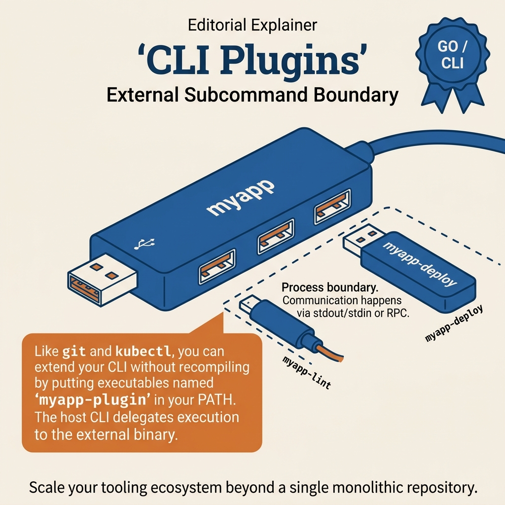

<!-- tags: golang -->
# 🔌 Plugin & External Subcommands — Extensible CLI Without Monolith Growth

> When a CLI starts growing, stuffing everything into a single binary quickly becomes burdensome. This article focuses on plugin patterns and `git-foo`-style external subcommands, helping the CLI extend while keeping the core compact.

📅 Created: 2026-03-28 · 🔄 Updated: 2026-03-28 · ⏱️ 15 min read

| Aspect | Detail |
| --- | --- |
| **Complexity** | Advanced |
| **Use case** | internal platform CLI, team toolchains, domain-specific extensions |
| **Go libs** | `os/exec`, `os`, `fmt`, `strings` |
| **Prerequisites** | Cobra basics, command tree design |

## 1. DEFINE

A production on-call shift often starts when a CLI command just failed on a client machine because config precedence and secret layering were misunderstood. **Plugin & External Subcommands — Extensible CLI Without Monolith Growth** helps you name the problem correctly before reacting from habit.

> *CLI extends, team adds subcommands. Plugin runtime.*

### What directions do plugin CLIs typically take?

| Direction | When to use |
| --- | --- |
| built-in subcommands | core features, stable UX |
| external executable plugins | team/domain extensions, independent release cycle |
| RPC/plugin frameworks | powerful plugins, clearer sandbox/protocol |

### Failure Modes

| Failure | Root Cause | Fix |
| --- | --- | --- |
| core CLI too bloated | every team adds subcommands to the same repo | split into external plugins |
| plugin version drift | no clear contract | define minimal CLI plugin protocol |
| security risk when executing unknown plugins | trusting PATH blindly | whitelist path/source or explicit install flow |

These failure modes are clear. But there is a trap: core CLI knowing too much about plugin internals causes coupling lock, and LookPath on untrusted environments creates security risk. That trap will surface in PITFALLS.
## 2. VISUAL



*Figure: This comparison card places the options side by side so boundaries and trade-offs are immediately visible.*


In **Plugin & External Subcommands — Extensible CLI Without Monolith Growth**, the real request flow shows where middleware, handler, and response path hook into each other.

```text
myapp
  ├── core command
  ├── built-in command
  └── external plugin lookup
         │
         └── myapp-foo on PATH
```

## 3. CODE

The request flow of **Plugin & External Subcommands — Extensible CLI Without Monolith Growth** is clear. Now lower it into handler, middleware, and setup code to see where this framework is used correctly.

### Example 1: Basic — Execute external subcommand if binary exists

> **Goal**: Let the core CLI forward unknown subcommands to external plugin binaries without recompiling the entire core CLI.
> **Approach**: Find the executable by the `root-subcommand` pattern on `PATH`, then `exec` it with the current stdin/stdout/stderr.
> **Example**: `myapp foo ...` will find `myapp-foo` and hand processing to that binary.
> **Complexity**: O(n) over PATH entries during lookup, then runtime depends on the plugin.

```go
// external_subcommand.go — Delegate unknown subcommand to an external executable
package cliplugin

import (
	"fmt"
	"os"
	"os/exec"
)

func ExecExternalPlugin(root string, subcommand string, args []string) error {
	binaryName := fmt.Sprintf("%s-%s", root, subcommand)
	binaryPath, err := exec.LookPath(binaryName)
	if err != nil {
		return fmt.Errorf("plugin %s not found: %w", binaryName, err)
	}

cmd := exec.Command(binaryPath, args...)
	cmd.Stdout = os.Stdout
	cmd.Stderr = os.Stderr
	cmd.Stdin = os.Stdin
	return cmd.Run()
}
```

> **Takeaway**: This is a simple and highly pragmatic Git-style plugin pattern. It still lacks UX discoverability; users cannot easily know which plugins are available without a separate discovery step.

Plugin interface is covered. But external subcommands need discovery — let us find them.

### Example 2: Intermediate — Simple plugin discovery

> **Goal**: List external plugins currently available on `PATH` by the CLI's naming convention.
> **Approach**: Scan each directory in PATH, find executables with the `root-` prefix.
> **Example**: PATH contains `myapp-db`, `myapp-report` → doctor/help can display these two plugins.
> **Complexity**: O(total_files_on_PATH_scan).

```go
// plugin_discovery.go — List external plugin candidates from PATH naming convention
package cliplugin

import (
	"os"
	"path/filepath"
	"strings"
)

func DiscoverPlugins(root string) []string {
	seen := map[string]struct{}{}
	for _, dir := range filepath.SplitList(os.Getenv("PATH")) {
		entries, err := os.ReadDir(dir)
		if err != nil {
			continue
		}
		for _, entry := range entries {
			name := entry.Name()
			prefix := root + "-"
			if strings.HasPrefix(name, prefix) {
				seen[strings.TrimPrefix(name, prefix)] = struct{}{}
			}
		}
	}

plugins := make([]string, 0, len(seen))
	for plugin := range seen {
		plugins = append(plugins, plugin)
	}
	return plugins
}
```

> **Takeaway**: This step makes the plugin system more usable for real users. Without discovery, the plugin ecosystem quickly becomes "present but invisible".

Discovery is covered. But plugin lifecycle needs a clear contract — let us standardize.

### Example 3: Advanced — Pass context/config to plugin via env

> **Goal**: Pass minimal context such as the current profile or plugin mode to external subcommands in a simple way.
> **Approach**: Append intentional env vars to `exec.Cmd` instead of letting the plugin guess runtime context.
> **Example**: Plugin knows it is running under profile `prod` and knows it was invoked from the core CLI via `MYAPP_PLUGIN_MODE=1`.
> **Complexity**: O(1) setup.

```go
// plugin_context.go — Provide minimal runtime context to external plugins
package cliplugin

import (
	"os"
	"os/exec"
)

func PluginCommand(binaryPath string, args []string, profile string) *exec.Cmd {
	cmd := exec.Command(binaryPath, args...)
	cmd.Env = append(os.Environ(),
		"MYAPP_PROFILE="+profile,
		// ✅ A thin and clear env contract evolves better than embedding too much coupling logic into the core CLI.
		"MYAPP_PLUGIN_MODE=1",
	)
	return cmd
}
```

> **Takeaway**: This keeps plugin context sufficient without making the core CLI know too much about plugin internals. But as the ecosystem grows, trust model and metadata become important.

Contract is covered. But execution needs sandboxing — let us protect.

### Example 4: Expert — Plugin metadata handshake

> **Goal**: Let the core CLI verify who the plugin is, what version it is, and whether it is compatible with the current CLI before executing more complex behavior.
> **Approach**: Standardize a simple subcommand handshake like `plugin-name metadata --json`.
> **Example**: Core calls `myapp-db metadata --json` to get `name`, `version`, `api_version`.
> **Complexity**: O(1) per plugin handshake.

```go
// plugin_metadata.go — Query plugin metadata before enabling richer integration
package cliplugin

import (
	"encoding/json"
	"os/exec"
)

type PluginMetadata struct {
	Name       string `json:"name"`
	Version    string `json:"version"`
	APIVersion string `json:"api_version"`
}

func ReadPluginMetadata(binaryPath string) (PluginMetadata, error) {
	output, err := exec.Command(binaryPath, "metadata", "--json").Output()
	if err != nil {
		return PluginMetadata{}, err
	}

var meta PluginMetadata
	if err := json.Unmarshal(output, &meta); err != nil {
		return PluginMetadata{}, err
	}
	return meta, nil
}
```

> **Takeaway**: This step moves the plugin model toward a more mature contract instead of just "exec and done". A heavy handshake is not needed from the start, but when the plugin ecosystem experiences version drift and multiple teams participate, this pattern becomes very valuable.
```

You have covered plugin interface, discovery, contract, and execution. Now comes the dangerous part: coupling lock and LookPath risk — the trap set up from the beginning of this article.

## 4. PITFALLS

The sample code of **Plugin & External Subcommands — Extensible CLI Without Monolith Growth** looks fairly clean. In practice, the worst errors usually come from lifecycle and context misuse rather than syntax.

| # | Defect | Fix |
| --- | --- | --- |
| 1 | Core CLI knows too much about plugin internals | keep contract minimal |
| 2 | `exec.LookPath` on uncontrolled environments | use explicit install/whitelist path |
| 3 | Unstable plugin output format | define stdout/stderr contract |
| 4 | Not recording plugin version/source | add doctor/debug info |

You have covered plugin patterns and the traps. The resources below help go deeper.

## 5. REF

| Resource | Link |
| --- | --- |
| Git plugin style | https://git-scm.com/book/en/v2/Git-Internals-Environment-Variables |
| Cobra | https://github.com/spf13/cobra |
| Go exec | https://pkg.go.dev/os/exec |

## 6. RECOMMEND

With the request lifecycle and the main traps of **Plugin & External Subcommands — Extensible CLI Without Monolith Growth** clear, open the right adjacent framework branch to maintain a smooth learning path.

| Extension | When | Rationale |
| --- | --- | --- |
| plugin manifest/metadata | larger plugin ecosystem | better version/source management |
| gRPC/RPC plugin protocol | plugins doing complex work | stronger contract than stdout hacks |
| signed plugin binaries | sensitive environments | reduce supply chain risk |

## 7. QUIZ

### Quick Check

1. How does the external subcommand pattern help large CLIs?
2. Why does plugin execution need security attention?
3. When is a plugin protocol stronger than simple `exec` needed?

### Answer Key

1. It keeps the core CLI compact and allows independent extension releases.
2. Because it runs external binaries that may be untrustworthy if source/path is uncontrolled.
3. When plugins need complex contracts, typed data, or longer lifecycles.

## 8. NEXT STEPS

- Read [Release, Distribution & Shell Completion](./04-release-distribution-and-shell-completion.md)
- Or continue to [Deployment: GoReleaser](../deployment/04-goreleaser-release-pipeline.md)
