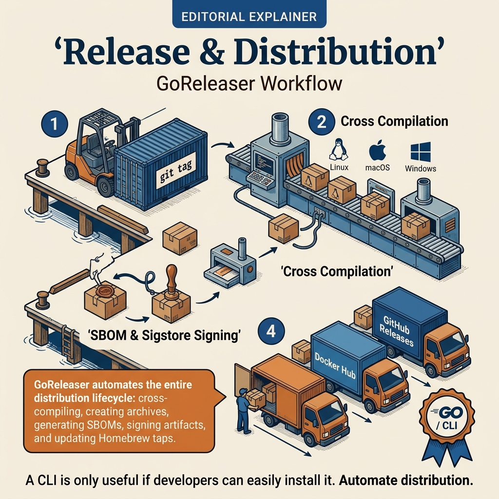

<!-- tags: golang -->
# 📦 Release, Distribution & Shell Completion — Shipping a Usable CLI

> A CLI is only truly complete when users can install it, upgrade it, and use it comfortably. This article focuses on release artifacts, shell completion, install UX, and the considerations when distributing a CLI to a team or community.

📅 Created: 2026-03-28 · 🔄 Updated: 2026-03-28 · ⏱️ 15 min read

| Aspect | Detail |
| --- | --- |
| **Complexity** | Advanced |
| **Use case** | internal CLI, devtools, ops commands needing clear distribution |
| **Go libs** | `github.com/spf13/cobra`, `fmt`, `os` |
| **Prerequisites** | Cobra basics, release pipeline concepts |

## 1. DEFINE

Some articles reveal their value only when a CLI command just failed on a client machine because config precedence and secret layering were misunderstood. **Release, Distribution & Shell Completion — Shipping a Usable CLI** is one of those articles.

> *CLI built. One binary per platform. GoReleaser pipeline.*

### What does a "releasable" CLI need?

| Area | Meaning |
| --- | --- |
| versioned artifacts | know which version users are running |
| install path | clear installation docs |
| shell completion | better UX for power users |
| upgrade story | know how to update |

### Failure Modes

| Failure | Root Cause | Fix |
| --- | --- | --- |
| User installed but does not know version | metadata not injected | add version command/ldflags |
| Install guide confusing | each OS differs but not documented | standardize release artifacts |
| Completion not working | wrong shell generation | add clear completion command |

These failure modes sound familiar. But there is a trap: no version command means users do not know which binary is running, and completion as an afterthought means low developer adoption. That trap will surface in PITFALLS.
## 2. VISUAL



*Figure: This workflow map pulls the main flow into view so you maintain the right pace when reading code.*


In **Release, Distribution & Shell Completion — Shipping a Usable CLI**, the real request flow shows where middleware, handler, and response path hook into each other.

```text
git tag
   │
   ▼
release pipeline
   ├── binary archives
   ├── checksums
   ├── version metadata
   └── completion scripts
         │
         ▼
      user install / upgrade
```

## 3. CODE

The request flow of **Release, Distribution & Shell Completion — Shipping a Usable CLI** is clear. Now lower it into handler, middleware, and setup code to see where this framework is used correctly.

### Example 1: Basic — Version subcommand

> **Goal**: Let users and support know which version and commit the CLI is running.
> **Approach**: Create a `version` subcommand that prints build metadata injected from the release pipeline.
> **Example**: `myapp version` returns `version=v1.4.2 commit=abc1234`.
> **Complexity**: O(1).

```go
// cmd/version.go — Surface build metadata to end users and support teams
package cmd

import (
	"fmt"

"github.com/spf13/cobra"
)

var (
	version = "dev"
	commit  = "local"
)

func NewVersionCmd() *cobra.Command {
	return &cobra.Command{
		Use:   "version",
		Short: "Print CLI version information",
		Run: func(cmd *cobra.Command, args []string) {
			fmt.Printf("version=%s commit=%s\n", version, commit)
		},
	}
}
```

> **Takeaway**: This is the minimum for the CLI to become supportable after release. It does not significantly improve daily UX yet; shell completion is the clearest next usability step.

Version metadata is covered. But distribution needs automation — let us release.

### Example 2: Intermediate — Completion command

> **Goal**: Generate shell completion scripts so users do not have to memorize the entire command tree and flags.
> **Approach**: Use Cobra's built-in support for `bash` and `zsh`.
> **Example**: `myapp completion zsh > _myapp` then load into shell for tab completion to work.
> **Complexity**: O(1) command logic.

```go
// cmd/completion.go — Generate shell completion scripts for different environments
package cmd

import (
	"os"

"github.com/spf13/cobra"
)

func NewCompletionCmd(root *cobra.Command) *cobra.Command {
	cmd := &cobra.Command{
		Use:   "completion",
		Short: "Generate shell completion scripts",
	}

cmd.AddCommand(&cobra.Command{
		Use:   "bash",
		Short: "Generate bash completion",
		RunE: func(cmd *cobra.Command, args []string) error {
			return root.GenBashCompletion(os.Stdout)
		},
	})

cmd.AddCommand(&cobra.Command{
		Use:   "zsh",
		Short: "Generate zsh completion",
		RunE: func(cmd *cobra.Command, args []string) error {
			return root.GenZshCompletion(os.Stdout)
		},
	})

return cmd
}
```

> **Takeaway**: Completion is a small UX feature but very valuable for long-lived CLIs. It is only useful when the release pipeline and docs distribution are clear enough for users to actually install this script.

Release is covered. But shell completion needs generation — let us integrate.

### Example 3: Advanced — GoReleaser distribution concept

> **Goal**: Publish versioned CLI artifacts with stable metadata and checksums through a standard release pipeline.
> **Approach**: Use GoReleaser to build binaries, inject `version/commit`, package into archives, and generate checksums.
> **Example**: Tag `v1.4.2` produces tarballs for each OS/arch along with `checksums.txt`.
> **Complexity**: O(1) config complexity; build cost depends on the number of targets.

```yaml
# .goreleaser.yaml — Publish CLI archives with version metadata and checksums
version: 2

builds:
  - main: ./cmd/myapp
    binary: myapp
    env:
      - CGO_ENABLED=0
    ldflags:
      - -s -w
      - -X cmd.version={{ .Version }}
      - -X cmd.commit={{ .Commit }}

archives:
  - format: tar.gz
    name_template: "{{ .ProjectName }}_{{ .Version }}_{{ .Os }}_{{ .Arch }}"

checksum:
  name_template: "checksums.txt"
```

> **Takeaway**: This step frees CLI release from "manual binary copying". However users still need a clear upgrade/install story, not just artifacts sitting on a release page.

Completion is covered. But cross-platform needs a matrix — let us build multi-platform.

### Example 4: Expert — Self-update guardrail with release channel

> **Goal**: Give internal CLIs the ability to self-check for updates and only upgrade within the appropriate channel.
> **Approach**: Use an updater abstraction that reads the release channel (`stable`, `rc`) and target version before applying an update.
> **Example**: User on the `stable` channel only sees the latest stable version, not jumping to RC builds.
> **Complexity**: O(1) control flow excluding network calls of the updater backend.

```go
// update_policy.go — Keep CLI self-update behavior explicit by channel and version target
package cmd

import "context"

type Updater interface {
	Update(ctx context.Context, channel string) error
}

func RunSelfUpdate(ctx context.Context, updater Updater, channel string) error {
	// ✅ Explicit channel prevents internal CLI from accidentally upgrading to an unstable release.
	return updater.Update(ctx, channel)
}
```

> **Takeaway**: This pattern fits internal CLIs or managed tooling with a serious upgrade story. For small public CLIs, self-update may be overkill; release docs and package manager integration are sometimes better.
```

You have covered version, release, completion, and cross-platform. Now comes the dangerous part: missing version and completion afterthought — the trap set up from the beginning of this article.

## 4. PITFALLS

The sample code of **Release, Distribution & Shell Completion — Shipping a Usable CLI** looks fairly clean. In practice, the worst errors usually come from lifecycle and context misuse rather than syntax.

| # | Defect | Fix |
| --- | --- | --- |
| 1 | No `version` command | add metadata command from the start |
| 2 | Completion as a manual afterthought | generate via built-in Cobra command |
| 3 | Each release changes command UX arbitrarily | treat CLI UX as a public contract |
| 4 | Release artifacts without checksums | publish checksums alongside artifacts |

You have covered release patterns and the traps. The resources below help go deeper.

## 5. REF

| Resource | Link |
| --- | --- |
| Cobra shell completion | https://cobra.dev/docs/how-to-guides/shell-completion/ |
| GoReleaser | https://goreleaser.com/ |

## 6. RECOMMEND

With the request lifecycle and the main traps of **Release, Distribution & Shell Completion — Shipping a Usable CLI** clear, open the right adjacent framework branch to maintain a smooth learning path.

| Extension | When | Rationale |
| --- | --- | --- |
| Homebrew/Scoop/AUR packaging | public CLI | better install UX |
| self-update command | internal managed CLI | reduce manual upgrade friction |
| signed release artifacts | security-sensitive tooling | increase trust/provenance |

## 7. QUIZ

### Quick Check

1. Why does a CLI need a `version` command?
2. How does shell completion help UX?
3. What should accompany release artifacts besides the binary?

### Answer Key

1. So support/debugging knows which version the user is running.
2. Reduces typing, increases command/flag discoverability.
3. Checksums, changelog, and installation docs.

## 8. NEXT STEPS

- Return to [CLI README](./README.md)
- Or continue to [Deployment: GoReleaser](../deployment/04-goreleaser-release-pipeline.md)
