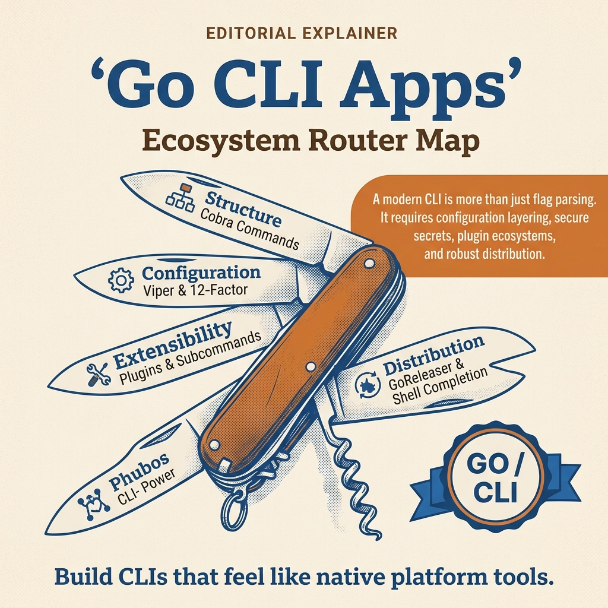

<!-- tags: golang, overview -->
# CLI Development in Go

> Build production-grade CLIs with Cobra and Viper: command tree, config layering, plugin/subcommand extensibility, release/distribution, and operational ergonomics.

📅 Updated: 2026-04-05 · ⏱️ 6 min read

## 1. DEFINE

Imagine a CLI command that just failed on a client machine because config precedence and secret layering were misunderstood. At that point, **CLI Development in Go** is no longer a decorative table of contents; it is where you must ensure the CLI operational contract is as clear as an API contract.

This hub does not exist to list files. It exists to help you pick the right entry point into `cli`: where to start, which articles to read sequentially, and which lane to take first when a real symptom appears.

### 1.1 Signals & Boundaries

- Open this hub when you know you are in the `cli` cluster but are unsure which article to read first.
- The hub's focus is mapping pain points to the correct document, not replacing each detail article.
- If you keep jumping to other articles and still feel lost, it is usually because the entry lane was wrong, not because more definitions are needed.

### 1.2 Learning Lanes

- `Cobra & Viper — Building Production-ready CLI Foundations` is the natural entry point if you want a clear anchor before going deep.
- `Config Layering & Secrets — Flags, Env, Files, Validation` fits better when you need to bridge to an adjacent lane or expand from foundations to production concerns.
- Keep this hub as a navigation map: after finishing an article, return here to pick the next step with intention.

## 2. VISUAL



*Figure: This router map gathers the main entry points so you can select the right article by symptom or learning goal.*


At this point, what is missing is not more definitions but a diagram compact enough to show where the decision points lie. The visual below does exactly that.

### Level 1

```text
choose pain point or learning goal
-> if you need a first anchor, start with Cobra & Viper — Building Production-ready CLI Foundations
-> read the core article or the most fitting lane
-> then move to recipe / incident / quiz
```

*Figure: Level 1 shows the `cli` hub should be used as a learning path router, not as a list to skim.*

### Level 2

```text
hub does not replace detail articles
hub only helps pick the right entry door
reading in the right order significantly reduces the feeling of fragmentation
that is the main value of a router-style README
```

*Figure: Level 2 emphasizes the real value of the `cli` hub: connecting the right article at the right time.*

## 3. CODE

The flow is clear at the conceptual level. Now lower it into an artifact that a Go team can read, review, and keep as an execution standard.

### Example 1: Router artifact — select article by reading goal

> **Goal**: Turn this hub into a navigation tool instead of a passive link table.
> **Approach**: Map learning goals or symptoms to the correct entry file.
> **Example**: Select lane by concern such as fundamentals, framework, concurrency, or production ops.
> **Complexity**: O(1) at the routing level; the important part is choosing the right entry.

```text
func chooseLane(goal string) string {
    switch goal {
    case "cobra viper": return "./01-cobra-viper.md"
    case "config layering and secrets": return "./02-config-layering-and-secrets.md"
    case "plugin and external subcommands": return "./03-plugin-and-external-subcommands.md"
    case "release distribution and shell completion": return "./04-release-distribution-and-shell-completion.md"
    default: return "./README.md"
    }
}
```

This pseudo-router is not code to run in an app; it is a way to compress the hub's navigation spirit into a concise artifact. Reading the hub with this mindset helps maintain a smoother learning pace.

## 4. PITFALLS

The most dangerous part of **CLI Development in Go** is usually not in theory, but in a few decisions that seem small yet completely change the outcome.

| # | Severity | Defect | Consequence | Fix |
| --- | --- | --- | --- | --- |
| 1 | 🔴 Fatal | Using the hub as a link list to skim | Fragmented learning and wrong entry point selection | Always start from a specific pain point or learning goal |
| 2 | 🟡 Common | Jumping straight into a deep article without foundation lane | Understanding terms in isolation and applying them incorrectly | Pick one entry point then follow the cluster rhythm |
| 3 | 🔵 Minor | Not returning to hub after reading | Losing inter-article connection rhythm | Return to hub after each lane to pick the next step |

## 5. REF

| Resource | Link | Notes |
| --- | --- | --- |
| Cobra docs | [https://cobra.dev/](https://cobra.dev/) | Command tree, flags, and CLI patterns |
| Viper repo | [https://github.com/spf13/viper](https://github.com/spf13/viper) | Configuration layering and env/file integration |
| GoReleaser docs | [https://goreleaser.com/](https://goreleaser.com/) | Release and distribution tooling for Go CLIs |

## 6. RECOMMEND

You have seen where **CLI Development in Go** stands in the larger flow. The RECOMMEND below helps connect it to the closest adjacent documents.

| Extension | When to read next | Rationale | File/Link |
| --- | --- | --- | --- |
| Cobra & Viper — Building Production-ready CLI Foundations | When a clear entry point is needed | Maintain smooth reading pace within the same cluster | [./01-cobra-viper.md](./01-cobra-viper.md) |
| Config Layering & Secrets — Flags, Env, Files, Validation | When bridging to the adjacent lane | Maintain smooth reading pace within the same cluster | [./02-config-layering-and-secrets.md](./02-config-layering-and-secrets.md) |
| Go Programming | When switching Go cluster | Return to root router to pick another lane | [../README.md](../README.md) |
