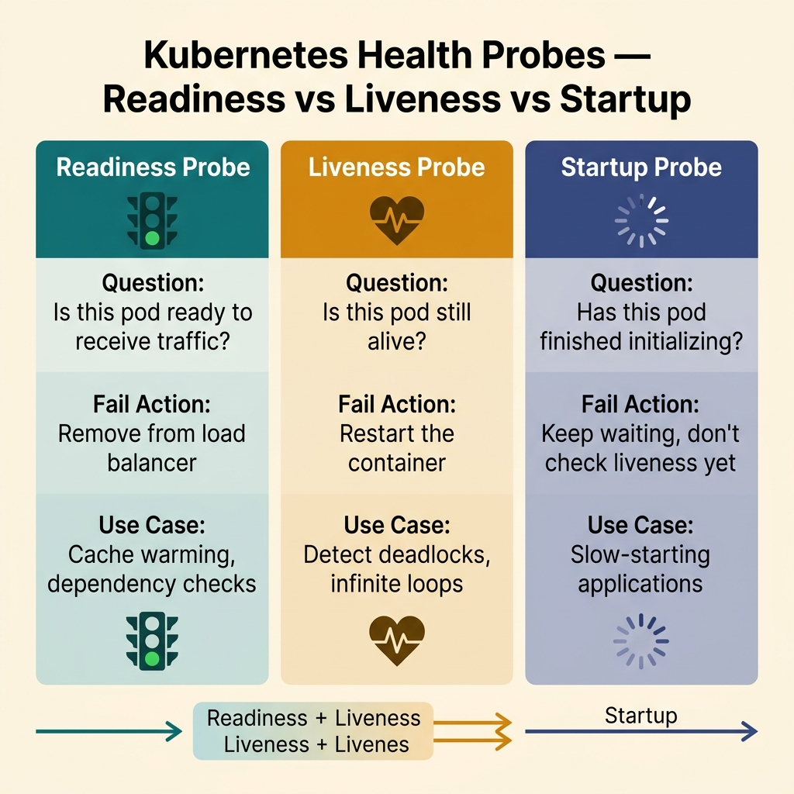
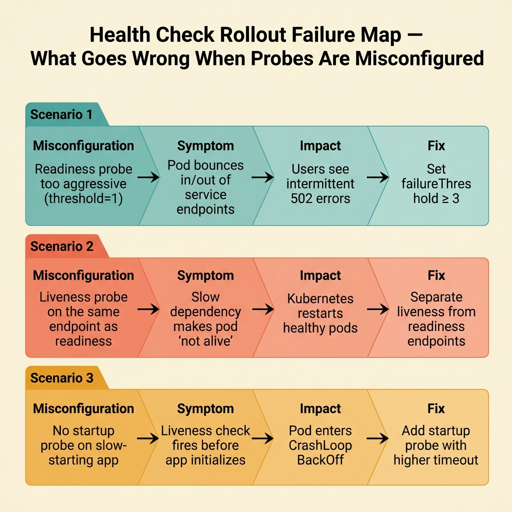

<!-- tags: golang, cloud-infra, health-check -->
# ❤️ Health Checks — Readiness, Liveness, Startup

> Health endpoint is not just for returning "200 OK". In cloud runtimes, readiness, liveness, and startup probes dictate when a service receives traffic, when it restarts, and when rollouts proceed.

📅 Created: 2026-03-28 · 🔄 Updated: 2026-04-09 · ⏱️ 17 min read

| Aspect | Detail |
| --- | --- |
| **Complexity** | Intermediate → Advanced |
| **Use case** | Go HTTP/gRPC services running on Kubernetes or container orchestration |
| **Go libs** | `net/http`, `context`, `sync/atomic` |
| **Prerequisites** | HTTP server basics, deployment concepts |

## 1. DEFINE

Imagine a rollout where the pod maps green on the dashboard but real requests are dropping. In that moment, **Health Checks — Readiness, Liveness, Startup** is no longer a pretty table of contents; it is where you must lock down the exact operational meaning behind each infrastructure signal.

> *K8s restart log OK. liveness DB slow CrashLoopBackOff.*

### How do readiness, liveness, and startup differ?

| Probe | Goal |
| --- | --- |
| Readiness | Is the service ready to receive traffic |
| Liveness | Is the process deadlocked and needs restart |
| Startup | Does slow booting apps need a dedicated grace period |

### Invariants

| Rule | Meaning |
| --- | --- |
| Readiness should reflect capability to handle new requests | Avoid routing traffic to draining or unbooted instances |
| Liveness should only fail when process cannot recover | Avoid restart loops |
| Probes must be fast and stable | Avoid turning probes into a dependency storm |

### Failure Modes

| Failure | Cause | Fix |
| --- | --- | --- |
| Pod receives traffic too early | Readiness always 200 from start | Only ready after successful initialization |
| Pod restarts repeatedly | Liveness check hits external dependency | Keep liveness simple, self-health only |
| Rollout stalls | Missing startup probe for slow-booting app | Use startup probe or increase initial delay |

The above failure modes sound basic. But there is a trap: using the same logic for readiness and liveness = pod killed when it only needed traffic pause, and overly heavy health check = cascade of probe timeouts. That trap will surface in PITFALLS.
## 2. VISUAL

For this article, one visual is not enough: one graphic to lock the semantics of each probe, and one to map where rollouts break when these semantics are misapplied.



*Figure: Probe compare card isolates `startup`, `readiness`, and `liveness` by teaching job and failure mode, ensuring one endpoint is not overloaded for three different decisions.*



*Figure: Rollout failure map illustrates why a pod might be "green" on the dashboard yet receive traffic prematurely or self-trigger restart loops.*

## 3. CODE

You have seen the path of signal, request, or goroutine in **Health Checks — Readiness, Liveness, Startup**. Now it is time to move to code to verify which parts must be written tightly to avoid production paying the price.

### Example 1: Basic — Readiness flag in service state

> **Goal**: Decouple the "ready for traffic" state from business logic, allowing clear toggle of readiness strictly following the lifecycle.
> **Approach**: Adopt `atomic.Bool` as the source of truth for readiness, as this flag is heavily read by HTTP probes and rarely written by bootstrap/shutdown flows.
> **Example**: Application initially holds `ready=false`; following successful bootstrap, issues `MarkReady()` letting the readiness probe return `200`.
> **Complexity**: O(1) read/write, O(1) space.

```go
// health_state.go — Track whether the service is ready to accept traffic
package cloudinfra

import "sync/atomic"

type HealthState struct {
	ready atomic.Bool
}

func (s *HealthState) MarkReady() {
	// ✅ Chỉ flip sang ready khi app thật sự có thể phục vụ request mới.
	s.ready.Store(true)
}

func (s *HealthState) MarkNotReady() {
	// ✅ Dùng trước shutdown/drain để load balancer dừng gửi traffic mới.
	s.ready.Store(false)
}

func (s *HealthState) IsReady() bool {
	return s.ready.Load()
}
```

> **Takeaway**: This example lays the minimum foundation for probe lifecycle. It does not yet differentiate semantics between readiness and liveness at the HTTP layer; that separation comes in the next example.

Health endpoints are covered. But dependency checks must be separated — let us categorize them.

### Example 2: Intermediate — Readiness and liveness handlers

> **Goal**: Compose 2 endpoints reflecting different semantics: readiness aligns with traffic safety, while liveness rigidly isolates process viability.
> **Approach**: Readiness queries `HealthState`; liveness stays strictly lightweight and avoids external dependencies resisting false restart loops.
> **Example**: Pod unfinished in bootstrap returns `503 /ready`, while `/live` consistently returns `200` as the process runs normally.
> **Complexity**: O(1) per request, O(1) extra space.

```go
// health_handlers.go — Separate readiness from liveness semantics
package cloudinfra

import (
	"net/http"
	"sync/atomic"
)

type HealthState struct {
	ready atomic.Bool
}

func (s *HealthState) IsReady() bool {
	return s.ready.Load()
}

func ReadinessHandler(state *HealthState) http.HandlerFunc {
	return func(w http.ResponseWriter, r *http.Request) {
		if !state.IsReady() {
			// ✅ 503 báo orchestrator biết instance chưa an toàn để nhận traffic.
			http.Error(w, "not ready", http.StatusServiceUnavailable)
			return
		}
		w.WriteHeader(http.StatusOK)
		_, _ = w.Write([]byte("ready"))
	}
}

func LivenessHandler() http.HandlerFunc {
	return func(w http.ResponseWriter, r *http.Request) {
		// ✅ Liveness giữ cực nhẹ; đừng gọi DB/Redis từ đây.
		w.WriteHeader(http.StatusOK)
		_, _ = w.Write([]byte("alive"))
	}
}
```

> **Takeaway**: With this, the service firmly holds correct probe contracts mapped to the orchestrator. The caveat is the readiness endpoint is strictly correct only if the boot and shutdown phases faithfully update `HealthState` at vital timings.

Dependency checks are covered. But readiness demands private logic — separate it away from liveness.

### Example 3: Advanced — Boot sequence sets readiness only after dependencies initialize

> **Goal**: Guarantee the pod flips to ready solely after all critical initializers complete, strictly avoiding traffic while the DB client, cache, or router remain unready.
> **Approach**: Bootstrap sequentially passes through initializers, securing `ready=false` until the entire block of critical phases finalizes.
> **Example**: Instantiates config, DB pool, router, and background workers; if any phase fails, the pod remains `not ready` stalling the rollout.
> **Complexity**: O(n) scaled by initializers; O(1) space outside dependency state.

```go
// boot_sequence.go — Flip readiness only after critical startup work completes
package cloudinfra

import (
	"context"
	"fmt"
	"sync/atomic"
)

type Initializer interface {
	Init(ctx context.Context) error
}

type HealthState struct {
	ready atomic.Bool
}

func (s *HealthState) MarkNotReady() {
	s.ready.Store(false)
}

func (s *HealthState) MarkReady() {
	s.ready.Store(true)
}

func Bootstrap(ctx context.Context, state *HealthState, initializers ...Initializer) error {
	state.MarkNotReady()

for _, initializer := range initializers {
		// ✅ Fail fast tại bootstrap để pod không nhận traffic trong trạng thái nửa sống nửa chết.
		if err := initializer.Init(ctx); err != nil {
			return fmt.Errorf("bootstrap init: %w", err)
		}
	}

state.MarkReady()
	return nil
}
```

> **Takeaway**: This example securely mounts readiness directly into the app lifecycle instead of just presenting a bare "return 200" endpoint. Never force every dependency health onto readiness if a failing dependency merely degrades a non-critical domain.

Readiness/liveness are covered. But startup probes demand proper configuration — let us align them.

### Example 4: Expert — Composite probe policy with traffic safety boundary

> **Goal**: Disentangle which dependency acts as critical for readiness against what distinctly deserves only logging/degradation, ensuring probes never explode into a dependency storm.
> **Approach**: Inject `ProbePolicy` and `DependencyStatus` enforcing readiness strictly around traffic safety boundaries rather than letting any failing dependency ruthlessly fail the pod.
> **Example**: DB constitutes critical infrastructure triggering readiness failure; an analytics publisher operates non-critical, demanding degraded logging while the pod seamlessly handles core traffic.
> **Complexity**: O(n) bounded by queried dependencies; O(1) space outside the status list.

```go
// probe_policy.go — Decide readiness from critical dependency set instead of all dependencies equally
package cloudinfra

type DependencyStatus struct {
	Name     string
	Critical bool
	Healthy  bool
}

type ProbePolicy struct {
	Statuses []DependencyStatus
}

func (p ProbePolicy) ReadyForTraffic() bool {
	for _, status := range p.Statuses {
		// ✅ Chỉ dependency critical mới được quyền chặn traffic mới.
		if status.Critical && !status.Healthy {
			return false
		}
	}

return true
}
```

> **Takeaway**: This is where readiness distinctly mounts into production-grade posture: it solely drives "should new traffic reliably hit this pod", avoiding the trap assessing "is the entire ecosystem operating flawlessly". Apply this pattern strictly wherever services handle auxiliary dependencies like analytics, audit, or async publishers that must never drag down the primary rollout.
```

You have navigated through health, dependency, readiness, and startup boundaries. Now traversing into the hot zone: probe confusion and deeply heavy health checks — the trap staged from the inception of this piece.

## 4. PITFALLS

The flawless mechanics of **Health Checks — Readiness, Liveness, Startup** are entrenched. The pitfalls beneath operate as zones where timing, ownership, or evidence inherently falter, remaining invisible until an incident dramatically rips apart production.

| # | Defect | Fix |
| --- | --- | --- |
| 1 | Readiness blindly pushes 200 from cold boot | Only mark ready after full startup finalizes |
| 2 | Liveness check relentlessly hits external DB/Redis | Liveness must solely protect sheer self-health |
| 3 | Minimal dependency spasm traps the pod inside a restart loop | Enforce readiness degradation instead of ruthless liveness exhaustion |
| 4 | Disregarding readiness lockdown during core shutdown phase | Systematically mark not-ready preceding traffic drain |

You have aggressively traversed health check patterns and distinct traps. The embedded resources below will drive deeper alignment.

## 5. REF

| Resource | Link |
| --- | --- |
| Kubernetes probes | https://kubernetes.io/docs/tasks/configure-pod-container/configure-liveness-readiness-startup-probes/ |
| Go `net/http` | https://pkg.go.dev/net/http |
| gRPC health checking protocol | https://grpc.io/docs/guides/health-checking/ |

## 6. RECOMMEND

You have acquired optimal context regarding **Health Checks — Readiness, Liveness, Startup** enabling deeply intentional progression. The designated paths beneath definitively push expansion toward precisely aligned tooling, runtime, or architectural patterns.

| Extension | When | Rationale |
| --- | --- | --- |
| gRPC health protocol | Service strictly leveraging massive gRPC flow | Probe contracts established on transport explicitly stabilize uniformity | [01-grpc-protobuf.md](../microservices/01-grpc-protobuf.md) |
| Graceful shutdown | Service properly understands traffic staging but lacks deep cessation routing | Readiness manifests authentic resilience only once anchored seamlessly across the drain sequence | [02-graceful-shutdown-connection-draining.md](./02-graceful-shutdown-connection-draining.md) |
| Kubernetes rollout discipline | Probe semantics rigorously hold but external rollout ruthlessly shatters orchestrator stability | Bridge strict probe contracting directly against raw manifest and core rollout behavior | [02-kubernetes.md](../deployment/02-kubernetes.md) |

## 7. QUIZ

### Quick Check

1. Exactly what rigid functional goals fundamentally differentiate readiness from liveness?
2. Why is triggering heavy external dependencies unequivocally forbidden from inside the liveness perimeter?
3. Amidst shutdown, exactly which distinct probe must execute an immediate state pivot?

### Answer Key

1. Readiness strictly confirms traffic acceptance capability; liveness strictly tracks process exhaustion necessitating hard restarts.
2. Because heavy hits violently trigger false restart loops even when the core process stands deeply resilient.
3. Readiness; halting inbound traffic remains the immediate absolute priority preceding shutdown destruction.

## 8. NEXT STEPS

- Read ahead [Graceful Shutdown — SIGTERM, Draining, Worker Stop](./02-graceful-shutdown-connection-draining.md)
- Or jump to [Deployment in Go](../deployment/README.md)
