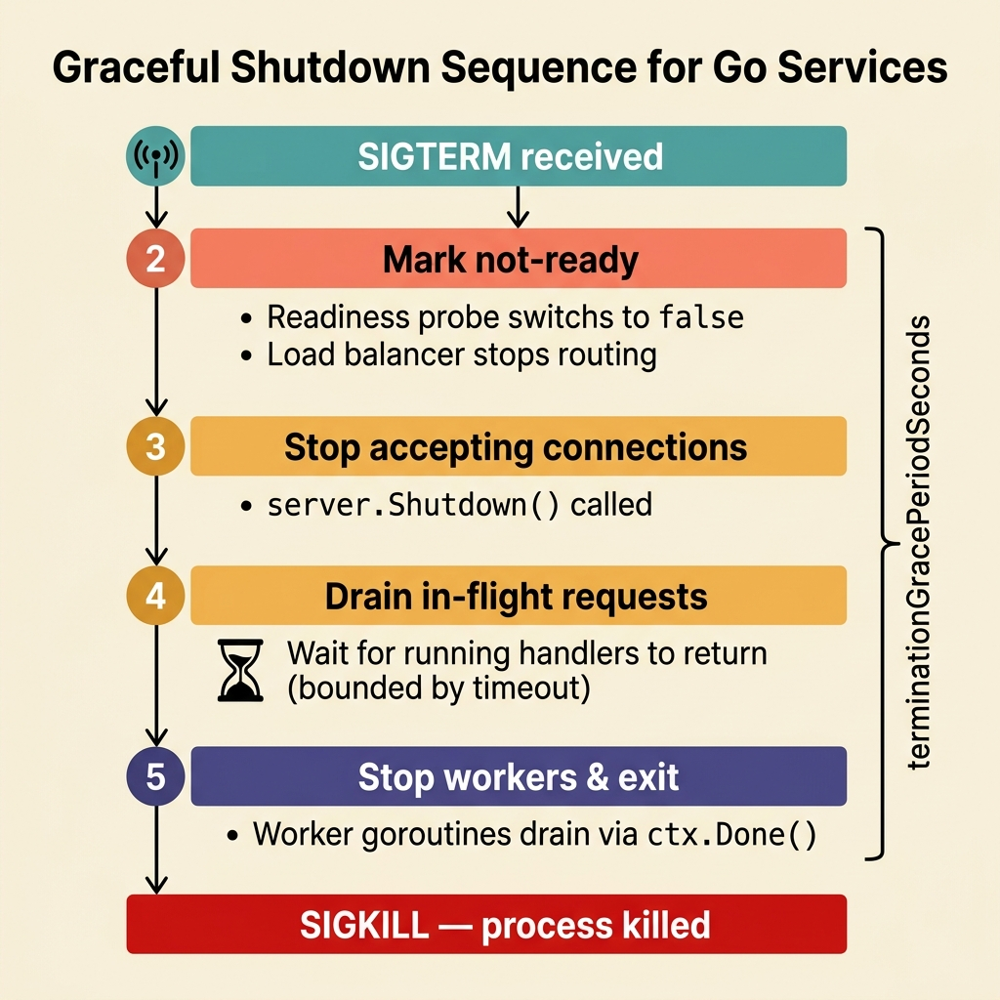
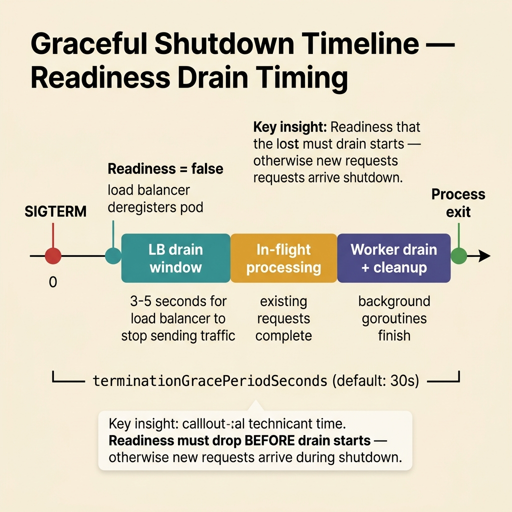

<!-- tags: golang, cloud-infra, graceful-shutdown -->
# 🛑 Graceful Shutdown — SIGTERM, Draining, Worker Stop

> Cloud platforms do not kill pods instantly. They send SIGTERM and wait. If a Go service ignores that signal, running requests break mid-flight, workers abandon jobs, and every rollout generates a spike of 502 errors.

📅 Created: 2026-03-28 · 🔄 Updated: 2026-04-09 · ⏱️ 18 min read

| Aspect | Detail |
| --- | --- |
| **Complexity** | Advanced |
| **Use case** | HTTP servers, queue workers, background jobs running on containers/K8s |
| **Go libs** | `context`, `net/http`, `os/signal`, `syscall`, `sync` |
| **Prerequisites** | contexts, server lifecycle, readiness probes |

## 1. DEFINE

Graceful shutdown has four steps. Skip one and you get error spikes, zombie goroutines, or data loss.

1. Stop accepting new traffic (mark readiness probe as not ready).
2. Wait for in-flight requests to complete.
3. Stop workers and background goroutines in order.
4. Exit before `terminationGracePeriodSeconds` expires.

### Invariants

| Rule | Meaning |
| --- | --- |
| Sink readiness first | The load balancer needs time to deregister the pod. Mark not-ready before stopping the server. |
| Enforce a global shutdown timeout | Without a timeout, a stuck handler blocks shutdown forever. The platform sends SIGKILL. |
| Workers must listen to `ctx.Done()` | A goroutine that ignores cancellation leaks memory and may process stale data. |

### Failure Modes

| Failure | Cause | Fix |
| --- | --- | --- |
| 502 error spike during rollout | Pod accepts traffic while shutting down | Mark not-ready before starting the shutdown sequence |
| Job severed mid-processing | Worker ignores the cancellation signal | Propagate the root context into all workers |
| Process killed by SIGKILL | Shutdown exceeds the grace period | Shorten cleanup, prioritize draining over cleanup tasks |

## 2. VISUAL

Two visuals clarify graceful shutdown. The first shows the event sequence. The second shows the timing boundary between readiness drain, in-flight processing, and the hard timeout.



*Figure: Shutdown progresses in order: capture signal → mark not-ready → stop accepting connections → drain in-flight requests → stop workers → exit. Breaking this sequence causes error spikes.*



*Figure: Readiness drops immediately after SIGTERM. The remaining grace period is split between in-flight request draining and worker cleanup. If both exceed the grace period, the platform sends SIGKILL.*

## 3. CODE

### Example 1: Basic — Signal-aware root context

> **Goal**: Convert SIGTERM/SIGINT into a root cancellation context that the entire application shares.
> **Complexity**: Basic

```go
// signal_context.go — Convert SIGTERM/SIGINT into a root cancellation context
package cloudinfra

import (
	"context"
	"os/signal"
	"syscall"
)

func RootSignalContext() (context.Context, context.CancelFunc) {
	// One root context ensures HTTP, workers, and background tasks stop together.
	return signal.NotifyContext(context.Background(), syscall.SIGINT, syscall.SIGTERM)
}
```

**Why?** `signal.NotifyContext` creates a context that cancels when the process receives SIGTERM or SIGINT. Every component that derives from this context stops when the signal arrives. No manual channel wiring needed.

### Example 2: Intermediate — Graceful HTTP shutdown

> **Goal**: Stop accepting new requests and let in-flight requests finish within a bounded timeout.
> **Complexity**: Intermediate

```go
// graceful_http.go — Stop accepting new requests and wait for inflight handlers
package cloudinfra

import (
	"context"
	"fmt"
	"net/http"
	"time"
)

func ServeHTTP(ctx context.Context, server *http.Server) error {
	errCh := make(chan error, 1)

	go func() {
		// ErrServerClosed is expected when Shutdown() is called.
		if err := server.ListenAndServe(); err != nil && err != http.ErrServerClosed {
			errCh <- fmt.Errorf("listen and serve: %w", err)
		}
	}()

	select {
	case err := <-errCh:
		return err
	case <-ctx.Done():
		// Shutdown timeout must be shorter than the platform's termination grace period.
		shutdownCtx, cancel := context.WithTimeout(context.Background(), 10*time.Second)
		defer cancel()
		return server.Shutdown(shutdownCtx)
	}
}
```

**Why?** `server.Shutdown` stops accepting new connections and waits for in-flight handlers to return. The 10-second timeout prevents a stuck handler from blocking the shutdown forever. If the handler needs more than 10 seconds, the context cancels and the process exits.

### Example 3: Advanced — Worker draining with stop-pull behavior

> **Goal**: Stop fetching new jobs when shutdown starts. Let running jobs finish.
> **Complexity**: Advanced

```go
// worker_drain.go — Stop fetching new jobs and wait for inflight jobs to finish
package cloudinfra

import (
	"context"
	"sync"
)

type Job func(context.Context) error

type Worker struct {
	wg sync.WaitGroup
}

func (w *Worker) Run(ctx context.Context, jobs <-chan Job) {
	for {
		select {
		case <-ctx.Done():
			// Shutdown started. Wait for running jobs to finish, then exit.
			w.wg.Wait()
			return
		case job, ok := <-jobs:
			if !ok {
				w.wg.Wait()
				return
			}

			w.wg.Add(1)
			go func(job Job) {
				defer w.wg.Done()
				// The handler must also respect ctx.Done(), or drain can hang.
				_ = job(ctx)
			}(job)
		}
	}
}
```

**Why?** When `ctx.Done()` fires, the worker stops pulling from the channel. The `WaitGroup` blocks until every running job finishes. This prevents two problems: accepting work that will be killed mid-flight, and exiting before running work completes.

### Example 4: Expert — Full shutdown coordinator with readiness drain

> **Goal**: Chain readiness collapse, HTTP shutdown, and worker drain into a single testable sequence.
> **Complexity**: Expert

```go
// shutdown_coordinator.go — Coordinate readiness drain, HTTP shutdown and worker drain
package cloudinfra

import (
	"context"
	"fmt"
	"net/http"
	"sync/atomic"
	"time"
)

type HealthState struct {
	ready atomic.Bool
}

func (s *HealthState) MarkNotReady() {
	s.ready.Store(false)
}

func ShutdownGracefully(
	state *HealthState,
	server *http.Server,
	drainWorkers func(context.Context) error,
) error {
	state.MarkNotReady()

	shutdownCtx, cancel := context.WithTimeout(context.Background(), 15*time.Second)
	defer cancel()

	if err := server.Shutdown(shutdownCtx); err != nil {
		return fmt.Errorf("shutdown http server: %w", err)
	}

	if err := drainWorkers(shutdownCtx); err != nil {
		return fmt.Errorf("drain workers: %w", err)
	}

	return nil
}
```

**Why?** One coordinator, one timeout, one sequence: mark not-ready → drain HTTP → drain workers. When an incident hits, the on-call engineer knows exactly which step the service stopped at. Scattering shutdown logic across packages makes debugging impossible at 3 AM.

## 4. PITFALLS

| # | Defect | Fix |
| --- | --- | --- |
| 1 | Calling `os.Exit` the moment SIGTERM arrives | Run the full graceful sequence with a bounded timeout |
| 2 | Shutting down HTTP but leaving background workers running | Chain all goroutine lifecycles under the root context |
| 3 | Relying on a static `preStop` sleep instead of active draining | Implement readiness drop + active drain instead of sleeping |
| 4 | No logging of whether shutdown completed or timed out | Log the shutdown outcome and total duration for post-incident analysis |

## 5. REF

| Resource | Link |
| --- | --- |
| Go `http.Server.Shutdown` | https://pkg.go.dev/net/http#Server.Shutdown |
| Kubernetes pod termination | https://kubernetes.io/docs/concepts/workloads/pods/pod-lifecycle/#pod-termination |

## 6. RECOMMEND

| Extension | When | Rationale | Link |
| --- | --- | --- | --- |
| preStop hook | Load balancer deregistration is slow | Gives the LB time to stop routing traffic before the pod starts draining | [05-progressive-rollout-and-rollback.md](./05-progressive-rollout-and-rollback.md) |
| In-flight request gauge | High traffic with slow handlers | Shows exactly which phase of shutdown is blocking | Observability lane |
| Worker visibility timeout | Long-running queue jobs that risk duplication on pod kill | Pairs graceful shutdown with message consumption safety | [Messaging lane](../messaging/README.md) |

## 7. QUIZ

### Quick Check

1. What is the first step in graceful shutdown behind a load balancer?
2. Why must workers stop pulling new jobs before draining?
3. Is a global shutdown timeout required?

### Answer Key

1. Mark the readiness probe as not ready. This stops the load balancer from sending new traffic to the pod.
2. If workers keep pulling, they accept jobs that will be killed when the grace period expires. Stop pulling first, then wait for running jobs.
3. Yes. Without a timeout, a stuck handler or job blocks shutdown forever. The platform sends SIGKILL and you lose all in-flight work.

## 8. NEXT STEPS

- Read ahead [ConfigMaps, Secrets & Runtime Config](./03-configmaps-secrets-runtime-config.md)
- Or consult [Graceful Shutdown Best Practice](../../best-practice/10-graceful-shutdown.md)
