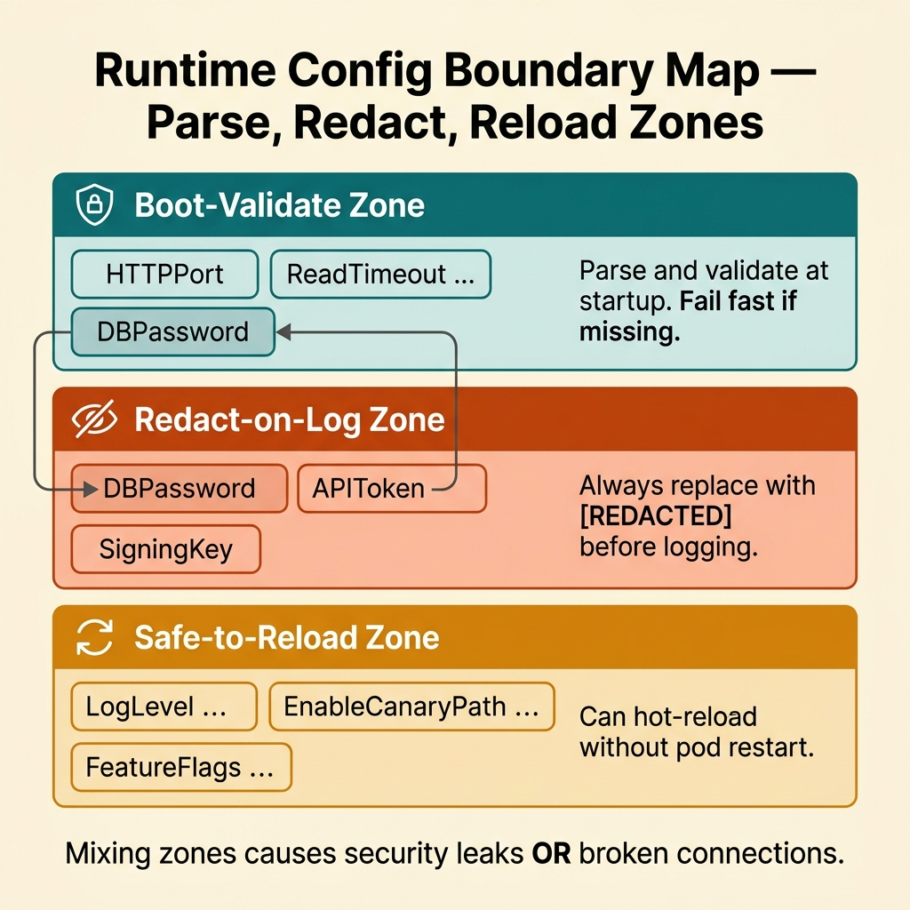

<!-- tags: golang, cloud-infra, configuration -->
# 🔐 ConfigMaps, Secrets & Runtime Config — Keep Configuration Boring

📅 Created: 2026-03-28 · 🔄 Updated: 2026-04-09 · ⏱️ 16 min read

| Aspect | Detail |
| --- | --- |
| **Complexity** | Intermediate → Advanced |
| **Use case** | Services that deploy across multiple environments with secrets, feature flags, and connection settings |
| **Go libs** | `os`, `fmt`, `time`, `strings` |
| **Prerequisites** | Environment configuration basics, Kubernetes deployment pipeline |

## 1. DEFINE

Configuration and secrets serve different purposes and need different treatment.

| Type | Example | Where it belongs |
| --- | --- | --- |
| Config | port, feature flag, timeout, log level | Environment variables / ConfigMap |
| Secret | DB password, API token, signing key | Vault or native K8s Secret |

### Invariants

| Rule | Meaning |
| --- | --- |
| Config must validate at boot | Fail fast. A missing required value should crash the pod before it receives traffic. |
| Never log raw secrets | A leaked password in logs is a security incident. Redact before serialization. |
| Default values require intention | Random defaults cause invisible configuration drift across environments. |

## 2. VISUAL

The boundary map below separates fields by lifecycle: which ones validate at boot, which ones can hot-reload, and which ones require a pod restart.



*Figure: Config fields split into three zones — boot-validate (ports, passwords), redact-on-log (secrets), and safe-to-reload (log level, feature flags). Mixing zones causes either security leaks or broken connections.*

## 3. CODE

### Example 1: Basic — Typed config loader

> **Goal**: Parse environment variables into a typed struct at startup. Fail if required secrets are missing.
> **Complexity**: Basic

```go
// config_loader.go — Parse typed runtime configuration from environment variables
package cloudinfra

import (
	"fmt"
	"os"
	"strconv"
	"time"
)

type Config struct {
	HTTPPort         string
	ReadTimeout      time.Duration
	LogLevel         string
	EnableCanaryPath bool
	DBPassword       string
}

func LoadConfig() (Config, error) {
	readTimeoutSec, err := strconv.Atoi(getEnv("READ_TIMEOUT_SEC", "5"))
	if err != nil {
		return Config{}, fmt.Errorf("parse READ_TIMEOUT_SEC: %w", err)
	}

	cfg := Config{
		HTTPPort:         getEnv("HTTP_PORT", "8080"),
		ReadTimeout:      time.Duration(readTimeoutSec) * time.Second,
		LogLevel:         getEnv("LOG_LEVEL", "info"),
		EnableCanaryPath: getEnv("ENABLE_CANARY_PATH", "false") == "true",
		DBPassword:       os.Getenv("DB_PASSWORD"),
	}

	// Required secrets trigger immediate failure at startup.
	if cfg.DBPassword == "" {
		return Config{}, fmt.Errorf("DB_PASSWORD is required")
	}

	return cfg, nil
}

func getEnv(key string, fallback string) string {
	if value := os.Getenv(key); value != "" {
		return value
	}
	return fallback
}
```

**Why?** Missing database credentials guarantee eventual failure. Failing at boot alerts the deployment pipeline immediately. The rollback happens before traffic routes to the broken pod.

### Example 2: Intermediate — Safe config logging

> **Goal**: Create a redacted config view for logging during rollouts. Passwords never appear in logs.
> **Complexity**: Intermediate

```go
// config_redaction.go — Expose a log-safe view of runtime config
package cloudinfra

import "time"

type Config struct {
	HTTPPort         string
	ReadTimeout      time.Duration
	LogLevel         string
	EnableCanaryPath bool
	DBPassword       string
}

type SafeConfigView struct {
	HTTPPort         string `json:"http_port"`
	ReadTimeout      string `json:"read_timeout"`
	LogLevel         string `json:"log_level"`
	EnableCanaryPath bool   `json:"enable_canary_path"`
	DBPassword       string `json:"db_password"`
}

func (c Config) SafeView() SafeConfigView {
	return SafeConfigView{
		HTTPPort:         c.HTTPPort,
		ReadTimeout:      c.ReadTimeout.String(),
		LogLevel:         c.LogLevel,
		EnableCanaryPath: c.EnableCanaryPath,
		// Redact sensitive credentials to prevent log leaks.
		DBPassword:       "[REDACTED]",
	}
}
```

**Why?** Go's JSON serializer reflects every exported field. If you log `Config` directly, `DBPassword` appears in plaintext. A separate `SafeConfigView` struct guarantees secrets are overwritten before serialization.

### Example 3: Advanced — Controlled runtime reload boundary

> **Goal**: Allow hot-reload for safe fields (log level, feature flags). Force pod restarts for connection-critical fields (port, password).
> **Complexity**: Advanced

```go
// config_reload_boundary.go — Only hot-reload fields that are safe to change live
package cloudinfra

import "time"

type Config struct {
	HTTPPort         string
	ReadTimeout      time.Duration
	LogLevel         string
	EnableCanaryPath bool
	DBPassword       string
}

type RuntimeSettings struct {
	LogLevel         string
	EnableCanaryPath bool
}

func DeriveRuntimeSettings(cfg Config) RuntimeSettings {
	return RuntimeSettings{
		// Only copy fields safe for live-reloading.
		LogLevel:         cfg.LogLevel,
		EnableCanaryPath: cfg.EnableCanaryPath,
	}
}
```

**Why?** Without a clear boundary, operators hot-reload database passwords. Half the application runs old connections while new schema loads. The `RuntimeSettings` struct makes the boundary explicit: only these fields change at runtime.

### Example 4: Expert — Validate rollout-safe config policy

> **Goal**: Block live reload when restart-required fields change. Force a pod restart instead.
> **Complexity**: Expert

```go
// config_policy.go — Reject live reload when restart-required fields change
package cloudinfra

import (
	"fmt"
	"time"
)

type Config struct {
	HTTPPort         string
	ReadTimeout      time.Duration
	LogLevel         string
	EnableCanaryPath bool
	DBPassword       string
}

func ValidateLiveReload(oldCfg Config, newCfg Config) error {
	if oldCfg.HTTPPort != newCfg.HTTPPort {
		return fmt.Errorf("HTTP_PORT requires restart")
	}

	if oldCfg.DBPassword != newCfg.DBPassword {
		return fmt.Errorf("DB_PASSWORD requires restart")
	}

	// LogLevel and EnableCanaryPath can change safely at runtime.
	return nil
}
```

**Why?** This guard prevents automated tools from hot-reloading a new database password. The system forces a pod restart, ensuring all connections reinitialize with the new credentials.

## 4. PITFALLS

| # | Severity | Defect | Impact | Fix |
|---|----------|--------|--------|-----|
| 1 | 🔴 Fatal | Scattering string-based config lookups across the codebase | Type mismatches cause runtime panics | Load all config into a typed struct at boot |
| 2 | 🔴 Fatal | Silent defaults for required secrets | Pod starts without credentials and crashes on first request | Fail fast at boot if required secrets are missing |
| 3 | 🟡 Common | Hot-reloading connection-critical fields | Half the app uses old connections, half uses new ones | Limit live reload to safe fields only |
| 4 | 🔵 Minor | Inconsistent env var naming across environments | Deployment friction and debugging confusion | Use a uniform naming schema across all environments |

## 5. REF

| Resource | Link |
| --- | --- |
| Twelve-Factor config | https://12factor.net/config |
| Kubernetes ConfigMap | https://kubernetes.io/docs/concepts/configuration/configmap/ |
| Kubernetes Secret | https://kubernetes.io/docs/concepts/configuration/secret/ |

## 6. RECOMMEND

| Extension | When to proceed | Rationale |
| --- | --- | --- |
| Secret Manager Integration | When secrets need automated rotation | Eliminates hardcoded secrets and their expiration risk |
| [Config Checksum Rollout](../deployment/02-kubernetes.md) | When ConfigMap changes must trigger pod restarts | Ensures atomic pod replacement when config changes |
| [Feature Flag Service](../microservices/07-config-secrets-feature-flags.md) | When feature flags grow beyond simple booleans | Manages complex rollout logic outside of environment variables |

## 7. QUIZ

### Quick Check

1. Why do configs and secrets belong in different storage mechanisms?
2. Why must config validate at boot?
3. Is it safe to hot-reload all configuration fields?

### Answer Key

1. Configs are variable across environments but not sensitive. Secrets require encryption, access control, and audit logging that ConfigMaps do not provide.
2. Validation at boot catches missing or malformed values before the pod receives traffic. Without it, the first request triggers a runtime error.
3. No. Only safe fields (log level, feature flags) can hot-reload. Connection-critical fields (ports, passwords) require pod restarts.

## 8. NEXT STEPS

- Proceed to [Horizontal Scaling & Queue Workers](./04-horizontal-scaling-queue-workers.md)
- Or jump to [Config, Secrets & Feature Flags](../microservices/07-config-secrets-feature-flags.md)
