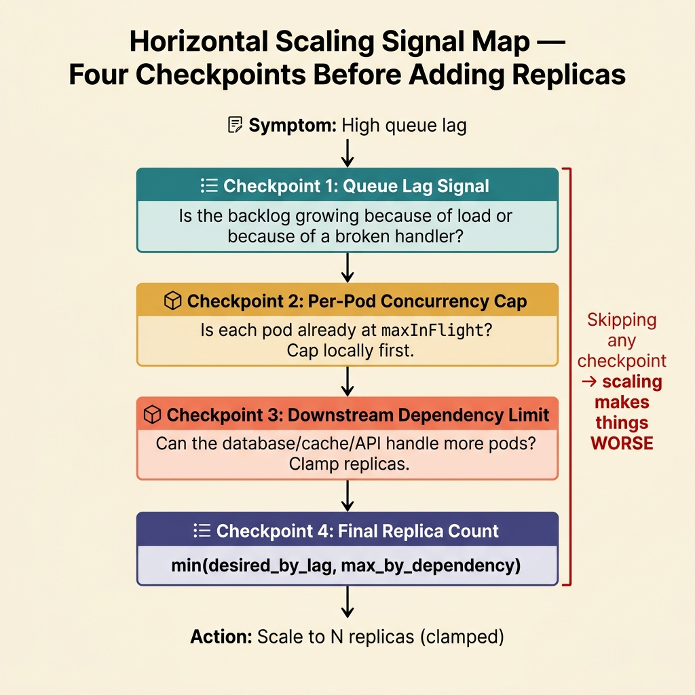

<!-- tags: golang, cloud-infra, scaling -->
# 📦 Horizontal Scaling — HTTP Replicas, Worker Concurrency, Queue Lag

> Scaling is not "add more pods." If each pod has no concurrency cap, adding replicas multiplies the load on your database. If queue lag grows because the handler is broken, more pods process more broken work. This article teaches you to scale against the right signal.

📅 Created: 2026-03-28 · 🔄 Updated: 2026-04-09 · ⏱️ 17 min read

| Aspect | Detail |
| --- | --- |
| **Complexity** | Advanced |
| **Use case** | Go APIs and queue workers that need autoscaling based on CPU, latency, or queue lag |
| **Go libs** | `context`, `sync/atomic`, `time` |
| **Prerequisites** | worker pools, metrics, queue basics |

## 1. DEFINE

Horizontal scaling has four components. Miss one and the other three make things worse.

| Component | Question it answers |
| --- | --- |
| HTTP replicas | Does adding pods reduce request latency? |
| Worker concurrency | How many jobs can one pod process simultaneously? |
| Queue lag | Is the growing backlog caused by CPU, I/O, or a broken handler? |
| Dependency limits | Can downstream services (DB, cache, APIs) survive the increased load? |

### Invariants

| Rule | Meaning |
| --- | --- |
| Scale signals must match the bottleneck | Do not scale CPU when the bottleneck is I/O or a slow database |
| Replica count and per-pod concurrency must be tuned together | Adding pods without capping per-pod concurrency multiplies downstream pressure |
| Queue lag needs context from throughput and error metrics | A growing backlog often means a broken handler, not insufficient replicas |

### Failure Modes

| Failure | Cause | Fix |
| --- | --- | --- |
| Scaling crushes the database | Autoscaler watches CPU only; ignores connection pool limits | Include dependency limits and connection pool caps in the scaling policy |
| Worker duplication and timeouts | Unbounded concurrency per pod | Cap per-pod concurrency with a local limiter |
| Cost inflation with no latency improvement | Scaling against the wrong signal | Route scaling decisions through lag + throughput + error metrics |

## 2. VISUAL

The signal map below shows how scaling decisions should flow: from symptom to signal to action.



*Figure: Scaling decisions route through four checkpoints: queue lag signal, per-pod concurrency cap, downstream dependency limit, and final replica count. Skipping any checkpoint produces a scaling policy that makes things worse.*

## 3. CODE

### Example 1: Basic — Cap worker concurrency per pod

> **Goal**: Limit how many jobs a single pod can process at the same time.
> **Complexity**: Basic

```go
// worker_limits.go — Bound local worker concurrency instead of scaling blindly
package cloudinfra

import "sync/atomic"

type WorkerLimiter struct {
	maxInFlight int64
	inFlight    atomic.Int64
}

func NewWorkerLimiter(maxInFlight int64) *WorkerLimiter {
	return &WorkerLimiter{maxInFlight: maxInFlight}
}

func (l *WorkerLimiter) TryAcquire() bool {
	current := l.inFlight.Load()
	if current >= l.maxInFlight {
		return false
	}

	// CAS ensures the limiter is safe when multiple goroutines compete for a slot.
	return l.inFlight.CompareAndSwap(current, current+1)
}

func (l *WorkerLimiter) Release() {
	l.inFlight.Add(-1)
}
```

**Why?** Without a local concurrency cap, each pod accepts unlimited work. When the autoscaler adds replicas, each new pod also accepts unlimited work — multiplying the load on the database and downstream APIs. This limiter prevents that cascade.

### Example 2: Intermediate — Derive scaling hint from queue lag

> **Goal**: Convert queue lag into a coarse scaling recommendation.
> **Complexity**: Intermediate

```go
// lag_signal.go — Convert queue lag into a coarse scaling recommendation
package cloudinfra

func DesiredReplicas(queueLag int, currentReplicas int) int {
	switch {
	case queueLag > 5000:
		return currentReplicas + 3
	case queueLag > 1000:
		return currentReplicas + 1
	default:
		return currentReplicas
	}
}
```

**Why?** Queue lag is a better scaling signal than CPU for I/O-bound workers. But lag alone is not enough — if the lag grows because the database is slow or the handler is broken, adding pods only makes the problem worse. Always pair lag with throughput and error metrics.

### Example 3: Advanced — Concurrency-aware worker execution

> **Goal**: Reject new jobs when the pod is saturated instead of accepting work that will timeout.
> **Complexity**: Advanced

```go
// worker_execution.go — Refuse new jobs locally when pod is already saturated
package cloudinfra

import (
	"context"
	"fmt"
	"sync/atomic"
)

type WorkerLimiter struct {
	maxInFlight int64
	inFlight    atomic.Int64
}

func (l *WorkerLimiter) TryAcquire() bool {
	current := l.inFlight.Load()
	if current >= l.maxInFlight {
		return false
	}
	return l.inFlight.CompareAndSwap(current, current+1)
}

func (l *WorkerLimiter) Release() {
	l.inFlight.Add(-1)
}

type JobHandler func(context.Context) error

func HandleJob(ctx context.Context, limiter *WorkerLimiter, handler JobHandler) error {
	if !limiter.TryAcquire() {
		// Map this error to a retry/backoff policy at the broker or orchestrator level.
		return fmt.Errorf("worker saturated")
	}
	defer limiter.Release()

	return handler(ctx)
}
```

**Why?** The pod protects itself before the autoscaler reacts. When the pod is full (32 in-flight jobs), job 33 fails fast with "worker saturated." The broker retries after backoff instead of the job sitting in the pod until it times out.

### Example 4: Expert — Scaling decision with downstream cap

> **Goal**: Combine queue lag with dependency limits so autoscaling does not overwhelm the database.
> **Complexity**: Expert

```go
// scaling_policy.go — Combine queue lag demand with downstream safety limits
package cloudinfra

func DesiredWorkerReplicas(queueLag int, currentReplicas int, maxReplicasByDependency int) int {
	desired := DesiredReplicas(queueLag, currentReplicas)
	if desired > maxReplicasByDependency {
		// Clamp to dependency cap so autoscaling does not push the system into overload.
		return maxReplicasByDependency
	}

	return desired
}
```

**Why?** Lag says "I want 10 replicas." The database can only handle 6 pods worth of connections. Without the clamp, the autoscaler adds 10 pods and the database connection pool exhausts. This function enforces the hard constraint.

## 4. PITFALLS

| # | Defect | Fix |
| --- | --- | --- |
| 1 | Scaling on CPU for I/O-bound queue workers | Use lag, throughput, and error signals instead |
| 2 | Adding replicas while each pod has no concurrency cap | Cap local concurrency first, then scale replicas |
| 3 | No scale-down testing | Verify drain and timeout behavior when pods are removed |
| 4 | Ignoring DB connection pool limits in scaling policy | Tune pool size in proportion to max replica count |

## 5. REF

| Resource | Link |
| --- | --- |
| Kubernetes HPA | https://kubernetes.io/docs/tasks/run-application/horizontal-pod-autoscale/ |
| KEDA | https://keda.sh/ |
| Queue-based autoscaling | https://learnk8s.io/scaling-celery-rabbitmq-kubernetes |

## 6. RECOMMEND

| Extension | When | Rationale |
| --- | --- | --- |
| KEDA for queue workers | When you need to scale against queue lag or message counts | KEDA outperforms CPU-only HPA for async workloads |
| Load-shedding | When downstream services have hard rate limits | Protects dependencies when scaling alone cannot solve the bottleneck |
| [Queue partitioning](../messaging/README.md) | When backlog is concentrated in specific tenants or topics | Separates scaling boundaries instead of dumping all pressure onto one worker pool |

## 7. QUIZ

### Quick Check

1. Why must replica count and per-pod concurrency be tuned together?
2. Does growing queue lag always mean "add more pods"?
3. Which scaling signal is more accurate than CPU for I/O-bound workers?

### Answer Key

1. Because adding replicas without per-pod limits multiplies downstream pressure. Each new pod sends uncapped concurrent requests to the database.
2. No. Growing lag often means a slow dependency or a broken handler. Adding pods makes the problem worse by processing more broken work.
3. Queue lag, throughput, and error rate. These track the actual bottleneck more accurately than CPU utilization for I/O-bound workloads.

## 8. NEXT STEPS

- Proceed to [Progressive Rollout & Rollback](./05-progressive-rollout-and-rollback.md)
- Or return to [Messaging](../messaging/README.md)
