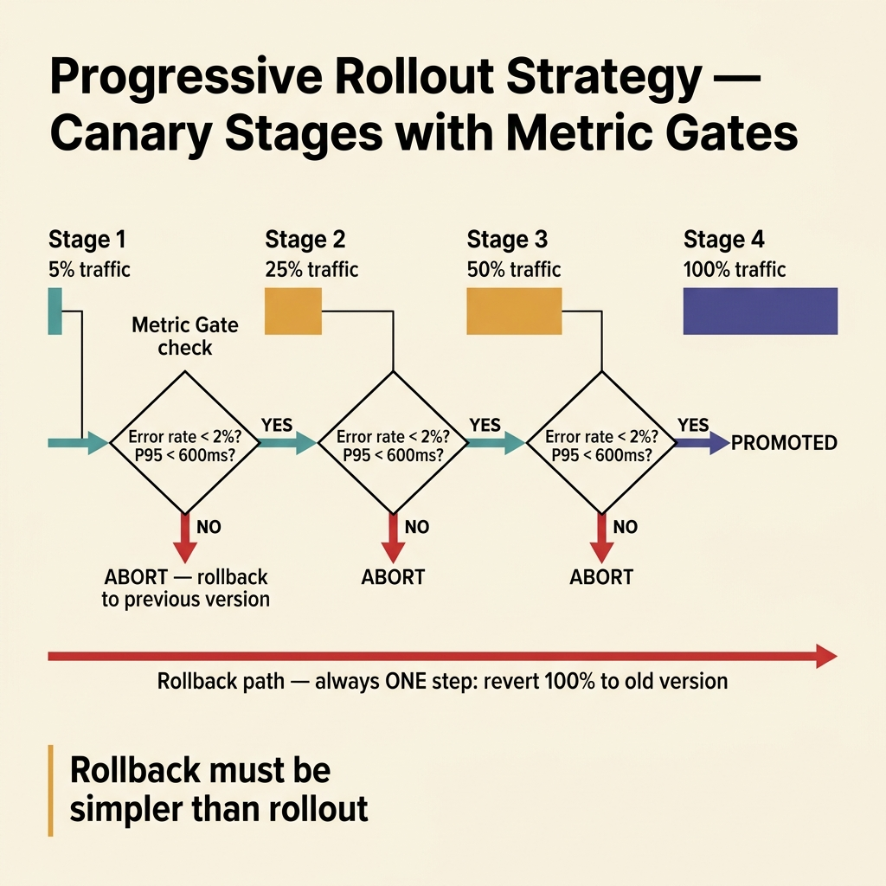
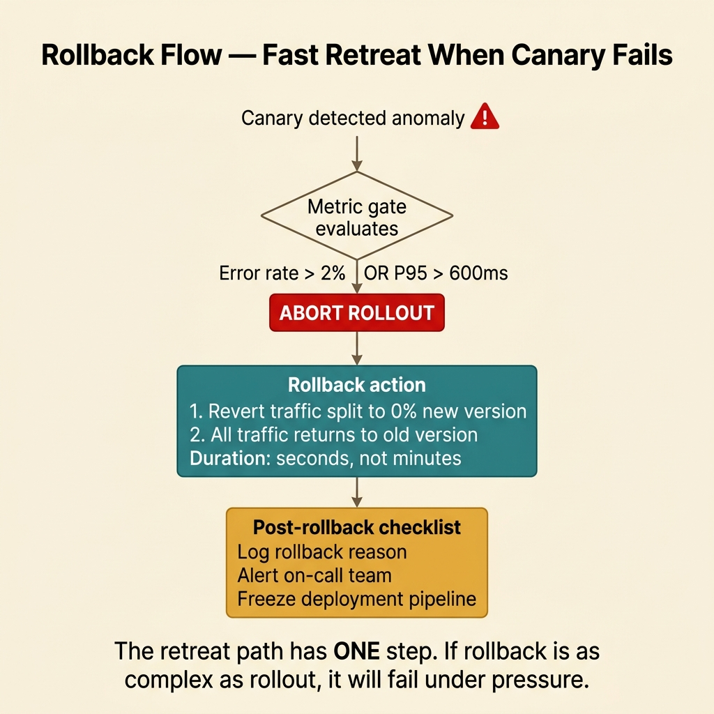

<!-- tags: golang, cloud-infra, rollout -->
# 🚦 Progressive Rollout & Rollback — Canary, Blue-Green, Fast Abort

> Deploying to production should never be a leap of faith. This article covers controlled rollouts for Go services: canary deployments, metric gates, rollback signals, and blast radius control.

📅 Created: 2026-03-28 · 🔄 Updated: 2026-04-14 · ⏱️ 17 min read

| Aspect | Detail |
| --- | --- |
| **Complexity** | Advanced |
| **Use case** | Services that need controlled release phases over K8s, ingress, or service mesh |
| **Focus** | canary, blue-green, rollback, metric gates |
| **Prerequisites** | deployment basics, observability signals |

## 1. DEFINE

Progressive rollout means deploying a new version in measured steps, watching signals at each step, and aborting if symptoms appear.

### Common strategies

| Strategy | When to use |
| --- | --- |
| Rolling update | Standard applications with moderate risk |
| Canary | When you need metric-gated traffic splitting before full promotion |
| Blue-green | When you need instant cutover and instant rollback |

### Invariants

| Rule | Meaning |
| --- | --- |
| Metric gates are required | Promotion only happens when error rate and latency are within policy bounds |
| Backward traffic compatibility | Old and new versions coexist during rollout. Protocol mismatches break traffic. |
| Rollback must be simpler than rollout | A crisis exit path must be fast and unbranched |

### Failure Modes

| Failure | Cause | Fix |
| --- | --- | --- |
| Canary fails but rollout continues | No metric gates defined — promotion is manual and skipped | Define explicit abort criteria with automated enforcement |
| Rollback fails | Release includes incompatible DB schema changes | Use backward-compatible schema migrations |
| Incident affects only one route or tenant | Monitoring checks global success rate only | Monitor per-route and per-tenant metrics separately |

## 2. VISUAL

Two visuals cover progressive rollout. The first maps the promote/abort decision flow. The second isolates the rollback path.



*Figure: Canary rollout progresses through 5% → 25% → 50% → 100% traffic stages. At each stage, metric gates check error rate and P95 latency. If either exceeds the threshold, the rollout aborts.*



*Figure: Rollback reverts traffic to the previous version in one step. If the rollback path has as many steps as the rollout path, you are debugging the rollback instead of saving live traffic.*

## 3. CODE

### Example 1: Basic — Rollout policy as data

> **Goal**: Encode rollout stages and metric gates as a struct. No tribal knowledge.
> **Complexity**: Basic

```go
// rollout_policy.go — Keep rollout stages explicit instead of tribal knowledge
package cloudinfra

type RolloutPolicy struct {
	Service       string
	CanarySteps   []int
	MaxErrorRate  float64
	MaxP95Millis  int
	RollbackOwner string
}

func DefaultRolloutPolicy() RolloutPolicy {
	return RolloutPolicy{
		Service:       "checkout-service",
		CanarySteps:   []int{5, 25, 50, 100},
		MaxErrorRate:  0.02,
		MaxP95Millis:  600,
		RollbackOwner: "payments-platform",
	}
}
```

**Why?** The policy struct removes human intuition from the promotion decision. The canary steps, error budget, and latency ceiling are code-reviewable. Every team member sees the same rules.

### Example 2: Intermediate — Evaluate rollout guardrail

> **Goal**: Compare observed canary metrics against the rollout policy. Return promote or abort.
> **Complexity**: Intermediate

```go
// rollout_gate.go — Decide whether rollout may continue based on observed symptoms
package cloudinfra

type RolloutObservation struct {
	ErrorRate float64
	P95Millis int
}

func CanPromote(obs RolloutObservation, policy RolloutPolicy) bool {
	return obs.ErrorRate <= policy.MaxErrorRate && obs.P95Millis <= policy.MaxP95Millis
}
```

**Why?** The gate function is deterministic. Given the same observation and policy, it always returns the same answer. No dashboard squinting. No "it looks fine to me."

### Example 3: Advanced — Backward-compatible feature path switch

> **Goal**: Run old and new code paths side by side during canary. The new path activates per-request via a flag.
> **Complexity**: Advanced

```go
// rollout_switch.go — Use a flag to enable the new path only after the release is healthy
package cloudinfra

type RuntimeFlags struct {
	NewCheckoutPath bool
}

func RouteCheckout(flags RuntimeFlags) string {
	if flags.NewCheckoutPath {
		// Canary traffic routes to v2 without a hard cutover.
		return "v2"
	}
	return "v1"
}
```

**Why?** Feature flags decouple deployment from release. The binary deploys first. The new code path activates later, only after metrics confirm the release is healthy. Rollback is flipping the flag, not redeploying.

### Example 4: Expert — Abort rollout with explicit rollback reason

> **Goal**: Return a structured promote/abort decision with a concrete reason. Release tooling logs the reason for post-incident analysis.
> **Complexity**: Expert

```go
// rollout_decision.go — Return actionable promote/abort decision with concrete reason
package cloudinfra

type RolloutDecision struct {
	Allowed bool
	Reason  string
}

func EvaluateRollout(obs RolloutObservation, policy RolloutPolicy) RolloutDecision {
	if obs.ErrorRate > policy.MaxErrorRate {
		return RolloutDecision{
			Allowed: false,
			Reason:  "error rate above rollout policy",
		}
	}

	if obs.P95Millis > policy.MaxP95Millis {
		return RolloutDecision{
			Allowed: false,
			Reason:  "p95 latency above rollout policy",
		}
	}

	return RolloutDecision{
		Allowed: true,
		Reason:  "rollout gate passed",
	}
}
```

**Why?** A boolean `allowed` is not enough for production. The `Reason` field tells the release bot, the on-call engineer, and the post-incident reviewer exactly why the rollout was aborted. No guessing.

## 4. PITFALLS

| # | Defect | Fix |
| --- | --- | --- |
| 1 | Rollout promoted based on gut feeling, not metrics | Define metric gates with explicit thresholds |
| 2 | Canary runs at 1% but metrics are not split by version | Add version tags to all metrics so canary and baseline are comparable |
| 3 | New release requires a breaking DB migration | Use backward-compatible evolutionary schema changes |
| 4 | Rollback completes but stale feature flags remain active | Add a post-rollback cleanup checklist |

## 5. REF

| Resource | Link |
| --- | --- |
| Argo Rollouts concepts | https://argo-rollouts.readthedocs.io/en/stable/concepts/ |
| Kubernetes deployments | https://kubernetes.io/docs/concepts/workloads/controllers/deployment/ |

## 6. RECOMMEND

| Extension | When | Rationale |
| --- | --- | --- |
| Argo Rollouts / Flagger | When canary stages need complex abort conditions | Automates the promote/abort control loop, replacing manual oversight |
| Versioned dashboards | When releases span multiple tenants | Compares canary metrics against baseline in real time |

---
