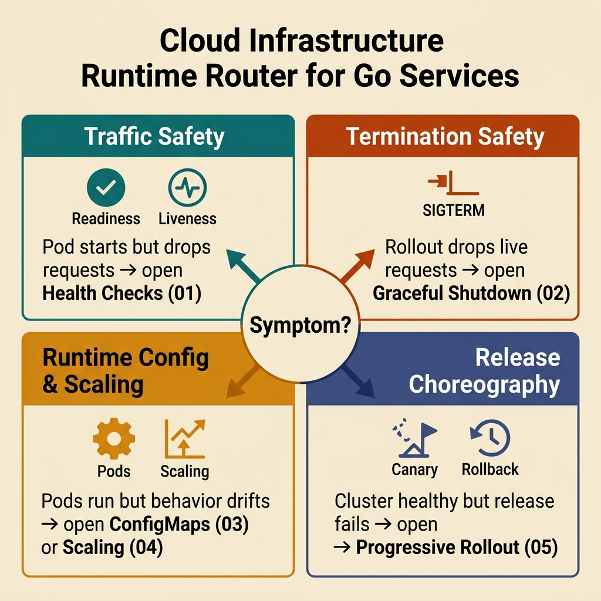

<!-- tags: golang, overview, cloud-infra -->
# Cloud Infrastructure for Go

> Operational runtime for Go services on cloud/Kubernetes: probes, graceful shutdown, config/secrets, scaling, and progressive rollout. This branch connects directly from microservices, observability, and deployment.

📅 Updated: 2026-04-09 · ⏱️ 7 min read

## 1. DEFINE

Imagine a rollout where the pod maps green on the dashboard but real requests are dropping. In that moment, **Cloud Infrastructure for Go** is no longer a pretty table of contents; it is where you must lock down the exact operational meaning behind each infrastructure signal.

This hub does not exist to list files. It exists to help you choose the right entry point to `cloud-infra`: where to begin, which articles to read sequentially, and when facing real symptoms, which lane to pivot to first.

### 1.1 Signals & Boundaries

- Open this hub when you know you are within the `cloud-infra` cluster but are unsure which article to read first.
- The focus of this hub is mapping pain points to the exact documentation, not replacing each detailed article.
- If you keep jumping to other articles and still feel lost, it is usually because you chose the wrong starting lane, not because of missing definitions.

### 1.2 Learning Lanes

- `Health Checks — Readiness, Liveness, Startup` is the natural entry point if you want a clear baseline before digging deeper.
- `Graceful Shutdown — SIGTERM, Draining, Worker Stop` is better when you need to bridge to a side lane or extend from foundation to production concerns.
- Keep this hub as a navigation map: after reading an article, return to select your next target intentionally.

## 2. VISUAL

This hub is most effective when viewed as a runtime router: which symptom loops into probe semantics, and which symptom is practically shutdown, scaling, or rollout discipline.



*Figure: This router isolates `cloud-infra` by operational teaching jobs so you do not dive into the closest-sounding article but completely miss the incident layer.*

## 3. CODE

The flow is conceptually clear. Now we pull it down to an artifact that a Go team can read, review, and keep as an execution standard.

### Example 1: Router artifact — selecting articles by reading goal

> **Goal**: Transform this hub into a navigation tool instead of a passive link board.
> **Approach**: Map reading goals or symptoms to the exact entry file.
> **Example**: Select a lane by concerns like fundamentals, framework, concurrency, or production ops.
> **Complexity**: O(1) at the navigation level; the key is picking the exact entry point.

```go
func chooseLane(goal string) string {
	switch goal {
	case "health checks readiness liveness":
		return "./01-health-checks-readiness-liveness.md"
	case "graceful shutdown connection draining":
		return "./02-graceful-shutdown-connection-draining.md"
	case "configmaps secrets runtime config":
		return "./03-configmaps-secrets-runtime-config.md"
	case "horizontal scaling queue workers":
		return "./04-horizontal-scaling-queue-workers.md"
	case "progressive rollout and rollback":
		return "./05-progressive-rollout-and-rollback.md"
	default:
		return "./README.md"
	}
}
```

This pseudo-router is not code to run in your app; it is a way to compress the hub's navigation spirit into a concise artifact. Reading the hub with this mindset keeps your learning rhythm seamless.

## 4. PITFALLS

The most dangerous part of **Cloud Infrastructure for Go** often is not the theory, but in a few seemingly minor decisions that drastically shift the outcome.

| # | Severity | Defect | Consequence | Fix |
| --- | --- | --- | --- | --- |
| 1 | 🔴 Fatal | Using hub as an aimless link list | Fragmented learning and wrong entry point | Always start with a specific pain point or learning goal |
| 2 | 🟡 Common | Jumping straight to deep articles without foundation | Disconnected terms leading to misapplication | Pick an entry point and follow the cluster rhythm |
| 3 | 🔵 Minor | Not returning to hub after reading | Losing the linkage rhythm across articles | Return to hub after each lane to pick the next step |

## 5. REF

| Resource | Link | Notes |
| --- | --- | --- |
| Kubernetes pod lifecycle | https://kubernetes.io/docs/concepts/workloads/pods/pod-lifecycle/ | Baseline to understand readiness, shutdown, and termination |
| Kubernetes probes | https://kubernetes.io/docs/tasks/configure-pod-container/configure-liveness-readiness-startup-probes/ | Semantics of readiness, liveness, startup |
| Horizontal Pod Autoscaler | https://kubernetes.io/docs/tasks/run-application/horizontal-pod-autoscale/ | Baseline for scaling and signal-based rollout |
| Go `context` | https://pkg.go.dev/context | Cancellation boundary for shutdown and worker stop |

## 6. RECOMMEND

You have seen where **Cloud Infrastructure for Go** stands in the broader flow. The RECOMMEND below helps bridge into the closest adjacent documents.

| Extension | When | Rationale | File/Link |
| --- | --- | --- | --- |
| Health Checks — Readiness, Liveness, Startup | When rollout or startup is failing at probe semantics | Fastest entry point to separate `ready`, `alive`, `booting` | [01-health-checks-readiness-liveness.md](./01-health-checks-readiness-liveness.md) |
| Graceful Shutdown — SIGTERM, Draining, Worker Stop | When deployment triggers error spikes on pod termination | Bridges from probe semantics to request draining and worker stops | [02-graceful-shutdown-connection-draining.md](./02-graceful-shutdown-connection-draining.md) |
| Horizontal Scaling — HTTP Replicas, Worker Concurrency, Queue Lag | When bottleneck sits in replica math, queue lag, or saturation | Keep scaling at target layer instead of fixing it at probe/shutdown | [04-horizontal-scaling-queue-workers.md](./04-horizontal-scaling-queue-workers.md) |
| Progressive Rollout & Rollback — Canary, Blue-Green, Fast Abort | When infrastructure signal drives promote/abort decisions | Bridge cloud runtime towards release control loop | [05-progressive-rollout-and-rollback.md](./05-progressive-rollout-and-rollback.md) |
| Go Programming | When pivoting Go clusters to backpropagate to runtime/foundation lanes | Keep top-level router as an intentional checkpoint | [README.md](../README.md) |
