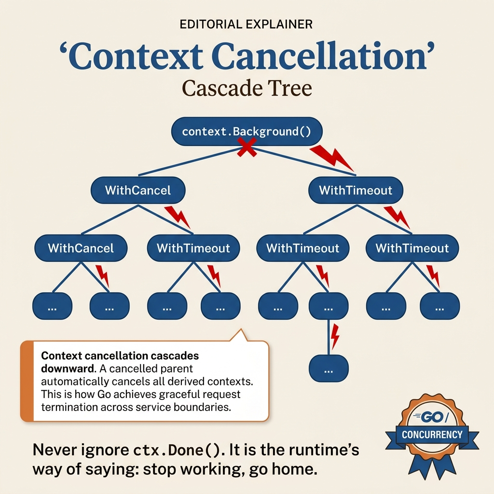

<!-- tags: golang, context -->
# 03 — Context

> **Foundation**: Managing lifecycle, cancellation, and timeout for goroutines.

📅 Created: 2026-03-20 · 🔄 Updated: 2026-04-19 · ⏱️ 15 min read

| Aspect         | Detail                                                             |
| -------------- | ------------------------------------------------------------------ |
| **Concept**    | Context tree — deadline, cancellation, request-scoped values       |
| **Use case**   | HTTP timeout, goroutine lifecycle, cascade cancel, tracing          |
| **Go stdlib**  | `context.Background`, `WithCancel`, `WithTimeout`, `WithDeadline`  |
| **Key insight**| Parent cancel → all children cancel (cascade), but not the reverse |

---

## 1. DEFINE

Goroutines are easy to start and hard to stop. Without a cancellation signal, a goroutine spawned by a request outlives that request — holding connections, leaking memory, and doing work whose result nobody will read. `context.Context` is Go’s answer: a tree-shaped cancellation and deadline propagation mechanism wired into every layer of the call chain.

You just deployed an API server. A request triggers a DB query that takes 30 seconds (slow DB), the client disconnected 5 seconds ago, but the goroutine keeps running — holding the connection, consuming resources. 1,000 such requests = 1,000 zombie goroutines. You need a mechanism: when the client disconnects or times out, **all** related goroutines stop. `context.Context` is Go's answer: it propagates deadlines and cancellation signals down the entire call chain. But there is a trap: using `WithValue` for business logic creates implicit dependencies that are hard to test, hard to debug, and fail silently. That trap will surface in PITFALLS.

### Definition

**`context.Context`** is Go's standard interface for propagating **deadlines, cancellation signals, and request-scoped values** throughout a goroutine call chain. Context solves the problem: "How do I stop all goroutines when a request is cancelled?"

### 4 Constructor Functions

| Function                          | Creates                    | Cancels when                              |
| --------------------------------- | -------------------------- | ----------------------------------------- |
| `context.Background()`            | Root context, no cancel    | Never — use in `main()`, `init()`         |
| `context.WithCancel(parent)`      | Manual cancel              | `cancel()` is called                      |
| `context.WithTimeout(parent, d)`  | Auto cancel after duration | Duration `d` expires or `cancel()` called |
| `context.WithDeadline(parent, t)` | Auto cancel at point in time | Time `t` reached or `cancel()` called    |
| `context.WithValue(parent, k, v)` | Attach key-value           | When parent cancels                       |

### Invariants

- **ALWAYS `defer cancel()`** right after `WithCancel/WithTimeout/WithDeadline`
- Context is **immutable** — each `With*` creates a **new child** context
- Parent cancel → **all children cancel** (cascade)
- Child cancel → parent is **NOT affected**
- `WithValue` is only for **request-scoped** data (request ID, auth token) — NOT for business logic

### Failure Modes

| Failure            | Cause                              | Prevention                                  |
| ------------------ | ---------------------------------- | ------------------------------------------- |
| **Goroutine leak** | Not checking `ctx.Done()`          | Always `select { case <-ctx.Done(): return }` |
| **Resource leak**  | Forgetting `defer cancel()`        | Always defer right after creation           |
| **Wrong value**    | Using `WithValue` for business data | Use only for request metadata              |

Context tree, constructors, invariants — theory is covered. Let us see what cascade cancellation and HTTP propagation look like visually.

---
## 2. VISUAL

This article has two distinct visual jobs: one diagram to lock down the mental model "context is a cancellation tree," and one to lock down request propagation through handler, service, and repository.

### Cancellation Tree



*This diagram locks down the correct mental model: parent intent flows down to child contexts; cancelling at the root stops the entire subtree, while a child cancel does not affect siblings or parent.*

### Request Propagation


*This diagram pulls `context` from theory into service reality: handler, service, repository, DB, cache, and RPC all must receive the same lifetime signal instead of guessing their own timeout.*

When you hold these two diagrams side by side, you will use `WithValue` less as a miscellaneous bag and create fewer background goroutines detached from request lifetime.

---

## 3. CODE

The flow of **Context** is clear. Now let us bring it down to code to see what constraints make this mechanism hold up, not just intuition.

---

### Example 1: Basic — WithCancel — Manual Cancellation

Returning to the earlier problem: 3 workers run continuously, and you need to stop all of them from the outside. The `done` channel pattern already does this — but `context.WithCancel` wraps it more cleanly and standardizes it across every layer.

```go
package main

import (
    "context"
    "fmt"
    "time"
)

func worker(ctx context.Context, id int) {
    for {
        select {
        case <-ctx.Done():
            // ━━━━━━━━━━━━━━━━━━━━━━━━━━━━━━━━━━━━━
            // ctx.Done() returns a closed channel when:
            // - cancel() is called
            // - parent context is cancelled
            // ctx.Err() tells you the reason:
            // - context.Canceled
            // - context.DeadlineExceeded
            // ━━━━━━━━━━━━━━━━━━━━━━━━━━━━━━━━━━━━━
            fmt.Printf("[Worker %d] Stopped: %v\n", id, ctx.Err())
            return
        default:
            fmt.Printf("[Worker %d] Working...\n", id)
            time.Sleep(200 * time.Millisecond)
        }
    }
}

func main() {
    // Create context with a cancel function
    ctx, cancel := context.WithCancel(context.Background())
    defer cancel() // ← ALWAYS defer cancel to avoid resource leaks

// Start 3 workers
    for i := 1; i <= 3; i++ {
        go worker(ctx, i)
    }

// Let workers run for 1 second
    time.Sleep(1 * time.Second)

// Cancel → all workers receive the signal via ctx.Done()
    fmt.Println("\n>>> Cancelling all workers...")
    cancel()

time.Sleep(100 * time.Millisecond) // wait for cleanup
    fmt.Println("Done!")
}
```

**Achieved**: 3 workers run in parallel; `cancel()` stops all of them at once via `ctx.Done()`. No need to manage a `done` channel yourself.

**Caveat**: Calling `cancel()` multiple times is safe (idempotent). `defer cancel()` must be right after `WithCancel` — do not push it to the end of the function.

**Use when**: Any goroutine that needs external cancellation — for example, background pollers, worker pools, or health check listeners.

WithCancel covers manual cancellation. But when you need auto cancel after a time limit — API calls, DB queries — use `WithTimeout` instead of manual `time.After` + select.

---

### Example 2: Intermediate — WithTimeout — Auto Cancellation

WithCancel requires you to call `cancel()` from the outside. But for API calls or DB queries, you want: "if not done in 1 second, abort." Writing `time.After` + `select` from scratch is too manual — `WithTimeout` wraps it cleanly and propagates down every layer.

```go
package main

import (
    "context"
    "fmt"
    "math/rand/v2" // Go 1.22+
    "time"
)

// simulateDBQuery simulates a database query with random duration
func simulateDBQuery(ctx context.Context) (string, error) {
    // Create a channel for the result
    resultCh := make(chan string, 1)

go func() {
        // Simulate a query taking 100ms - 3000ms
        queryTime := time.Duration(100+rand.IntN(2900)) * time.Millisecond
        time.Sleep(queryTime)
        resultCh <- fmt.Sprintf("Query result (took %v)", queryTime)
    }()

// ━━━━━━━━━━━━━━━━━━━━━━━━━━━━━━━━━━━━━━━━━━━━━━
    // Select: get the result or timeout — whoever finishes first wins
    // ━━━━━━━━━━━━━━━━━━━━━━━━━━━━━━━━━━━━━━━━━━━━━━
    select {
    case result := <-resultCh:
        return result, nil
    case <-ctx.Done():
        return "", ctx.Err() // context.DeadlineExceeded
    }
}

func main() {
    // ━━━━━━━━━━━━━━━━━━━━━━━━━━━━━━━━━━━━━━━━━━━━━━
    // WithTimeout: auto cancel after 1 second
    // If the query finishes before 1s → return result
    // If the query is not done after 1s → cancel + return error
    // ━━━━━━━━━━━━━━━━━━━━━━━━━━━━━━━━━━━━━━━━━━━━━━
    ctx, cancel := context.WithTimeout(context.Background(), 1*time.Second)
    defer cancel()

result, err := simulateDBQuery(ctx)
    if err != nil {
        fmt.Println("❌ Error:", err) // context deadline exceeded
        return
    }
    fmt.Println("✅", result)
}
```

**Achieved**: Fast query (<1s) → returns the result. Slow query (>1s) → auto cancel with `context.DeadlineExceeded`. No manual timer plumbing needed.

**Caveat**: The goroutine inside `simulateDBQuery` still runs after cancel — only the result is discarded. If you need to truly stop the goroutine, pass `ctx` into it. Timeouts should be shorter than the parent: parent 5s → child 3s → grandchild 1s.

**Use when**: Every external call (DB, HTTP, gRPC, Redis) should have a timeout context. HTTP handlers use `r.Context()` — it auto-cancels when the client disconnects.

> **Why use `WithTimeout` instead of manual `time.After` + select?**
> `time.After` can only cancel 1 operation at 1 point. `WithTimeout` creates a derived context — it propagates down every layer. Everything checking `ctx.Done()` will stop automatically. This is a propagation mechanism.

WithTimeout covers auto cancel for a single operation. But when the parent context cancels — all children must stop too. Cascade cancellation is the real power of the context tree.

---

### Example 3: Advanced — Context Cascade — Parent cancel → Children cancel

WithTimeout cancels a single operation. But imagine an HTTP request calling DB + Redis + gRPC — 3 operations belonging to the same request. The client disconnects, and all 3 must stop. This is when cascade cancellation reveals the true power of the context tree.

```go
package main

import (
    "context"
    "fmt"
    "time"
)

func childWorker(ctx context.Context, name string) {
    <-ctx.Done()
    fmt.Printf("  [%s] Cancelled: %v\n", name, ctx.Err())
}

func main() {
    // ━━━━━━━━━━━━━━━━━━━━━━━━━━━━━━━━━━━━━━━━━━━━━━
    // Context Tree:
    //   root (Background)
    //     └── parent (WithCancel)
    //           ├── child1 (WithTimeout 5s)
    //           └── child2 (WithCancel)
    //
    // When parent cancels → both child1 and child2 cancel
    // (even though child1 still has 5s left on its timeout)
    // ━━━━━━━━━━━━━━━━━━━━━━━━━━━━━━━━━━━━━━━━━━━━━━
    parent, parentCancel := context.WithCancel(context.Background())
    defer parentCancel()

child1, child1Cancel := context.WithTimeout(parent, 5*time.Second)
    defer child1Cancel()

child2, child2Cancel := context.WithCancel(parent)
    defer child2Cancel()

go childWorker(child1, "Child1-Timeout5s")
    go childWorker(child2, "Child2-Manual")

// Cancel parent after 500ms
    time.Sleep(500 * time.Millisecond)
    fmt.Println(">>> Cancelling PARENT...")
    parentCancel() // → child1 + child2 both cancel

time.Sleep(100 * time.Millisecond)
    fmt.Println("Done!")
}
```

**Achieved**: Parent cancel → both child1 (despite having 5s left) and child2 cancel immediately. `ctx.Err()` returns `context.Canceled` because the parent cancelled, not a timeout.

**Caveat**: Child cancel does NOT affect the parent — cascade flows downward only. This is by design: cancelling 1 DB query must not cancel the entire request context.

**Use when**: HTTP middleware (parent = request context), children = DB query, Redis call, RPC. When the client disconnects, all children stop automatically.

> **Why does child cancel not affect the parent?**
> The context tree is a DAG — cancellation propagates only downward to children, not upward to parents. If it propagated up: cancelling 1 DB query would cancel the request context → all other operations would also cancel. One-way design allows cancelling each subtree independently.

You now know WithCancel, WithTimeout, and cascade. Here comes the dangerous part: forgetting `defer cancel()` and using `WithValue` for business logic — traps set up from the beginning of this article.

---

## 4. PITFALLS

Knowing the correct path of **Context** is not enough. The part that costs teams the most lies in wrong assumptions that dashboards and code demos do not reveal.

| # | Severity | Mistake | Consequence | Fix |
| --- | --- | --- | --- | --- |
| 1 | 🔴 Fatal | **Forget `defer cancel()`** | Resource leak — goroutines never freed | `defer cancel()` right after `WithCancel/WithTimeout` |
| 2 | 🔴 Fatal | **Not checking `ctx.Done()`** | Goroutine runs forever even after context is cancelled | `select { case <-ctx.Done(): return }` |
| 3 | 🟡 Common | **Timeout longer than parent** | Child timeout 10s, parent 5s → meaningless | Always child < parent |
| 4 | 🟡 Common | **`WithValue` for business logic** | Implicit dependency, hard to test/debug | Use only for request metadata (request ID, auth) |
| 5 | 🔵 Minor | **Passing `nil` context** | Panic in functions that check ctx | Always use `context.Background()` or `context.TODO()` |

You have covered WithCancel, WithTimeout, cascade, and the resource leak / WithValue abuse traps. The resources below help you go deeper.

---

## 5. REF

| Resource | Type | Link | Notes |
| --- | --- | --- | --- |
| Go Blog — Context | Core team blog | [go.dev/blog/context](https://go.dev/blog/context) | Design rationale |
| context package | Official docs | [pkg.go.dev/context](https://pkg.go.dev/context) | API reference |
| Go Concurrency Patterns: Context | Official talk | [go.dev/talks/2014/gotham-context.slide](https://go.dev/talks/2014/gotham-context.slide) | Slide presentation |

---

## 6. RECOMMEND

You just went from manual cancel (WithCancel) → auto cancel (WithTimeout) → cascade cancel (context tree). This is the foundation — each next step connects context to another concern: error groups, pipelines, or framework integration.

| Next step | When | Reason | File/Link |
| --- | --- | --- | --- |
| **05 — errgroup** | When a group of goroutines must fail-fast along the cancellation tree | Structured concurrency cleaner than manual cancel plumbing | [05-errgroup.md](./05-errgroup.md) |
| **07 — Pipeline Pattern** | When cancellation must flow through multiple stages | Connect `ctx.Done()` with backpressure and shutdown ownership | [07-pipeline.md](./07-pipeline.md) |
| **09 — Goroutine Leak Detection & Containment** | When you suspect zombie goroutines after timeout or disconnect | Turn context misuse into a concrete investigation workflow | [../advanced/09-goroutine-leak-detection-and-containment.md](../advanced/09-goroutine-leak-detection-and-containment.md) |
| **Gin Framework with Go** | When context passes through HTTP middleware and handler chains | See request lifecycle in a real web framework | [../gin/README.md](../gin/README.md) |
| **Fiber Framework with Go** | When you need to map request lifetime to a different framework | Compare how frameworks expose request context | [../fiber/README.md](../fiber/README.md) |

---

**Links**: [← Mutex & Race Condition](./02-mutex-and-race-condition.md) · [→ sync.Pool](./04-sync-pool.md)
