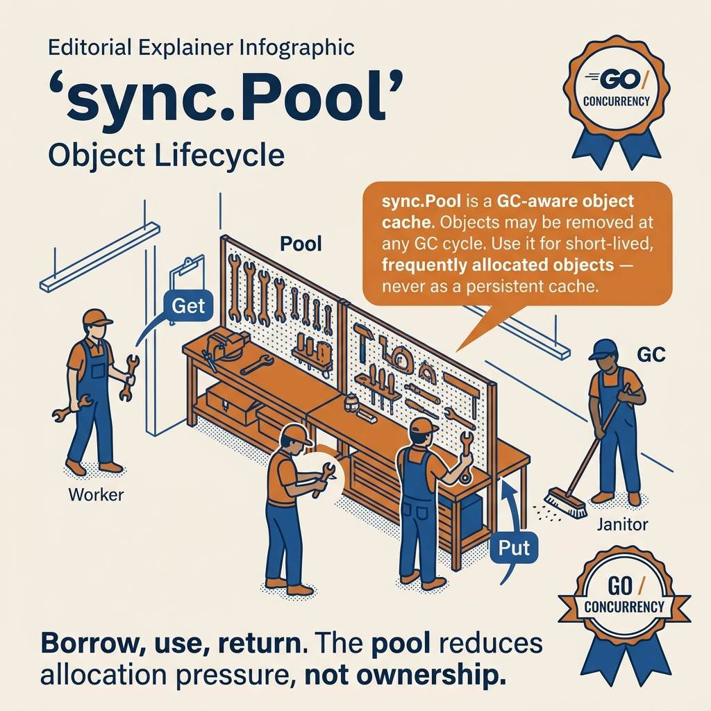

<!-- tags: golang -->
# 04 — sync.Pool & Buffer Pool

> **Foundation**: Object reuse — reducing GC pressure for high-throughput systems.

📅 Created: 2026-03-20 · 🔄 Updated: 2026-04-19 · ⏱️ 15 min read

| Aspect         | Detail                                                    |
| -------------- | --------------------------------------------------------- |
| **Concept**    | sync.Pool — per-P object cache, GC-managed lifecycle      |
| **Use case**   | Buffer reuse, JSON encoder pool, HTTP response writers    |
| **Go stdlib**  | `sync.Pool`, `New` callback, `Get()`/`Put()`              |
| **Key insight**| Pool is per-P = low contention, but GC can evict at any time |

---

## 1. DEFINE

Allocation is fast in Go. GC is the slow part. When your hot path allocates a temporary buffer on every request, the cost is not the allocation itself — it is the GC pressure that scales linearly with throughput. `sync.Pool` breaks that scaling by reusing objects across requests, dropping per-request allocations to near zero on the steady-state path.

Your API server handles 10,000 req/s, and each request needs a 4KB `[]byte` buffer to encode the response. Allocating a new one every time = 10,000 allocations/second = GC running constantly, p99 latency triples. The problem is not that allocation is slow — it is that **GC pressure** scales linearly with throughput. `sync.Pool` solves this: it reuses objects between requests, dropping allocations down to ~GOMAXPROCS instead of ~request_count. But there is a trap: putting a buffer back into the pool without resetting it = **data leak** — the next request reads sensitive data from the previous one. That trap will surface in PITFALLS.

### sync.Pool

**`sync.Pool`** is a pool for reusing temporary objects. Instead of allocating and freeing continuously, you GET an object from the pool, use it, then PUT it back. The Go GC **can evict objects from the pool** at any time.

### Buffer Pool

**Buffer Pool** is the most common use case: a pool of `[]byte` buffers. It avoids allocating a new buffer for every request — critical for I/O-intensive apps (image processing, file upload, network).

### sync.Pool vs Custom Object Pool

| Property        | sync.Pool                            | Custom Object Pool             |
| --------------- | ------------------------------------ | ------------------------------ |
| **Lifecycle**   | GC can evict at any time             | Developer-managed              |
| **Thread-safe** | ✅ Yes                               | Must implement yourself        |
| **Use case**    | Temporary buffers, scratch objects   | Connection pools, worker pools |
| **Guarantee**   | Does NOT guarantee object survival   | Guaranteed                     |

### Invariants

- **Pool objects are temporary** — do not use for persistent state
- **ALWAYS reset object before Put** — prevents data leaks
- **Get() may return a new object** if the pool is empty (calls `New`)
- Pool is **per-P (processor)** — each P has its own local pool → low contention

### Failure Modes

| Failure            | Cause                              | Prevention                  |
| ------------------ | ---------------------------------- | --------------------------- |
| **Data leak**      | Putting object with sensitive data | Reset/clear before Put      |
| **Wrong type**     | Get returns `interface{}`, bad cast | Check type after Get        |
| **Poor performance** | Pool too small, GC evicts constantly | Benchmark, tune GC        |

sync.Pool, buffer pool, invariants — theory is covered. Let us see what the lifecycle and request flow look like visually.

---
## 2. VISUAL

If you only remember `Get()` and `Put()`, you will easily misuse `sync.Pool` as a cache. The PNG diagram below locks down the correct mental model first, then the ASCII view below serves as supporting reference.



*`sync.Pool` is only suitable for temporary objects on the hot path, with explicit reset, and accepting that pool entries can be evicted by GC at any time.*

### sync.Pool Lifecycle

```
        Get()                       Put(obj)
          │                            │
  ┌───────▼───────┐           ┌───────▼───────┐
  │  Pool empty?  │           │  Reset object │
  │               │           │  (clear data)  │
  └───┬───────┬───┘           └───────┬───────┘
      │       │                       │
     Yes      No                      │
      │       │                       ▼
      ▼       ▼               ┌──────────────┐
  ┌──────┐  ┌──────┐         │  Put to Pool  │
  │ New()│  │Return│         │  (reuse next  │
  │create│  │object│         │   time)       │
  │ new  │  │from  │         └──────────────┘
  └──────┘  │pool  │
            └──────┘
```

*sync.Pool lifecycle — Get() retrieves from pool or calls New(); Put() returns after reset. GC can evict at any time.*

### Buffer Pool — Request Flow

```
Request 1 ──▶ Get(buf) ──▶ [Process data] ──▶ Reset + Put(buf)
                                                      │
Request 2 ──▶ Get(buf) ◀──── reuse same buffer ◄─────┘
                          (no allocation!)

Without Pool: 1000 requests = 1000 allocations = heavy GC
With Pool:    1000 requests = ~4 allocations (1 per CPU) = light GC
```

*Buffer pool reuse — 1000 requests need only ~4 allocations instead of 1000, reducing GC pressure by 99%+.*

The diagrams give an overview of pool lifecycle and buffer reuse. Now let us implement — starting from a basic pool, then concurrent processing, then combining with Tunny worker pool.

---

## 3. CODE

You have seen the flow of signals, requests, and goroutines in **sync.Pool & Buffer Pool**. Now shift to code to check which parts must be written tightly to avoid paying the production price.

---

### Example 1: Basic — sync.Pool for []byte buffers

10,000 req/s, each request needs a 4KB buffer. Allocating a new one every time = 10,000 allocations/second. GC runs constantly, p99 latency increases.

`sync.Pool` is the simplest answer: `Get()` retrieves a buffer from the pool (or creates a new one if empty), and when done, `Put()` returns it. The next request reuses the old buffer — zero allocation.

```go
package main

import (
    "fmt"
    "sync"
)

func main() {
    // ━━━━━━━━━━━━━━━━━━━━━━━━━━━━━━━━━━━━━━━━━━━━━━
    // Buffer Pool: reuse []byte buffers
    // New: function to create a NEW object when pool is empty
    // Get: retrieve object from pool (or create new if empty)
    // Put: return object to pool for reuse
    // ━━━━━━━━━━━━━━━━━━━━━━━━━━━━━━━━━━━━━━━━━━━━━━
    bufPool := sync.Pool{
        New: func() interface{} {
            fmt.Println("  [Pool] Creating new buffer (1KB)")
            buf := make([]byte, 1024)
            return buf
        },
    }

// First time: Pool is empty → calls New()
    buf1 := bufPool.Get().([]byte)
    fmt.Printf("Got buf1: len=%d, cap=%d\n", len(buf1), cap(buf1))

// Use the buffer
    copy(buf1, []byte("Hello, Pool!"))
    fmt.Printf("buf1 content: %s\n", buf1[:12])

// ━━━━━━━━━━━━━━━━━━━━━━━━━━━━━━━━━━━━━━━━━━━━━━
    // IMPORTANT: Reset buffer before Put
    // Prevents data leak — old buffer may contain sensitive data
    // ━━━━━━━━━━━━━━━━━━━━━━━━━━━━━━━━━━━━━━━━━━━━━━
    for i := range buf1 {
        buf1[i] = 0 // clear sensitive data
    }
    bufPool.Put(buf1) // return to pool

// Second time: Pool has a buffer → reuse (does NOT call New)
    buf2 := bufPool.Get().([]byte)
    fmt.Printf("Got buf2: len=%d (reused, no allocation!)\n", len(buf2))
    bufPool.Put(buf2)
}
```

**Achieved**: First Get calls `New()` to create a new buffer. Second Get reuses — zero allocation.

**Caveat**: `Get()` returns `interface{}` — requires type assertion `.([]byte)`. **ALWAYS reset/clear before Put** — the old buffer may contain sensitive data. Go 1.18+: you can use a generics wrapper for type safety.

**Use when**: Any hot path that allocates and frees the same object type repeatedly — buffers, temp structs, encoders.

Basic pool covers a single goroutine. But production needs 100 concurrent goroutines processing data simultaneously — the pool must be thread-safe and per-P to reduce contention.

---

### Example 2: Intermediate — Buffer Pool in concurrent processing

The basic pool takes 1 buffer from 1 goroutine. But production needs 100 concurrent goroutines processing data simultaneously. sync.Pool is designed **per-P** (processor), so each P has its own local pool — 100 goroutines need only ~GOMAXPROCS buffers instead of 100.

```go
package main

import (
    "crypto/sha256"
    "fmt"
    "sync"
)

func main() {
    // ━━━━━━━━━━━━━━━━━━━━━━━━━━━━━━━━━━━━━━━━━━━━━━
    // Pool of 4KB buffers for concurrent data processing
    // 100 goroutines process simultaneously, but only ~GOMAXPROCS buffers needed
    // ━━━━━━━━━━━━━━━━━━━━━━━━━━━━━━━━━━━━━━━━━━━━━━
    bufPool := &sync.Pool{
        New: func() interface{} {
            return make([]byte, 4096) // 4KB buffer
        },
    }

var wg sync.WaitGroup
    results := make(chan string, 100)

for i := range 100 { // Go 1.22+
        wg.Add(1)
        go func(taskID int) {
            defer wg.Done()

// GET buffer from pool (reuse, no allocation)
            buf := bufPool.Get().([]byte)

// Use buffer for processing
            data := fmt.Sprintf("Task-%d-data-payload", taskID)
            copy(buf, []byte(data))

// Simulate CPU work: hash data
            hash := sha256.Sum256(buf[:len(data)])

results <- fmt.Sprintf("Task %3d: hash=%x", taskID, hash[:4])

// ━━━ Reset & PUT buffer back to pool ━━━
            for j := range len(data) { // Go 1.22+
                buf[j] = 0
            }
            bufPool.Put(buf)
        }(i)
    }

// Close results when all goroutines complete
    go func() {
        wg.Wait()
        close(results)
    }()

// Print results
    count := 0
    for r := range results {
        count++
        if count <= 5 || count == 100 {
            fmt.Println(r)
        }
    }
    fmt.Printf("Total: %d tasks processed\n", count)
}
```

**Achieved**: 100 goroutines but only ~4-8 buffers created (= GOMAXPROCS). GC pressure drops 90%+ compared to allocating a new buffer per goroutine.

**Caveat**: sync.Pool is thread-safe — no extra mutex needed. But after each GC cycle, Go **can evict all** pool items. Do not rely on pool for persistent data.

**Use when**: High-throughput processing where each goroutine needs a temporary buffer — image processing, file upload, network I/O.

> **Why can sync.Pool's GC evict items at any time?**
> sync.Pool is not a cache — it is a "hint" to the runtime that an object can be reused. GC evicts pool items to free memory when needed. Pool is efficient for short-lived, high-frequency allocations.

Concurrent pool covers multi-goroutine. But when combined with a worker pool (Tunny) — bounded concurrency + reused memory = optimal for high-throughput production workloads.

---

### Example 3: Advanced — Combining sync.Pool + Tunny Worker Pool (referencing current project)

Concurrent pool reduces allocations. But 10,000 goroutines running simultaneously = goroutine explosion. You need **bounded concurrency** (limit the number of workers) + **reused memory** (pool). Tunny limits workers; sync.Pool limits allocations — two different problems combined into an optimal solution.

```go
package main

import (
    "fmt"
    "sync"
    "time"
    "math/rand/v2" // Go 1.22+

"github.com/Jeffail/tunny"
)

func main() {
    // ━━━━━━━━━━━━━━━━━━━━━━━━━━━━━━━━━━━━━━━━━
    // sync.Pool: reuse buffers
    // Tunny Pool: limit concurrency (4 workers)
    // Combined: each worker GETs a buffer, processes, PUTs it back
    // ━━━━━━━━━━━━━━━━━━━━━━━━━━━━━━━━━━━━━━━━━
    bufferPool := sync.Pool{
        New: func() interface{} {
            return make([]byte, 1024)
        },
    }

pool := tunny.NewFunc(4, func(payload interface{}) interface{} {
        num := payload.(int)

// GET buffer from pool — reuse
        buf := bufferPool.Get().([]byte)
        defer bufferPool.Put(buf) // PUT back when worker finishes

// Simulate work using buffer
        copy(buf, []byte(fmt.Sprintf("processing-%d", num)))
        time.Sleep(time.Duration(rand.IntN(200)) * time.Millisecond)

return num * num
    })
    defer pool.Close()

// Process 20 items through the worker pool
    var wg sync.WaitGroup
    for i := range 20 { // Go 1.22+
        wg.Add(1)
        go func(n int) {
            defer wg.Done()
            result := pool.Process(n) // ← blocks until a worker is available
            fmt.Printf("%d² = %d\n", n, result.(int))
        }(i)
    }

wg.Wait()
}
```

**Achieved**: Only 4 goroutines run concurrently (Tunny limit) + buffers are reused across workers (sync.Pool). Memory-efficient + CPU-efficient.

**Caveat**: Tunny's `Process()` is **blocking** — the caller goroutine must wait for a worker to become available. `defer bufferPool.Put(buf)` ensures the buffer always returns even if a panic occurs. This pattern is used in the project's `cmd/api/main.go`.

**Use when**: High-throughput workloads that need both bounded concurrency and memory reuse — image resize, CSV export, batch data processing.

> **Why combine sync.Pool + Worker Pool instead of using just one?**
> Worker Pool manages concurrency (prevents goroutine explosion). sync.Pool manages memory (prevents GC pressure). Two different problems. Combined = bounded concurrency + reused memory = optimal.

You now know the basic pool, concurrent pool, and Tunny combo. Here comes the dangerous part: data leaks from pooled buffers — the trap set up from the beginning of this article.

---

## 4. PITFALLS

The correct mechanism of **sync.Pool & Buffer Pool** is in place. The traps below are where people get timing, ownership, or evidence wrong — and only realize it when the incident has already exploded.

| # | Severity | Mistake | Consequence | Fix |
| --- | --- | --- | --- | --- |
| 1 | 🔴 Fatal | **Forgetting to reset before Put** | Sensitive data persists in pooled object | Clear sensitive data: `buf[i] = 0` |
| 2 | 🟡 Common | **Using Pool for persistent data** | GC evicts at any time → data loss | Use only for temporary objects |
| 3 | 🟡 Common | **Pool objects too large** | 1MB buffer × 8 CPUs = 8MB idle | Benchmark buffer size |
| 4 | 🔵 Minor | **Forgetting type assertion** | `Get()` returns `interface{}` — runtime panic on wrong type | Always: `.([]byte)` + check |

You have covered pool lifecycle, concurrent processing, Tunny combo, and the data leak / GC eviction traps. The resources below help you go deeper.

---

## 5. REF

| Resource | Type | Link | Notes |
| --- | --- | --- | --- |
| sync.Pool docs | Official docs | [pkg.go.dev/sync#Pool](https://pkg.go.dev/sync#Pool) | API reference |
| Go source — pool.go | Source code | [go.dev/src/sync/pool.go](https://go.dev/src/sync/pool.go) | Internal implementation |
| Effective Go — Allocation | Official guide | [go.dev/doc/effective_go#allocation_new](https://go.dev/doc/effective_go#allocation_new) | new vs make |

---

## 6. RECOMMEND

You just went from a basic pool (single goroutine) → concurrent pool (per-P scaling) → Tunny combo (bounded + reused). From here, expand based on the specific workload.

| Next step | When | Reason | File/Link |
| --- | --- | --- | --- |
| **valyala/bytebufferpool** | High-perf byte buffers | Optimized byte buffer pool — used in fasthttp | `github.com/valyala/bytebufferpool` |
| **JSON + Pool** | API handlers | Pool JSON encoders to reduce allocs | `sync.Pool` + `json.NewEncoder` |
| **Protobuf + Pool** | gRPC services | Pool protobuf buffers | `sync.Pool` + `proto.Marshal` |
| **HTTP handler** | Response writing | Pool buffers for response writing | `sync.Pool` + `bytes.Buffer` |
| **Profiling** | Detect pool candidates | Find objects that need pooling | `go tool pprof -alloc_objects` |
| **Worker pool + Pool** | Reuse goroutines + buffers | Combine Ants/Tunny | [08-worker-pool-tunny.md](./08-worker-pool-tunny.md) · [12-ants.md](./12-ants.md) |

---

**Links**: [← Context](./03-context.md) · [→ Errgroup](./05-errgroup.md)
