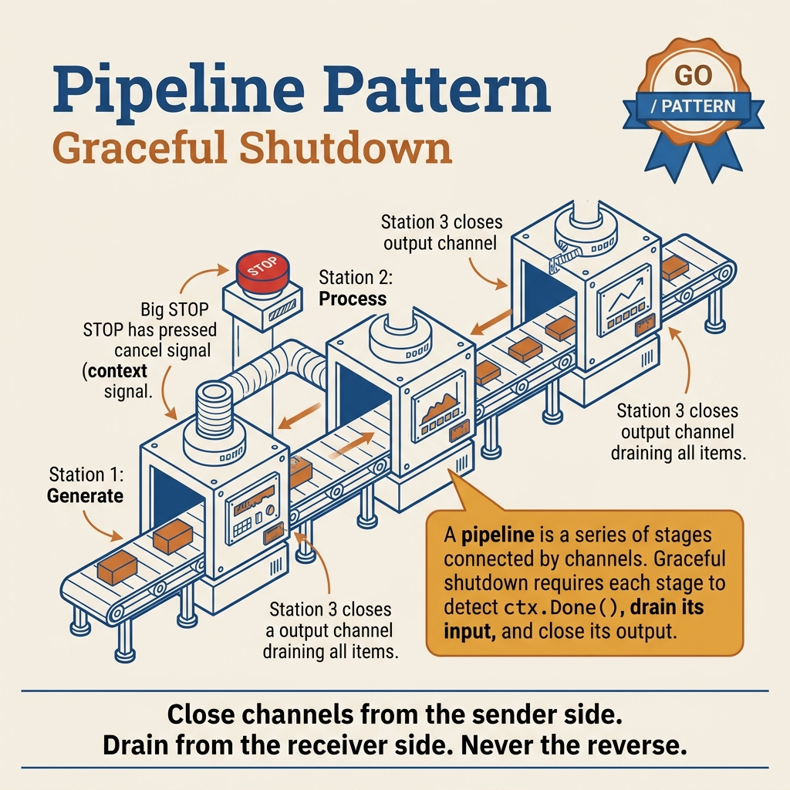

<!-- tags: golang -->
# 07 — Pipeline Pattern

> **Pattern**: Chain of processing stages connected by channels — each stage receives input, processes it, and sends output.

📅 Created: 2026-03-20 · 🔄 Updated: 2026-04-19 · ⏱️ 15 min read

| Aspect         | Detail                                                            |
| -------------- | ----------------------------------------------------------------- |
| **Concept**    | Pipeline — chain of stages connected via channels                 |
| **Use case**   | ETL, stream processing, image pipeline, log processing            |
| **Go stdlib**  | `chan`, `context`, `sync.WaitGroup`                                |
| **Key insight**| Buffered channels provide free backpressure — a slow stage auto-throttles the fast stage |

---

## 1. DEFINE

Data flows through stages: read, validate, transform, write. Each stage runs in its own goroutine, connected by channels. The pipeline pattern turns this into a composable, concurrent stream processor where each stage can be independently scaled, tested, and shut down — but only if every stage respects context cancellation and channel ownership.

You have a data processing flow: read CSV → parse → validate → transform → write to DB. Put it all in 1 function? The code is long, hard to test, and impossible to parallelize each step. Pipeline pattern separates each step into an independent stage, connected by channels. Each stage runs in its own goroutine — modular, concurrent, and with free backpressure from buffered channels. But there is a trap: stage A closes a channel before stage B finishes draining = **deadlock** or data loss. Ownership rule violations are the most common class of bugs. That trap will surface in PITFALLS.

### Definition

A **Pipeline** is a chain of **stages** linked by channels. Each stage:

1. Receives data from an **inbound channel** (upstream)
2. Processes it (transform, filter, aggregate)
3. Sends results to an **outbound channel** (downstream)

### Pipeline Rules

| Rule              | Detail                                              |
| ----------------- | --------------------------------------------------- |
| **Ownership**     | Stage creates → stage closes outbound channel       |
| **Cancellation**  | Every stage must check `ctx.Done()`                 |
| **Backpressure**  | Slow stage → upstream blocks (built-in via channel) |
| **Composability** | Stages are functions, composable into new pipelines |

### Pipeline vs Fan-out/Fan-in

|              | Pipeline                                | Fan-out/Fan-in                      |
| ------------ | --------------------------------------- | ----------------------------------- |
| **Flow**     | A → B → C (sequential stages)           | A → [B1,B2,B3] → C (parallel stage) |
| **Use case** | Transform chain                         | Parallel processing                 |
| **Combined** | A pipeline stage CAN BE fan-out/fan-in  |

### Failure Modes

| Failure            | Cause                          | Prevention                             |
| ------------------ | ------------------------------ | -------------------------------------- |
| **Pipeline stall** | 1 slow stage → blocks the whole | Buffer channel or fan-out slow stage   |
| **Goroutine leak** | Stage does not check cancellation | Always `select { case <-ctx.Done() }` |
| **Data loss**      | Close channel too early        | Only close when all data is confirmed  |

Pipeline stages, backpressure, invariants — theory is covered. Let us see what data flow and stage orchestration look like visually.

---
## 2. VISUAL

The visuals for this article need to answer two questions: which stage owns which channel, and in which direction does shutdown/backpressure flow when the pipeline encounters an error or a slow consumer.

### Shutdown, Ownership, Backpressure



*The main diagram does not describe the happy path alone. It shows source, transform, sink, and the shutdown path so you can see where backpressure flows backward and where cancellation must stop upstream.*

### Supporting View: stage topology before thinking about worker count

```text
source -> parse -> validate -> enrich -> sink

Each stage should do exactly one clear job.
Each stage owns its own outbound channel.
If the shutdown path is ambiguous, the pipeline will leak goroutines before it increases throughput.
```

*Before optimizing with fan-out or buffers, draw the stage topology and ownership lines as simply as shown above.*

Reading these two visuals together helps you avoid a very common mistake: a pipeline that looks modular on the happy path but has no one truly owning the shutdown path.

---

## 3. CODE

You have seen the flow of signals, requests, and goroutines in **Pipeline Pattern**. Now shift to code to check which parts must be written tightly to avoid paying the production price.

---

### Example 1: Basic — 3-Stage Pipeline

CSV flow: read → parse → validate → transform → write to DB. Put it all in 1 function? The code is long, hard to test, impossible to parallelize. Pipeline separates each step into an independent stage connected by channels. Start with 3 simple stages: generate → square → filter.

```go
package main

import (
    "context"
    "fmt"
)

// ━━━━━━━━━━━━━━━━━━━━━━━━━━━━━━━━━━━━━━━━━
// Stage 1: Generate — produce a sequence of numbers
// Rule: function that creates channel → function closes channel
// ━━━━━━━━━━━━━━━━━━━━━━━━━━━━━━━━━━━━━━━━━
func generate(ctx context.Context, nums ...int) <-chan int {
    out := make(chan int)
    go func() {
        defer close(out) // ← OWNER closes
        for _, n := range nums {
            select {
            case <-ctx.Done():
                return // ← cancellation check
            case out <- n:
            }
        }
    }()
    return out
}

// ━━━━━━━━━━━━━━━━━━━━━━━━━━━━━━━━━━━━━━━━━
// Stage 2: Square — transform each number → n²
// Input: <-chan int (receive-only)
// Output: <-chan int (passed to the next stage)
// ━━━━━━━━━━━━━━━━━━━━━━━━━━━━━━━━━━━━━━━━━
func square(ctx context.Context, in <-chan int) <-chan int {
    out := make(chan int)
    go func() {
        defer close(out)
        for n := range in {
            select {
            case <-ctx.Done():
                return
            case out <- n * n:
            }
        }
    }()
    return out
}

// ━━━━━━━━━━━━━━━━━━━━━━━━━━━━━━━━━━━━━━━━━
// Stage 3: Filter — keep only numbers > threshold
// ━━━━━━━━━━━━━━━━━━━━━━━━━━━━━━━━━━━━━━━━━
func filter(ctx context.Context, in <-chan int, threshold int) <-chan int {
    out := make(chan int)
    go func() {
        defer close(out)
        for n := range in {
            select {
            case <-ctx.Done():
                return
            default:
            }
            if n > threshold {
                select {
                case <-ctx.Done():
                    return
                case out <- n:
                }
            }
        }
    }()
    return out
}

func main() {
    ctx, cancel := context.WithCancel(context.Background())
    defer cancel()

// ━━━━━━━━━━━━━━━━━━━━━━━━━━━━━━━━━━━━━━━━━
    // Pipeline composition: generate → square → filter
    // Read right to left:
    //   filter(square(generate(1,2,3,4,5,6,7,8,9,10))) > 20
    // ━━━━━━━━━━━━━━━━━━━━━━━━━━━━━━━━━━━━━━━━━
    nums := generate(ctx, 1, 2, 3, 4, 5, 6, 7, 8, 9, 10)
    squared := square(ctx, nums)
    result := filter(ctx, squared, 20)

// Consumer: read final results
    fmt.Println("Numbers where n² > 20:")
    for v := range result {
        fmt.Printf("  %d\n", v) // 25, 36, 49, 64, 81, 100
    }
}
```

**Achieved**: Pipeline `[1..10] → [n²] → [n² > 20]`. Each stage is an independent goroutine running concurrently. Composable — add/remove stages easily.

**Caveat**: Convention: function that creates the channel → function that closes the channel (ownership). Every stage checks `ctx.Done()` — cancel anywhere → the entire pipeline stops.

**Use when**: Data transform chains, filter pipelines, stream processing — where each processing step can be tested independently.

> **Why does each stage create and close its own channel (ownership rule)?**
> If stage A creates the channel but stage B closes it → race condition: A still sends after B closes → panic. Rule: whoever creates the channel, that function closes it. This simplifies reasoning and eliminates the most common class of pipeline bugs.

3-stage pipeline covers basic data flow. But when 1 stage is slow (image resize) — fan-out that stage with N workers increases throughput without changing the pipeline.

---

### Example 2: Intermediate — Pipeline with Fan-out stage — Image Processing

A 3-stage pipeline runs sequentially between stages. But if 1 stage is slow (resize image = CPU-intensive), it blocks the entire pipeline. Solution: fan-out that stage with N workers — increase throughput without changing pipeline structure.

```go
package main

import (
    "context"
    "fmt"
    "math/rand/v2" // Go 1.22+
    "runtime"
    "sync"
    "time"
)

type Image struct {
    Name string
    Size int // KB
}

type ProcessedImage struct {
    Name     string
    Original int // KB
    Resized  int // KB
    Duration time.Duration
}

// Stage 1: List images
func listImages(ctx context.Context) <-chan Image {
    out := make(chan Image)
    go func() {
        defer close(out)
        images := []Image{
            {"photo1.jpg", 2400}, {"photo2.jpg", 3100},
            {"photo3.png", 5200}, {"photo4.jpg", 1800},
            {"banner.png", 8000}, {"avatar.jpg", 900},
            {"thumb1.jpg", 450},  {"thumb2.jpg", 520},
            {"cover.png", 6300},  {"hero.jpg", 4500},
        }
        for _, img := range images {
            select {
            case <-ctx.Done():
                return
            case out <- img:
            }
        }
    }()
    return out
}

// Stage 2: Resize (fan-out — CPU intensive, multiple workers)
func resize(ctx context.Context, images <-chan Image, numWorkers int) <-chan ProcessedImage {
    out := make(chan ProcessedImage)
    var wg sync.WaitGroup

// ━━━ Fan-out: N workers reading from images channel ━━━
    for i := range numWorkers { // Go 1.22+
        wg.Add(1)
        go func(workerID int) {
            defer wg.Done()
            for img := range images {
                select {
                case <-ctx.Done():
                    return
                default:
                }

// Simulate resize: proportional to original size
                duration := time.Duration(img.Size/10) * time.Millisecond
                time.Sleep(duration)

resized := img.Size / 4 // resize to 25%
                out <- ProcessedImage{
                    Name:     img.Name,
                    Original: img.Size,
                    Resized:  resized,
                    Duration: duration,
                }
            }
        }(i + 1)
    }

// Fan-in: close output when all workers done
    go func() {
        wg.Wait()
        close(out)
    }()

return out
}

// Stage 3: Save results
func save(ctx context.Context, images <-chan ProcessedImage) <-chan string {
    out := make(chan string)
    go func() {
        defer close(out)
        for img := range images {
            select {
            case <-ctx.Done():
                return
            default:
            }
            // Simulate disk write
            time.Sleep(10 * time.Millisecond)
            out <- fmt.Sprintf("✅ %s: %dKB → %dKB (resize took %v)",
                img.Name, img.Original, img.Resized, img.Duration)
        }
    }()
    return out
}

func main() {
    ctx, cancel := context.WithTimeout(context.Background(), 10*time.Second)
    defer cancel()

start := time.Now()

// ━━━━━━━━━━━━━━━━━━━━━━━━━━━━━━━━━━━━━━━━━
    // Pipeline: list → resize (fan-out) → save
    // Fan-out at stage 2: NumCPU workers in parallel
    // ━━━━━━━━━━━━━━━━━━━━━━━━━━━━━━━━━━━━━━━━━
    numWorkers := runtime.NumCPU()
    fmt.Printf("Pipeline: list → resize (%d workers) → save\n\n", numWorkers)

images := listImages(ctx)
    processed := resize(ctx, images, numWorkers)
    saved := save(ctx, processed)

for result := range saved {
        fmt.Println(result)
    }

_ = rand.Int() // suppress unused import
    fmt.Printf("\n⏱ Total: %v\n", time.Since(start))
}
```

**Achieved**: 10 images fan-out resize → ~NumCPU× faster than single worker. Pipeline stages overlap: save begins as soon as the first image finishes resizing.

**Caveat**: CPU-bound stages use `NumCPU()` workers. I/O-bound stages usually need only 1 worker. Pipeline has built-in backpressure: save is slow → resize channel fills → resize workers block.

**Use when**: Image/video processing, data transformation pipelines — where 1 stage is the bottleneck and needs fan-out to scale.

> **Why does a channel-based pipeline have built-in backpressure without a rate limiter?**
> Each channel between 2 stages is a bounded buffer. When the consumer is slow, the buffer fills, and the producer blocks at `ch <- item`. This pressure propagates backward to the source: the source cannot produce faster than the slowest stage. This is natural backpressure — unlike a message queue that needs explicit rate limiting.

Fan-out pipeline covers CPU-bound bottleneck. But when you need production ETL (GORM extract → transform → batch load) — pipeline + batch insert is the classic pattern.

---

### Example 3: Advanced — ETL Pipeline — GORM Extract → Transform → Batch Load

Fan-out pipeline covers CPU-bound bottleneck. But production ETL needs: read millions of rows from DB (cursor pagination) → transform with business logic → batch insert 100 rows/INSERT. Pipeline + batch = the classic pattern for data migration and report generation.

**Components**: 2 tables — `raw_orders` (source) and `order_reports` (destination). Pipeline reads from source, transforms, and batch-writes to destination.

```go
package main

import (
    "context"
    "fmt"
    "log"
    "strings"
    "time"

"gorm.io/driver/postgres"
    "gorm.io/gorm"
    "gorm.io/gorm/logger"
)

// ━━━━━━━━━━━━━━━━━━━━━━━━━━━━━━━━━━━━━━━━━
// Models: Source (raw_orders) → Destination (order_reports)
// ━━━━━━━━━━━━━━━━━━━━━━━━━━━━━━━━━━━━━━━━━
type RawOrder struct {
    ID        uint      `gorm:"primarykey"`
    UserEmail string    `gorm:"column:user_email"`
    Product   string    `gorm:"column:product"`
    Amount    float64   `gorm:"column:amount"`
    Status    string    `gorm:"column:status"` // "pending", "completed", "cancelled"
    CreatedAt time.Time
}

type OrderReport struct {
    ID           uint    `gorm:"primarykey;autoIncrement"`
    UserDomain   string  `gorm:"column:user_domain;index"`  // extracted from email
    Product      string  `gorm:"column:product"`
    AmountUSD    float64 `gorm:"column:amount_usd"`          // converted
    IsCompleted  bool    `gorm:"column:is_completed"`
    ProcessedAt  time.Time
}

// ━━━━━━━━━━━━━━━━━━━━━━━━━━━━━━━━━━━━━━━━━
// Stage 1: EXTRACT — Read from DB using cursor pagination
// Why cursor? Because OFFSET is slow on large tables.
// Each batch reads 100 rows, sends each row into the channel.
// ━━━━━━━━━━━━━━━━━━━━━━━━━━━━━━━━━━━━━━━━━
func extract(ctx context.Context, db *gorm.DB, batchSize int) <-chan RawOrder {
    out := make(chan RawOrder, batchSize) // ← buffered = batchSize → reduces blocking
    go func() {
        defer close(out)

var lastID uint = 0
        for {
            var orders []RawOrder
            // Cursor pagination: WHERE id > lastID ORDER BY id LIMIT batch
            // 1000x faster than OFFSET on large tables (index scan vs full scan)
            result := db.WithContext(ctx).
                Where("id > ? AND status != ?", lastID, "cancelled").
                Order("id ASC").
                Limit(batchSize).
                Find(&orders)

if result.Error != nil {
                log.Printf("[Extract] DB error: %v", result.Error)
                return
            }
            if len(orders) == 0 {
                log.Println("[Extract] No more rows — done")
                return
            }

for _, order := range orders {
                select {
                case out <- order:
                case <-ctx.Done():
                    log.Println("[Extract] Cancelled")
                    return
                }
            }
            lastID = orders[len(orders)-1].ID
        }
    }()
    return out
}

// ━━━━━━━━━━━━━━━━━━━━━━━━━━━━━━━━━━━━━━━━━
// Stage 2: TRANSFORM — Business logic transformation
// Pure function in a goroutine → easy to test, easy to change
// ━━━━━━━━━━━━━━━━━━━━━━━━━━━━━━━━━━━━━━━━━
func transform(ctx context.Context, in <-chan RawOrder) <-chan OrderReport {
    out := make(chan OrderReport, 50)
    go func() {
        defer close(out)
        for order := range in {
            // Extract domain from email: "user@company.com" → "company.com"
            domain := "unknown"
            parts := strings.Split(order.UserEmail, "@")
            if len(parts) == 2 {
                domain = parts[1]
            }

report := OrderReport{
                UserDomain:  domain,
                Product:     strings.ToUpper(order.Product),
                AmountUSD:   order.Amount * 1.0, // currency conversion placeholder
                IsCompleted: order.Status == "completed",
                ProcessedAt: time.Now(),
            }

select {
            case out <- report:
            case <-ctx.Done():
                return
            }
        }
    }()
    return out
}

// ━━━━━━━━━━━━━━━━━━━━━━━━━━━━━━━━━━━━━━━━━
// Stage 3: LOAD — Batch insert into destination table
// CreateInBatches: 1 INSERT for 100 rows instead of 100 INSERTs
// ━━━━━━━━━━━━━━━━━━━━━━━━━━━━━━━━━━━━━━━━━
func load(ctx context.Context, db *gorm.DB, in <-chan OrderReport, batchSize int) error {
    batch := make([]OrderReport, 0, batchSize)
    totalLoaded := 0

for report := range in {
        batch = append(batch, report)

// When batch is full → flush to DB
        if len(batch) >= batchSize {
            if err := db.WithContext(ctx).CreateInBatches(batch, batchSize).Error; err != nil {
                return fmt.Errorf("batch insert failed at %d: %w", totalLoaded, err)
            }
            totalLoaded += len(batch)
            log.Printf("[Load] Inserted batch: %d (total: %d)", len(batch), totalLoaded)
            batch = batch[:0] // ← reset slice, keep capacity — no allocation
        }
    }

// Flush remaining
    if len(batch) > 0 {
        if err := db.WithContext(ctx).CreateInBatches(batch, batchSize).Error; err != nil {
            return fmt.Errorf("final batch insert failed: %w", err)
        }
        totalLoaded += len(batch)
    }

log.Printf("[Load] ETL complete: %d records loaded", totalLoaded)
    return nil
}

func main() {
    // ━━━━━━━━━━━━━━━━━━━━━━━━━━━━━━━━━━━━━━━━━
    // Setup: GORM connection + context with timeout
    // ━━━━━━━━━━━━━━━━━━━━━━━━━━━━━━━━━━━━━━━━━
    dsn := "host=localhost user=app password=secret dbname=etl_db port=5432 sslmode=disable"
    db, err := gorm.Open(postgres.Open(dsn), &gorm.Config{
        Logger: logger.Default.LogMode(logger.Warn),
    })
    if err != nil {
        log.Fatal("DB connection failed:", err)
    }

// Auto migrate destination table
    db.AutoMigrate(&OrderReport{})

// ETL timeout: 5 minutes for the entire pipeline
    ctx, cancel := context.WithTimeout(context.Background(), 5*time.Minute)
    defer cancel()

// ━━━━━━━━━━━━━━━━━━━━━━━━━━━━━━━━━━━━━━━━━
    // Connect pipeline: Extract → Transform → Load
    //
    //   [DB raw_orders]
    //        ↓ cursor pagination (100 rows/batch)
    //   [extract goroutine]
    //        ↓ chan RawOrder (buffered 100)
    //   [transform goroutine]
    //        ↓ chan OrderReport (buffered 50)
    //   [load — batch insert 100 rows/INSERT]
    //        ↓
    //   [DB order_reports]
    // ━━━━━━━━━━━━━━━━━━━━━━━━━━━━━━━━━━━━━━━━━
    rawOrders := extract(ctx, db, 100)
    reports := transform(ctx, rawOrders)

if err := load(ctx, db, reports, 100); err != nil {
        log.Fatal("ETL failed:", err)
    }
}
```

**Achieved**: Full ETL pipeline DB → Transform → DB. Cursor pagination 1000x faster than OFFSET. Batch insert reduces round-trips 100x. Pipeline overlaps I/O between stages.

**Caveat**: Buffer sizes matter — extract buffer = batchSize so extract can fetch the next batch without waiting for transform. Buffered channels hold data in memory — batch too large = OOM risk. Production should use errgroup for error propagation instead of just logging.

**Use when**: Data migration, report generation, data sync — where you need to read millions of rows and batch-write to a destination.

> **Why does the ETL pipeline use a buffered channel with size = batchSize?**
> Buffer = batchSize allows extract to send an entire batch into the channel without blocking, while transform processes the previous batch. If the buffer is too small: extract blocks waiting for transform — the pipeline at this stage runs sequentially instead of concurrently. If the buffer is too large: holds too much data in memory → OOM risk. batchSize is the sweet spot.

ETL pipeline covers the practical case. But when you need event-driven, cross-service pipelines (Kafka, NATS) — Watermill abstracts message routing so handler code stays clean.

---

### Example 4: Expert — Event-Driven Pipeline — Watermill Message Router

ETL pipeline uses channels for in-process data flow. But when the pipeline crosses process boundaries — Order Service publishes events, Notification Service consumes — channels are not enough. Watermill abstracts message routing: handler code stays the same, swap Kafka/RabbitMQ/NATS with just 1 line of config.

**Components**: Publisher creates order events → Router enriches events → Handler sends notification. GoChannel backend (in-memory, swap to Kafka with 1 line of config).

```go
package main

import (
    "context"
    "encoding/json"
    "fmt"
    "log"
    "time"

"github.com/ThreeDotsLabs/watermill"
    "github.com/ThreeDotsLabs/watermill/message"
    "github.com/ThreeDotsLabs/watermill/pubsub/gochannel"
)

// ━━━━━━━━━━━━━━━━━━━━━━━━━━━━━━━━━━━━━━━━━
// Domain Events: messages flowing through the pipeline
// ━━━━━━━━━━━━━━━━━━━━━━━━━━━━━━━━━━━━━━━━━
type OrderCreatedEvent struct {
    OrderID   string  `json:"order_id"`
    UserID    string  `json:"user_id"`
    Product   string  `json:"product"`
    Amount    float64 `json:"amount"`
    CreatedAt string  `json:"created_at"`
}

type OrderEnrichedEvent struct {
    OrderCreatedEvent
    UserName  string `json:"user_name"`
    UserTier  string `json:"user_tier"` // "bronze", "silver", "gold"
    Discount  float64 `json:"discount"`
    FinalAmount float64 `json:"final_amount"`
}

// ━━━━━━━━━━━━━━━━━━━━━━━━━━━━━━━━━━━━━━━━━
// Handler 1: Enrich — receives OrderCreated, looks up user info, publishes OrderEnriched
// Pattern: each handler = 1 pipeline stage
// Input topic:  "order.created"
// Output topic: "order.enriched"
// ━━━━━━━━━━━━━━━━━━━━━━━━━━━━━━━━━━━━━━━━━
func enrichOrderHandler(pub message.Publisher) message.HandlerFunc {
    return func(msg *message.Message) ([]*message.Message, error) {
        // Deserialize incoming event
        var event OrderCreatedEvent
        if err := json.Unmarshal(msg.Payload, &event); err != nil {
            return nil, fmt.Errorf("unmarshal failed: %w", err)
        }

// ━━━ Simulate user lookup (in production: call User Service or DB) ━━━
        tier := "bronze"
        discount := 0.0
        if event.Amount > 500 {
            tier = "gold"
            discount = 0.15
        } else if event.Amount > 100 {
            tier = "silver"
            discount = 0.05
        }

enriched := OrderEnrichedEvent{
            OrderCreatedEvent: event,
            UserName:          "User-" + event.UserID,
            UserTier:          tier,
            Discount:          discount,
            FinalAmount:       event.Amount * (1 - discount),
        }

payload, _ := json.Marshal(enriched)
        outMsg := message.NewMessage(watermill.NewUUID(), payload)

log.Printf("[Enrich] Order %s: %s tier, %.0f%% discount → $%.2f",
            event.OrderID, tier, discount*100, enriched.FinalAmount)

return []*message.Message{outMsg}, nil
    }
}

// ━━━━━━━━━━━━━━━━━━━━━━━━━━━━━━━━━━━━━━━━━
// Handler 2: Notify — receives OrderEnriched, sends notification
// Terminal stage — does not publish further
// ━━━━━━━━━━━━━━━━━━━━━━━━━━━━━━━━━━━━━━━━━
func notifyHandler(msg *message.Message) error {
    var event OrderEnrichedEvent
    if err := json.Unmarshal(msg.Payload, &event); err != nil {
        return err
    }

// Simulate notification (email, push, webhook)
    log.Printf("[Notify] 📧 → %s: Order %s confirmed! Product=%s, Total=$%.2f (%s tier)",
        event.UserName, event.OrderID, event.Product, event.FinalAmount, event.UserTier)

// msg.Ack() is called automatically when returning nil — message consumed successfully
    return nil
}

func main() {
    // ━━━━━━━━━━━━━━━━━━━━━━━━━━━━━━━━━━━━━━━━━
    // Setup: Watermill logger + GoChannel PubSub
    // GoChannel: in-memory pub/sub for dev/test
    // Production: swap to Kafka, RabbitMQ, NATS
    //
    //   pubSub := kafka.NewPublisher(kafka.PublisherConfig{
    //       Brokers: []string{"localhost:9092"},
    //   }, logger)
    // ━━━━━━━━━━━━━━━━━━━━━━━━━━━━━━━━━━━━━━━━━
    logger := watermill.NewStdLogger(false, false)
    pubSub := gochannel.NewGoChannel(
        gochannel.Config{Persistent: true}, // persistent = true → buffer messages
        logger,
    )

// ━━━━━━━━━━━━━━━━━━━━━━━━━━━━━━━━━━━━━━━━━
    // Router: connect handlers into a pipeline
    //
    //   [Publisher]
    //       ↓ topic: "order.created"
    //   [enrichOrderHandler]
    //       ↓ topic: "order.enriched"
    //   [notifyHandler]
    //       ↓ (terminal — log/email)
    //
    // Router manages: subscription, ack/nack, retry, middleware
    // ━━━━━━━━━━━━━━━━━━━━━━━━━━━━━━━━━━━━━━━━━
    router, err := message.NewRouter(message.RouterConfig{}, logger)
    if err != nil {
        log.Fatal(err)
    }

// Stage 1 → Stage 2: order.created → enrich → order.enriched
    router.AddHandler(
        "enrich_order",         // handler name (unique)
        "order.created",        // subscribe topic
        pubSub,                 // subscriber
        "order.enriched",       // publish topic
        pubSub,                 // publisher
        enrichOrderHandler(pubSub),
    )

// Stage 2 → Terminal: order.enriched → notify (no output topic)
    router.AddNoPublisherHandler(
        "notify_user",
        "order.enriched",
        pubSub,
        notifyHandler,
    )

// ━━━━━━━━━━━━━━━━━━━━━━━━━━━━━━━━━━━━━━━━━
    // Publisher: simulate order events
    // In production: API handler publishes events
    // ━━━━━━━━━━━━━━━━━━━━━━━━━━━━━━━━━━━━━━━━━
    go func() {
        time.Sleep(500 * time.Millisecond) // wait for router start
        orders := []OrderCreatedEvent{
            {"ORD-001", "U100", "Laptop", 1200.0, time.Now().Format(time.RFC3339)},
            {"ORD-002", "U200", "Mouse", 25.0, time.Now().Format(time.RFC3339)},
            {"ORD-003", "U300", "Monitor", 350.0, time.Now().Format(time.RFC3339)},
        }

for _, order := range orders {
            payload, _ := json.Marshal(order)
            msg := message.NewMessage(watermill.NewUUID(), payload)
            if err := pubSub.Publish("order.created", msg); err != nil {
                log.Printf("Publish failed: %v", err)
            }
            log.Printf("[Publisher] Published order %s ($%.0f)", order.OrderID, order.Amount)
        }
    }()

// Router.Run blocks — graceful shutdown on SIGTERM
    ctx, cancel := context.WithTimeout(context.Background(), 10*time.Second)
    defer cancel()
    if err := router.Run(ctx); err != nil {
        log.Fatal(err)
    }
}
```

**Achieved**: Event-driven pipeline: loosely coupled stages via topics. Swap GoChannel → Kafka with just 1 line of config. Auto retry + ack/nack built-in.

**Caveat**: GoChannel is for dev/test only (in-memory). Consumers must be idempotent — messages can be delivered > 1 time. Comparison: Watermill suits cross-service, channel pipeline suits in-process.

**Use when**: Microservice event-driven architecture, order processing, notification pipelines — where the pipeline crosses process boundaries.

> **Why Watermill instead of building a Kafka consumer yourself?**
> Building a Kafka consumer yourself requires handling: consumer groups, offset commit, rebalancing, retry, dead letter, serialization. Watermill abstracts all of that into `AddHandler(topic, handler)` and swaps backend (Kafka → NATS → RabbitMQ) without changing handler code. Downside: adds 1 layer of abstraction, harder to debug when you need to tune low-level Kafka config.

You now know 3-stage, fan-out, ETL, and event-driven pipeline. Here comes the dangerous part: closing before draining and ownership violations — traps set up from the beginning of this article.

---

## 4. PITFALLS

The correct mechanism of **Pipeline Pattern** is in place. The traps below are where people get timing, ownership, or evidence wrong — and only realize it when the incident has already exploded.

| # | Severity | Mistake | Consequence | Fix |
| --- | --- | --- | --- | --- |
| 1 | 🔴 Fatal | **Stage does not close output** | Downstream stage blocks forever | Owner creates → owner closes |
| 2 | 🔴 Fatal | **Missing ctx.Done() check** | Cancel does not stop pipeline → goroutine leak | `select { case <-ctx.Done(): return }` |
| 3 | 🟡 Common | **Unbuffered between stages** | Backpressure too strong, pipeline stall | Use buffered channel |
| 4 | 🟡 Common | **Too many stages** | Each stage = goroutine overhead | Merge simple stages |

You have covered 3-stage, fan-out, ETL, Watermill, and the ownership/stall/unbuffered traps. The resources below help you go deeper.

---

## 5. REF

| Resource | Type | Link | Notes |
| --- | --- | --- | --- |
| Go Blog — Pipelines and Cancellation | Core team blog | [go.dev/blog/pipelines](https://go.dev/blog/pipelines) | Authoritative pipeline guide |
| Go Concurrency Patterns | Official talk | [go.dev/talks/2012/concurrency.slide](https://go.dev/talks/2012/concurrency.slide) | Rob Pike's patterns |
| Advanced Go Concurrency Patterns | Official talk | [go.dev/talks/2013/advconc.slide](https://go.dev/talks/2013/advconc.slide) | Advanced patterns |

---

## 6. RECOMMEND

You just went from 3-stage basic → fan-out bottleneck stage → ETL production (GORM) → event-driven cross-service (Watermill). Pipeline is the backbone — from here, expand based on specific concerns.

| Next step | When | Reason | File/Link |
| --- | --- | --- | --- |
| **03 — Context** | When pipeline shutdown must follow request lifetime | Connect stage ownership with cancellation tree | [03-context.md](./03-context.md) |
| **05 — errgroup** | When multiple stages must fail-fast together | Simplify error propagation and group cancellation | [05-errgroup.md](./05-errgroup.md) |
| **06 — Fan-out/Fan-in** | When a stage needs parallel workers then merge results | Expand pipeline to parallel stage properly | [06-fan-out-fan-in.md](./06-fan-out-fan-in.md) |
| **08 — Worker Pool (tunny)** | When source is no longer a simple stream but a bounded job queue | Transition from pure pipeline to bounded worker coordination | [08-worker-pool-tunny.md](./08-worker-pool-tunny.md) |
| **09 — Or-Done / Tee Channels** | When pipeline needs split signal or separate error stream | Keep shutdown path clearer in complex flows | [09-or-done-tee-channels.md](./09-or-done-tee-channels.md) |

---

## 7. QUICK REF

| Goal                                  | Pattern                           | Notes                                    |
| ------------------------------------- | --------------------------------- | ---------------------------------------- |
| Stage receives and sends data         | `func stage(in <-chan T) <-chan T` | Each stage = 1 goroutine                 |
| Merge N channels → 1                  | fan-in with `sync.WaitGroup`      | see [06-fan-out-fan-in.md](./06-fan-out-fan-in.md) |
| Cancel entire pipeline                | `context.WithCancel()`            | Pass ctx through every stage             |
| Batch N items before processing       | buffered channel + ticker         | `make(chan T, batchSize)`                |
| Measure pipeline throughput           | Prometheus counter per stage      | `stageProcessed.Inc()`                   |
| Stage processes in parallel (N workers) | Fan-out stage with N goroutines | see [06-fan-out-fan-in.md](./06-fan-out-fan-in.md) |
| Timeout per stage                     | `context.WithTimeout()`           | Prevent hung pipeline                    |

**Links**: [← Fan-out/Fan-in](./06-fan-out-fan-in.md) · [→ Worker Pool](./08-worker-pool-tunny.md)
