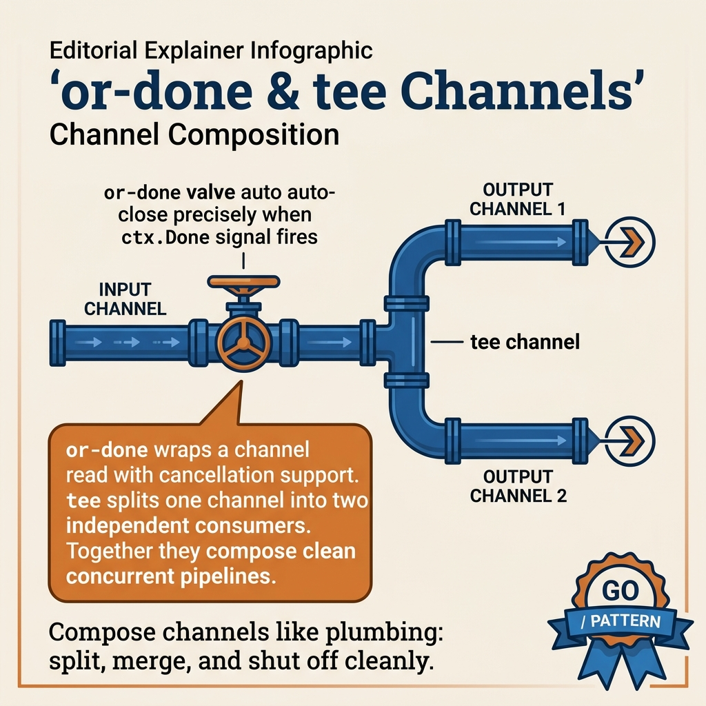

<!-- tags: golang, concurrency, goroutines -->
# 09 — Or-done & Tee Channels

> **Advanced**: Channel patterns for composition — handling done signals and channel splitting.

📅 Created: 2026-03-20 · 🔄 Updated: 2026-04-19 · ⏱️ 15 min read

| Aspect         | Detail                                                       |
| -------------- | ------------------------------------------------------------ |
| **Concept**    | Or-done (cancel-safe read), Tee (1 channel → 2 outputs)     |
| **Use case**   | Graceful shutdown, stream splitting, audit + processing      |
| **Go stdlib**  | `chan`, `select`, `context`, `sync.WaitGroup`                 |
| **Key insight**| Or-done = DRY for cancel-safe reads; Tee = broadcast pattern |

---

## 1. DEFINE

Pipelines assume one producer, one consumer. Real systems break that assumption: a stage may need to forward its output to two independent consumers (tee), or a consumer may need to drain a channel while simultaneously watching for cancellation (or-done). These two micro-patterns fill the gaps that raw `select` and `range` leave open.

You have a pipeline with 5 stages, each stage needing to check `ctx.Done()` before every channel read. Result: every stage repeats the same `select { case <-ctx.Done(): ... case v := <-ch: ... }`. Code is duplicated, hard to read. Or-done pattern extracts this logic into a helper — 1 line instead of 5. Tee channel solves a different problem: you need to send the same data stream to both an audit logger and a processor — but a Go channel only allows 1 consumer. But there is a trap: tee channel blocks if 1 consumer is slow — the entire pipeline stalls. And the or-done helper allocates a goroutine on every call = leak if you forget to cancel. That trap will surface in PITFALLS.

### Or-done Channel

**Or-done** pattern wraps a channel read to automatically abort when a `done` (or `ctx.Done()`) signal fires. Instead of writing `select { case <-done; case v := <-ch }` everywhere → extract into a helper function.

### Tee Channel

**Tee** channel takes 1 input → splits into **2 identical outputs** (similar to the `tee` command in Unix). Every value from input is sent to BOTH output channels.

### Or Channel

**Or** channel combines N `done` channels → 1 channel that closes when **ANY** input channel closes. Pattern for "first one wins" — race multiple operations.

### Use cases

| Pattern     | Use case                                              |
| ----------- | ----------------------------------------------------- |
| **Or-done** | Wrap channel reads in pipeline stages for easy cancel |
| **Tee**     | Send data to 2 different consumers (log + process)    |
| **Or**      | Race timeout vs result, first successful response     |

### Failure Modes

| Failure                  | Cause                                   | Prevention                                  |
| ------------------------ | --------------------------------------- | ------------------------------------------- |
| **Goroutine leak (tee)** | Slow consumer → tee goroutine blocks    | Buffer channels or context                  |
| **Or channel leak**      | Recursive goroutines not cleaned up     | Use context.Context instead                 |
| **Tee out-of-sync**      | 1 consumer fast, 1 slow → blocks both   | Use buffered channels or async consumers    |

Or-done, tee channel, or-channel patterns — theory is covered. Let us see what data flow and split/merge look like visually.

---
## 2. VISUAL

Channel composition in this article is hard to remember from code wrappers alone. The PNG below pulls `or-done` and `tee` back to their actual jobs: preserving cancellation and duplication semantics.



*`or-done` helps stop reads cleanly; `tee` helps split a stream while still forcing you to respect drain/cancel rules on both branches.*

### Or-done Pattern

```
Before (verbose):                   After (or-done wrapper):

for {                               for v := range orDone(ctx, ch) {
    select {                             process(v)
    case <-ctx.Done():               }
        return
    case v, ok := <-ch:
        if !ok { return }
        process(v)
    }
}

→ Reduces boilerplate, more readable
```

### Tee Channel

```
                      ┌──▶ output1 ──▶ Consumer A (log)
  input ──▶ tee() ───┤
                      └──▶ output2 ──▶ Consumer B (process)

Every value from input → copied into BOTH outputs
  input: [1, 2, 3]
  output1: [1, 2, 3]  (exact copy)
  output2: [1, 2, 3]  (exact copy)
```

### Or Channel

```
  done1 ──┐
           │
  done2 ──┼──▶ or() ──▶ closes when ANY input closes
           │
  done3 ──┘

Timeline:
  done1: ━━━━━━━━━━━ (still open)
  done2: ━━━━ close!
  done3: ━━━━━━━━━━━ (still open)
  or():  ━━━━ close! ← done2 closes → or closes immediately
```

The diagrams give an overview of or-done and tee channel. Now let us implement — starting from the or-done helper, then tee channel, then or-channel, then combining all three.

---

## 3. CODE

You have seen the flow of signals, requests, and goroutines in **Or-done & Tee Channels**. Now shift to code to check which parts must be written tightly to avoid paying the production price.

---

### Example 1: Basic — Or-done — Clean channel iteration with cancellation
> **Goal**: Demonstrate or-done — clean channel iteration with cancellation in the right context so the reader understands why this technique exists.
> **Approach**: Start from a basic example then attach necessary technical decisions instead of jumping straight into hard code.
> **Example**: A job or request passes through multiple goroutines while preserving cancellation, concurrency limits, and clear error handling.
> **Complexity**: O(1) orchestration in application code; real cost depends on data, goroutines, or I/O being demonstrated.

**Goal**: Create an `orDone` helper function — wraps `<-chan T` into cancellation-aware iteration. Reduces boilerplate `select { case <-done }` in every pipeline stage.

**Requirements**: Go standard library, `context` package.

```go
package main

import (
    "context"
    "fmt"
    "time"
)

// ━━━━━━━━━━━━━━━━━━━━━━━━━━━━━━━━━━━━━━━━━
// orDone: wraps channel read with context cancellation
//
// BEFORE (verbose — must write at EVERY channel read):
//   for {
//       select {
//       case <-ctx.Done(): return
//       case v, ok := <-ch:
//           if !ok { return }
//           // use v
//       }
//   }
//
// AFTER (clean — use range):
//   for v := range orDone(ctx, ch) {
//       // use v
//   }
// ━━━━━━━━━━━━━━━━━━━━━━━━━━━━━━━━━━━━━━━━━
func orDone[T any](ctx context.Context, ch <-chan T) <-chan T {
    out := make(chan T)
    go func() {
        defer close(out)
        for {
            select {
            case <-ctx.Done():
                return
            case v, ok := <-ch:
                if !ok {
                    return // channel closed
                }
                select {
                case out <- v:
                case <-ctx.Done():
                    return
                }
            }
        }
    }()
    return out
}

// Simulate data source
func dataSource(count int) <-chan int {
    ch := make(chan int)
    go func() {
        defer close(ch)
        for i := 1; i <= count; i++ {
            ch <- i
            time.Sleep(100 * time.Millisecond)
        }
    }()
    return ch
}

func main() {
    // ━━━ Context cancels after 350ms ━━━
    ctx, cancel := context.WithTimeout(context.Background(), 350*time.Millisecond)
    defer cancel()

source := dataSource(100) // produces 100 items (10s without cancel)

// ━━━ orDone: auto-stops when context cancels ━━━
    fmt.Println("Reading with orDone (auto-cancel at 350ms):")
    count := 0
    for v := range orDone(ctx, source) {
        count++
        fmt.Printf("  Received: %d\n", v)
    }
    fmt.Printf("Stopped after %d items (ctx: %v)\n", count, ctx.Err())
}
```

This example is appropriate for grasping the baseline of or-done — clean channel iteration with cancellation. When you need to handle more edge cases or coordinate additional abstractions, move to the next example.

**Achieved**:

- Reads ~3 items (300ms) then auto-stops when context times out (350ms).
- `orDone` uses generics (Go 1.18+) — type-safe, reusable for any `<-chan T`.
- Clean code: `for v := range orDone(ctx, ch)` instead of nested select.

**Caveats**:

- `orDone` creates 1 goroutine — small overhead but present. Only use when cancellation is needed.
- Inner `select` needs 2 cases (`out <- v` + `ctx.Done()`) — prevents blocking on send when ctx cancels.
- Go 1.18+: uses generics `[T any]`. Older Go: use `interface{}`.

Or-done covers clean iteration. But when you need to send the same stream to 2 consumers — audit log + processor — tee channel splits 1→2.

---

### Example 2: Intermediate — Tee Channel — Split 1 input into 2 outputs
> **Goal**: Demonstrate tee channel — split 1 input into 2 outputs in the right context so the reader understands why this technique exists.
> **Approach**: Start from an intermediate example then attach necessary technical decisions instead of jumping straight into hard code.
> **Example**: A job or request passes through multiple goroutines while preserving cancellation, concurrency limits, and clear error handling.
> **Complexity**: O(1) orchestration; total complexity depends on the number of coordination steps and related data structures.

**Goal**: Create a `tee` function — sends each value to BOTH channels. Use case: log stream + processing stream from the same source.

**Requirements**: Go standard library, `context` package.

```go
package main

import (
    "context"
    "fmt"
    "sync"
    "time"
)

// ━━━━━━━━━━━━━━━━━━━━━━━━━━━━━━━━━━━━━━━━━
// tee: split 1 input channel → 2 output channels
//
// Every value from input is sent to BOTH outputs.
// ⚠ BOTH consumers must read — if 1 consumer is slow
//    → blocks tee goroutine → blocks the other consumer too.
// ━━━━━━━━━━━━━━━━━━━━━━━━━━━━━━━━━━━━━━━━━
func tee[T any](ctx context.Context, in <-chan T) (<-chan T, <-chan T) {
    out1 := make(chan T)
    out2 := make(chan T)

go func() {
        defer close(out1)
        defer close(out2)
        for val := range orDone(ctx, in) {
            // ━━━ Send to BOTH channels ━━━
            // Use local vars because select case only allows 1 channel
            var o1, o2 = out1, out2
            for range 2 { // Go 1.22+
                select {
                case <-ctx.Done():
                    return
                case o1 <- val:
                    o1 = nil // ← already sent to o1, disable this case
                case o2 <- val:
                    o2 = nil // ← already sent to o2, disable this case
                }
            }
        }
    }()

return out1, out2
}

// orDone helper (same as Example 1)
func orDone[T any](ctx context.Context, ch <-chan T) <-chan T {
    out := make(chan T)
    go func() {
        defer close(out)
        for {
            select {
            case <-ctx.Done():
                return
            case v, ok := <-ch:
                if !ok {
                    return
                }
                select {
                case out <- v:
                case <-ctx.Done():
                    return
                }
            }
        }
    }()
    return out
}

func main() {
    ctx, cancel := context.WithCancel(context.Background())
    defer cancel()

// ━━━ Source: generate 1..5 ━━━
    source := make(chan int)
    go func() {
        defer close(source)
        for i := 1; i <= 5; i++ {
            source <- i
            time.Sleep(50 * time.Millisecond)
        }
    }()

// ━━━ Tee: split source → logger + processor ━━━
    logStream, processStream := tee(ctx, source)

var wg sync.WaitGroup

// Consumer A: Logger (logs all values)
    wg.Add(1)
    go func() {
        defer wg.Done()
        for v := range logStream {
            fmt.Printf("  [Logger]    value=%d\n", v)
        }
    }()

// Consumer B: Processor (transforms values)
    wg.Add(1)
    go func() {
        defer wg.Done()
        for v := range processStream {
            fmt.Printf("  [Processor] value=%d → %d²=%d\n", v, v, v*v)
        }
    }()

wg.Wait()
    fmt.Println("\nBoth consumers received all values!")
}
```

This level starts being useful for real code because it coordinates multiple techniques. The caveat is to keep the API compact so the reader does not lose track of reasoning.

**Achieved**:

- 1 source → 2 consumers: Logger and Processor receive the SAME data.
- Tee implementation uses the `nil channel trick`: set channel = nil after sending → select skips that case.

**Caveats**:

- **BOTH consumers MUST read** — if 1 consumer blocks → blocks both.  
  Fix: use buffered channels or async consumer wrappers.
- `nil channel trick`: `case ch <- v:` with `ch = nil` → select **skips** that case (never ready). This is a Go idiom.

> **Why does tee channel use the nil channel trick?**
> When 1 of the 2 outputs has already received data, you need to send to the remaining output without re-sending. Assigning the already-sent channel = nil → select automatically skips that case. This is a state machine via select: changing behavior by changing channels, no flags or conditions needed.

- Tee creates a **copy** — both consumers receive the same value, they do not split items (unlike fan-out).

Tee channel covers broadcast. But when you need to pick the fastest result from multiple sources — or-channel first one wins.

---

### Example 3: Advanced — Or Channel — First one wins
> **Goal**: Demonstrate or channel — first one wins in the right context so the reader understands why this technique exists.
> **Approach**: Start from an advanced example then attach necessary technical decisions instead of jumping straight into hard code.
> **Example**: A job or request passes through multiple goroutines while preserving cancellation, concurrency limits, and clear error handling.
> **Complexity**: O(1) orchestration at the example layer; real complexity lies in concurrency, memory, and integration underneath.

**Goal**: Combine multiple `done` channels into 1 — closes when ANY input closes. Use case: race timeout vs result, or multiple cancellation sources.

**Requirements**: Go standard library.

```go
package main

import (
    "fmt"
    "time"
)

// ━━━━━━━━━━━━━━━━━━━━━━━━━━━━━━━━━━━━━━━━━
// or: combine N done channels → 1
// Closes when ANY input channel closes.
//
// How it works:
// - Base case: 0 channels → nil, 1 channel → return it
// - 2+ channels: select on all, whichever closes first → return
// - Recursive: split in half, or each half, then or the results
// ━━━━━━━━━━━━━━━━━━━━━━━━━━━━━━━━━━━━━━━━━
func or(channels ...<-chan struct{}) <-chan struct{} {
    switch len(channels) {
    case 0:
        return nil
    case 1:
        return channels[0]
    }

orDone := make(chan struct{})
    go func() {
        defer close(orDone)
        switch len(channels) {
        case 2:
            select {
            case <-channels[0]:
            case <-channels[1]:
            }
        default:
            // Split & recurse
            mid := len(channels) / 2
            select {
            case <-or(channels[:mid]...):
            case <-or(channels[mid:]...):
            }
        }
    }()
    return orDone
}

// after: creates a channel that closes after duration d
func after(d time.Duration) <-chan struct{} {
    ch := make(chan struct{})
    go func() {
        defer close(ch)
        time.Sleep(d)
    }()
    return ch
}

func main() {
    start := time.Now()

// ━━━ 5 signals with different durations ━━━
    // or() closes when the FIRST signal closes (100ms)
    done := or(
        after(2*time.Second),
        after(500*time.Millisecond),
        after(100*time.Millisecond), // ← fastest!
        after(1*time.Second),
        after(3*time.Second),
    )

<-done // ← blocks until 1 signal closes
    fmt.Printf("Signaled after %v\n", time.Since(start)) // ~100ms

// ━━━━━━━━━━━━━━━━━━━━━━━━━━━━━━━━━━━━━━━━━
    // Use case: Race API call vs timeout
    // ━━━━━━━━━━━━━━━━━━━━━━━━━━━━━━━━━━━━━━━━━
    fmt.Println("\n=== Race: API call vs timeout ===")

apiResult := make(chan struct{})
    timeout := after(300 * time.Millisecond)

// Simulate API call
    go func() {
        time.Sleep(200 * time.Millisecond) // API responds in 200ms
        close(apiResult)
    }()

select {
    case <-apiResult:
        fmt.Println("✅ API responded!")
    case <-timeout:
        fmt.Println("❌ Timeout!")
    }
}
```

This is the closest to production level in this article. Only keep this complexity when the trade-off yields clear benefits in correctness, throughput, or maintainability.

**Achieved**:

- `or()` closes after ~100ms — the fastest signal wins.
- Race pattern: API call vs timeout — whichever finishes first wins.

**Caveats**:

- In production, **`context.Context`** replaces most use cases of `or()`.
- `or()` recursive creates O(log N) goroutines — ok for a few channels, be careful with many.

> **Why does or-channel use recursive merge instead of reflect.Select?**
> `reflect.Select` accepts a dynamic number of cases but is slow (reflection overhead). Recursive binary merge creates a tree of goroutines — each goroutine only selects on 2-3 channels → fast path for the Go scheduler. Trade-off: O(log N) goroutines but each goroutine is very lightweight.

- `after()` helper creates `<-chan struct{}` from a duration — reusable.

Or-channel covers first-wins. Combining or-done + tee in a complete pipeline = production pattern.

---

### Example 4: Expert — Combined — Or-done + Tee in Pipeline
> **Goal**: Demonstrate combining or-done + tee in a pipeline in the right context so the reader understands why this technique exists.
> **Approach**: Start from an expert example then attach necessary technical decisions instead of jumping straight into hard code.
> **Example**: A job or request passes through multiple goroutines while preserving cancellation, concurrency limits, and clear error handling.
> **Complexity**: O(1) orchestration at the application layer; the hard parts lie in reliability, scale, and operations.

**Goal**: Production pipeline: source → orDone (cancellation) → tee (split) → 2 consumers. Combining all patterns.

**Requirements**: All patterns from previous examples.

```go
package main

import (
    "context"
    "fmt"
    "sync"
    "time"
)

func orDonePipeline[T any](ctx context.Context, ch <-chan T) <-chan T {
    out := make(chan T)
    go func() {
        defer close(out)
        for {
            select {
            case <-ctx.Done():
                return
            case v, ok := <-ch:
                if !ok {
                    return
                }
                select {
                case out <- v:
                case <-ctx.Done():
                    return
                }
            }
        }
    }()
    return out
}

func teePipeline[T any](ctx context.Context, in <-chan T) (<-chan T, <-chan T) {
    out1 := make(chan T)
    out2 := make(chan T)
    go func() {
        defer close(out1)
        defer close(out2)
        for val := range orDonePipeline(ctx, in) {
            var o1, o2 = out1, out2
            for range 2 { // Go 1.22+
                select {
                case <-ctx.Done():
                    return
                case o1 <- val:
                    o1 = nil
                case o2 <- val:
                    o2 = nil
                }
            }
        }
    }()
    return out1, out2
}

func main() {
    // ━━━ Context: auto cancel after 800ms ━━━
    ctx, cancel := context.WithTimeout(context.Background(), 800*time.Millisecond)
    defer cancel()

// ━━━ Source: stream of events ━━━
    events := make(chan string)
    go func() {
        defer close(events)
        for i := 1; i <= 100; i++ {
            select {
            case <-ctx.Done():
                return
            case events <- fmt.Sprintf("event-%d", i):
                time.Sleep(100 * time.Millisecond)
            }
        }
    }()

// ━━━ Pipeline: source → orDone → tee → 2 consumers ━━━
    safe := orDonePipeline(ctx, events)     // cancellation-safe stream
    logCh, processCh := teePipeline(ctx, safe) // split into 2

var wg sync.WaitGroup

// Consumer 1: Logger — logs all events
    wg.Add(1)
    go func() {
        defer wg.Done()
        for e := range logCh {
            fmt.Printf("  📋 [LOG] %s\n", e)
        }
        fmt.Println("  📋 [LOG] Stream ended")
    }()

// Consumer 2: Analytics — counts events
    wg.Add(1)
    go func() {
        defer wg.Done()
        count := 0
        for range processCh {
            count++
        }
        fmt.Printf("  📊 [ANALYTICS] Total events: %d\n", count)
    }()

wg.Wait()
    fmt.Printf("\n✅ Pipeline completed (ctx: %v)\n", ctx.Err())
}
```

This level is only appropriate when the team is already comfortable with the abstractions and related libraries. If there is no corresponding operational need, a simpler version is usually better.

**Achieved**:

- Source → orDone (auto-cancel at 800ms) → tee → Logger + Analytics.
- ~7-8 events then auto-stop (800ms / 100ms = ~8 events).
- BOTH consumers receive the SAME events, stop at the same time.

**Caveats**:

- `orDone` + `tee` combined create **composable pipeline primitives**.
- In production: you can add filter, transform stages between orDone and tee.

> **Why combine or-done + tee instead of having 2 consumers read directly?**
> A Go channel only allows 1 consumer to receive each message. 2 consumers reading the same channel → each message goes to only 1 consumer (fan-out, not broadcast). Tee clones data for both. Or-done wraps reads for cancel-safety. Combined = broadcast + graceful shutdown.

- This pattern is common in **event streaming**, **log processing**, **monitoring**.

You now know or-done, tee channel, or-channel, and the combo pipeline. Here comes the dangerous part: slow tee consumer and goroutine leak — traps set up from the beginning of this article.

---

## 4. PITFALLS

The correct mechanism of **Or-done & Tee Channels** is in place. The traps below are where people get timing, ownership, or evidence wrong — and only realize it when the incident has already exploded.

| # | Severity | Mistake | Consequence | Fix |
| --- | --- | --- | --- | --- |
| 1 | 🔴 Fatal | **Or channel goroutine leak** | Recursive goroutines not cleaned up | Use context instead |
| 2 | 🔴 Fatal | **Forget to close inner channels** | Goroutine leak | Always `defer close(out)` |
| 3 | 🟡 Common | **Slow tee consumer** | Blocks BOTH consumers | Buffer channels or timeout |
| 4 | 🔵 Minor | **Or-done double select** | Needs 2 selects (receive + send) | Template code in Example 1 |

You have covered or-done, tee, or-channel, combo, and the consumer/leak traps. The resources below help you go deeper.

---

## 5. REF

| Resource | Type | Link | Notes |
| --- | --- | --- | --- |
| Concurrency in Go (O'Reilly) Ch.4 | Book | ISBN: 978-1491941195 | Or-done, tee, or patterns |
| Go Blog — Advanced Concurrency | Official talk | [go.dev/talks/2013/advconc.slide](https://go.dev/talks/2013/advconc.slide) | Advanced patterns |
| Go Concurrency Patterns (Rob Pike) | Official talk | [go.dev/talks/2012/concurrency.slide](https://go.dev/talks/2012/concurrency.slide) | Foundational patterns |

---

## 6. RECOMMEND

You have enough context from **Or-done & Tee Channels** to proceed with purpose. The directions below help expand to the right tooling, runtime, or related pattern layer.

| Next step | When | Reason | File/Link |
| --- | --- | --- | --- |
| **context.Context** | Simplified or-done | Context cancel = or-done for most cases | `context` |
| **conc.iter.ForEach** | Typed tee | Type-safe broadcast | [13-conc.md](./13-conc.md) |
| **Redis Pub/Sub / NATS** | Distributed tee | Cross-service broadcast | External services |
| **Watermill + tee** | Event sourcing | Split event stream for audit + processing | `ThreeDotsLabs/watermill` |
| **Or-done + fan-out** | Fan-out combine | Graceful shutdown for multi-worker systems | Pattern |
| **goleak** | Testing | Detect goroutine leaks from or-done patterns | `uber-go/goleak` |
