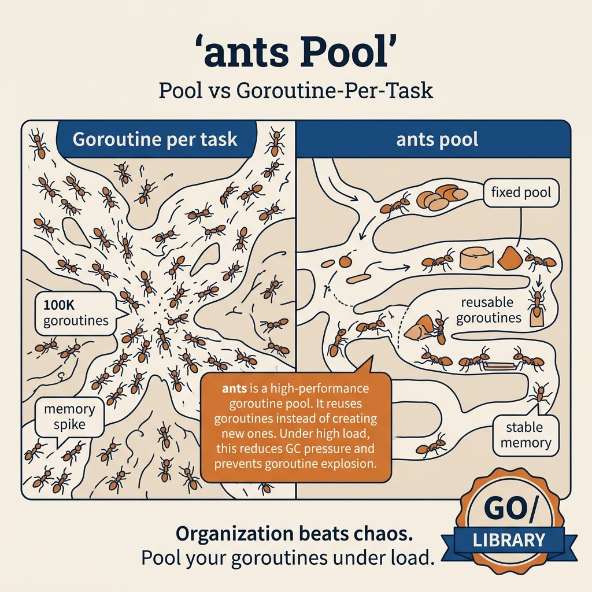

<!-- tags: golang -->
# 12 — Ants

> **Library**: `github.com/panjf2000/ants` — High-performance goroutine pool with auto-scaling.

📅 Created: 2026-03-20 · 🔄 Updated: 2026-04-19 · ⏱️ 15 min read

| Aspect         | Detail                                                        |
| -------------- | ------------------------------------------------------------- |
| **Concept**    | Ants — pre-allocated goroutine pool, auto-scale, panic-safe   |
| **Use case**   | High-throughput task processing, HTTP handler pool             |
| **Go stdlib**  | `github.com/panjf2000/ants/v2`                                |
| **Key insight**| Goroutine reuse reduces alloc/GC 90%+, auto-scales with workload |

---

## 1. DEFINE

Hand-rolling a worker pool means managing channels, WaitGroups, shutdown signals, and panic recovery yourself. `ants` is the most popular Go goroutine pool library (10K+ GitHub stars): it provides a production-ready pool with auto-tuning, pre-allocation, non-blocking submission, and built-in metrics — at the cost of an external dependency and a learning curve around its configuration knobs.

A DIY worker pool with channels works fine, but when traffic spikes from 100 → 10,000 tasks/s, you need a pool that auto-scales, auto-recovers from panics, and does not create new goroutines every time. Ants solves this: pre-allocate goroutines, reuse them across tasks, auto-scale with load, and panic recovery built-in. But there is a trap: `Submit()` with closure captures by reference — a variable changing outside the closure = silent race condition. And `PoolWithFunc` with `interface{}` args = runtime panic if the type is wrong. That trap will surface in PITFALLS.

### Definition

**Ants** is the highest-performance goroutine pool library for Go. Instead of creating a new goroutine for every task → **reuse** from a goroutine pool. Reduces the overhead of creating/destroying goroutines, limits memory consumption.

### Ants vs Tunny vs errgroup

| Feature             | Ants                 | Tunny        | errgroup.SetLimit |
| ------------------- | -------------------- | ------------ | ----------------- |
| **Pool type**       | Dynamic (auto-scale) | Fixed        | Fixed             |
| **Goroutine reuse** | ✅ (core feature)    | ✅           | ❌ (creates new)  |
| **Return result**   | ❌ (fire-and-forget) | ✅ Process() | ❌                |
| **Panic recovery**  | ✅ Built-in          | ❌           | ❌                |
| **Pre-allocate**    | ✅ `PreAlloc` option | ✅           | ❌                |
| **Expiry cleanup**  | ✅ Auto-purge idle   | ❌ Fixed     | N/A               |
| **Performance**     | ⚡ Fastest           | Moderate     | Good              |

### 2 Pool Types

| Type                    | API              | Use case              |
| ----------------------- | ---------------- | --------------------- |
| **`ants.Pool`**         | `Submit(func())` | Fire-and-forget tasks |
| **`ants.PoolWithFunc`** | `Invoke(args)`   | All tasks receive args |

### Invariants

- Pool auto-shrinks when idle (configurable expiry)
- `Submit()` blocks when pool is full — or returns error if blocking is disabled
- `Release()` must be called when done — frees goroutines
- Panic in a task → recovered, pool continues operating

### Failure Modes

| Failure             | Cause                | Prevention              |
| ------------------- | -------------------- | ----------------------- |
| **Pool exhaustion** | Submit too fast       | Buffer, increase pool size |
| **Memory spike**    | Pool too large       | Tune pool size = 2× CPU |
| **Forget Release**  | Pool goroutines leak | `defer pool.Release()`  |

Ants pool, auto-scaling, panic recovery — theory is covered. Let us see what the pool lifecycle looks like visually.

---
## 2. VISUAL

With `ants`, the important thing is not remembering the API. The important thing is knowing when a library pool is worth the effort over plain goroutines or a small hand-rolled worker pool.



*If admission control and pooling pressure are not real pain yet, plain Go is usually still the better default.*

### Ants Pool Architecture

```
  Tasks ──▶ Submit(task) ──▶ ┌───────────────────────────────┐
                             │       Ants Pool (N=4)         │
                             │                               │
                             │  ┌────┐ ┌────┐ ┌────┐ ┌────┐│
                             │  │ G1 │ │ G2 │ │ G3 │ │ G4 ││
                             │  │busy│ │idle│ │busy│ │idle ││
                             │  └────┘ └────┘ └────┘ └────┘│
                             │      ↑                  ↑    │
                             │      │   Reuse!    Reuse!    │
                             │      │                  │    │
                             │  Task done → G available    │
                             │  New task → assign to idle G│
                             └───────────────────────────────┘
                                        │
                             Idle timeout (5s) → purge G
                             (auto-scale to save memory)
```

The diagram gives an overview of the ants pool. Now let us implement — starting from basic pool, then PoolWithFunc, then Options monitoring, then CSV import pipeline.

---

## 3. CODE

You have seen the flow of signals, requests, and goroutines in **Ants**. Now shift to code to check which parts must be written tightly to avoid paying the production price.

---

### Example 1: Basic — ants.Pool
> **Goal**: Demonstrate basic ants.Pool in the right context so the reader understands why this technique exists.
> **Approach**: Start from a basic example then attach necessary technical decisions instead of jumping straight into hard code.
> **Example**: A job or request passes through multiple goroutines while preserving cancellation, concurrency limits, and clear error handling.
> **Complexity**: O(1) orchestration in application code; real cost depends on data, goroutines, or I/O being demonstrated.

**Goal**: Create a pool with N goroutines, submit fire-and-forget tasks.

**Requirements**: `go get github.com/panjf2000/ants/v2`.

```go
package main

import (
    "fmt"
    "sync"
    "sync/atomic"
    "time"

"github.com/panjf2000/ants/v2"
)

func main() {
    var taskCount atomic.Int64

// ━━━━━━━━━━━━━━━━━━━━━━━━━━━━━━━━━━━━━━━━━
    // ants.NewPool: creates pool with max 10 goroutines
    // Goroutines are reused — not created fresh per task
    // ━━━━━━━━━━━━━━━━━━━━━━━━━━━━━━━━━━━━━━━━━
    pool, err := ants.NewPool(10,
        ants.WithPreAlloc(true),                         // Pre-allocate goroutines
        ants.WithExpiryDuration(5*time.Second),          // Idle goroutine timeout
        ants.WithPanicHandler(func(p interface{}) {      // Handle panics
            fmt.Printf("🔥 Panic recovered: %v\n", p)
        }),
    )
    if err != nil {
        panic(err)
    }
    defer pool.Release() // ← ALWAYS Release when done

var wg sync.WaitGroup

// Submit 100 tasks — only 10 run at a time
    for range 100 { // Go 1.22+
        wg.Add(1)
        err := pool.Submit(func() {
            defer wg.Done()
            taskCount.Add(1)
            time.Sleep(50 * time.Millisecond) // simulate work
        })
        if err != nil {
            wg.Done()
            fmt.Printf("Submit failed: %v\n", err)
        }
    }

wg.Wait()

fmt.Printf("Tasks completed: %d\n", taskCount.Load())
    fmt.Printf("Pool running: %d\n", pool.Running())
    fmt.Printf("Pool free: %d\n", pool.Free())
    fmt.Printf("Pool cap: %d\n", pool.Cap())
}
```

This example is appropriate for grasping the baseline of ants.Pool. When you need to handle more edge cases or coordinate additional abstractions, move to the next example.

**Achieved**:

- 100 tasks processed by 10 reused goroutines.
- Pre-allocate: goroutines created upfront (avoids allocation on submit).
- Panic recovery: task panics → pool keeps operating.

**Caveats**:

- `Submit` returns error if pool is released or task is rejected.
- `pool.Release()` frees ALL goroutines — call once at app shutdown.
- `Running()`, `Free()`, `Cap()` for monitoring.

Basic pool covers fire-and-forget tasks. But when all tasks use the same function with only different arguments — PoolWithFunc saves more memory.

---

### Example 2: Intermediate — PoolWithFunc — Tasks with arguments
> **Goal**: Demonstrate PoolWithFunc — tasks with arguments in the right context so the reader understands why this technique exists.
> **Approach**: Start from an intermediate example then attach necessary technical decisions instead of jumping straight into hard code.
> **Example**: A job or request passes through multiple goroutines while preserving cancellation, concurrency limits, and clear error handling.
> **Complexity**: O(1) orchestration; total complexity depends on the number of coordination steps and related data structures.

**Goal**: Pool with a fixed function — each task calls `Invoke(args)` instead of `Submit(func())`. More efficient when all tasks share the same logic.

**Requirements**: `ants/v2`.

```go
package main

import (
    "fmt"
    "math"
    "sync"
    "time"

"github.com/panjf2000/ants/v2"
)

type ImageTask struct {
    ID     int
    Width  int
    Height int
}

type ImageResult struct {
    TaskID   int
    Resized  string
    Duration time.Duration
}

func main() {
    results := make(chan ImageResult, 50)

// ━━━━━━━━━━━━━━━━━━━━━━━━━━━━━━━━━━━━━━━━━
    // PoolWithFunc: all tasks use the SAME function
    // Invoke(args) calls the function with args
    // More efficient than Pool because function is compiled once
    // ━━━━━━━━━━━━━━━━━━━━━━━━━━━━━━━━━━━━━━━━━
    pool, err := ants.NewPoolWithFunc(4, func(payload interface{}) {
        task := payload.(ImageTask)
        start := time.Now()

// Simulate image resize
        pixels := task.Width * task.Height
        time.Sleep(time.Duration(pixels/10000) * time.Millisecond)

results <- ImageResult{
            TaskID:   task.ID,
            Resized:  fmt.Sprintf("%dx%d → %dx%d", task.Width, task.Height,
                task.Width/2, task.Height/2),
            Duration: time.Since(start),
        }
    })
    if err != nil {
        panic(err)
    }
    defer pool.Release()

// Submit image tasks
    tasks := []ImageTask{
        {1, 1920, 1080}, {2, 3840, 2160}, {3, 1280, 720},
        {4, 2560, 1440}, {5, 800, 600},   {6, 4096, 2160},
        {7, 1024, 768},  {8, 1600, 900},
    }

var wg sync.WaitGroup
    for _, task := range tasks {
        wg.Add(1)
        go func(t ImageTask) {
            defer wg.Done()
            pool.Invoke(t) // ← blocks until a goroutine is free
        }(task)
    }

go func() {
        wg.Wait()
        close(results)
    }()

for r := range results {
        fmt.Printf("Task %d: %s (%v)\n", r.TaskID, r.Resized, r.Duration)
    }

_ = math.Abs(0) // suppress unused import
}
```

This level starts being useful for real code because it coordinates multiple techniques. The caveat is to keep the API compact so the reader does not lose track of reasoning.

**Achieved**:

- 8 image tasks, 4 workers — processed in parallel.
- `Invoke(payload)` passes args directly — no need to wrap in a closure.

**Caveats**:

- `PoolWithFunc` is better than `Pool` when ALL tasks use the same logic (fewer allocations).
- `Invoke()` is blocking — caller waits for a free goroutine.
- Payload is `interface{}` → needs type assertion inside the function.

> **Why `PoolWithFunc` instead of `NewPool` + closure?**
> `NewPool` takes `func()` — each task is a closure that captures outer variables, easily causing closure-over-loop-variable bugs. `PoolWithFunc` takes `func(interface{})` — argument is passed directly, no capture. Safer and more explicit for tasks with input.

PoolWithFunc covers typed tasks. But production needs monitoring (Running, Free), auto-scaling (Tune), and NonBlocking option.

---

### Example 3: Advanced — Advanced options — Monitoring & Tuning
> **Goal**: Demonstrate advanced options — monitoring & tuning in the right context so the reader understands why this technique exists.
> **Approach**: Start from an advanced example then attach necessary technical decisions instead of jumping straight into hard code.
> **Example**: The code below shows core input/output and how to wire this technique into an application or real-world problem.
> **Complexity**: O(1) orchestration at the example layer; real complexity lies in concurrency, memory, and integration underneath.

**Goal**: Configure pool for production: custom logger, nonblocking, max blocking tasks.

```go
package main

import (
    "fmt"
    "log"
    "time"

"github.com/panjf2000/ants/v2"
)

func main() {
    // ━━━━━━━━━━━━━━━━━━━━━━━━━━━━━━━━━━━━━━━━━
    // Production options
    // ━━━━━━━━━━━━━━━━━━━━━━━━━━━━━━━━━━━━━━━━━
    pool, err := ants.NewPool(10,
        // Pre-allocate goroutines (avoid runtime allocation)
        ants.WithPreAlloc(true),

// Idle goroutine expiry (auto-scale down)
        ants.WithExpiryDuration(10*time.Second),

// Non-blocking: Submit returns error instead of blocking
        ants.WithNonblocking(true),

// Max blocking tasks: max 100 tasks waiting in queue
        // Exceeding → Submit returns error
        ants.WithMaxBlockingTasks(100),

// Panic handler
        ants.WithPanicHandler(func(p interface{}) {
            log.Printf("🔥 Worker panic: %v", p)
        }),

// Custom logger
        ants.WithLogger(log.Default()),
    )
    if err != nil {
        panic(err)
    }
    defer pool.Release()

// ━━━ Monitoring ━━━
    go func() {
        for {
            fmt.Printf("📊 Running: %d | Free: %d | Cap: %d\n",
                pool.Running(), pool.Free(), pool.Cap())
            time.Sleep(1 * time.Second)
        }
    }()

// Submit tasks
    for range 50 { // Go 1.22+
        err := pool.Submit(func() {
            time.Sleep(500 * time.Millisecond)
        })
        if err != nil {
            fmt.Printf("❌ Submit rejected: %v\n", err) // NonBlocking = true
        }
    }

time.Sleep(3 * time.Second)

// ━━━ Resize pool at runtime ━━━
    pool.Tune(20) // scale up to 20
    fmt.Printf("Pool resized to cap: %d\n", pool.Cap())

// ━━━ Reboot pool (reset all workers) ━━━
    pool.Reboot()
    fmt.Println("Pool rebooted!")
}
```

This is the closest to production level in this article. Only keep this complexity when the trade-off yields clear benefits in correctness, throughput, or maintainability.

**Achieved**:

- `NonBlocking`: Submit returns error instead of blocking → good for HTTP handlers.
- `Tune(n)`: resize pool at runtime — auto-scale.
- `Reboot()`: reset pool — recreate workers.

**Caveats**:

- **NonBlocking** + `WithMaxBlockingTasks`: combine for backpressure control.
- `Tune()` enables runtime scaling — adjust pool size based on load.

> **Why `Tune()` at runtime instead of fixed pool size?**
> Traffic patterns change by the hour: peak 10K tasks/s, off-peak 100. Fixed pool size = wasted memory off-peak or insufficient capacity at peak. `Tune(N)` enables auto-scaling based on metrics (queue depth, latency) — similar to Kubernetes HPA but for a goroutine pool.

- Ants **benchmark**: 10x less memory than creating goroutines directly for large workloads.

Options/monitoring covers tuning. Combining Ants + sync.Pool + GORM batch = production CSV import pipeline.

---

### Example 4: Expert — Ants + GORM Batch Insert + sync.Pool — CSV Import Pipeline
> **Goal**: Demonstrate Ants + GORM batch insert + sync.Pool — CSV import pipeline in the right context so the reader understands why this technique exists.
> **Approach**: Start from an expert example then attach necessary technical decisions instead of jumping straight into hard code.
> **Example**: A job or request passes through multiple goroutines while preserving cancellation, concurrency limits, and clear error handling.
> **Complexity**: O(1) orchestration at the application layer; the hard parts lie in reliability, scale, and operations.

**Goal**: Build a CSV import pipeline: read CSV file → parse with reusable buffers (sync.Pool) → batch insert into DB (GORM) → limit concurrency (Ants). A common pattern for data import, ETL, bulk processing.

**Requirements**: `ants/v2`, `gorm.io/gorm`, `sync` (Pool).

**Components**: CSV file containing 100K products → parse → validate → batch insert 500 rows/batch. Ants pool limits to 8 concurrent workers, sync.Pool reuses parse buffers.

```go
package main

import (
    "bytes"
    "context"
    "encoding/csv"
    "fmt"
    "io"
    "log"
    "os"
    "strconv"
    "sync"
    "sync/atomic"

"github.com/panjf2000/ants/v2"
    "gorm.io/driver/postgres"
    "gorm.io/gorm"
    "gorm.io/gorm/logger"
)

// ━━━━━━━━━━━━━━━━━━━━━━━━━━━━━━━━━━━━━━━━━
// GORM Model: destination table
// ━━━━━━━━━━━━━━━━━━━━━━━━━━━━━━━━━━━━━━━━━
type ImportedProduct struct {
    ID       uint    `gorm:"primarykey;autoIncrement"`
    SKU      string  `gorm:"column:sku;uniqueIndex;size:50"`
    Name     string  `gorm:"column:name;size:200"`
    Price    float64 `gorm:"column:price"`
    Category string  `gorm:"column:category;index;size:100"`
    Stock    int     `gorm:"column:stock"`
}

// ━━━━━━━━━━━━━━━━━━━━━━━━━━━━━━━━━━━━━━━━━
// sync.Pool: reuse byte buffers for CSV parsing
// Why? CSV parsing creates many temporary strings/byte slices
// sync.Pool reduces GC pressure ~40% for large imports
// ━━━━━━━━━━━━━━━━━━━━━━━━━━━━━━━━━━━━━━━━━
var bufferPool = sync.Pool{
    New: func() interface{} {
        return bytes.NewBuffer(make([]byte, 0, 4096)) // 4KB pre-alloc
    },
}

// parseBatch: parse CSV rows into structs, using pooled buffer
func parseBatch(rows [][]string) []ImportedProduct {
    buf := bufferPool.Get().(*bytes.Buffer)
    defer func() {
        buf.Reset()
        bufferPool.Put(buf) // ← return to pool — reuse for next batch
    }()

products := make([]ImportedProduct, 0, len(rows))
    for _, row := range rows {
        if len(row) < 5 {
            continue // skip invalid rows
        }

price, _ := strconv.ParseFloat(row[2], 64)
        stock, _ := strconv.Atoi(row[4])

// Validate
        if price <= 0 || row[0] == "" {
            continue
        }

products = append(products, ImportedProduct{
            SKU:      row[0],
            Name:     row[1],
            Price:    price,
            Category: row[3],
            Stock:    stock,
        })
    }
    return products
}

func main() {
    // ━━━━━━━━━━━━━━━━━━━━━━━━━━━━━━━━━━━━━━━━━
    // Setup: GORM + Ants pool
    // ━━━━━━━━━━━━━━━━━━━━━━━━━━━━━━━━━━━━━━━━━
    dsn := "host=localhost user=app dbname=import_db port=5432 sslmode=disable"
    db, err := gorm.Open(postgres.Open(dsn), &gorm.Config{
        Logger:                 logger.Default.LogMode(logger.Warn),
        SkipDefaultTransaction: true, // ← disable auto-transaction for batch insert performance
    })
    if err != nil {
        log.Fatal(err)
    }
    db.AutoMigrate(&ImportedProduct{})

// Ants pool: 8 concurrent workers for batch insert
    // Why 8? DB connection pool is typically 10-20 connections
    // 8 workers = ~80% connection utilization (remainder for other queries)
    pool, err := ants.NewPool(8,
        ants.WithPreAlloc(true),
        ants.WithPanicHandler(func(p interface{}) {
            log.Printf("🔥 Worker panic: %v", p)
        }),
    )
    if err != nil {
        log.Fatal(err)
    }
    defer pool.Release()

// ━━━━━━━━━━━━━━━━━━━━━━━━━━━━━━━━━━━━━━━━━
    // Read CSV file
    // ━━━━━━━━━━━━━━━━━━━━━━━━━━━━━━━━━━━━━━━━━
    file, err := os.Open("products.csv")
    if err != nil {
        log.Fatal(err)
    }
    defer file.Close()

reader := csv.NewReader(file)
    reader.Read() // skip header

// ━━━━━━━━━━━━━━━━━━━━━━━━━━━━━━━━━━━━━━━━━
    // Pipeline: Read CSV → Batch (500 rows) → Parse (sync.Pool) → Insert (GORM)
    //
    //   [CSV File]
    //       ↓ read 500 rows/batch
    //   [parseBatch — sync.Pool buffer]
    //       ↓ []ImportedProduct
    //   [Ants Pool — 8 concurrent workers]
    //       ↓ GORM CreateInBatches
    //   [PostgreSQL]
    //
    // Why batch 500?
    // - < 100: too many INSERT statements → overhead
    // - > 1000: transaction too large → lock contention
    // - 500: sweet spot for PostgreSQL
    // ━━━━━━━━━━━━━━━━━━━━━━━━━━━━━━━━━━━━━━━━━
    const batchSize = 500

var wg sync.WaitGroup
    var totalImported atomic.Int64
    var totalErrors atomic.Int64
    ctx := context.Background()

batch := make([][]string, 0, batchSize)
    batchNum := 0

for {
        row, err := reader.Read()
        if err == io.EOF {
            break
        }
        if err != nil {
            continue
        }

batch = append(batch, row)

if len(batch) >= batchSize {
            batchNum++
            // Copy batch — because the batch slice will be reset after this
            batchCopy := make([][]string, len(batch))
            copy(batchCopy, batch)
            currentBatch := batchNum

wg.Add(1)
            pool.Submit(func() {
                defer wg.Done()

// Parse: sync.Pool reuses buffers
                products := parseBatch(batchCopy)
                if len(products) == 0 {
                    return
                }

// Insert: GORM batch insert
                if err := db.WithContext(ctx).CreateInBatches(products, len(products)).Error; err != nil {
                    log.Printf("❌ Batch %d failed: %v", currentBatch, err)
                    totalErrors.Add(int64(len(products)))
                    return
                }

totalImported.Add(int64(len(products)))
                log.Printf("✅ Batch %d: %d products inserted", currentBatch, len(products))
            })

batch = batch[:0] // reset batch
        }
    }

// Flush remaining rows
    if len(batch) > 0 {
        batchNum++
        remaining := make([][]string, len(batch))
        copy(remaining, batch)
        lastBatch := batchNum

wg.Add(1)
        pool.Submit(func() {
            defer wg.Done()
            products := parseBatch(remaining)
            if len(products) > 0 {
                db.WithContext(ctx).CreateInBatches(products, len(products))
                totalImported.Add(int64(len(products)))
                log.Printf("✅ Final batch %d: %d products", lastBatch, len(products))
            }
        })
    }

wg.Wait()

fmt.Printf("\n📊 Import Summary:\n")
    fmt.Printf("   Total imported: %d\n", totalImported.Load())
    fmt.Printf("   Total errors:   %d\n", totalErrors.Load())
    fmt.Printf("   Batches:        %d\n", batchNum)
}
```

This level is only appropriate when the team is already comfortable with the abstractions and related libraries. If there is no corresponding operational need, a simpler version is usually better.

**Achieved**:

- **3 techniques combined**: Ants (goroutine pool) + sync.Pool (buffer reuse) + GORM (batch insert).
- **100K products → ~200 batches × 500 rows**, 8 concurrent workers.
- **sync.Pool reduces GC**: parse buffers reused, ~40% fewer allocations.
- **SkipDefaultTransaction**: GORM skips auto-transaction → ~2× faster batch insert.

**Caveats**:

- **Batch size 500**: sweet spot for PostgreSQL. MySQL may need 1000. Tune per DB engine.
- **Copy batch**: `batchCopy := copy(...)` — required because the `batch` slice is reset after.
- **Error isolation**: 1 batch fails → only that batch is skipped, does not affect other batches.
- **Production**: add Prometheus metrics for `totalImported`, `totalErrors`, import duration.

> **Why combine Ants + sync.Pool + GORM batch instead of just Ants?**
> Ants limits goroutines (concurrency). sync.Pool reuses buffers (memory). GORM batch insert reduces DB roundtrips (from N inserts down to N/batchSize). Each solves a different bottleneck. Using only Ants: still allocates new buffers per task + N DB roundtrips.

- Comparison: native goroutines for 100K tasks → 100K goroutine overhead. Ants pool: only 8 goroutines reused.

You now know basic pool, PoolWithFunc, Options, and CSV pipeline. Here comes the dangerous part: closure capture and interface{} args — traps set up from the beginning of this article.

---

## 4. PITFALLS

The correct mechanism of **Ants** is in place. The traps below are where people get timing, ownership, or evidence wrong — and only realize it when the incident has already exploded.

| # | Severity | Mistake | Consequence | Fix |
| --- | --- | --- | --- | --- |
| 1 | 🔴 Fatal | **Forget `pool.Release()`** | Goroutines leak | `defer pool.Release()` |
| 2 | 🔴 Fatal | **Submit after Release** | Panic | Check `pool.IsClosed()` |
| 3 | 🟡 Common | **Pool too small** | Tasks queue up → latency | Monitor + Tune() |
| 4 | 🔵 Minor | **interface{} args** | PoolWithFunc type unsafe | Wrap in typed function |

You have covered basic, PoolWithFunc, Options, CSV pipeline, and the capture/type/Submit traps. The resources below help you go deeper.

---

## 5. REF

| Resource | Type | Link | Notes |
| --- | --- | --- | --- |
| Ants GitHub | GitHub | [github.com/panjf2000/ants](https://github.com/panjf2000/ants) | Source code |
| Ants GoDoc | Official docs | [pkg.go.dev/github.com/panjf2000/ants/v2](https://pkg.go.dev/github.com/panjf2000/ants/v2) | API reference |
| Ants Benchmark | GitHub | [github.com/panjf2000/ants#-benchmarks](https://github.com/panjf2000/ants#-benchmarks) | Performance numbers |

---

## 6. RECOMMEND

You have enough context from **Ants** to proceed with purpose. The directions below help expand to the right tooling, runtime, or related pattern layer.

| Next step | When | Reason | File/Link |
| --- | --- | --- | --- |
| **errgroup.SetLimit(n)** | Simple alternative | Simpler when reuse is not needed | [05-errgroup.md](./05-errgroup.md) |
| **sourcegraph/conc** | Type-safe | Generic results | [13-conc.md](./13-conc.md) |
| **Ants + sync.Pool** | Buffer reuse | Workers reuse goroutines + Pool reuses buffers | [04-sync-pool.md](./04-sync-pool.md) |
| **Ants + Gin/Echo** | HTTP server | Limit concurrent HTTP processing | Pattern |
| **Ants + GORM batch** | GORM batch | Parallel DB operations | [orm/02](../orm/02-crud.md) |
| **Ants + Prometheus** | Metrics | Monitor pool.Running(), pool.Free() | Auto-scaling |
