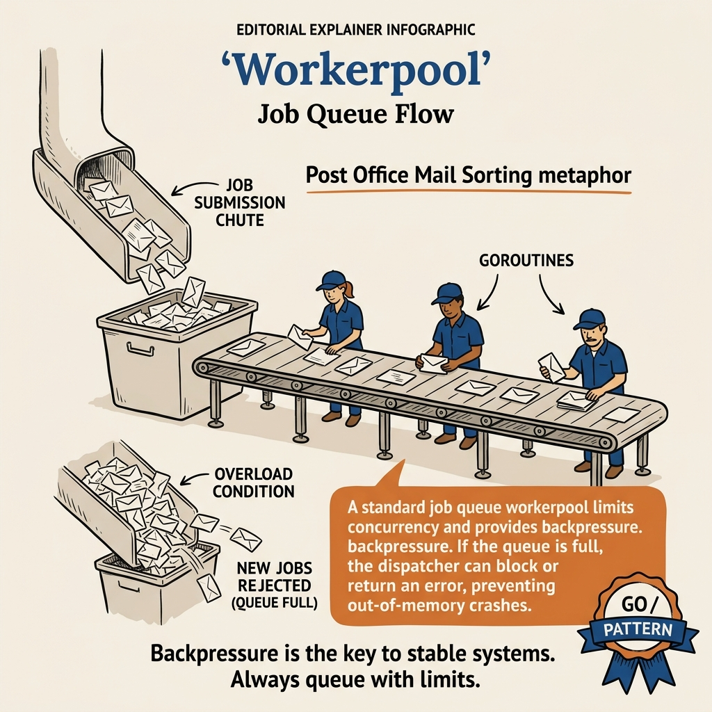

<!-- tags: golang -->
# 14 — Workerpool

> **Library**: `github.com/gammazero/workerpool` — Simple bounded worker pool.

📅 Created: 2026-03-20 · 🔄 Updated: 2026-04-19 · ⏱️ 15 min read

---

## 1. DEFINE

`gammazero/workerpool` takes a different design stance from ants and Tunny: a minimal API surface with a fixed worker count, automatic task queuing, and a clean `StopWait()` shutdown. It trades configurability for simplicity — fewer knobs means fewer misconfiguration bugs in production.

> *100K items 50ms. 100K overwhelm. workerpool lifecycle.*

### Definition

**Workerpool** is a lightweight worker pool library — extremely simple API: `Submit(func())` and `StopWait()`. Suitable when you need to limit concurrency without complex features (timeout, results, weighted). But there is a trap: the queue is unbounded = submitting faster than processing → memory grows without limit. And `Submit` after `Stop` = panic. That trap will surface in PITFALLS.

### Workerpool vs Ants vs Tunny

| Feature             | Workerpool        | Ants              | Tunny              |
| ------------------- | ----------------- | ----------------- | ------------------ |
| **API**             | Submit + StopWait | Submit + Release  | Process (blocking) |
| **Return result**   | ❌                | ❌                | ✅                 |
| **Queue overflow**  | Unbounded queue   | Configurable      | Block              |
| **Goroutine reuse** | ✅                | ✅                | ✅                 |
| **Complexity**      | ⭐ Simplest       | ⭐⭐⭐            | ⭐⭐               |
| **Best for**        | Simple batch jobs | High-perf servers | Request-response   |

### API

| Method               | Description                                    |
| -------------------- | ---------------------------------------------- |
| `New(maxWorkers)`    | Create pool with N workers                     |
| `Submit(func())`     | Submit task — queues if workers are busy        |
| `SubmitWait(func())` | Submit + block until task completes             |
| `StopWait()`         | Wait for all tasks to finish, then stop pool    |
| `Stop()`             | Cancel pending tasks, stop immediately          |
| `WaitingQueueSize()` | Number of tasks waiting in the queue            |

### Failure Modes

| Failure           | Cause                          | Prevention               |
| ----------------- | ------------------------------ | ------------------------ |
| **Memory leak**   | Queue unbounded + submit fast  | Monitor WaitingQueueSize |
| **Forget StopWait** | Goroutines leak             | `defer pool.StopWait()`  |

Workerpool API, use cases, invariants — theory is covered. Let us see what the job flow looks like visually.

---
## 2. VISUAL

`workerpool` is a lifecycle problem before it is an API problem. The PNG below clarifies queue ownership, bounded workers, and stop semantics.



*The value of `workerpool` lies in a very compact lifecycle: submit, consume with a fixed worker count, then stop cleanly at the right boundary.*

```
  Workerpool (maxWorkers=3)

Submit(t1) → Worker 1 ━━━━━ done → pick t4
  Submit(t2) → Worker 2 ━━━━━━━ done → pick t5
  Submit(t3) → Worker 3 ━━━━ done → pick t6
  Submit(t4) → Queue [t4] ← waits for a free worker
  Submit(t5) → Queue [t5]
  Submit(t6) → Queue [t6]

StopWait() → waits for t1..t6 to finish → stops all workers
```

The diagram gives an overview of workerpool. Now let us implement — starting from basic batch file processing, then SubmitWait + monitoring.

---

## 3. CODE

You have seen the flow of signals, requests, and goroutines in **Workerpool**. Now shift to code to check which parts must be written tightly to avoid paying the production price.

---

### Example 1: Basic — Batch file processing
> **Goal**: Demonstrate basic batch file processing in the right context so the reader understands why this technique exists.
> **Approach**: Start from a basic example then attach necessary technical decisions instead of jumping straight into hard code.
> **Example**: A job or request passes through multiple goroutines while preserving cancellation, concurrency limits, and clear error handling.
> **Complexity**: O(1) orchestration in application code; real cost depends on data, goroutines, or I/O being demonstrated.

**Goal**: Process 50 files with only 5 concurrent — as simple as possible.

**Requirements**: `go get github.com/gammazero/workerpool`.

```go
package main

import (
    "fmt"
    "math/rand/v2" // Go 1.22+
    "sync/atomic"
    "time"

"github.com/gammazero/workerpool"
)

func main() {
    // ━━━━━━━━━━━━━━━━━━━━━━━━━━━━━━━━━━━━━━━━━
    // New(5): max 5 concurrent workers
    // Submit(func()): queue task, worker picks up when free
    // StopWait(): wait for ALL tasks to complete
    // ━━━━━━━━━━━━━━━━━━━━━━━━━━━━━━━━━━━━━━━━━
    wp := workerpool.New(5)

var processed atomic.Int64

for i := range 50 { // Go 1.22+
        fileID := i
        wp.Submit(func() {
            // Simulate file processing
            delay := time.Duration(50+rand.IntN(200)) * time.Millisecond
            time.Sleep(delay)
            processed.Add(1)

if fileID < 5 {
                fmt.Printf("  File %d processed (%v)\n", fileID, delay)
            }
        })
    }

fmt.Printf("Queued: %d tasks waiting\n", wp.WaitingQueueSize())

// ━━━ StopWait: wait for all to finish then stop ━━━
    wp.StopWait()
    fmt.Printf("✅ Processed: %d files\n", processed.Load())
}
```

This example is appropriate for grasping the baseline of batch file processing. When you need to handle more edge cases or coordinate additional abstractions, move to the next example.

**Achieved**:

- 50 files, 5 concurrent — simple with 2 lines: `Submit` + `StopWait`.
- Queue automatically buffers tasks when workers are busy.

**Caveats**:

- `Submit` **does not block** — the task is queued. Workers pick up automatically.
- `StopWait()` blocks until ALL tasks (including queued ones) complete.
- `Stop()` differs from `StopWait()`: `Stop()` **cancels pending** tasks in the queue.

Basic batch covers fire-and-forget. But when you need to know when a task finishes and monitor queue size — SubmitWait + WaitingQueueSize.

---

### Example 2: Intermediate — SubmitWait + Monitoring
> **Goal**: Demonstrate SubmitWait + monitoring in the right context so the reader understands why this technique exists.
> **Approach**: Start from an intermediate example then attach necessary technical decisions instead of jumping straight into hard code.
> **Example**: A job or request passes through multiple goroutines while preserving cancellation, concurrency limits, and clear error handling.
> **Complexity**: O(1) orchestration; total complexity depends on the number of coordination steps and related data structures.

**Goal**: `SubmitWait` for synchronous execution, combined with monitoring queue size.

```go
package main

import (
    "fmt"
    "time"

"github.com/gammazero/workerpool"
)

func main() {
    wp := workerpool.New(3)

// ━━━ Submit multiple tasks first ━━━
    for i := range 20 { // Go 1.22+
        i := i
        wp.Submit(func() {
            time.Sleep(200 * time.Millisecond)
            fmt.Printf("  Background task %d done\n", i)
        })
    }

// ━━━━━━━━━━━━━━━━━━━━━━━━━━━━━━━━━━━━━━━━━
    // SubmitWait: submit + BLOCK until this task finishes
    // Useful when you need the result immediately
    // ━━━━━━━━━━━━━━━━━━━━━━━━━━━━━━━━━━━━━━━━━
    fmt.Printf("Queue size before SubmitWait: %d\n", wp.WaitingQueueSize())

wp.SubmitWait(func() {
        fmt.Println("  🔴 PRIORITY task executing! (blocking caller)")
        time.Sleep(100 * time.Millisecond)
    })
    fmt.Println("  🔴 PRIORITY task done (caller unblocked)")

// ━━━ Monitoring loop ━━━
    go func() {
        for {
            qs := wp.WaitingQueueSize()
            if qs == 0 {
                break
            }
            fmt.Printf("  📊 Queue: %d tasks waiting\n", qs)
            time.Sleep(500 * time.Millisecond)
        }
    }()

wp.StopWait()
    fmt.Println("✅ All done!")
}
```

This level starts being useful for real code because it coordinates multiple techniques. The caveat is to keep the API compact so the reader does not lose track of reasoning.

**Achieved**:

- `SubmitWait`: caller blocks until the task completes — useful for priority tasks.
- Monitoring: `WaitingQueueSize()` for queue depth.

**Caveats**:

- `SubmitWait` task still has to wait for its **queue position** — it does not bypass the queue.
- Queue is **unbounded** — if submitting faster than processing → memory grows. Monitor!

> **Why `SubmitWait` instead of `Submit` + manual `sync.WaitGroup`?**
> `Submit` is fire-and-forget: the caller does not know when the task finishes. `SubmitWait` blocks so the caller gets the result immediately. With a manual WaitGroup, you have to `Add(1)` before submit, `Done()` inside the task, `Wait()` at the caller — 3 points that can go wrong. `SubmitWait` encapsulates everything.

You now know batch and SubmitWait. Here comes the dangerous part: unbounded queue and Submit after Stop — traps set up from the beginning of this article.

---

## 4. PITFALLS

The correct mechanism of **Workerpool** is in place. The traps below are where people get timing, ownership, or evidence wrong — and only realize it when the incident has already exploded.

| # | Severity | Mistake | Consequence | Fix |
| --- | --- | --- | --- | --- |
| 1 | 🔴 Fatal | **Forget StopWait** | Workers + goroutines leak | `defer wp.StopWait()` |
| 2 | 🟡 Common | **Unbounded queue** | Memory grows without limit | Monitor WaitingQueueSize, backpressure |
| 3 | 🔴 Fatal | **Submit after Stop** | Panic | Check pool state |

You have covered batch, SubmitWait, and the queue/leak/Stop traps. The resources below help you go deeper.

---

## 5. REF

| Resource | Type | Link | Notes |
| --- | --- | --- | --- |
| Workerpool GitHub | GitHub | [github.com/gammazero/workerpool](https://github.com/gammazero/workerpool) | Source code |
| Workerpool GoDoc | Official docs | [pkg.go.dev/github.com/gammazero/workerpool](https://pkg.go.dev/github.com/gammazero/workerpool) | API reference |

---

## 6. RECOMMEND

You have enough context from **Workerpool** to proceed with purpose. The directions below help expand to the right tooling, runtime, or related pattern layer.

| Next step | When | Reason | File/Link |
| --- | --- | --- | --- |
| **Tunny Process()** | Need results | Return values from workers | [08-worker-pool-tunny.md](./08-worker-pool-tunny.md) |
| **Ants** | High-perf | Auto-scale, pre-allocate | [12-ants.md](./12-ants.md) |
| **sourcegraph/conc** | Type-safe | Generic ResultPool | [13-conc.md](./13-conc.md) |
| **Asynq** | Distributed | Redis-backed task queue | [15-asynq.md](./15-asynq.md) |
| **Monitor WaitingQueueSize** | Backpressure | Alert when queue is too large | Pattern |
| **Workerpool + GORM** | Batch + GORM | Background data import | [orm/02](../orm/02-crud.md) |
