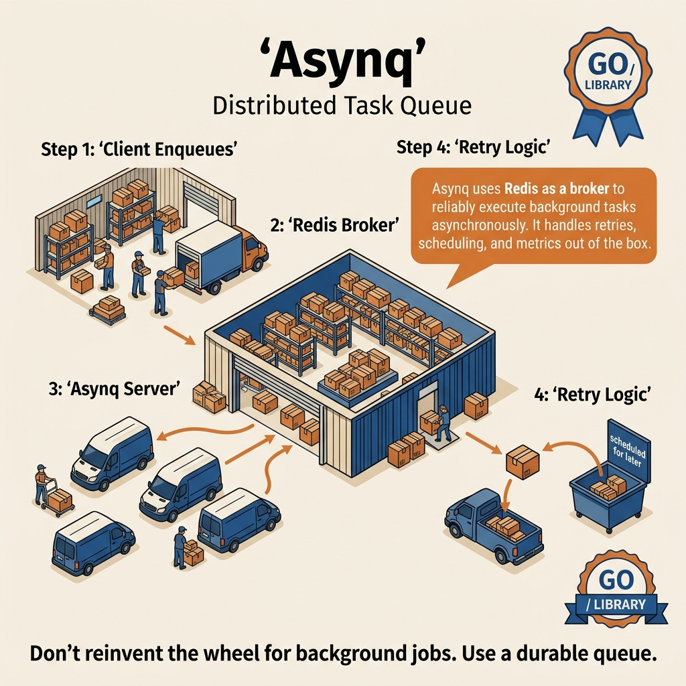

<!-- tags: golang -->
# 15 — Asynq

> **Library**: `github.com/hibiken/asynq` — Distributed task queue (Redis-backed).

📅 Created: 2026-03-20 · 🔄 Updated: 2026-04-19 · ⏱️ 15 min read

---

## 1. DEFINE

In-process worker pools (ants, Tunny, workerpool) lose all queued tasks when the process restarts. `asynq` moves the queue to Redis, giving you persistent task storage, automatic retries with exponential backoff, scheduled jobs (cron), priority queues, and a web dashboard — turning a Go process into a durable, distributed task worker.

> *Async email retry. Pod restart lost. asynq Redis persistent.*

### Definition

**Asynq** is a distributed task queue for Go, using **Redis** as the message broker. Unlike in-process worker pools (Tunny, Ants), Asynq allows **queueing tasks across multiple processes/servers** — suitable for background jobs, scheduled tasks, email sending, etc. But there is a trap: at-least-once delivery = non-idempotent handlers → duplicate processing. And multiple scheduler instances = duplicate cron tasks. That trap will surface in PITFALLS.

### In-process Pool vs Distributed Queue

| Feature        | In-process (Tunny/Ants) | Distributed (Asynq)               |
| -------------- | ----------------------- | --------------------------------- |
| **Scope**      | 1 process               | Multi-process, multi-server       |
| **State**      | Memory                  | Redis (persistent)                |
| **Retry**      | DIY                     | Built-in (exponential backoff)    |
| **Scheduling** | ❌                      | ✅ Cron, delayed tasks            |
| **Dashboard**  | ❌                      | ✅ Asynqmon Web UI                |
| **Use case**   | CPU/IO tasks in-process | Background jobs, emails, webhooks |

### Core Components

| Component         | Role                                           |
| ----------------- | ---------------------------------------------- |
| `asynq.Client`    | Enqueue tasks → Redis                          |
| `asynq.Server`    | Dequeue + execute tasks from Redis             |
| `asynq.ServeMux`  | Route tasks to handlers (like http.ServeMux)   |
| `asynq.Task`      | Task = type name + payload (JSON)              |
| `asynq.Scheduler` | Cron-based scheduled tasks                     |

### Invariants

- Tasks persist in Redis — server restart → tasks are still there
- Each task is processed **at-least-once** — requires idempotent handlers
- Automatic retry with exponential backoff
- Dead-letter queue for tasks that fail more than N times

### Failure Modes

| Failure                  | Cause                   | Prevention                            |
| ------------------------ | ----------------------- | ------------------------------------- |
| **Duplicate processing** | At-least-once delivery  | Idempotent handlers                   |
| **Redis down**           | Single point of failure | Redis Sentinel/Cluster                |
| **Payload too large**    | Redis memory            | Store data in DB, only queue references |

Asynq architecture, Redis-backed queue, invariants — theory is covered. Let us see what the task lifecycle looks like visually.

---
## 2. VISUAL

Asynq is not just "a worker pool with Redis". The PNG below pushes the hard parts front and center: enqueue boundary, worker fetch, retry policy, and ack semantics.



*When coordination crosses process boundaries, retry, idempotency, backlog, and poison-task handling become part of the concurrency story.*

### Asynq Architecture

```
  ┌─────────────┐        ┌──────────┐        ┌─────────────────┐
  │  API Server │──Task──▶│  Redis   │◀──Poll──│  Worker Server  │
  │  (Client)   │        │  Queue   │        │  (asynq.Server) │
  └─────────────┘        └──────────┘        └────────┬────────┘
                                                      │
                              ┌────────────────────────┴──────┐
                              │         ServeMux              │
                              │  "email:welcome" → Handler    │
                              │  "order:process" → Handler    │
                              │  "report:daily"  → Handler    │
                              └───────────────────────────────┘
```

### Task Lifecycle

```
  Client.Enqueue(task) → Redis → Worker picks up → Handler executes
                                      │
                    ┌─────────────────┼─────────────────┐
                    ▼                 ▼                  ▼
                  OK ✅          Error (retry)      Error (dead)
               (completed)    (back to queue)     (exceeded max)
                                 retry 1,2,3...     → dead queue
                               (exponential delay)
```

The diagram gives an overview of the Asynq architecture. Now let us implement — starting from basic task definition, then cron scheduler, then order processing pipeline.

---

## 3. CODE

The visual of **Asynq** gave you the big picture. Code is where decisions about cancellation, ownership, or sequencing turn into real behavior.

---

### Example 1: Basic — Task definition, enqueue, handler
> **Goal**: Demonstrate basic task definition, enqueue, handler in the right context so the reader understands why this technique exists.
> **Approach**: Start from a basic example then attach necessary technical decisions instead of jumping straight into hard code.
> **Example**: A job or request passes through multiple goroutines while preserving cancellation, concurrency limits, and clear error handling.
> **Complexity**: O(1) orchestration in application code; real cost depends on data, goroutines, or I/O being demonstrated.

**Goal**: Create a task type, enqueue from the API server, process at the worker server. Complete flow.

**Requirements**: `go get github.com/hibiken/asynq`, Redis running.

```go
// ━━━━━━━━━━━━━━━━━━━━━━━━━━━━━━━━━━━━━━━━━
// tasks/email.go — Task definition (shared between client + worker)
// ━━━━━━━━━━━━━━━━━━━━━━━━━━━━━━━━━━━━━━━━━
package tasks

import (
    "context"
    "encoding/json"
    "fmt"
    "log"
    "time"

"github.com/hibiken/asynq"
)

// Task type name — convention: "module:action"
const TypeEmailWelcome = "email:welcome"

// Payload: data needed for the task (serialized to JSON)
type EmailWelcomePayload struct {
    UserID int    `json:"user_id"`
    Email  string `json:"email"`
    Name   string `json:"name"`
}

// ━━━━━━━━━━━━━━━━━━━━━━━━━━━━━━━━━━━━━━━━━
// NewEmailWelcomeTask: create task for enqueue
// Payload serialized to JSON → stored in Redis
// ━━━━━━━━━━━━━━━━━━━━━━━━━━━━━━━━━━━━━━━━━
func NewEmailWelcomeTask(userID int, email, name string) (*asynq.Task, error) {
    payload, err := json.Marshal(EmailWelcomePayload{
        UserID: userID,
        Email:  email,
        Name:   name,
    })
    if err != nil {
        return nil, err
    }

return asynq.NewTask(
        TypeEmailWelcome,
        payload,
        asynq.MaxRetry(3),              // Max 3 retries
        asynq.Timeout(30*time.Second),   // Timeout per execution
        asynq.Queue("emails"),           // Queue name (priority routing)
    ), nil
}

// ━━━━━━━━━━━━━━━━━━━━━━━━━━━━━━━━━━━━━━━━━
// HandleEmailWelcome: handler that processes the task
// ⚠ Must be IDEMPOTENT — may be called > 1 time (retry)
// ━━━━━━━━━━━━━━━━━━━━━━━━━━━━━━━━━━━━━━━━━
func HandleEmailWelcome(ctx context.Context, t *asynq.Task) error {
    var payload EmailWelcomePayload
    if err := json.Unmarshal(t.Payload(), &payload); err != nil {
        return fmt.Errorf("unmarshal payload: %w", err) // non-retryable
    }

log.Printf("📧 Sending welcome email to %s (%s)...", payload.Name, payload.Email)

// Simulate sending email
    time.Sleep(500 * time.Millisecond)

log.Printf("✅ Welcome email sent to %s", payload.Email)
    return nil // ← success: task completed
    // return error → auto retry (up to MaxRetry)
}
```

```text
// ━━━━━━━━━━━━━━━━━━━━━━━━━━━━━━━━━━━━━━━━━
// cmd/client/main.go — Enqueue tasks (API server side)
// ━━━━━━━━━━━━━━━━━━━━━━━━━━━━━━━━━━━━━━━━━
package main

import (
    "log"

"github.com/hibiken/asynq"
    "myapp/tasks"
)

func main() {
    // Connect to Redis
    client := asynq.NewClient(asynq.RedisClientOpt{
        Addr: "localhost:6379",
    })
    defer client.Close()

// ━━━ Enqueue: push task to Redis queue ━━━
    task, err := tasks.NewEmailWelcomeTask(1, "alice@example.com", "Alice")
    if err != nil {
        log.Fatal(err)
    }

info, err := client.Enqueue(task)
    if err != nil {
        log.Fatal(err)
    }

log.Printf("Enqueued: id=%s queue=%s", info.ID, info.Queue)

// ━━━ Delayed task: execute after 1 hour ━━━
    task2, _ := tasks.NewEmailWelcomeTask(2, "bob@example.com", "Bob")
    info, err = client.Enqueue(task2, asynq.ProcessIn(1*time.Hour))
    // Task will be processed after 1 hour
}
```

```text
// ━━━━━━━━━━━━━━━━━━━━━━━━━━━━━━━━━━━━━━━━━
// cmd/worker/main.go — Worker server (processes tasks)
// ━━━━━━━━━━━━━━━━━━━━━━━━━━━━━━━━━━━━━━━━━
package main

import (
    "log"

"github.com/hibiken/asynq"
    "myapp/tasks"
)

func main() {
    // ━━━ Server config ━━━
    srv := asynq.NewServer(
        asynq.RedisClientOpt{Addr: "localhost:6379"},
        asynq.Config{
            Concurrency: 10,  // 10 concurrent workers
            Queues: map[string]int{
                "critical": 6,  // priority queue weights
                "emails":   3,
                "default":  1,
            },
            // Retry delay: exponential backoff
            // Retry 1: 10s, Retry 2: 20s, Retry 3: 40s,...
        },
    )

// ━━━ Route tasks to handlers ━━━
    mux := asynq.NewServeMux()
    mux.HandleFunc(tasks.TypeEmailWelcome, tasks.HandleEmailWelcome)
    // Add handlers for other task types...

// ━━━ Start server (blocking) ━━━
    if err := srv.Run(mux); err != nil {
        log.Fatal(err)
    }
}
```

This example is appropriate for grasping the baseline of task definition, enqueue, handler. When you need to handle more edge cases or coordinate additional abstractions, move to the next example.

**Achieved**:

- Complete flow: define task → enqueue (client) → process (worker).
- Tasks persist in Redis — server restart → tasks are still there.
- Automatic retry: error → retry (max 3 times, exponential backoff).

**Caveats**:

- **Handler must be IDEMPOTENT** — retry calls the handler again → should not create duplicates.
- **Separate binaries**: client (API server) ≠ worker (background server).
- Queue priorities: `"critical": 6` → 6× higher priority than `"default": 1`.
- `ProcessIn(1*time.Hour)` for delayed tasks (scheduled emails, reminders).

Basic task covers enqueue/handler. But when you need recurring jobs (daily reports, hourly cleanup) — Asynq scheduler + cron is the solution.

---

### Example 2: Intermediate — Scheduled Tasks (Cron)
> **Goal**: Demonstrate scheduled tasks (cron) in the right context so the reader understands why this technique exists.
> **Approach**: Start from an intermediate example then attach necessary technical decisions instead of jumping straight into hard code.
> **Example**: A job or request passes through multiple goroutines while preserving cancellation, concurrency limits, and clear error handling.
> **Complexity**: O(1) orchestration; total complexity depends on the number of coordination steps and related data structures.

**Goal**: Create recurring tasks running on a schedule (cron) — daily reports, cleanup jobs.

```go
package main

import (
    "log"

"github.com/hibiken/asynq"
)

func main() {
    // ━━━━━━━━━━━━━━━━━━━━━━━━━━━━━━━━━━━━━━━━━
    // Scheduler: cron-based recurring tasks
    // ━━━━━━━━━━━━━━━━━━━━━━━━━━━━━━━━━━━━━━━━━
    scheduler := asynq.NewScheduler(
        asynq.RedisClientOpt{Addr: "localhost:6379"},
        nil, // default config
    )

// Daily report — 8:00 AM every day
    task1 := asynq.NewTask("report:daily", nil)
    _, err := scheduler.Register("0 8 * * *", task1,
        asynq.Queue("critical"),
    )
    if err != nil {
        log.Fatal(err)
    }

// Cleanup — every hour
    task2 := asynq.NewTask("cleanup:expired", nil)
    scheduler.Register("@every 1h", task2)

// Weekly digest — Sunday 9 PM
    task3 := asynq.NewTask("email:weekly_digest", nil)
    scheduler.Register("0 21 * * 0", task3,
        asynq.Queue("emails"),
    )

// ━━━ Start scheduler (blocking) ━━━
    if err := scheduler.Run(); err != nil {
        log.Fatal(err)
    }
}
```

This level starts being useful for real code because it coordinates multiple techniques. The caveat is to keep the API compact so the reader does not lose track of reasoning.

**Achieved**:

- Cron-based scheduling: daily, hourly, weekly tasks.
- Tasks enqueue into Redis → workers process them.

**Caveats**:

- Scheduler **should run as 1 instance** — running N instances = N duplicate tasks.
- Cron syntax: `minute hour day month weekday` or `@every 1h`.
- Scheduler only enqueues — processing is still done by the Worker server.

> **Why should the Asynq scheduler run as only 1 instance?**
> Scheduler uses cron triggers — N instances = N enqueues of the same task at the same time. Asynq does not deduplicate scheduler tasks (unlike worker auto-dedup by task ID). Fix: use leader election (Redis lock) for the scheduler, or deploy only 1 scheduler pod.

Cron scheduler covers recurring. But production needs a complete pipeline: GORM order creation → Asynq enqueue → email handler with retry/dead letter.

---

### Example 3: Advanced — Asynq + GORM + Email — Order Processing Pipeline
> **Goal**: Demonstrate Asynq + GORM + Email — order processing pipeline in the right context so the reader understands why this technique exists.
> **Approach**: Start from an advanced example then attach necessary technical decisions instead of jumping straight into hard code.
> **Example**: A job or request passes through multiple goroutines while preserving cancellation, concurrency limits, and clear error handling.
> **Complexity**: O(1) orchestration at the example layer; real complexity lies in concurrency, memory, and integration underneath.

**Goal**: Full production pipeline: GORM hook → enqueue Asynq task → worker fetches DB → process → send email → update status. A common pattern for e-commerce: order created → background processing → confirmation email.

**Requirements**: `asynq`, `gorm.io/gorm`, Go standard library.

**Components**: Order model with GORM hook `AfterCreate` that auto-enqueues an Asynq task. Worker: fetch order from DB → validate → send email → update status. Idempotent handler.

```go
// ━━━━━━━━━━━━━━━━━━━━━━━━━━━━━━━━━━━━━━━━━
// models/order.go — GORM model + Asynq integration
// ━━━━━━━━━━━━━━━━━━━━━━━━━━━━━━━━━━━━━━━━━
package models

import (
    "encoding/json"
    "log"
    "time"

"github.com/hibiken/asynq"
    "gorm.io/gorm"
)

type Order struct {
    ID        uint           `gorm:"primarykey" json:"id"`
    UserEmail string         `gorm:"column:user_email;not null" json:"user_email"`
    Product   string         `gorm:"column:product;not null" json:"product"`
    Amount    float64        `gorm:"column:amount;not null" json:"amount"`
    Status    string         `gorm:"column:status;default:'pending';index" json:"status"`
    // "pending" → "processing" → "confirmed" → "email_sent"
    ProcessedAt *time.Time   `gorm:"column:processed_at" json:"processed_at"`
    CreatedAt   time.Time    `json:"created_at"`
    UpdatedAt   time.Time    `json:"updated_at"`
}

const TypeOrderProcess = "order:process"

type OrderProcessPayload struct {
    OrderID uint `json:"order_id"`
}

// ━━━━━━━━━━━━━━━━━━━━━━━━━━━━━━━━━━━━━━━━━
// GORM Hook: AfterCreate → auto enqueue Asynq task
// Every newly created order → automatically queued for background processing
// ━━━━━━━━━━━━━━━━━━━━━━━━━━━━━━━━━━━━━━━━━
var AsynqClient *asynq.Client // set in main()

func (o *Order) AfterCreate(tx *gorm.DB) error {
    if AsynqClient == nil {
        return nil
    }

payload, _ := json.Marshal(OrderProcessPayload{OrderID: o.ID})
    task := asynq.NewTask(
        TypeOrderProcess,
        payload,
        asynq.MaxRetry(5),
        asynq.Timeout(2*time.Minute),
        asynq.Queue("orders"),
    )

info, err := AsynqClient.Enqueue(task)
    if err != nil {
        log.Printf("⚠️ Failed to enqueue order %d: %v", o.ID, err)
        // Do not return error — order was created successfully
        // Task will be re-enqueued by retry mechanism
        return nil
    }

log.Printf("📤 Order %d enqueued: task_id=%s", o.ID, info.ID)
    return nil
}
```

```text
// ━━━━━━━━━━━━━━━━━━━━━━━━━━━━━━━━━━━━━━━━━
// handlers/order_handler.go — Worker handler
// ⚠ IDEMPOTENT: may be called multiple times for the same order
// ━━━━━━━━━━━━━━━━━━━━━━━━━━━━━━━━━━━━━━━━━
package handlers

import (
    "context"
    "encoding/json"
    "fmt"
    "log"
    "time"

"github.com/hibiken/asynq"
    "gorm.io/gorm"
    "myapp/models"
)

type OrderHandler struct {
    DB *gorm.DB
}

func (h *OrderHandler) HandleOrderProcess(ctx context.Context, t *asynq.Task) error {
    var payload models.OrderProcessPayload
    if err := json.Unmarshal(t.Payload(), &payload); err != nil {
        // ━━━ Non-retryable error: payload corrupt ━━━
        return fmt.Errorf("unmarshal: %w", asynq.SkipRetry)
    }

// ━━━ Step 1: Fetch order from DB ━━━
    var order models.Order
    if err := h.DB.WithContext(ctx).First(&order, payload.OrderID).Error; err != nil {
        return fmt.Errorf("fetch order %d: %w", payload.OrderID, err)
    }

// ━━━ Step 2: Idempotency check — skip if already processed ━━━
    // At-least-once delivery → handler may be called > 1 time
    if order.Status == "confirmed" || order.Status == "email_sent" {
        log.Printf("⏭️ Order %d already %s — skipping", order.ID, order.Status)
        return nil // ← idempotent: do not reprocess
    }

// ━━━ Step 3: Process order ━━━
    log.Printf("⚙️ Processing order %d: %s ($%.2f)", order.ID, order.Product, order.Amount)

// Update status: pending → processing
    h.DB.WithContext(ctx).Model(&order).Update("status", "processing")

// Simulate processing (inventory check, payment validation, etc.)
    time.Sleep(500 * time.Millisecond)

// Update status: processing → confirmed
    now := time.Now()
    h.DB.WithContext(ctx).Model(&order).Updates(map[string]interface{}{
        "status":       "confirmed",
        "processed_at": &now,
    })

// ━━━ Step 4: Send confirmation email ━━━
    if err := sendEmail(order.UserEmail, order); err != nil {
        // Email fail → retry (order already confirmed, email not yet sent)
        return fmt.Errorf("email order %d: %w", order.ID, err)
    }

// Update final status
    h.DB.WithContext(ctx).Model(&order).Update("status", "email_sent")

log.Printf("✅ Order %d completed: confirmed + email sent to %s", order.ID, order.UserEmail)
    return nil
}

func sendEmail(to string, order models.Order) error {
    // Production: use SMTP, SendGrid, SES
    log.Printf("📧 Sending confirmation to %s: Order #%d - %s ($%.2f)",
        to, order.ID, order.Product, order.Amount)
    time.Sleep(200 * time.Millisecond) // simulate
    return nil
}
```

```text
// ━━━━━━━━━━━━━━━━━━━━━━━━━━━━━━━━━━━━━━━━━
// cmd/worker/main.go — Worker server
// ━━━━━━━━━━━━━━━━━━━━━━━━━━━━━━━━━━━━━━━━━
package main

import (
    "log"

"github.com/hibiken/asynq"
    "gorm.io/driver/postgres"
    "gorm.io/gorm"
    "myapp/handlers"
    "myapp/models"
)

func main() {
    // Setup GORM
    dsn := "host=localhost user=app dbname=shop port=5432 sslmode=disable"
    db, err := gorm.Open(postgres.Open(dsn), &gorm.Config{})
    if err != nil {
        log.Fatal(err)
    }
    db.AutoMigrate(&models.Order{})

// Setup Asynq worker
    srv := asynq.NewServer(
        asynq.RedisClientOpt{Addr: "localhost:6379"},
        asynq.Config{
            Concurrency: 10,
            Queues: map[string]int{
                "orders":   6,
                "emails":   3,
                "default":  1,
            },
        },
    )

orderHandler := &handlers.OrderHandler{DB: db}

mux := asynq.NewServeMux()
    mux.HandleFunc(models.TypeOrderProcess, orderHandler.HandleOrderProcess)

if err := srv.Run(mux); err != nil {
        log.Fatal(err)
    }
}
```

This is the closest to production level in this article. Only keep this complexity when the trade-off yields clear benefits in correctness, throughput, or maintainability.

**Achieved**:

- **Full pipeline**: GORM `AfterCreate` hook → Asynq queue → Worker → DB update → Email.
- **Idempotent handler**: checks status before processing → retry safe.
- **Error handling**: payload corrupt → `SkipRetry` (no retry). Email fail → retry (order already confirmed).
- **Status tracking**: `pending → processing → confirmed → email_sent` — observable workflow.

**Caveats**:

- **Hook does not return error**: `AfterCreate` enqueue fail → logs but does not rollback the order. Order creation is critical, enqueue can be retried.
- **Status-based idempotency**: checks `order.Status` before processing — prevents duplicate processing.
- **`SkipRetry` wrapper**: `asynq.SkipRetry` — non-retryable error (corrupt payload, invalid data).
- **Separation**: API server (enqueue) ≠ Worker server (process) — scale independently.
- Production: add **Asynqmon** dashboard to monitor task states.

> **Why Asynq + GORM hook instead of calling directly in the handler?**
> Calling sync inside the HTTP handler: the user waits for order creation + email sending + notification. With Asynq: the handler only creates the order + enqueues a task (ms) → fast response. The worker processes async with retry, dead letter, monitoring. Trade-off: eventual consistency — user receives email a few seconds later, but UX is better because the response is fast.

You now know task definition, cron, and order pipeline. Here comes the dangerous part: duplicate processing and scheduler multi-instance — traps set up from the beginning of this article.

---

## 4. PITFALLS

From here on, with **Asynq**, the focus is no longer making it work, but avoiding the kinds of runs that seem fine but silently create operational debt.

| # | Severity | Mistake | Consequence | Fix |
| --- | --- | --- | --- | --- |
| 1 | 🔴 Fatal | **Handler not idempotent** | Duplicate processing on retry | Check before create |
| 2 | 🟡 Common | **Payload too large** | Redis memory issue | Store data in DB, queue reference ID |
| 3 | 🔴 Fatal | **Redis SPOF** | Downtime = lost tasks | Redis Sentinel/Cluster |
| 4 | 🟡 Common | **Multiple schedulers** | Duplicate cron tasks | Run 1 scheduler instance |
| 5 | 🟡 Common | **No monitoring** | Tasks fail silently | Deploy Asynqmon dashboard |

You have covered task definition, cron, order pipeline, and the duplicate/SPOF/scheduler traps. The resources below help you go deeper.

---

## 5. REF

| Resource | Type | Link | Notes |
| --- | --- | --- | --- |
| Asynq GitHub | GitHub | [github.com/hibiken/asynq](https://github.com/hibiken/asynq) | Source code |
| Asynq Wiki | Wiki | [github.com/hibiken/asynq/wiki](https://github.com/hibiken/asynq/wiki) | Guide |
| Asynqmon (Web UI) | GitHub | [github.com/hibiken/asynqmon](https://github.com/hibiken/asynqmon) | Dashboard |
| Asynq GoDoc | Official docs | [pkg.go.dev/github.com/hibiken/asynq](https://pkg.go.dev/github.com/hibiken/asynq) | API reference |

---

## 6. RECOMMEND

The most important point of **Asynq** is clear. The extensions below are for when you need to turn this understanding into a more complete investigation or operations workflow.

| Next step | When | Reason | File/Link |
| --- | --- | --- | --- |
| **Ants / Tunny** | In-process alternative | No Redis required | [12-ants.md](./12-ants.md) |
| **Machinery** | Heavy workloads | Supports result backends, workflows | `RichardKnop/machinery` |
| **Asynqmon Web UI** | Monitoring | Dashboard for task monitoring | `hibiken/asynqmon` |
| **GORM + Asynq** | Background DB ops | Async DB writes, batch processing | [orm/05](../orm/05-transactions-and-hooks.md) |
| **Asynq + SMTP/FCM** | Email/Notification | Async email sending, push notifications | Pattern |
| **Asynq Deployment** | Kubernetes | Scale workers independently from API server | K8s Deployment |
