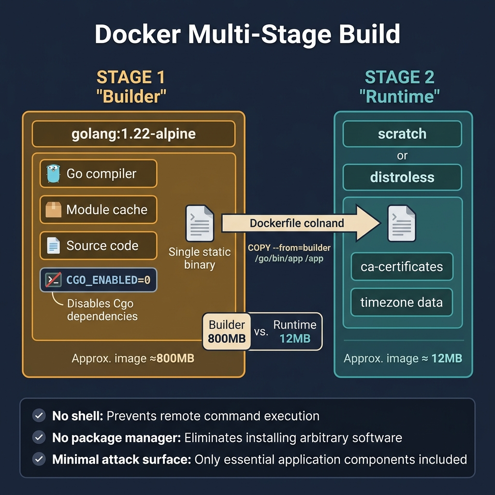
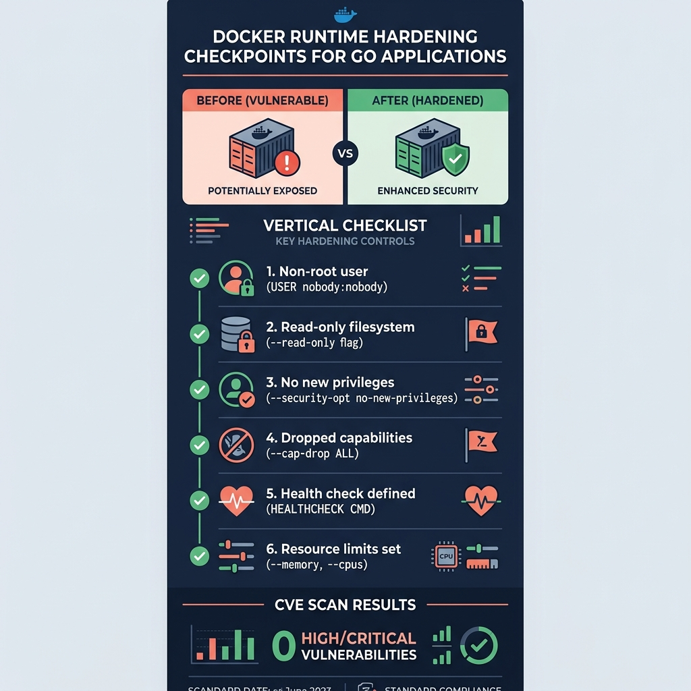

<!-- tags: golang, deployment, docker -->
# 🐳 Docker — Multi-stage Builds, Distroless, Runtime Hygiene

> Docker for Go is not just about building a binary and running it. This article focuses on creating images that are small, reproducible, cache-friendly and safer in production.

📅 Created: 2026-03-23 · 🔄 Updated: 2026-04-09 · ⏱️ 18 min read

| Aspect | Detail |
| --- | --- |
| **Complexity** | Intermediate → Advanced |
| **Use case** | API services, workers, CLI binaries that need to be packaged as containers |
| **Focus** | image size, build cache, metadata, runtime user |
| **Prerequisites** | Go build basics, Docker fundamentals |

## 1. DEFINE

Picture a release where image build, rollout, probes and rollback must lock together step by step. In that moment, **Docker — Multi-stage Builds, Distroless, Runtime Hygiene** becomes the anchor that prevents a wrong-layer technical decision.

> *Build 50 MB image from 800 MB. scratch = 15 MB. CGO static linking.*

### Why Go fits containers well

Go compiles to a standalone binary, so the runtime image can be small with fewer dependencies than runtime-based stacks.

### Invariants

| Rule | Meaning |
| --- | --- |
| Build stage and run stage are separate | The final image is smaller and cleaner |
| Runtime container runs as non-root | Reduces blast radius if compromised |
| Build must be reproducible | Easier to trace versions and debug incidents |

### Failure Modes

| Failure | Cause | Fix |
| --- | --- | --- |
| Image too large | Build tools remain in the runtime image | Multi-stage build |
| Runtime crash because the binary depends on libc | Build with `CGO_ENABLED=0` where appropriate |
| Hard to debug which version is running | No build metadata injected | Add version/commit/build time |

Those failure modes sound basic. But there is a trap: using the `golang` image as runtime produces a 1.2 GB production image, and running containers as root opens the door to privilege escalation. That trap surfaces in PITFALLS.

## 2. VISUAL

For Docker with Go, you need two different visuals: one to lock the builder/runtime split, and another to remind the team of hardening checkpoints that tend to be skipped when the pipeline gets rushed.



*Figure: This visual locks the builder/runtime boundary so you do not bring the full toolchain, cache and package manager into the production image.*



*Figure: The hardening card gathers the points that are forgotten most — non-root, CA bundle, timezone, metadata and immutable tagging — into one scannable checklist.*

## 3. CODE

The flow of **Docker — Multi-stage Builds, Distroless, Runtime Hygiene** is visible now. We lower it to code to show which constraints hold this mechanism together, not just intuition.

### Example 1: Basic — Production-ready multi-stage Dockerfile

> **Goal**: Build a Go binary in a builder stage and run it on a minimal runtime image, so the final image is smaller with less attack surface.
> **Approach**: Use a multi-stage Dockerfile with a `golang` builder and a `distroless` runtime, instead of running on an image with the full toolchain.
> **Example**: Source code lives in `./cmd/api`; the output is a `/server` binary listening on port `8080`.
> **Complexity**: O(1) in configuration; build cost sits in `go mod download` and `go build`.

```dockerfile
# Dockerfile — Build Go binary in builder stage, run minimal distroless image
FROM golang:1.24-alpine AS builder

WORKDIR /src
# ✅ Copy CA bundle and timezone from the builder so the runtime image needs no package manager.
RUN apk add --no-cache ca-certificates tzdata

COPY go.mod go.sum ./
RUN go mod download

COPY . .
RUN CGO_ENABLED=0 GOOS=linux GOARCH=amd64 \
    go build -trimpath -ldflags="-s -w" -o /out/server ./cmd/api

FROM gcr.io/distroless/static-debian12

COPY --from=builder /out/server /server
COPY --from=builder /etc/ssl/certs/ca-certificates.crt /etc/ssl/certs/
COPY --from=builder /usr/share/zoneinfo /usr/share/zoneinfo

EXPOSE 8080
# ✅ Non-root is the minimum runtime hygiene baseline for production containers.
USER nonroot:nonroot
ENTRYPOINT ["/server"]
```

> **Conclusion**: This example handles the most basic Docker need for Go: lean build, clean runtime and non-root execution. It does not answer which commit the image came from; that metadata needs to surface in the next example.

Multi-stage build covered. But build metadata needs to be exposed — time to inject.

### Example 2: Intermediate — Build metadata exposed by the service

> **Goal**: Inject `version` and `commit` into the binary so startup logs, debug incidents and artifact tracing work.
> **Approach**: Declare `version/commit` variables in the binary and inject them via `-ldflags` from Docker or CI.
> **Example**: The image is built from tag `v1.4.2` and commit `abc123` → startup log shows `version=v1.4.2 commit=abc123`.
> **Complexity**: O(1) runtime; cost sits in build-time wiring.

```go
// version.go — Surface build metadata injected by Docker/CI into service logs
package deploymeta

import "log/slog"

var (
	version = "dev"
	commit  = "local"
)

func logBuildInfo() {
	// ✅ This startup log is a useful anchor when cross-referencing images, release notes and incident timelines.
	slog.Info("service starting", "version", version, "commit", commit)
}
```

> **Conclusion**: After this step, the image is no longer an anonymous black box. The caveat is that metadata is trustworthy only if the release pipeline injects an immutable tag/SHA, not arbitrary values from local builds.

Metadata covered. But layer cache needs optimization — time to split dependencies.

### Example 3: Advanced — Cache-aware Dockerfile with explicit build args

> **Goal**: Keep layer cache effective for dependencies while injecting metadata into the binary so CI builds are faster.
> **Approach**: Copy `go.mod/go.sum` before source code to leverage the module cache, then use `ARG VERSION/COMMIT` for release metadata.
> **Example**: Only source code changes but dependencies remain the same → `go mod download` is cached, and the new binary still carries the correct `VERSION/COMMIT`.
> **Complexity**: O(1) in configuration, but with a large cache benefit when CI runs repeat.

```dockerfile
# Dockerfile.release — Add metadata and preserve dependency caching
FROM golang:1.24-alpine AS builder

ARG VERSION=dev
ARG COMMIT=local

WORKDIR /src
COPY go.mod go.sum ./
# ✅ Separating the module download from COPY source lets Docker cache this layer better.
RUN go mod download

COPY . .
RUN CGO_ENABLED=0 GOOS=linux GOARCH=amd64 \
    go build -trimpath \
    -ldflags="-s -w -X main.version=${VERSION} -X main.commit=${COMMIT}" \
    -o /out/server ./cmd/api

FROM gcr.io/distroless/static-debian12
COPY --from=builder /out/server /server
USER nonroot:nonroot
ENTRYPOINT ["/server"]
```

> **Conclusion**: This is a sensible Dockerfile shape for most production Go services. It does not handle multi-arch, SBOM or provenance; those needs should connect to the release pipeline at a higher layer.

Cache optimization covered. But multi-arch needs buildx — time to expand.

### Example 4: Expert — Multi-arch buildx pipeline with immutable tags

> **Goal**: Publish a single image manifest for both `amd64` and `arm64`, attaching a semantic version and commit SHA so the rollout does not depend on a single architecture.
> **Approach**: Use `docker buildx build --platform ... --push`, pass `VERSION/COMMIT` into the Dockerfile and produce two immutable tags.
> **Example**: Tag `v1.4.2` produces `ghcr.io/myorg/checkout-api:v1.4.2` and `ghcr.io/myorg/checkout-api:abc1234` for both `linux/amd64` and `linux/arm64`.
> **Complexity**: O(1) script complexity; build cost grows with the number of platforms.

```bash
# build-release.sh — Build and push one immutable multi-arch image manifest
set -euo pipefail

VERSION="${VERSION:-v1.4.2}"
COMMIT="${COMMIT:-abc1234}"
IMAGE="ghcr.io/myorg/checkout-api"

docker buildx build \
  --platform linux/amd64,linux/arm64 \
  --build-arg VERSION="${VERSION}" \
  --build-arg COMMIT="${COMMIT}" \
  --tag "${IMAGE}:${VERSION}" \
  --tag "${IMAGE}:${COMMIT}" \
  --push \
  -f Dockerfile.release .
```

> **Conclusion**: This is the step where Docker reaches production release: the image has clear metadata, multi-arch support and immutable tags for rollback. Do not push `latest` as the primary production tag because it breaks audit and precise rollback.

You have walked through multi-stage, metadata, caching and multi-arch. Now comes the dangerous part: image bloat and root containers — the trap set up at the start.

## 4. PITFALLS

Knowing the right path in **Docker — Multi-stage Builds, Distroless, Runtime Hygiene** is not enough. The part that costs teams the most sits in wrong assumptions that dashboards and code demos do not surface for you.

| # | Severity | Defect | Impact | Fix |
| --- | --- | --- | --- | --- |
| 1 | 🔴 Fatal | Using the `golang` image as the runtime | 1.2 GB production image with full toolchain exposed | Separate builder and runtime stages |
| 2 | 🔴 Fatal | Running the container as root | Privilege escalation if the container is compromised | `USER nonroot:nonroot` |
| 3 | 🟡 Common | Not copying CA bundle/timezone when HTTPS/timezone is needed | TLS failures or wrong timestamps at runtime | Copy certs and zoneinfo from the builder |
| 4 | 🟡 Common | Not knowing which version the image contains | Impossible to trace incidents to a specific release | Inject `version` and `commit` via `ldflags` |

You have walked through Docker patterns and their traps. The resources below help you go deeper.

## 5. REF

| Resource | Link | Note |
| --- | --- | --- |
| Docker Go guide | https://docs.docker.com/language/golang/ | Foundation for multi-stage builds and runtime split |
| Distroless images | https://github.com/GoogleContainerTools/distroless | Minimal runtime images without shell or package manager |
| Go build flags | https://pkg.go.dev/cmd/go#hdr-Compile_packages_and_dependencies | Reference for `-ldflags`, `-trimpath` and build modes |

## 6. RECOMMEND

Once you have seen how **Docker — Multi-stage Builds, Distroless, Runtime Hygiene** operates and where it breaks, the next step is opening the right related branch to go deeper instead of optimizing blind.

| Extension | When to proceed | Rationale | File/Link |
| --- | --- | --- | --- |
| SBOM generation | When releasing production images into environments that require audit | Increases visibility into supply chain and dependency surface | [05-runtime-hardening-and-image-security.md](./05-runtime-hardening-and-image-security.md) |
| Image signing | In security-sensitive environments or when provenance must be strict | Verifies the artifact before promotion/deployment | [04-goreleaser-release-pipeline.md](./04-goreleaser-release-pipeline.md) |
| Buildx multi-arch | When deploying on both `amd64` and `arm64` | Keeps a single release story for multiple runtime targets | [04-goreleaser-release-pipeline.md](./04-goreleaser-release-pipeline.md) |

## 7. QUIZ

### Quick Check

1. Why are multi-stage builds important for Go containers?
2. When is `CGO_ENABLED=0` useful?
3. Should the runtime image contain the full Go toolchain?

### Answer Key

1. They keep the image small, clean and reduce attack surface.
2. When you want a more static binary, in particular with distroless/scratch.
3. No; the runtime should contain only what is needed to run the binary.

## 8. NEXT STEPS

- Continue with [Kubernetes — Deploy Go Services with Probes, Resources, Rollouts](./02-kubernetes.md)
- Or connect to [Runtime Hardening & Image Security](./05-runtime-hardening-and-image-security.md)
