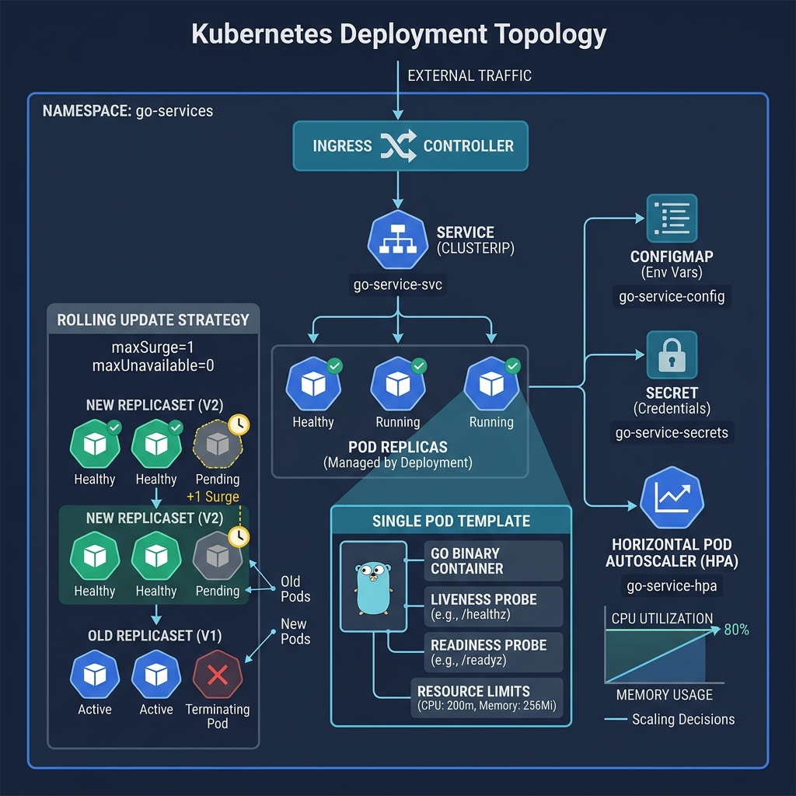
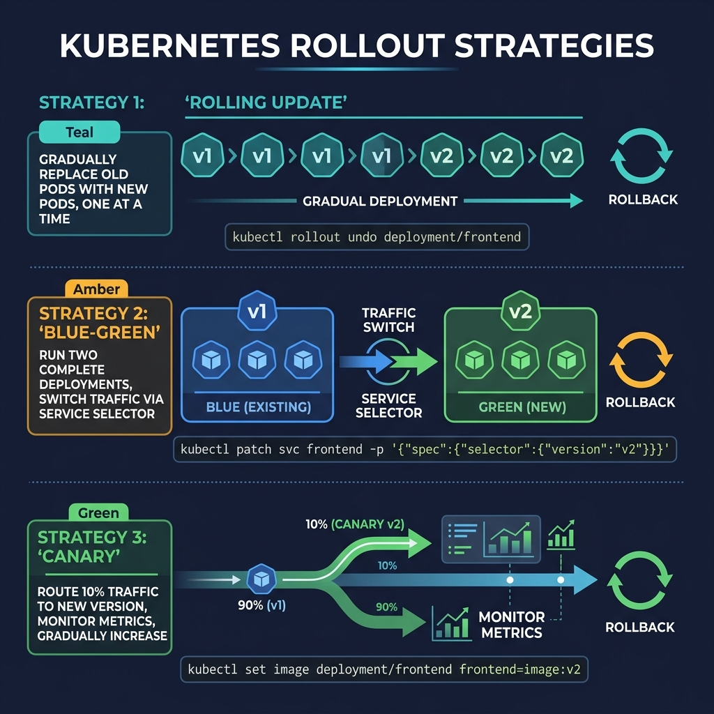

<!-- tags: golang, deployment, kubernetes -->
# ☸️ Kubernetes — Deploy Go Services with Probes, Resources, Rollouts

> Running a Go service on Kubernetes is more than having a `Deployment` and a `Service`. This article focuses on probes, resource requests/limits, config wiring and rollout semantics so pods receive traffic at the right time and exit the right way.

📅 Created: 2026-03-23 · 🔄 Updated: 2026-04-09 · ⏱️ 19 min read

| Aspect | Detail |
| --- | --- |
| **Complexity** | Advanced |
| **Use case** | Go APIs/workers running on K8s with readiness, config, autoscaling |
| **Focus** | manifests, probes, env wiring, rollout safety |
| **Prerequisites** | Docker image basics, service runtime lifecycle |

## 1. DEFINE

Picture a release where image build, rollout, probes and rollback must lock together step by step. Without a firm grasp of **Kubernetes — Deploy Go Services with Probes, Resources, Rollouts**, you are liable to fix the surface and miss the real mechanism underneath.

> *K8s limits probes HPA. Wrong = OOMKilled CrashLoopBackOff.*

### What does Kubernetes care about in a Go service?

| Concern | Meaning |
| --- | --- |
| Probes | Whether the pod should receive traffic or needs a restart |
| Resources | Where the scheduler places the pod and how it caps the runtime |
| Config/Secret wiring | How environment-specific values enter the app |
| Rollout semantics | How new and old pods replace each other |

### Invariants

| Rule | Meaning |
| --- | --- |
| Readiness reflects the ability to receive traffic | Fewer 5xx errors during rollout |
| Requests/limits must be realistic | The scheduler and HPA get correct signals |
| Config must be decoupled from the image | The same image works across environments |

### Failure Modes

| Failure | Cause | Fix |
| --- | --- | --- |
| Pod crash loop | Probe semantics wrong or config missing | Fix probe + fail-fast config |
| Latency spike after deploy | Requests too low or limits too tight | Tune resources with real metrics |
| Config changed but pod does not pick it up | No restart/reload on config update | Rollout again or use a checksum strategy |

Those failure modes sound familiar. But there is a trap: when readiness and liveness share the same semantics, pods get killed instead of just losing traffic; and setting limits without requests leads to wrong scheduler allocation. That trap surfaces in PITFALLS.

## 2. VISUAL

Kubernetes for a Go service needs more than one overview topology; you also need to see the rollout path to understand where the manifest concern ends and where the runtime signal concern begins.



*Figure: This topology gathers image, probes, resources, config and service routing into a single mental model to avoid fixing the wrong layer.*



*Figure: The rollout path pulls the deployment control loop out of the topology, making the sequence of ready → receive traffic → scale → rollback visible.*

## 3. CODE

The visual for **Kubernetes — Deploy Go Services with Probes, Resources, Rollouts** gives you the big picture. Code is where decisions about cancellation, ownership or sequencing become real behavior.

### Example 1: Basic — Go health endpoints aligned with K8s probes

> **Goal**: Expose separate `readiness` and `liveness` endpoints so Kubernetes knows which pod can receive traffic and which needs a restart.
> **Approach**: Use a separate readiness flag for traffic safety, while liveness reflects only that the process is alive.
> **Example**: The pod finishes booting and flips `ready=true`; before that, `/health/ready` returns `503` while `/health/live` still returns `200`.
> **Complexity**: O(1) per probe request, O(1) state.

```go
// health_server.go — Expose separate readiness and liveness endpoints for Kubernetes
package main

import (
	"net/http"
	"sync/atomic"
)

var ready atomic.Bool

func main() {
	ready.Store(true)

	mux := http.NewServeMux()
	mux.HandleFunc("/health/live", func(w http.ResponseWriter, _ *http.Request) {
		// ✅ Liveness stays minimal to avoid a restart loop caused by an external dependency.
		w.WriteHeader(http.StatusOK)
		_, _ = w.Write([]byte("alive"))
	})
	mux.HandleFunc("/health/ready", func(w http.ResponseWriter, _ *http.Request) {
		if !ready.Load() {
			http.Error(w, "not ready", http.StatusServiceUnavailable)
			return
		}
		w.WriteHeader(http.StatusOK)
		_, _ = w.Write([]byte("ready"))
	})

	_ = http.ListenAndServe(":8080", mux)
}
```

> **Conclusion**: This is the minimum contract for a pod to communicate with the orchestrator. It is not sufficient for a real deployment; the pod still needs a manifest with probes, resource requests and config wiring.

Health endpoints covered. But the deployment manifest needs probes + resources — time to declare.

### Example 2: Intermediate — Deployment manifest with probes and resources

> **Goal**: Declare a `Deployment` usable for basic production: immutable image, probes, `envFrom`, requests/limits.
> **Approach**: Map the app's runtime contract into the manifest instead of letting K8s guess the service semantics.
> **Example**: `checkout-api` runs 3 replicas, reads config from ConfigMap/Secret and receives traffic only after `/health/ready` passes.
> **Complexity**: O(1) in manifest complexity; operational cost sits in tuning resources and probes.

```yaml
# k8s/deployment.yaml — Wire image, probes, resources and env config into a Go service
apiVersion: apps/v1
kind: Deployment
metadata:
  name: checkout-api
spec:
  replicas: 3
  selector:
    matchLabels:
      app: checkout-api
  template:
    metadata:
      labels:
        app: checkout-api
    spec:
      containers:
        - name: api
          # ✅ Use an immutable tag to trace the exact artifact that is running.
          image: ghcr.io/myorg/checkout-api:1.4.2
          ports:
            - containerPort: 8080
          envFrom:
            - configMapRef:
                name: checkout-api-config
            - secretRef:
                name: checkout-api-secret
          resources:
            requests:
              cpu: "200m"
              memory: "256Mi"
            limits:
              cpu: "1000m"
              memory: "512Mi"
          readinessProbe:
            httpGet:
              path: /health/ready
              port: 8080
            periodSeconds: 5
          livenessProbe:
            httpGet:
              path: /health/live
              port: 8080
            periodSeconds: 10
```

> **Conclusion**: This manifest is sufficient for a Go HTTP service to run well on K8s. The caveat is that requests/limits are a starting point; if measured wrong, the scheduler and HPA make poor decisions.

Manifest covered. But the service and autoscaling need hints — time to configure.

### Example 3: Advanced — Service and autoscaling hints

> **Goal**: Connect the `Deployment` with a `Service` and an HPA so pods have a traffic ingress and the ability to scale when CPU rises.
> **Approach**: Separate concerns: `Service` defines the network entrypoint, HPA defines the scaling policy based on resource signals.
> **Example**: `checkout-api` scales from 3 to 12 replicas when average CPU utilization exceeds 70%.
> **Complexity**: O(1) manifest complexity; operational complexity grows with choosing the right scale metric.

```yaml
# k8s/service-hpa.yaml — Expose pods and scale from resource usage
apiVersion: v1
kind: Service
metadata:
  name: checkout-api
spec:
  selector:
    app: checkout-api
  ports:
    - port: 80
      targetPort: 8080
---
apiVersion: autoscaling/v2
kind: HorizontalPodAutoscaler
metadata:
  name: checkout-api
spec:
  scaleTargetRef:
    apiVersion: apps/v1
    kind: Deployment
    name: checkout-api
  minReplicas: 3
  maxReplicas: 12
  metrics:
    - type: Resource
      resource:
        name: cpu
        target:
          type: Utilization
          averageUtilization: 70
```

> **Conclusion**: This is a reasonable rollout baseline for HTTP services. However, CPU-only HPA is insufficient for queue workers or latency-sensitive APIs; in those cases you need a metric closer to the real bottleneck — lag, RPS or saturation.

Autoscaling covered. But ConfigMap rollout needs a checksum — time to trigger.

### Example 4: Expert — Checksum-driven rollout on ConfigMap changes

> **Goal**: Force a pod rollout when the ConfigMap changes, so new config enters the process instead of just updating the cluster object while old pods keep running.
> **Approach**: Attach a checksum of the config file to a pod template annotation; when the checksum changes, K8s creates a new ReplicaSet.
> **Example**: `config.yaml` changes a timeout or feature flag → the `checksum/config` annotation changes → the deployment rolls out again.
> **Complexity**: O(1) manifest/template logic; this is generated through Helm/Kustomize in practice.

```yaml
# deployment-with-checksum.yaml — Force rollout when ConfigMap content changes
apiVersion: apps/v1
kind: Deployment
metadata:
  name: checkout-api
spec:
  template:
    metadata:
      annotations:
        checksum/config: "f6ab82f2c4c8b8db2f3d4f24d8f6d2ad"
    spec:
      containers:
        - name: api
          image: ghcr.io/myorg/checkout-api:1.4.2
          envFrom:
            - configMapRef:
                name: checkout-api-config
```

> **Conclusion**: This is one of the most valuable K8s patterns for config hygiene in production. Do not rely on ConfigMap updates to "seep" into the Go process if the app has no explicit reload strategy; an intentional rollout is simpler and safer.

You have walked through health, manifest, autoscaling and checksum rollout. Now comes the dangerous part: probe confusion and resource mismatch — the trap set up at the start.

## 4. PITFALLS

From here, with **Kubernetes — Deploy Go Services with Probes, Resources, Rollouts**, the focus is no longer making it run — it is avoiding the kinds of run that look stable but create operational debt.

| # | Severity | Defect | Impact | Fix |
| --- | --- | --- | --- | --- |
| 1 | 🔴 Fatal | Readiness and liveness use the same semantics | Pod killed instead of traffic paused | Separate "alive" and "ready" clearly |
| 2 | 🔴 Fatal | Setting limits without requests | Scheduler/HPA allocation wrong | Set both so scheduling and scaling work |
| 3 | 🟡 Common | Image tag `latest` in production | Hard to trace which artifact is running | Use an immutable version tag |
| 4 | 🟡 Common | ConfigMap changed but pod not restarted | Pod serves stale config | Rollout again or checksum config into the pod spec |

You have walked through Kubernetes patterns and their traps. The resources below help you go deeper.

## 5. REF

| Resource | Link | Note |
| --- | --- | --- |
| Kubernetes deployments | https://kubernetes.io/docs/concepts/workloads/controllers/deployment/ | Core rollout semantics and ReplicaSet management |
| K8s probes | https://kubernetes.io/docs/tasks/configure-pod-container/configure-liveness-readiness-startup-probes/ | Reference for probe types, timing and semantics |
| HPA | https://kubernetes.io/docs/tasks/run-application/horizontal-pod-autoscale/ | Scaling policies based on resource and custom metrics |

## 6. RECOMMEND

The core point of **Kubernetes — Deploy Go Services with Probes, Resources, Rollouts** is clear. The extensions below are for when you need to turn this understanding into a fuller investigation or operational workflow.

| Extension | When to proceed | Rationale | File/Link |
| --- | --- | --- | --- |
| Helm / Kustomize | When multiple environment manifests and checksum config start to tangle | Manage templates and overlays with more discipline | [03-configmaps-secrets-runtime-config.md](../cloud-infra/03-configmaps-secrets-runtime-config.md) |
| Progressive rollout tools | When releasing a critical service that needs promote/abort by signal | Automates canary/rollback beyond baseline Deployment | [05-progressive-rollout-and-rollback.md](../cloud-infra/05-progressive-rollout-and-rollback.md) |
| KEDA | When queue workers or async consumers do not scale well on CPU | Scales by lag/event signal closer to the real bottleneck | [04-horizontal-scaling-queue-workers.md](../cloud-infra/04-horizontal-scaling-queue-workers.md) |

## 7. QUIZ

### Quick Check

1. What is the difference between a readiness probe and a liveness probe?
2. Why should production avoid tagging images with `latest`?
3. Does a ConfigMap change cause pods to pick up the new config on its own?

### Answer Key

1. Readiness controls traffic; liveness controls restart.
2. Because it makes tracing the real running artifact hard.
3. Not necessarily; a rollout or explicit reload strategy is needed.

## 8. NEXT STEPS

- Continue with [CI/CD — GitHub Actions, Quality Gates, Build Metadata](./03-cicd-github-actions.md)
- Or connect to [Cloud Infrastructure for Go](../cloud-infra/README.md)
