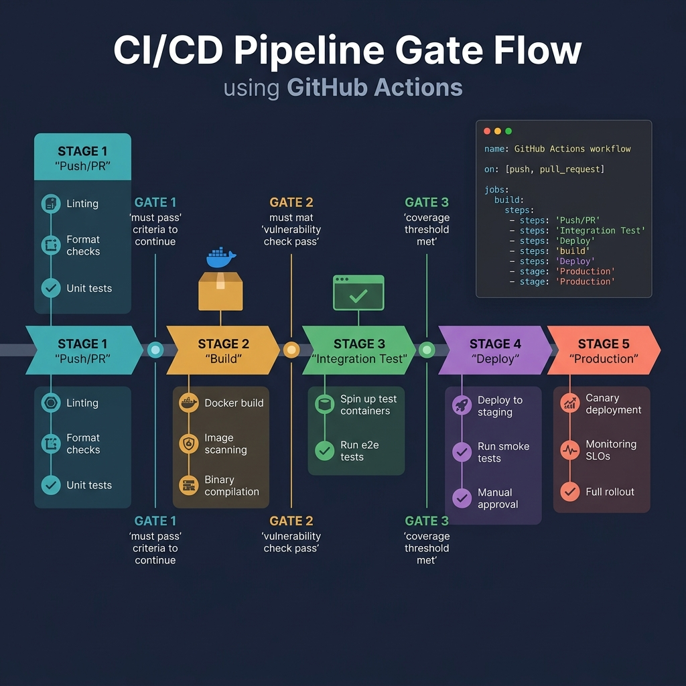
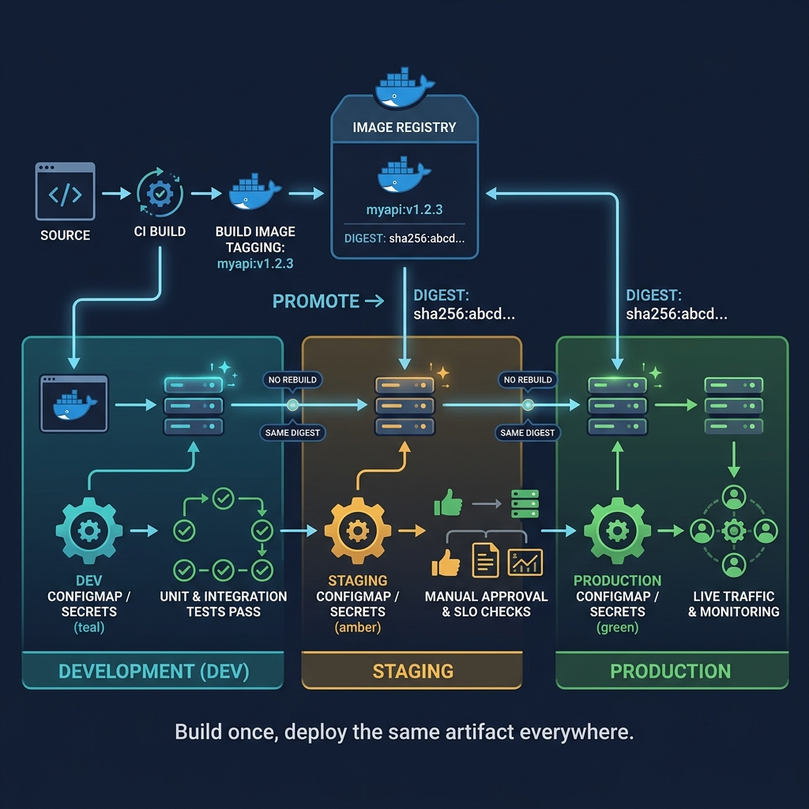

<!-- tags: golang, deployment, ci-cd -->
# ⚙️ CI/CD — GitHub Actions, Quality Gates, Build Metadata

> Good CI/CD is more than "build pass". It must protect artifact quality: lint, test, race detector, image build, release metadata and deploy gates. This article focuses on CI/CD pipelines for Go services in a production direction.

📅 Created: 2026-03-23 · 🔄 Updated: 2026-04-09 · ⏱️ 18 min read

| Aspect | Detail |
| --- | --- |
| **Complexity** | Advanced |
| **Use case** | Go repos that need quality CI and a clear release pipeline |
| **Focus** | Actions workflows, race tests, build artifacts, metadata |
| **Prerequisites** | Go test/build basics, Docker packaging |

## 1. DEFINE

Picture a release where image build, rollout, probes and rollback must lock together step by step. At that point, **CI/CD — GitHub Actions, Quality Gates, Build Metadata** is no longer a glossy table of contents; it is where you must lock down the release chain from build to rollback.

> *PR vet test build. Manual forgotten. Actions cache 5 to 1 min.*

### How do CI and CD differ?

| Component | Role |
| --- | --- |
| CI | Validates code: lint, test, build, scan |
| CD | Publishes artifacts / deploys to an environment |

### Invariants

| Rule | Meaning |
| --- | --- |
| CI must fail fast when a quality gate breaks | Does not push garbage to downstream stages |
| Artifacts need to trace back to a commit | Release debugging is easier |
| Deploy step must use an artifact that has been verified | Prevents an environment-different rebuild |

### Failure Modes

| Failure | Cause | Fix |
| --- | --- | --- |
| Release broken but nobody knows which commit | Missing version metadata | Inject version/commit/build time |
| CI green but runtime failure | No race/test/integration gate in place | Increase signal at the CI level |
| CD deploys an artifact different from local CI | Rebuild in multiple places | Promote the same artifact that was built |

Those failure modes are clear. But there is a trap: running unit tests without `-race` lets concurrency bugs reach production, and pushing an image before tests finish produces a low-quality artifact. That trap surfaces in PITFALLS.

## 2. VISUAL

In CI/CD, one visual must lock the quality-gate order; the other must lock the artifact promotion boundary so the team does not rebuild each environment and assume it is the same release.



*Figure: The gate flow shows where to fail fast and where the artifact earns the right to proceed to publish or deploy.*



*Figure: The promotion flow separates build from deploy to keep the same verified artifact through staging and into production.*

## 3. CODE

The visual for **CI/CD — GitHub Actions, Quality Gates, Build Metadata** gives you the big picture. Code is where decisions about cancellation, ownership or sequencing become real behavior.

### Example 1: Basic — Build metadata in Go binary

> **Goal**: Attach `version` and `commit` to the binary so CI/CD artifacts can trace back to the source commit and release tag.
> **Approach**: Use package-level variables in Go and inject them through build flags from CI.
> **Example**: Release tag `v1.4.2` and SHA `abc1234` appear in the startup log, health endpoint or debug page.
> **Complexity**: O(1) runtime; the complexity sits in build wiring.

```go
// version_info.go — Keep version metadata visible in logs and debugging endpoints
package deploymeta

import (
	"fmt"
	"log/slog"
)

var (
	version = "dev"
	commit  = "local"
)

func BuildInfo() string {
	return fmt.Sprintf("version=%s commit=%s", version, commit)
}

func LogBuildInfo() {
	// ✅ This metadata is the anchor for cross-referencing artifacts, CI runs and production incidents.
	slog.Info("build info", "version", version, "commit", commit)
}
```

> **Conclusion**: This is the first step so that artifacts are no longer anonymous. It does not create a real quality gate; the validation pipeline lives in the next CI workflow.

Build metadata covered. But the CI workflow needs automation — time to write the pipeline.

### Example 2: Intermediate — GitHub Actions CI workflow

> **Goal**: Create a fail-fast CI pipeline for a Go repo with minimum steps: checkout, setup Go, download modules, lint, test with race detector and build.
> **Approach**: Place quality gates before every publish step so artifacts are created only when the code passes baseline verification.
> **Example**: A PR into `main` runs `golangci-lint`, `go test -race ./...` and `go build ./...`; failure at any step stops the pipeline.
> **Complexity**: O(n) by number of packages/tests; CI wall time depends on repo size.

```yaml
# .github/workflows/ci.yml — Run quality gates before publishing any artifact
name: ci

on:
  pull_request:
  push:
    branches: [main]

jobs:
  test:
    runs-on: ubuntu-latest
    steps:
      - uses: actions/checkout@v4
      - uses: actions/setup-go@v5
        with:
          go-version: "1.24"
      - name: Download modules
        run: go mod download
      - name: Lint
        run: golangci-lint run
      - name: Test with race detector
        run: go test -race ./...
      - name: Build
        run: go build ./...
```

> **Conclusion**: This workflow establishes the minimum quality barrier before a release. For concurrent or IO-heavy services, `-race` is a high-value signal; removing it makes CI green in a misleading way.

CI workflow covered. But the release image needs immutable tags — time to close it.

### Example 3: Advanced — Release image with immutable tags

> **Goal**: Publish a container image from a git tag with a version tag and commit SHA — both immutable — so deployment knows the exact running artifact.
> **Approach**: Trigger the workflow on `push tags`, use `docker/build-push-action` and build args to pass metadata into the Docker build.
> **Example**: Pushing tag `v1.4.2` triggers the pipeline to publish `ghcr.io/myorg/checkout-api:v1.4.2` and `ghcr.io/myorg/checkout-api:<sha>`.
> **Complexity**: O(1) workflow structure; build time depends on image size and cache.

```yaml
# .github/workflows/release-image.yml — Publish one image per immutable git tag
name: release-image

on:
  push:
    tags:
      - "v*"

jobs:
  docker:
    runs-on: ubuntu-latest
    steps:
      - uses: actions/checkout@v4
      - uses: docker/setup-buildx-action@v3
      - uses: docker/login-action@v3
        with:
          registry: ghcr.io
          username: ${{ github.actor }}
          password: ${{ secrets.GITHUB_TOKEN }}
      - uses: docker/build-push-action@v6
        with:
          push: true
          tags: |
            ghcr.io/myorg/checkout-api:${{ github.ref_name }}
            # ✅ SHA tag keeps rollback and audit far more precise than latest.
            ghcr.io/myorg/checkout-api:${{ github.sha }}
          build-args: |
            VERSION=${{ github.ref_name }}
            COMMIT=${{ github.sha }}
```

> **Conclusion**: This is the step where CI/CD enters real release discipline: the artifact is born from a clear tag, carries immutable metadata and is not rebuilt at the next environment. What is still missing is an explicit promotion/deploy gate per environment.

Release image covered. But promotion needs verified artifacts — time to promote.

### Example 4: Expert — Promote one verified artifact across environments

> **Goal**: Use the same image that was verified in CI to promote through staging and into production, instead of rebuilding a different artifact per environment.
> **Approach**: Separate `release-image` from `deploy`, and pass the correct immutable image tag into the deploy job through a workflow input or environment promotion.
> **Example**: Image `ghcr.io/myorg/checkout-api:abc1234` is deployed to staging, smoke passes, and the same tag is promoted to production.
> **Complexity**: O(1) workflow orchestration; operational complexity sits in approval policy and smoke tests.

```yaml
# .github/workflows/deploy.yml — Promote one verified image instead of rebuilding per environment
name: deploy

on:
  workflow_dispatch:
    inputs:
      image_tag:
        description: Immutable image tag to deploy
        required: true
      environment:
        description: Target environment
        required: true

jobs:
  deploy:
    runs-on: ubuntu-latest
    environment: ${{ inputs.environment }}
    steps:
      - name: Show release artifact
        run: echo "Deploying ghcr.io/myorg/checkout-api:${{ inputs.image_tag }}"
      - name: Apply rollout
        run: |
          kubectl set image deployment/checkout-api \
            api=ghcr.io/myorg/checkout-api:${{ inputs.image_tag }}
```

> **Conclusion**: This is where CI/CD graduates from "build automation" to real release discipline. Do not rebuild the image in the production deploy job, because then the artifact that passed CI and the artifact that runs in production may differ.

You have walked through metadata, CI, release and promotion. Now comes the dangerous part: a missing race detector and premature publish — the trap set up at the start.

## 4. PITFALLS

From here, with **CI/CD — GitHub Actions, Quality Gates, Build Metadata**, the focus is no longer making it run — it is avoiding the kinds of run that look stable but create operational debt.

| # | Severity | Defect | Impact | Fix |
| --- | --- | --- | --- | --- |
| 1 | 🔴 Fatal | Unit tests run without `-race` | Concurrency bugs reach production undetected | Add the race detector for concurrent code |
| 2 | 🔴 Fatal | Image pushed before tests finish | Low-quality artifact published | Quality gates must stand before publish |
| 3 | 🟡 Common | Artifact rebuilt at each stage | Staging and production may run different binaries | Promote the same checked artifact |
| 4 | 🟡 Common | Action versions not pinned | Unexpected breakage from upstream changes | Use stable major versions or commit-pinned actions |

You have walked through CI/CD patterns and their traps. The resources below help you go deeper.

## 5. REF

| Resource | Link | Note |
| --- | --- | --- |
| GitHub Actions for Go | https://docs.github.com/en/actions/use-cases-and-examples/building-and-testing/building-and-testing-go | Quality-gate and artifact build flow |
| golangci-lint action | https://github.com/golangci/golangci-lint-action | Opinionated Go linter integration for CI |
| Docker build-push action | https://github.com/docker/build-push-action | Build and push images from a GitHub Actions workflow |

## 6. RECOMMEND

The core point of **CI/CD — GitHub Actions, Quality Gates, Build Metadata** is clear. The extensions below are for when you need to turn this understanding into a fuller investigation or operational workflow.

| Extension | When to proceed | Rationale | File/Link |
| --- | --- | --- | --- |
| Integration tests with services | When the app depends on a DB, cache or broker | Increases confidence before publishing a production artifact | [05-idempotency-retry-consumers.md](../messaging/05-idempotency-retry-consumers.md) |
| Artifact signing | When the release requires provenance or strict compliance | Verifies the artifact before promotion | [04-goreleaser-release-pipeline.md](./04-goreleaser-release-pipeline.md) |
| Deployment promotion pipeline | When there are multiple environments and approval gates | Keeps the release flow clear instead of relying on ad-hoc rebuild/deploy | [05-progressive-rollout-and-rollback.md](../cloud-infra/05-progressive-rollout-and-rollback.md) |

## 7. QUIZ

### Quick Check

1. Why should `go test -race` be part of CI for Go services?
2. What should artifacts be tagged with for good traceability?
3. Should CI push an artifact before quality gates complete?

### Answer Key

1. Because race conditions surface only when the detector runs.
2. A version tag and an immutable commit SHA.
3. No; quality must be verified before publishing.

## 8. NEXT STEPS

- Continue with [GoReleaser — Release Pipeline, Archives, Changelog, Containers](./04-goreleaser-release-pipeline.md)
- Or connect to [Docker — Multi-stage Builds, Distroless, Runtime Hygiene](./01-docker.md)
