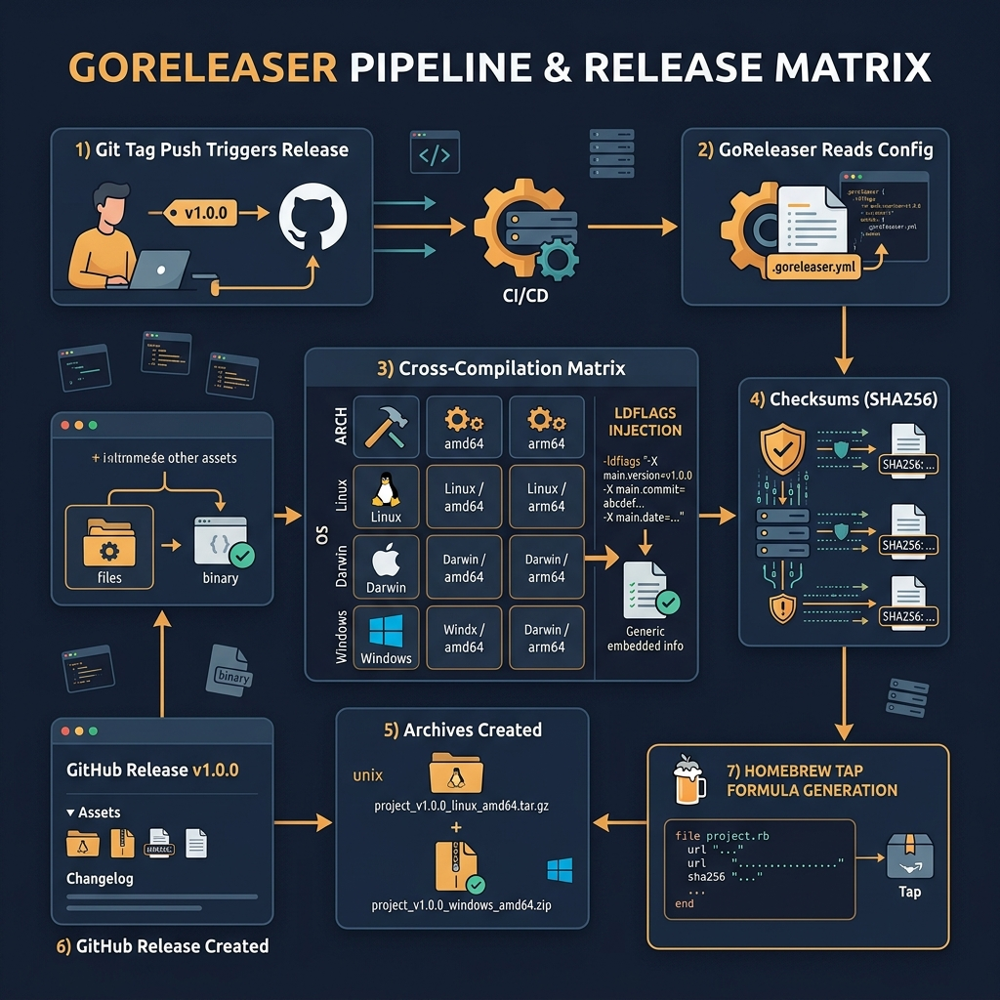

<!-- tags: golang, deployment, goreleaser -->
# 📦 GoReleaser — Release Pipeline, Archives, Changelog, Containers

> When a project starts having multiple binaries, multiple OS/arch targets or needs regular releases, GoReleaser helps standardize the release flow. This article focuses on using GoReleaser as a release orchestrator, not just an archive builder.

📅 Created: 2026-03-28 · 🔄 Updated: 2026-04-09 · ⏱️ 17 min read

| Aspect | Detail |
| --- | --- |
| **Complexity** | Advanced |
| **Use case** | CLIs/services that need cross-platform builds, changelogs, checksums, image releases |
| **Focus** | versioned artifacts, release metadata, docker integration |
| **Prerequisites** | CI/CD basics, Go build metadata |

## 1. DEFINE

Right before you must commit to a resolution path, you realize that a release where image build, rollout, probes and rollback must lock together step by step. That is when **GoReleaser — Release Pipeline, Archives, Changelog, Containers** shows how useful it is.

> *Release multi-OS. GoReleaser 1 cmd 3 min.*

### What does GoReleaser solve?

- Consistent builds across multiple targets
- Archive/checksum/changelog generation
- GitHub/GitLab release publishing
- Container image release integration

### Invariants

| Rule | Meaning |
| --- | --- |
| Releases run from a clear tag | Artifact names and changelogs remain stable |
| Metadata must track the real commit/tag | Easy to audit and rollback |
| Snapshot releases are separate from production releases | Local testing is safer |

### Failure Modes

| Failure | Cause | Fix |
| --- | --- | --- |
| Artifact naming is chaotic | Templates not standardized | Define naming rules in the config |
| Release notes are noisy | Changelog does not filter commit noise | Exclude docs/test chores where appropriate |
| Publishing production from an untested config | No local/CI snapshot run | Use `--snapshot` first |

Those failure modes sound easy to avoid. But there is a trap: running a production release for the first time without a snapshot leads to unexpected errors, and a changelog without filtering produces noisy release notes. That trap surfaces in PITFALLS.

## 2. VISUAL

With GoReleaser, the overview matrix and the pipeline boundary are two different teaching jobs. One visual shows the release surface; the other reveals which part belongs to build, package, publish or provenance.



*Figure: The release matrix gathers binaries, archives, checksums, changelogs and container tags into a single frame so a release is not a set of disconnected jobs.*


*Figure: The boundary map separates build, package, publish and snapshot rehearsal so the team does not confuse config validation with a production release.*

## 3. CODE

The visual for **GoReleaser — Release Pipeline, Archives, Changelog, Containers** gives you the big picture. Code is where decisions about cancellation, ownership or sequencing become real behavior.

### Example 1: Basic — Minimal GoReleaser config

> **Goal**: Create a minimum release config to build a binary, archive and checksum from a git tag in a consistent way.
> **Approach**: Declare `builds`, `archives`, `checksum` in `.goreleaser.yaml`, while injecting `Version` and `Commit` into the binary.
> **Example**: Tag `v1.4.2` produces binary `checkout-api`, archives by OS/arch and a `checksums.txt` file.
> **Complexity**: O(1) config; run time depends on the number of build targets.

```yaml
# .goreleaser.yaml — Standardize release outputs from a tagged build
version: 2

builds:
  - main: ./cmd/api
    binary: checkout-api
    env:
      - CGO_ENABLED=0
    ldflags:
      - -s -w
      # ✅ Version/Commit traveling with the artifact helps audit releases and rollback with precision.
      - -X main.version={{ .Version }}
      - -X main.commit={{ .Commit }}

archives:
  - format: tar.gz
    name_template: "{{ .ProjectName }}_{{ .Version }}_{{ .Os }}_{{ .Arch }}"

checksum:
  name_template: "checksums.txt"
```

> **Conclusion**: This example is sufficient to turn a git tag into an artifact with a stable structure. It does not solve noisy release notes; changelog filtering in the next example is the step that makes the release usable for consumers.

Minimal config covered. But the changelog needs filtering — time to filter.

### Example 2: Intermediate — Changelog and release filtering

> **Goal**: Focus release notes on notable changes and reduce noise from docs/test/chore commits.
> **Approach**: Use `changelog.filters.exclude` to remove commit prefixes that are not relevant to release consumers.
> **Example**: `docs:` and `test:` do not appear in the release notes, while `feat:` and `fix:` remain.
> **Complexity**: O(1) config complexity.

```yaml
# .goreleaser.yaml — Keep release notes cleaner for consumers
changelog:
  sort: asc
  filters:
    exclude:
      - "^docs:"
      - "^test:"
      - "^chore:"
```

> **Conclusion**: This step makes release notes readable instead of long and hard to scan. The caveat is that the filter should not be too aggressive; if the team uses commit prefixes inconsistently, the changelog remains noisy regardless.

Changelog covered. But Docker images need templates — time to integrate.

### Example 3: Advanced — Docker image templates

> **Goal**: Use GoReleaser to publish versioned container images alongside release artifacts, instead of operating two pipelines with different naming schemes.
> **Approach**: Declare `dockers.image_templates` and build args so the Docker image receives the same `Version/Commit` metadata as the binary release.
> **Example**: The same release `v1.4.2` publishes image `ghcr.io/myorg/checkout-api:v1.4.2` and `:latest` from the GoReleaser config.
> **Complexity**: O(1) config; real complexity grows with the number of registries/platforms.

```yaml
# .goreleaser.yaml — Publish versioned and latest container tags from the same release
dockers:
  - image_templates:
      - "ghcr.io/myorg/checkout-api:{{ .Version }}"
      - "ghcr.io/myorg/checkout-api:latest"
    dockerfile: Dockerfile
    build_flag_templates:
      - "--build-arg=VERSION={{ .Version }}"
      - "--build-arg=COMMIT={{ .Commit }}"
```

```go
// release_metadata.go — Surface release metadata provided by GoReleaser
package deploymeta

import "fmt"

func ReleaseLine(version string, commit string) string {
	return fmt.Sprintf("%s (%s)", version, commit)
}
```

> **Conclusion**: When binary releases and Docker releases share a single orchestration layer, naming and provenance become far more stable. However, `latest` should be a convenience tag only; rollback should rely on an immutable version or commit.

Docker template covered. But snapshot validation needs to run first — time to test.

### Example 4: Expert — Snapshot validation before production tag

> **Goal**: Test the full GoReleaser config before a real release, to avoid publishing a production release with broken templates or Docker wiring.
> **Approach**: Run `goreleaser release --snapshot --clean` in CI or as a local release rehearsal, then inspect the output artifacts.
> **Example**: On a release candidate branch, the pipeline runs a snapshot to confirm that binaries, archives, checksums and image templates are all correct before pushing the real tag.
> **Complexity**: O(n) by number of build targets; far cheaper than fixing a broken production release.

```bash
# validate-release.sh — Rehearse the full GoReleaser pipeline without publishing a production release
set -euo pipefail

goreleaser release --snapshot --clean

# ✅ Quick check to confirm the minimum expected outputs exist.
test -f dist/checksums.txt
find dist -maxdepth 1 -type f | sort
```

> **Conclusion**: This is the most important guardrail when the team starts using GoReleaser in a serious way. Do not treat `.goreleaser.yaml` as a static config you "write once and forget"; every change to naming, Docker, changelog or signing should have a snapshot rehearsal before a production tag.

You have walked through config, changelog, Docker and snapshot. Now comes the dangerous part: an untested release and noisy changelog — the trap set up at the start.

## 4. PITFALLS

From here, with **GoReleaser — Release Pipeline, Archives, Changelog, Containers**, the focus is no longer making it run — it is avoiding the kinds of run that look stable but create operational debt.

| # | Severity | Defect | Impact | Fix |
| --- | --- | --- | --- | --- |
| 1 | 🔴 Fatal | Running a production release for the first time without a snapshot | Unexpected errors in naming, Docker or checksums | Test with `goreleaser release --snapshot --clean` first |
| 2 | 🟡 Common | Not filtering the changelog | Release notes are long and hard to scan | Keep release notes short and useful |
| 3 | 🟡 Common | Binary name changes between versions | Consumer scripts and downloads break | Stabilize the naming template |
| 4 | 🟡 Common | GoReleaser publishes an image but the Dockerfile does not receive metadata | Image has no provenance info | Synchronize build args with the Dockerfile |

You have walked through GoReleaser patterns and their traps. The resources below help you go deeper.

## 5. REF

| Resource | Link | Note |
| --- | --- | --- |
| GoReleaser docs | https://goreleaser.com/ | Full reference for builds, archives, Docker and signing |
| GoReleaser CI guide | https://goreleaser.com/ci/actions/ | GitHub Actions integration |

## 6. RECOMMEND

The core point of **GoReleaser — Release Pipeline, Archives, Changelog, Containers** is clear. The extensions below are for when you need to turn this understanding into a fuller investigation or operational workflow.

| Extension | When to proceed | Rationale | File/Link |
| --- | --- | --- | --- |
| SBOM + signing | When compliance or supply-chain review becomes a hard requirement | Increases confidence in artifact provenance | [05-runtime-hardening-and-image-security.md](./05-runtime-hardening-and-image-security.md) |
| Monorepo release templates | When multiple services or binaries need to release in the same way | Reuses config while keeping naming discipline | [03-cicd-github-actions.md](./03-cicd-github-actions.md) |
| Release health gates | When deploying a critical service that must stop early before full promotion | Connects the release artifact to the rollout control loop | [05-progressive-rollout-and-rollback.md](../cloud-infra/05-progressive-rollout-and-rollback.md) |

## 7. QUIZ

### Quick Check

1. Why should GoReleaser run from a git tag?
2. What is a snapshot release useful for?
3. What does changelog filtering do?

### Answer Key

1. Because the tag is the clear and stable versioning source for artifacts.
2. To test the release config without publishing a real production release.
3. It focuses release notes on changes the user needs to know about.

## 8. NEXT STEPS

- Continue with [Runtime Hardening & Image Security](./05-runtime-hardening-and-image-security.md)
- Or return to [CI/CD Pipeline](./03-cicd-github-actions.md)
