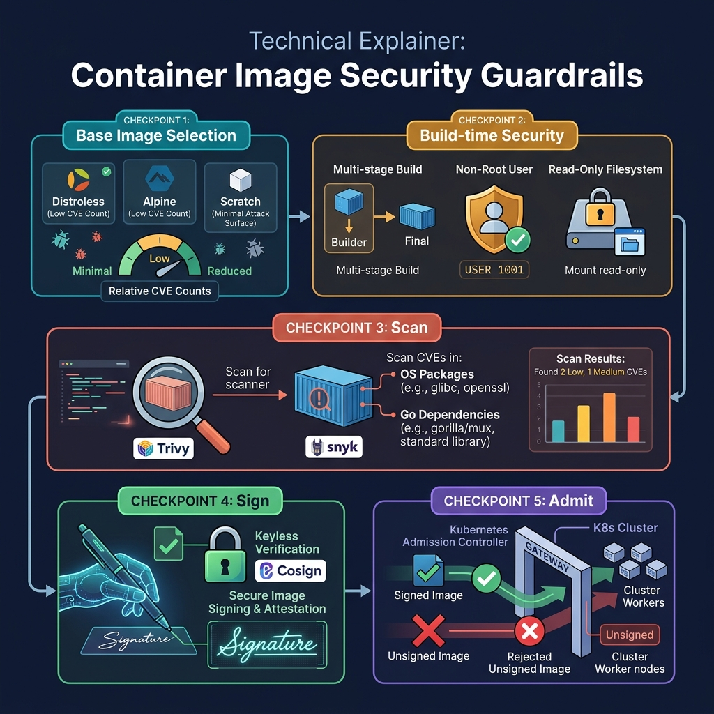

<!-- tags: golang, deployment, security -->
# 🔒 Runtime Hardening & Image Security — Non-root, Scanning, Supply Chain

> Building an image does not mean deploying it is safe. This article focuses on the baseline hardening for Go containers: non-root user, minimal images, scanning, SBOM and artifact provenance.

📅 Created: 2026-03-28 · 🔄 Updated: 2026-04-09 · ⏱️ 16 min read

| Aspect | Detail |
| --- | --- |
| **Complexity** | Advanced |
| **Use case** | Production Go services that need baseline security for containers/runtime |
| **Focus** | hardening, scanning, SBOM, provenance |
| **Prerequisites** | Docker and CI/CD basics |

## 1. DEFINE

Some articles reveal their value only when a release where image build, rollout, probes and rollback must lock together step by step goes wrong. **Runtime Hardening & Image Security — Non-root, Scanning, Supply Chain** is one of those articles.

> *Container root shell. RCE full. Distroless dead-end.*

### What does runtime hardening cover?

| Area | Examples |
| --- | --- |
| Container runtime | Non-root user, read-only FS where appropriate |
| Image hygiene | Minimal base image, no build tools in the runtime |
| Supply chain | SBOM, signing, vulnerability scans |

### Invariants

| Rule | Meaning |
| --- | --- |
| Runtime container is minimal | Reduces attack surface |
| Security checks must live in the pipeline | Avoids reliance on manual inspection |
| Vulnerability findings need a clear policy | Prevents "scan runs but no one acts" |

### Failure Modes

| Failure | Cause | Fix |
| --- | --- | --- |
| Container compromised with ease | Running as root on a heavy image | Non-root + minimal base |
| CVE exists for a long time without detection | No artifact scanning | Add a scanner to CI |
| Cannot prove artifact provenance | No signing/attestation | Add a signing/SBOM flow |

Those failure modes sound familiar. But there is a trap: scanning once and assuming you are safe forever lets new CVEs slip in, and running as root for convenience opens the door to privilege escalation when the container is compromised. That trap surfaces in PITFALLS.

## 2. VISUAL

In runtime hardening, what needs to be visible first is the artifact guardrail chain: harden the image, create evidence, then promote only the build that has clear provenance.



*Figure: The guardrail map gathers hardening, scanning, SBOM, signing and promotion into one release loop so security is not a disconnected checklist.*

## 3. CODE

The visual for **Runtime Hardening & Image Security — Non-root, Scanning, Supply Chain** gives you the big picture. Code is where decisions about cancellation, ownership or sequencing become real behavior.

### Example 1: Basic — Non-root Docker runtime

> **Goal**: Run a Go container with the minimum hardening baseline: a small runtime image and a non-root process.
> **Approach**: Use a distroless runtime and `USER nonroot:nonroot`, instead of keeping a full OS image and root privileges in production.
> **Example**: The binary `/server` is copied into a distroless image and runs without a shell or package manager.
> **Complexity**: O(1) config complexity.

```dockerfile
# Dockerfile.secure — Harden a Go runtime image with minimal defaults
FROM gcr.io/distroless/static-debian12

COPY server /server
# ✅ Non-root is the mandatory baseline unless the app has a genuine special need.
USER nonroot:nonroot
ENTRYPOINT ["/server"]
```

> **Conclusion**: This is the floor of runtime hygiene. It is not sufficient to audit artifact provenance or know which release the image came from; that metadata needs to surface on its own.

Non-root runtime covered. But build metadata needs security info — time to expose.

### Example 2: Intermediate — Go endpoint exposing build/security metadata

> **Goal**: Expose immutable build metadata so operations and security teams can trace the running artifact when investigating an incident or a CVE.
> **Approach**: Package the metadata into a simple struct that can be returned from a debug endpoint or startup log.
> **Example**: The API `/build-info` or the startup log shows `version=v1.4.2`, `commit=abc1234`.
> **Complexity**: O(1) runtime.

```go
// security_metadata.go — Expose immutable build metadata for operations and auditing
package deploymeta

type BuildMetadata struct {
	Version string `json:"version"`
	Commit  string `json:"commit"`
}

func CurrentBuild(version string, commit string) BuildMetadata {
	return BuildMetadata{
		Version: version,
		Commit:  commit,
	}
}
```

> **Conclusion**: This metadata does not make the container safer by itself, but it is the foundation that makes audit and rollback possible with evidence. Without provenance, every scanner and SBOM downstream struggles to trace back to the real artifact.

Metadata covered. But CI needs security checks — time to integrate.

### Example 3: Advanced — CI security checks concept

> **Goal**: Automate security checks in the pipeline instead of performing them by hand after the image is ready to deploy.
> **Approach**: Create a dedicated workflow to generate an SBOM and scan the filesystem/image, failing the build when a finding exceeds the policy.
> **Example**: Every release artifact produces `sbom.json` and is blocked by `trivy` if a critical vulnerability is detected.
> **Complexity**: O(n) by dependency tree and image size; increases CI time but trades it for higher release quality.

```yaml
# .github/workflows/security.yml — Run image scan and SBOM generation on release artifacts
name: security

on:
  workflow_call:

jobs:
  scan:
    runs-on: ubuntu-latest
    steps:
      - uses: actions/checkout@v4
      - name: Generate SBOM
        run: syft packages dir:. -o json > sbom.json
      - name: Scan filesystem
        # ✅ exit-code 1 makes the security gate block a bad release, not just print a report.
        run: trivy fs --exit-code 1 .
```

> **Conclusion**: This is the step where security starts attaching to the release flow instead of living in a wiki or a manual process. The caveat is that scanning is valuable only if the team has a clear policy for handling critical/high findings.

Security checks covered. But signing needs cosign — time to attest.

### Example 4: Expert — Cosign signing and provenance attestation

> **Goal**: Sign the container artifact and publish provenance so downstream deployment or security tooling can verify the image before running it.
> **Approach**: Use `cosign sign` and `cosign attest` on the published image digest, instead of signing a mutable tag.
> **Example**: The image digest `sha256:...` is signed and has an attestation predicate attached after the release pipeline completes.
> **Complexity**: O(1) command complexity; operational complexity sits in keyless signing setup and the verify policy.

```bash
# sign-release.sh — Sign published image digest and attach provenance
set -euo pipefail

IMAGE_DIGEST="${IMAGE_DIGEST:?missing image digest}"

cosign sign --yes "${IMAGE_DIGEST}"

cosign attest \
  --yes \
  --predicate provenance.json \
  --type slsaprovenance \
  "${IMAGE_DIGEST}"
```

> **Conclusion**: This is the step where hardening moves from "container is safer" to "supply chain is more trustworthy". Do not sign only a tag like `latest`; the digest is the stable identity to verify the exact production artifact.

You have walked through non-root, metadata, security checks and signing. Now comes the dangerous part: one-time scanning and root convenience — the trap set up at the start.

## 4. PITFALLS

From here, with **Runtime Hardening & Image Security — Non-root, Scanning, Supply Chain**, the focus is no longer making it run — it is avoiding the kinds of run that look stable but create operational debt.

| # | Severity | Defect | Impact | Fix |
| --- | --- | --- | --- | --- |
| 1 | 🔴 Fatal | Assuming that scanning once is enough forever | New CVEs slip into production undetected | Re-scan on each release |
| 2 | 🔴 Fatal | Running as root for convenience | Privilege escalation when compromised | Default to non-root, relax only when there is a real need |
| 3 | 🟡 Common | SBOM exists but is not attached to the release artifact | SBOM is disconnected from the actual image | Publish SBOM alongside release outputs |
| 4 | 🟡 Common | Security checks do not block the release | Scan reports pile up without action | Define an exit policy for critical/high severity |

You have walked through security hardening and its traps. The resources below help you go deeper.

## 5. REF

| Resource | Link | Note |
| --- | --- | --- |
| Trivy | https://trivy.dev/latest/ | Vulnerability and misconfiguration scanner |
| Syft | https://github.com/anchore/syft | SBOM generation for container images and filesystems |
| SLSA | https://slsa.dev/ | Supply-chain levels for software artifacts |

## 6. RECOMMEND

The core point of **Runtime Hardening & Image Security — Non-root, Scanning, Supply Chain** is clear. The extensions below are for when you need to turn this understanding into a fuller investigation or operational workflow.

| Extension | When to proceed | Rationale | File/Link |
| --- | --- | --- | --- |
| Cosign signing | When releasing public or critical artifacts | Better provenance verification before promotion | [04-goreleaser-release-pipeline.md](./04-goreleaser-release-pipeline.md) |
| Policy-based scanning | When managing multiple repos or services | Reduces manual inspection and pulls security into the quality gate | [03-cicd-github-actions.md](./03-cicd-github-actions.md) |
| Read-only root filesystem | When the runtime writes few files | Reduces the mutation surface of a running container | — |

## 7. QUIZ

### Quick Check

1. Why should containers run as non-root?
2. What role does an SBOM play in the release process?
3. Where should security scans live in the flow?

### Answer Key

1. To limit the process's privileges if there is a compromise.
2. It reveals which dependencies are in the artifact and supports audit/provenance.
3. In the CI/CD pipeline, before promoting/deploying the artifact.

## 8. NEXT STEPS

- Return to [Cloud Infra](../cloud-infra/README.md)
- Or connect to [Observability](../observability/README.md)
