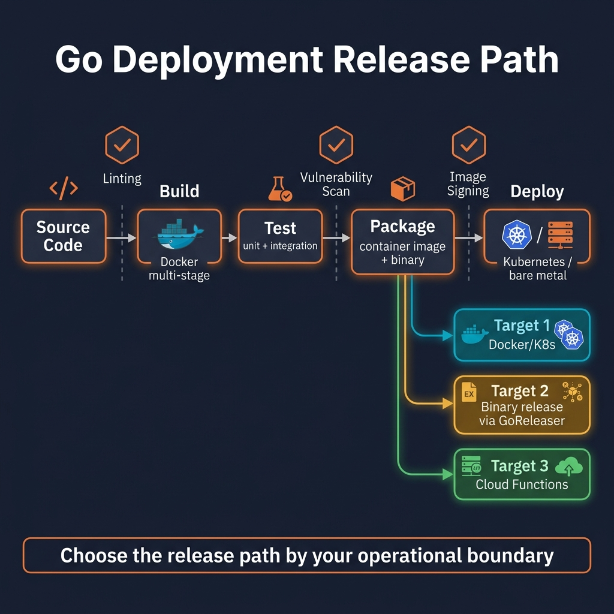

<!-- tags: golang, overview, deployment -->
# Deployment in Go

> Build, package, release and operate Go services from Docker to Kubernetes and CI/CD pipelines. This branch focuses on real-world release pipelines, not minimal YAML examples.

📅 Updated: 2026-04-09 · ⏱️ 7 min read

## 1. DEFINE

Picture a release where image build, rollout, probes and rollback must lock together step by step. In that moment, **Deployment in Go** becomes the anchor that prevents a wrong-layer technical decision.

This hub does not exist to list files. It exists to help you choose the right entry point into `deployment`: where to start, which articles to read back-to-back, and which lane to turn to first when a real symptom appears.

### 1.1 Signals & Boundaries

- Open this hub when you know you are in the `deployment` cluster but are not sure which article to read first.
- The hub's job is to map a pain point to the right document, not to replace each detail article.
- If you keep jumping between articles and still feel uncertain, the problem is choosing the wrong opening lane, not that you need more definitions.

### 1.2 Learning Lanes

- `Docker — Multi-stage Builds, Distroless, Runtime Hygiene` is the natural entry point when you want a clear anchor before going deeper.
- `Kubernetes — Deploy Go Services with Probes, Resources, Rollouts` fits better when you need to bridge to the adjacent lane or expand from fundamentals into production concerns.
- Treat this hub as a navigation map: after finishing one article, return here to choose the next waypoint with intent.

## 2. VISUAL

In the `deployment` lane, symptoms tend to look alike but the teaching jobs are different: the problem may sit at the image, the orchestrator, the release gate or artifact promotion. The router below separates those layers before you read further.



*Figure: This router splits `deployment` along the artifact's path from build to rollout, so you choose the right article by release failure rather than by tool name.*

## 3. CODE

The flow is clear at the concept level. Now we lower it to an artifact a Go team can read, review and keep as an execution reference.

### Example 1: Router artifact — choosing an article by reading goal

> **Goal**: Turn this hub into a navigation tool instead of a passive link table.
> **Approach**: Map a learning goal or symptom to the right opening file.
> **Example**: Choose a lane by concern — fundamentals, framework, concurrency or production ops.
> **Complexity**: O(1) at the navigation level; the real challenge is choosing the right entry point.

```go
func chooseLane(goal string) string {
	switch goal {
	case "docker":
		return "./01-docker.md"
	case "kubernetes":
		return "./02-kubernetes.md"
	case "cicd github actions":
		return "./03-cicd-github-actions.md"
	case "goreleaser release pipeline":
		return "./04-goreleaser-release-pipeline.md"
	case "runtime hardening and image security":
		return "./05-runtime-hardening-and-image-security.md"
	default:
		return "./README.md"
	}
}
```

This pseudo-router is not code to run in an app; it compresses the hub's navigation intent into a short artifact. Reading the hub in this spirit helps you maintain a coherent learning rhythm.

## 4. PITFALLS

The most dangerous part of **Deployment in Go** is not the theory — it is a few decisions that seem small but change the outcome.

| # | Severity | Defect | Impact | Fix |
| --- | --- | --- | --- | --- |
| 1 | 🔴 Fatal | Using the hub as a flat link list to skim | Fragmented learning and wrong entry point | Start from a pain point or a concrete learning goal |
| 2 | 🟡 Common | Jumping straight into a deep article without a foundation lane | Understanding terms in isolation and misapplying them | Pick one entry point and follow the cluster's rhythm |
| 3 | 🔵 Minor | Finishing an article without returning to the hub | Losing the connection thread between articles | Return to the hub after each lane to pick the next step |

## 5. REF

| Resource | Link | Note |
| --- | --- | --- |
| Docker Go guide | https://docs.docker.com/language/golang/ | Foundation for multi-stage builds and runtime split |
| Kubernetes deployments | https://kubernetes.io/docs/concepts/workloads/controllers/deployment/ | Baseline rollout semantics when artifacts enter the cluster |
| GitHub Actions for Go | https://docs.github.com/en/actions/use-cases-and-examples/building-and-testing/building-and-testing-go | Quality-gate and artifact build flow |
| GoReleaser docs | https://goreleaser.com/ | Release orchestration for binaries, archives and containers |

## 6. RECOMMEND

After reading this article, what matters is not holding more definitions in your head — it is moving on to the right related concept.

| Extension | When to proceed | Rationale | File/Link |
| --- | --- | --- | --- |
| Docker — Multi-stage Builds, Distroless, Runtime Hygiene | When you need to lock down artifact shape before discussing rollout | This is where builder, runtime, metadata and attack surface separate | [01-docker.md](./01-docker.md) |
| Kubernetes — Deploy Go Services with Probes, Resources, Rollouts | When the artifact is solid but rollout semantics are still unclear | Bridges image discipline to probes, resources and rollout | [02-kubernetes.md](./02-kubernetes.md) |
| CI/CD — GitHub Actions, Quality Gates, Build Metadata | When the failure sits at the gate, publish order or provenance | Shifts from packaging to release discipline | [03-cicd-github-actions.md](./03-cicd-github-actions.md) |
| GoReleaser — Release Pipeline, Archives, Changelog, Containers | When multiple binaries/targets make a release start to tangle | Standardizes the artifact matrix and changelog from a single orchestrator | [04-goreleaser-release-pipeline.md](./04-goreleaser-release-pipeline.md) |
| Go Programming | When you need to return to the main Go subtree router | Keeps a clear return point after leaving the deployment lane | [README.md](../README.md) |
