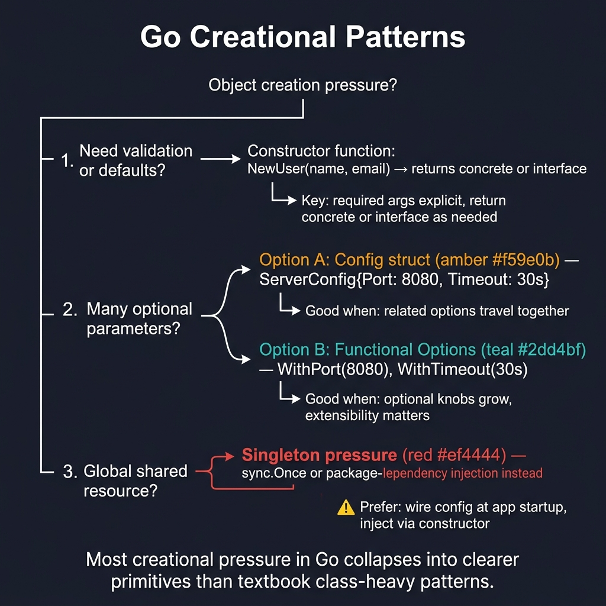

<!-- tags: golang, design-patterns, creational -->
# 🏭 Creational Patterns — Factory, Builder, Singleton, Options

> **Idiom**: Replacing heavy class instantiation with lightweight constructor functions, functional options, and `sync.Once` singletons.

📅 Created: 2026-03-24 · 🔄 Updated: 2026-04-14 · ⏱️ 10 min read

> ⚠️ **Bridge page**: Canonical creational patterns reside within [assets/design-pattern/creational](../../design-pattern/creational/README.md). Should you require Go-specific API designs, consult [Constructors & Functional Options](../idioms/01-constructors-and-functional-options.md) immediately.

## 1. DEFINE

When transitioning heavily object-oriented code into Go, the immediate pain point is object creation. You cannot declare a constructor inside a class. Without traditional instantiation mechanics, teams build massive configuration structs or write bloated initialization functions preventing clear consumer integrations.

**Creational Patterns** bridge this gap by establishing standard conventions for object setup. In Go, teams replace Java-style factories with simple package-level functions and swap rigid Builders for Functional Options.

### 1.1 Invariants & Failure Modes

- **Concrete Returns:** Factories must return concrete struct pointers, not interfaces, unless returning an interface enforces a strict abstraction requirement.
- **Concurrency Locks:** Singletons require `sync.Once` to handle concurrent initialization. Standard `nil` checks inside Goroutines cause immediate data races.
- **Builder Overhead:** Builders enforce explicit initialization chains. Use them only when functional options fail to cover complex validation.

## 2. VISUAL

Most creational pressure in Go resolves into simpler primitives than their textbook counterparts. The decision tree below maps each pressure type to its Go-native solution.



*Figure: Constructor functions handle validation, config structs group related options, functional options scale optional knobs, and sync.Once guards shared resources. Singleton pressure is usually a signal to use dependency injection instead.*

## 3. CODE

This section demonstrates how theoretically dense patterns reduce to robust Go idioms.

### Example 1: Basic — Factory Pattern

> **Goal**: Consolidate complex object initialization into a single callable boundary.
> **Approach**: Provide a package-level `NewX` function instead of exporting the struct.
> **Complexity**: O(1) allocation.

```go
// NestJS: useFactory → Go: constructor function
package logger

import (
	"fmt"
	"os"
)

type Logger interface {
	Log(msg string)
}

type consoleLogger struct{}
func (l *consoleLogger) Log(msg string) { fmt.Println(msg) }

type fileLogger struct{ file *os.File }
func (l *fileLogger) Log(msg string) { fmt.Fprintln(l.file, msg) }

// Factory function
func NewLogger(logType string) Logger {
	switch logType {
	case "file":
		f, _ := os.OpenFile("app.log", os.O_APPEND|os.O_CREATE|os.O_WRONLY, 0644)
		return &fileLogger{file: f}
	default:
		return &consoleLogger{}
	}
}
```

> **Takeaway**: Go factories operate primarily as standalone functions. They encapsulate branching logic and resource allocation.

---

### Example 2: Intermediate — Singleton (`sync.Once`)

> **Goal**: Ensure a global resource initializes exactly once, blocking simultaneous requests.
> **Approach**: Utilize `sync.Once` to guarantee parallel execution paths block until the target resource is ready.
> **Complexity**: O(1) concurrent synchronization.

```go
package config

import (
	"os"
	"sync"
)

type Config struct {
	AppName string
	Port    int
}

var (
	configInstance *Config
	configOnce     sync.Once
)

func GetConfig() *Config {
	configOnce.Do(func() {
		// Runs once regardless of how many goroutines call GetConfig.
		configInstance = &Config{
			AppName: os.Getenv("APP_NAME"),
			Port:    3000,
		}
	})
	return configInstance
}
```

> **Takeaway**: Never guard a singleton with a manual `nil` check and mutex. `sync.Once` handles concurrent initialization in one line.

---

### Example 3: Advanced — Builder Pattern

> **Goal**: Configure objects containing dozens of fields without forcing callers to populate massive structs.
> **Approach**: Chain consecutive method calls returning the builder instance before finalizing the assembly.
> **Complexity**: O(N) configuration step aggregations.

```go
package client

import "time"

type HTTPClient struct {
	baseURL string
	timeout time.Duration
	headers map[string]string
	retries int
}

type HTTPClientBuilder struct {
	client HTTPClient
}

func NewHTTPClient() *HTTPClientBuilder {
	return &HTTPClientBuilder{
		client: HTTPClient{
			timeout: 30 * time.Second, // Default setup
			headers: make(map[string]string),
			retries: 0,
		},
	}
}

func (b *HTTPClientBuilder) BaseURL(url string) *HTTPClientBuilder {
	b.client.baseURL = url
	return b
}

func (b *HTTPClientBuilder) Timeout(d time.Duration) *HTTPClientBuilder {
	b.client.timeout = d
	return b
}

func (b *HTTPClientBuilder) Header(k, v string) *HTTPClientBuilder {
	b.client.headers[k] = v
	return b
}

func (b *HTTPClientBuilder) Build() *HTTPClient {
	return &b.client
}

// client := NewHTTPClient().
//     BaseURL("https://api.example.com").
//     Timeout(10*time.Second).
//     Build()
```

> **Takeaway**: Builders handle intricate objects accommodating fluent declarative setups. Unfortunately, they demand substantial repetitive boilerplate.

---

### Example 4: Expert — Functional Options (idiomatic Go)

> **Goal**: Supply optional parameters flexibly without breaking backward compatibility.
> **Approach**: Accept a variadic slice of functions that mutate the underlying instance during initialization.
> **Complexity**: O(N) functional slice applications.

```go
package server

type Server struct {
	addr string
	port int
	tls  bool
}

type ServerOption func(*Server)

func WithAddr(addr string) ServerOption {
	return func(s *Server) { s.addr = addr }
}

func WithPort(port int) ServerOption {
	return func(s *Server) { s.port = port }
}

func WithTLS() ServerOption {
	return func(s *Server) { s.tls = true } // Encapsulates complex boolean toggles
}

func NewServer(opts ...ServerOption) *Server {
	s := &Server{addr: "0.0.0.0", port: 8080}
	for _, opt := range opts {
		opt(s)
	}
	return s
}

// s := NewServer(WithPort(3000), WithTLS())
```

> **Takeaway**: This pattern handles scalable configuration properties without demanding monolithic struct parameter mapping.

## 4. PITFALLS

Creational patterns expose subtle traps when translated too literally from OOP textbooks.

| # | Severity | Defect | Fix |
|---|----------|--------|-----|
| 1 | 🔴 Fatal | Translating factory class trees literally. | Use package-level `NewX()` functions instead of abstract factory hierarchies. |
| 2 | 🟡 Common | Hiding database connections behind singletons. | Pass dependencies through constructor arguments so tests can inject fakes. |
| 3 | 🟡 Common | Returning wide interfaces when concrete structs suffice. | Return structs. Add an interface only when the caller needs to swap implementations. |

## 5. REF

| Resource | Type | Link |
| --- | --- | --- |
| Go Patterns | Reference | [refactoring.guru/design-patterns/go](https://refactoring.guru/design-patterns/go) |
| Effective Go | Official docs | [go.dev/doc/effective_go](https://go.dev/doc/effective_go) |

## 6. RECOMMEND

Once creation logic stabilizes, the next pressure point is composition.

| Extension | When to proceed | Rationale |
| --- | --- | --- |
| [Constructors & Options](../idioms/01-constructors-and-functional-options.md) | Designing public API packages. | Deep dive into option patterns and validation at the constructor boundary. |
| [Structural Patterns](./02-structural.md) | Integrating external libraries. | Adapter, decorator, and facade patterns via interfaces and embedding. |
| [Canonical Pattern Hub](../../design-pattern/creational/README.md) | Language-independent theory. | Textbook definitions without Go-specific constraints. |

**Navigation**: [← Context Repository Hub](./README.md) · [→ Structural Patterns](./02-structural.md)
