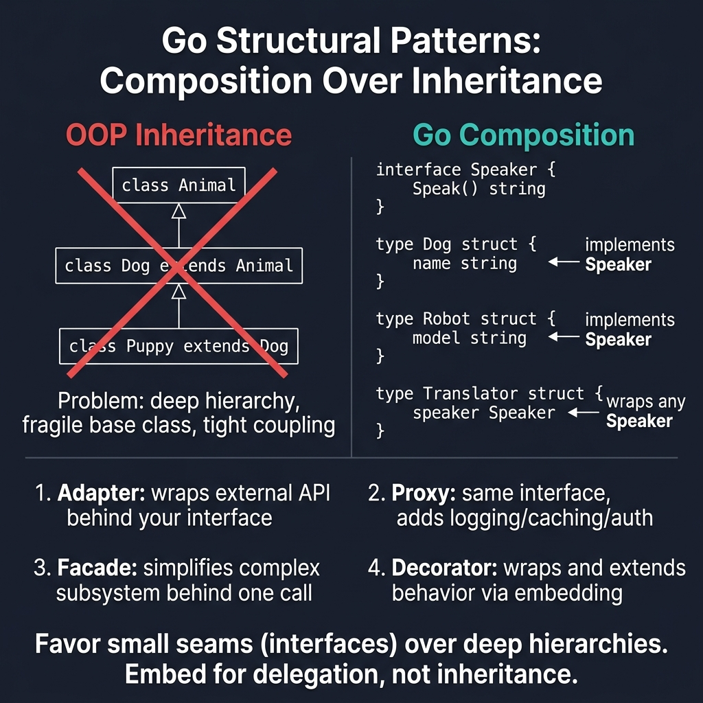

<!-- tags: golang, design-patterns, structural -->
# 🧩 Structural Patterns — Adapter, Decorator, Facade

> **Idiom**: Go replaces classical class inheritance with interface composition and struct embedding.

📅 Created: 2026-03-24 · 🔄 Updated: 2026-04-14 · ⏱️ 10 min read

> ⚠️ **Bridge page**: Canonical structural patterns reside within [assets/design-pattern/structural](../../design-pattern/structural/README.md). Should you require Go-specific compositions evaluating middleware, consult [Interfaces, Decorators & Middleware](../idioms/02-interfaces-decorators-and-middleware.md) immediately.

## 1. DEFINE

Structural patterns solve the problem of making incompatible types work together without rewriting structural source code. In Java, this often means deep inheritance trees and bloated base classes. In Go, an interface only cares about behavior, not structural lineage. 

Consequently, **Structural Patterns** in Go reduce to simple struct embedding and interface wrappers. Rather than forcing objects into a strict taxonomy, Go creates thin translation layers.

### 1.1 Invariants & Failure Modes

- Interfaces must describe the behavior you need, not the behavior the underlying package provides.
- Deep decorator chains complicate stack trace debugging.
- Facades must hide operational complexity, but they should never swallow operational errors.

## 2. VISUAL

OOP structural patterns depend on inheritance trees. Go eliminates the tree entirely — composition through interfaces and embedding covers the same ground with less coupling.



*Figure: OOP inheritance creates fragile class chains. Go achieves the same result with interface satisfaction and struct embedding — Adapter wraps, Proxy intercepts, Facade simplifies, Decorator extends.*

## 3. CODE

This section demonstrates how theoretically dense structural dependencies reduce to robust Go wrappers.

### Example 1: Basic — Adapter

> **Goal**: Force an external library to satisfy an aggressive internal interface requirement.
> **Approach**: Build a thin wrapper struct containing the external client and implement the target methods.
> **Complexity**: O(1) translation routing.

```go
// Adapt 3rd-party logger to your interface
package adapter

import "log/slog"

type Logger interface {
	Info(msg string, args ...any)
	Error(msg string, args ...any)
}

// Adapter: wrap *slog.Logger to match Logger interface
type SlogAdapter struct {
	logger *slog.Logger
}

func NewSlogAdapter(logger *slog.Logger) *SlogAdapter {
	return &SlogAdapter{logger: logger}
}

func (a *SlogAdapter) Info(msg string, args ...any) {
	a.logger.Info(msg, args...)
}

func (a *SlogAdapter) Error(msg string, args ...any) {
	a.logger.Error(msg, args...)
}

// Usage: var logger Logger = NewSlogAdapter(slog.Default())
```

> **Takeaway**: Adapters isolate your core business logic from external dependencies. Your domain dictates the interface; the adapter conforms external tools to it.

---

### Example 2: Intermediate — Decorator

> **Goal**: Append supplementary tracking behaviors to an existing workflow transparently.
> **Approach**: Wrap the target interface inside a struct that also implements the exact same interface.
> **Complexity**: O(1) operational boundary forwarding.

```go
package decorator

import (
	"context"
	"sync"
	"time"
)

type User struct{}
type Logger interface{ Info(msg ...any) }

// Add behavior without modifying original
type UserService interface {
	GetUser(ctx context.Context, id string) (*User, error)
}

// Logging decorator
type loggingDecorator struct {
	next   UserService
	logger Logger
}

func WithLogging(next UserService, logger Logger) UserService {
	return &loggingDecorator{next: next, logger: logger}
}

func (d *loggingDecorator) GetUser(ctx context.Context, id string) (*User, error) {
	d.logger.Info("GetUser called", "id", id)
	start := time.Now()

	user, err := d.next.GetUser(ctx, id)

	d.logger.Info("GetUser completed", "duration", time.Since(start), "error", err)
	return user, err
}

// Caching decorator
type cachingDecorator struct {
	next  UserService
	cache map[string]*User
	mu    sync.RWMutex
}

func WithCaching(next UserService) UserService {
	return &cachingDecorator{next: next, cache: make(map[string]*User)}
}

func (d *cachingDecorator) GetUser(ctx context.Context, id string) (*User, error) {
	d.mu.RLock()
	if u, ok := d.cache[id]; ok {
		d.mu.RUnlock()
		return u, nil
	}
	d.mu.RUnlock()

	user, err := d.next.GetUser(ctx, id)
	if err == nil {
		d.mu.Lock()
		d.cache[id] = user
		d.mu.Unlock()
	}
	return user, err
}

// Stack decorators securely:
// svc := WithLogging(WithCaching(NewUserService(repo)), logger)
```

> **Takeaway**: Decorators separate cross-cutting concerns from business logic. But stacking too many layers makes stack traces impossible to read.

---

### Example 3: Advanced — Facade

> **Goal**: Abstract disparate subsystems into a single interaction endpoint.
> **Approach**: Create a unified struct that coordinates the execution sequence of underlying domain objects.
> **Complexity**: O(N) sequential subsystem execution.

```go
package facade

import "context"

type Item struct{}
type User struct{ Email string }
type UserService interface{ GetUser(ctx context.Context, id string) (*User, error) }
type ProductService interface{ CalculateTotal(ctx context.Context, items []Item) (int, error) }
type PaymentService interface{ Charge(ctx context.Context, u *User, amount int) error }
type EmailService interface{ SendConfirmation(ctx context.Context, email string, items []Item) error }

// Simple interface mapping complex subsystems
type OrderFacade struct {
	userService    UserService
	productService ProductService
	paymentService PaymentService
	emailService   EmailService
}

func (f *OrderFacade) PlaceOrder(ctx context.Context, userID string, items []Item) error {
	user, err := f.userService.GetUser(ctx, userID)
	if err != nil {
		return err
	}

	total, err := f.productService.CalculateTotal(ctx, items)
	if err != nil {
		return err
	}

	err = f.paymentService.Charge(ctx, user, total)
	if err != nil {
		return err
	}

	return f.emailService.SendConfirmation(ctx, user.Email, items)
}
```

> **Takeaway**: Facades provide declarative orchestration logic. They hide complexity but expose granular error boundaries for upstream callers.

## 4. PITFALLS

Structural patterns go wrong when the wrapper starts doing more than translating.

| # | Severity | Defect | Fix |
|---|----------|--------|-----|
| 1 | 🔴 Fatal | Adapter contains business logic instead of pure translation. | Keep adapters to data-shape mapping only. Business rules belong in the domain layer. |
| 2 | 🟡 Common | Nesting too many decorators. | Stack traces become unreadable past 3 layers. Merge cross-cutting concerns into a single middleware when possible. |
| 3 | 🟡 Common | Facade swallows granular errors. | Return mapped errors so callers can distinguish payment failure from email failure. |

## 5. REF

| Resource | Type | Link |
| --- | --- | --- |
| Go Patterns | Reference | [refactoring.guru/design-patterns/go](https://refactoring.guru/design-patterns/go) |
| Effective Go | Official docs | [go.dev/doc/effective_go](https://go.dev/doc/effective_go) |

## 6. RECOMMEND

Once you can compose types, the next step is controlling runtime behavior.

| Extension | When to proceed | Rationale |
| --- | --- | --- |
| [Decorators & Middleware](../idioms/02-interfaces-decorators-and-middleware.md) | Building HTTP middleware chains. | Maps decorator patterns to production HTTP pipelines. |
| [Creational Patterns](./01-creational.md) | Object initialization grows complex. | Constructor functions and functional options. |
| [Behavioral Patterns](./03-behavioral.md) | Runtime behavior must vary. | Strategy, observer, and chain-of-responsibility in Go. |

**Navigation**: [← Creational Patterns](./01-creational.md) · [→ Behavioral Patterns](./03-behavioral.md)
